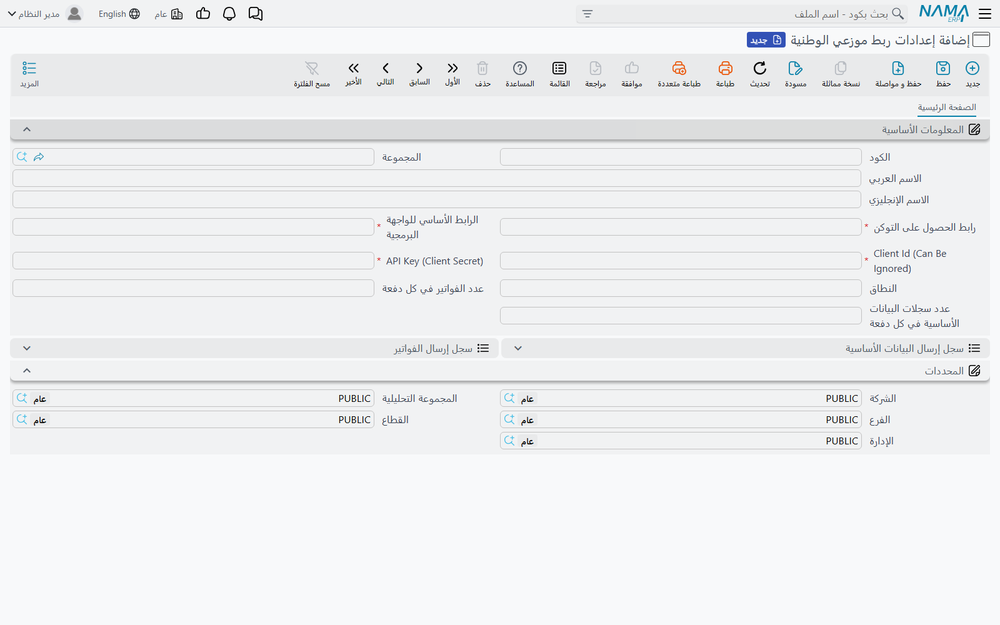

# إعداد ربط الوطنية (Alwatania Distributors Config)

كل ما يحتاجه نما للوصول إلى منصة الوطنية موجود على سجل واحد هو **إعدادات ربط موزعي الوطنية**.
افتح **integrations ← الملفات ← إعدادات ربط موزعي الوطنية** وأنشئ سجلًا لكل حساب لدى الوطنية؛
أغلب المنشآت تحتاج سجلًا واحدًا فقط.

**كود** السجل هو ما تطلبه إجراءات الإرسال، فاختر كودًا قصيرًا ستكتبه في المهمة المجدولة — مثل
`ALW01`.

## المعلومات الأساسية

| الحقل | ماذا تضع فيه |
|---|---|
| **الكود**، **المجموعة**، **الاسم العربي**، **الاسم الإنجليزي** | رأس الملف المعتاد. احفظ الكود جيدًا: كل إجراءات الإرسال تأخذه كمدخل أول |
| **رابط الحصول على التوكن** (Token URL) | الرابط الكامل الذي أعطته المنصة للحصول على رمز الدخول، مثل `https://auth.example.com/connect/token`. إلزامي |
| **الرابط الأساسي للواجهة البرمجية** (API Base URL) | الرابط الجذري لواجهة المنصة، مثل `https://api.example.com`. نما يضيف باقي كل رابط بنفسه، فلا تكتب `/api/v1/...`. وجود `/` في النهاية لا يضر. إلزامي |
| **Client Id (Can Be Ignored)** | معرّف العميل الذي أصدرته الوطنية. رغم ما يقوله العنوان، لا يُحفظ السجل بدونه، وهو يُرسَل مع كل تسجيل دخول |
| **API Key (Client Secret)** | المفتاح السري الذي أصدرته الوطنية. حقل كلمة مرور، فيُخفى بعد كتابته. إلزامي |
| **النطاق** (Scope) | فقط إذا طلبت الوطنية نطاقًا محددًا. اتركه فارغًا ويستخدم نما `openid` |
| **عدد الفواتير في كل دفعة** | عدد المستندات في الطلب الواحد. اتركه فارغًا (أو 0) ليكون **5000** |
| **عدد سجلات البيانات الأساسية في كل دفعة** | عدد السجلات الأساسية في الطلب الواحد. اتركه فارغًا (أو 0) ليكون **1000** |

عنوانا الحقلين **Client Id (Can Be Ignored)** و**API Key (Client Secret)** يظهران بالإنجليزية
حتى على الشاشة العربية.

تحت الحقول يظهر سجلا الإرسال: **سجل إرسال البيانات الأساسية** و**سجل إرسال الفواتير**. يمتلئان
وحدهما مع تشغيل الإجراءات، وصفحة [سجلات الإرسال وإعادة الإرسال](./alwatania-send-logs) تشرح
قراءتهما.

أما مجموعة **المحددات** فتحمل الشركة والمجموعة التحليلية والفرع والقطاع والإدارة المعتادة، مثل
أي ملف رئيسي.

::: warning الحفظ لا يختبر الاتصال
نما لا يتصل بالمنصة عند حفظ الإعدادات، فالرابط أو المفتاح المكتوب خطأً لا يُكتشف حتى أول إرسال.
أول تشغيل هو اختبار الاتصال: إذا كانت بيانات الدخول خاطئة يفشل برسالة تبدأ بـ
`Failed to obtain Alwatania access token` وتعرض رد المنصة نفسه.
:::

## تسجيل الدخول

لا تسجّل الدخول يدويًا أبدًا. كل تشغيل يطلب من رابط التوكن رمز دخول باستخدام معرّف العميل
والمفتاح والنطاق، ويحتفظ بالرمز طوال مدة صلاحيته التي تحددها المنصة، ويجلب رمزًا جديدًا عند
انتهائها. وإذا رفضت المنصة الرمز أثناء التشغيل، يسجّل نما الدخول من جديد ويعيد ذلك الطلب مرة
واحدة قبل أن يتوقف.

## اختيار حجم الدفعات

القيم الافتراضية مناسبة لأغلب المنشآت. الدفعة الأصغر تعني طلبات أكثر، لكن ما يُعاد إرساله عند
تعذّر الوصول إلى المنصة أقل؛ والدفعة الأكبر تعني رحلات أقل في الإرسال الأول الكبير. ودفعات
الفواتير الكبيرة جدًا يقسمها نما آليًا إذا كان الطلب أكبر مما تقبله المنصة، فلا حاجة لضبط
حجم دفعة الفواتير لهذا السبب.

## الخطوة التالية

بعد حفظ الإعدادات، جهّز البيانات الأساسية وأعدّ الإجراءات التي ترسلها —
[إرسال البيانات الأساسية والفواتير](./alwatania-sending-data).
