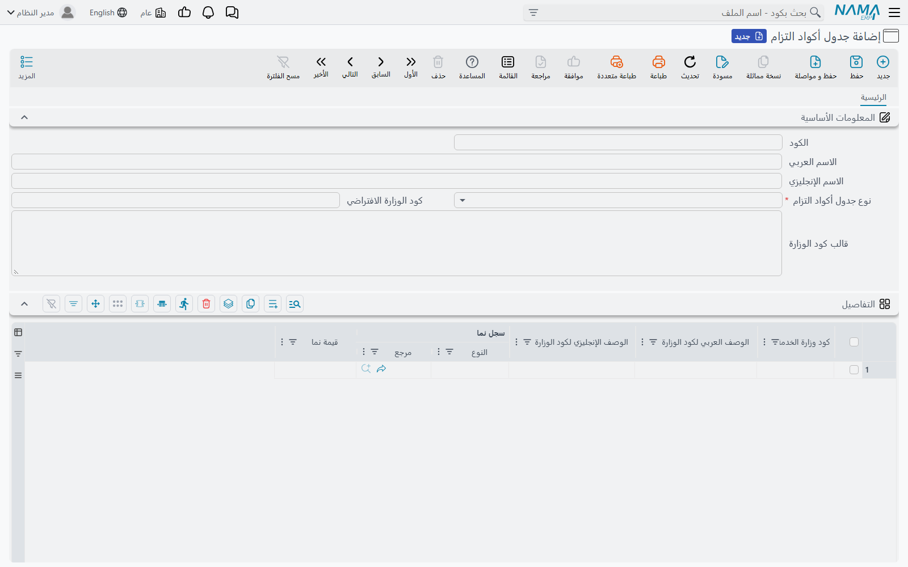

# جداول أكواد التزام

الوزارة لا تريد أن تعرف أن الموظف «ذكر»، ويعمل في «فرع الرياض»، ويشغل وظيفة «محاسب أول». بل تريد
`M`، وكود موقع من سبعة أرقام، وكود مسمى وظيفي من تسعة أرقام — كل منها من قائمة أكواد تنشرها الوزارة.
أما «نما» فيحتفظ بسجلات الجهة وبمسمياتها هي. و**جدول أكواد التزام** (MCS Eltezam Code Table) هو
القاموس بين الاثنين: جدول لكل قائمة أكواد من قوائم الوزارة، وكل صف فيه يقول «هذا السجل في نما، أو هذه
القيمة في نما، هي ذلك الكود لدى الوزارة».

تجده تحت **الملفات ← جدول أكواد التزام** في قائمة التكاملات.

## إنشاء كل الجداول دفعة واحدة

تنشر الوزارة 29 قائمة أكواد، ولا يُسمح إلا بجدول واحد لكل قائمة — فحفظ جدول ثانٍ لقائمة لها جدول
بالفعل يُرفض. وبدلاً من إنشائها واحداً واحداً، شغّل الإجراء **`EACreateEltezamCodeTables`** مرة
واحدة. لا يحتاج إلى مدخلات ويمكن تشغيله من أي مكان؛ وأبسط طريقة مهمة مجدولة من نوع **Action** تشغّلها
بزر **تشغيل الان** (انظر [المهام المجدولة](/ar/platform/scheduled-tasks)). في **إسم العنصر** اكتب
الاسم الكامل `com.namasoft.modules.integrations.utils.actions.EACreateEltezamCodeTables`، أو اكتب
الاسم المختصر واختر الكامل من قائمة الاقتراحات.

ينشئ الإجراء جدولاً فارغاً لكل قائمة ليس لها جدول بعد، ويكون كوده واسماه هو اسم القائمة
(`JobClassCode`، `Gender`، …)، ويجعله متاحاً لكل شركة وقطاع وفرع وإدارة ومجموعة تحليل، لأن أكواد
الوزارة واحدة على مستوى الجهة كلها. وتشغيله مرة أخرى لا يضر: فهو يتخطى الجداول الموجودة.

## شاشة الجدول

يحدد رأس الجدول القائمة التي يغطيها، وما يُفعل عند عدم تطابق أي صف:

| الحقل | معناه |
|---|---|
| **الكود / الاسم العربي / الاسم الإنجليزي** | مرجع الجدول نفسه — والإجراء يستخدم اسم القائمة |
| **نوع جدول أكواد التزام** (Eltezam Lookup Type) | **إجباري.** قائمة أكواد الوزارة التي يترجمها هذا الجدول، باسمها لدى الوزارة (JobClassCode، NationalityCode، …) |
| **كود الوزارة الافتراضي** (Default MCS Code) | الكود الذي يُرسل عند عدم تطابق أي شيء آخر. وفي القائمة التي تستخدم فيها الجهة كلها قيمة واحدة، يكفيك هذا الحقل |
| **قالب كود الوزارة** (MCS Code Template) | حقل يُقرأ منه الكود (أو قيمة تُترجم)، يُكتب مثل خانات «من حقل بالموظف» في الإعدادات: `description5`، `{ref4}`، `ref4.name1`. ويُقرأ من سجل «نما» أولاً ثم من الموظف |

ويحتوي جدول **التفاصيل** (Details) على صفوف الربط:

| العمود | معناه |
|---|---|
| **كود وزارة الخدمة المدنية** (MCS Code) | **إجباري.** الكود كما تنشره الوزارة بالضبط |
| **الوصف العربي لكود الوزارة** (MCS Arabic Description) | وصف الوزارة بالعربية — للرجوع إليه |
| **الوصف الإنجليزي لكود الوزارة** (MCS English Description) | وصف الوزارة بالإنجليزية — للرجوع إليه |
| **سجل نما** (NaMa Record) | السجل في «نما» الذي يعني هذا الكود — درجة وظيفية، مكان عمل، مفرد راتب… |
| **قيمة نما** (NaMa Value) | أو النص في «نما» الذي يعني هذا الكود — جنسية، نوع، تخصص… |

## كيف يختار «نما» الكود

لكل قيمة يرسلها، يبحث «نما» في الجدول المقابل بهذا الترتيب ويتوقف عند أول تطابق:

1. **صف في الجدول للسجل.** صف يكون **سجل نما** فيه هو السجل المُرسَل. وإن كتبت السجل في **قيمة نما**
   بدلاً من اختياره فهذا يعمل أيضاً: قيمة نما تساوي كود السجل أو اسمه العربي أو الإنجليزي تُحتسب
   تطابقاً. وأول صف مطابق هو الذي يُعتمد.
2. **قالب كود الوزارة**، يُقرأ من السجل ثم من الموظف.
3. **كود الوزارة الافتراضي.**

وفي **LocationCode** و**TransactionCode** يعمل القالب بخطوة إضافية: ما يقرؤه قيمة خاصة بك — مثلاً
`description5` يحتوي «فرع الرياض» — ثم يترجمها صف في الجدول بقيمة نما. فتحتفظ على الموظف بشيء مفهوم
وتربطه مرة واحدة. وفي بقية القوائم، ما يقرؤه القالب يُرسل هو نفسه كوداً للوزارة.

والأكواد الرقمية التي تطلبها الوزارة بطول ثابت تُكمَّل بأصفار على اليسار: فئة الوظيفة إلى 5 أرقام،
والمسمى الوظيفي ورقم الوظيفة إلى 9، والموقع إلى 7.

## على أي بيانات تُطابق كل قائمة

معرفة ما تُطابَق عليه كل قائمة تخبرك هل تملأ **سجل نما** أم **قيمة نما**.

**تُطابَق على سجل** — املأ سجل نما:

| القائمة | السجل |
|---|---|
| JobClassCode، JobNameCode، JobCatChain، EmploymentTypeCode، RankCode | الدرجة الوظيفية للموظف |
| LocationCode | مكان عمل الموظف (أو قالبه) |
| ElementCode | مفرد الراتب في كل سطر من سطور سند الراتب |
| ConsolidationSetID | الصرفية في سند الراتب |
| QualificationCode | المؤهل في سطر مؤهلات الموظف |
| VacationCode | نوع الأجازة في سند الأجازة |
| AppraisalTypeCode | نوع التقييم في تقييم الموظف |

**تُطابَق على قيمة** — املأ قيمة نما بالنص كما يحفظه «نما»:

| القائمة | القيمة |
|---|---|
| EmployeeStatusCode | حالة الموظف (Working، Resigned، …) |
| TerminationReasonCode | حالة الموظف الذي له تاريخ نهاية خدمة |
| Gender، Religion، MaritalStatus | الاختيار المقابل على الموظف |
| NationalityCode | جنسية الموظف |
| MajorCode | نص التخصص في سطر المؤهل |
| UniversityCode | نص جهة التخرج في سطر المؤهل |
| EduGrade | نص التقدير في سطر المؤهل |

**بالقالب أو الافتراضي فقط** — HealthStatus وBloodType وTransactionCode تُقرأ بقالب كود الوزارة من
الموظف، أو تعود إلى كود الوزارة الافتراضي. أما **PositionStatus** و**JobTransactionCode** فتستخدمان
كود الوزارة الافتراضي فقط.

::: tip كلمات لا أرقام في بعض القوائم
في Gender وReligion وBloodType وMaritalStatus وHealthStatus تنتظر الوزارة الكلمة التي تنشرها —
`M`، `Muslim`، `O-Positive`، `Single`، `Healthy` — لا رقماً. انسخ قائمة أكواد الوزارة كما هي.
:::

### كودا الجامعة 998 و999

حين تُربط جهة التخرج في مؤهل ما بكود الجامعة `998` أو `999` («أخرى»)، يرسل «نما» اسم جهة التخرج نفسه
مع الكود، فيمكن الإبلاغ عن جهة غير موجودة في قائمة الوزارة. اربط أي جهة غير مدرجة بـ`999` بدلاً من
تركها بلا كود.

### التقديرات تعمل كحدود دنيا

يُقرأ جدول **RatingCode** بطريقة مختلفة عن كل الجداول الأخرى. فقيمة نما فيه نسبة مئوية: **أقل** نسبة
نهائية للتقييم تستحق هذا التقدير. فإذا كانت الصفوف عند `0` و`60` و`75` و`90`، يحصل التقييم بنسبة 82%
على كود الصف `75`. والتقييم الذي ليس له نسبة نهائية يعود إلى كود الوزارة الافتراضي.

الخطوة التالية: [إرسال مستند](./eltezam-submissions-and-sending).
