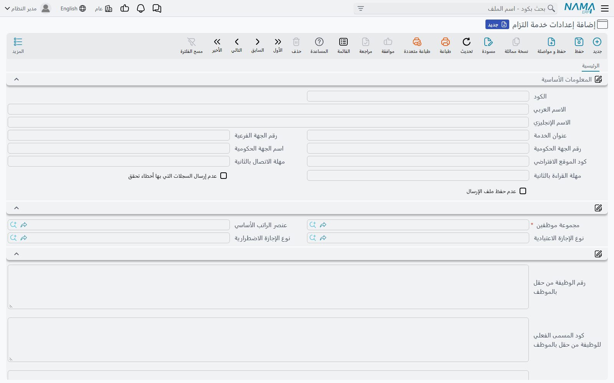
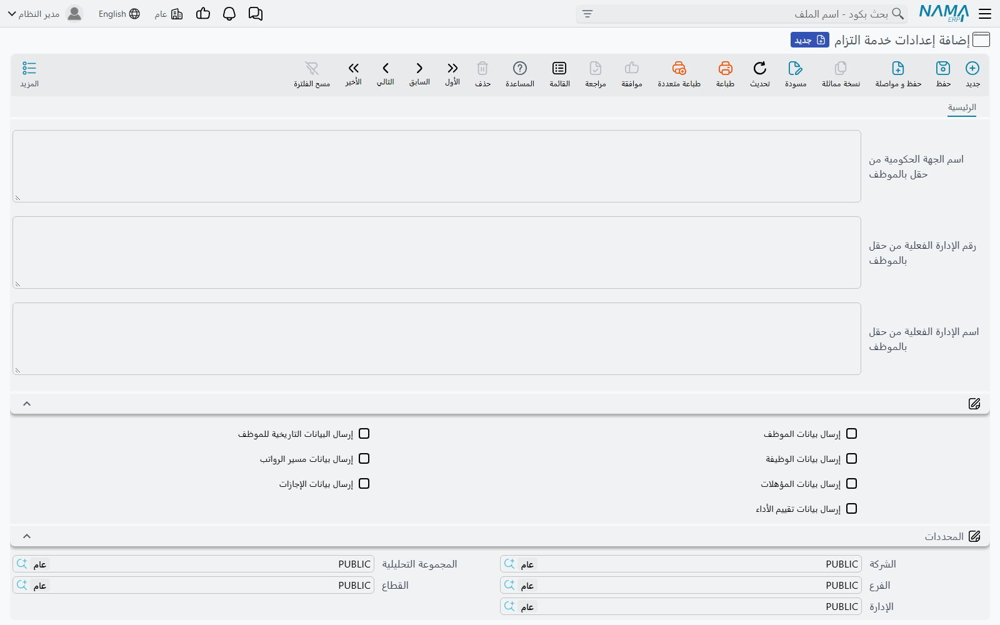

# إعداد التزام

قبل أن يرسل «نما» أي شيء إلى وزارة الخدمة المدنية، يحتاج إلى معرفة ثلاثة أشياء: *أين* خدمة التزام في
الوزارة، و*من* هي الجهة في نظر الوزارة، و*أي* الموظفين وسجلات الموارد البشرية يُبلغ عنها. والإجابة
عن الثلاثة في ملف واحد هو **إعدادات خدمة التزام** (MCS Eltezam Configuration)، تحت
**الملفات ← إعدادات خدمة التزام** في قائمة التكاملات.

تحتاج أغلب الجهات إلى إعدادات واحدة فقط. ولا تنشئ إعدادات ثانية إلا إذا كنت تُبلغ عن مجموعتين من
الموظفين برقمي جهة فرعية مختلفين، أو إلى عنوانين مختلفين.

## قبل البدء: بيانات الموارد البشرية

الإعدادات تخبر «نما» فقط أين يبحث؛ أما البيانات نفسها فيجب أن تكون موجودة في الموارد البشرية. راجع ما
يلي قبل أول إرسال، لأن كل نقص يتحول إلى طلب فاشل:

- **مجموعة موظفين** تضم بالضبط الموظفين الذين تُبلغ عنهم الوزارة.
- على كل موظف: الكود (يُرسل رقماً للموظف)، ورقم الهوية الوطنية أو — لغير السعوديين — رقم الإقامة،
  وطول كل منهما عشرة أحرف، والاسم العربي (Name1) والإنجليزي (Name2)، وتاريخ الميلاد، وتاريخ التعيين،
  والدرجة الوظيفية، ومكان العمل، والإدارة.
- سندات راتب وسندات إجازة وتقييمات موظفين ومستندات تحديث بيانات الموظف معتمدة، بحسب العمليات التي
  تنوي إرسالها.
- جدول هجري يمتد إلى أقدم تاريخ ميلاد أو تعيين تُرسله.

## المعلومات الأساسية

| الحقل | ما تضعه فيه |
|---|---|
| **الكود / الاسم العربي / الاسم الإنجليزي** | مرجعك الخاص لهذه الإعدادات |
| **عنوان الخدمة** (Service URL) | عنوان خدمة التزام الذي أعطتك إياه الوزارة. عنوان كامل (`http://…/EltezamDataService.svc`) أو اسم خادم أو IP فقط؛ وإن لم تكتب `http://` يضيفه «نما» |
| **رقم الجهة الفرعية** (Sub Agency ID) | رقم جهتك الفرعية لدى الوزارة. يُرسل مع كل الطلبات عدا بيانات الموظف |
| **رقم الجهة الحكومية** (Agency Organization ID) | رقم الجهة، ويُستخدم جهةً للوظيفة ما لم يغيّره حقل من حقول الموظف (انظر أدناه) |
| **اسم الجهة الحكومية** (Agency Organization Name) | اسم الجهة المقابل |
| **كود الموقع الافتراضي** (Default Location Code) | كود الموقع لدى الوزارة من سبعة أرقام، ويُرسل لكل موظف ليس لمكان عمله ربط في جدول المواقع |
| **مهلة الاتصال بالثانية** (Connect Timeout Seconds) | مدة انتظار قبول الوزارة للاتصال. تركه فارغاً يعني 30 ثانية |
| **مهلة القراءة بالثانية** (Read Timeout Seconds) | مدة انتظار رد الوزارة. تركه فارغاً يعني 120 ثانية |
| **عدم إرسال السجلات التي بها أخطاء تحقق** (Do Not Send Records Having Validation Errors) | انظر أدناه |
| **عدم حفظ ملف الإرسال** (Do Not Store Request XML) | اتركه غير مفعّل ليُحفظ نسخة من كل طلب ورد على مستند الإرسال؛ وفعّله لتوفير المساحة بعد استقرار الربط |

### فحص السجلات قبل خروجها من «نما»

قبل إرسال كل طلب، يفحصه «نما» وفق قواعد الوزارة: وجود القيم المطلوبة، وطول الأكواد الصحيح، ووجود
رقم الهوية أو الإقامة، ووقوع التواريخ داخل الجدول الهجري، وغير ذلك. وما يحدث عند فشل الفحص يتوقف على
خانة **عدم إرسال السجلات التي بها أخطاء تحقق**:

- **مفعّلة** — لا يُرسل الطلب. يُسجَّل فاشلاً بكود الخطأ `001-000000` وتكون قائمة المشكلات هي رسالة
  الخطأ. لا يصل شيء إلى الوزارة، فلا حاجة لتنظيف أي شيء لديها.
- **غير مفعّلة** — يُرسل الطلب على أي حال، وتُحفظ ملاحظات «نما» مع رد الوزارة في رسالة الخطأ. وهذا
  مفيد في البداية، حين تريد أن تعرف هل ترفض الوزارة فعلاً ما يعدّه «نما» ناقصاً.

## من أين تأتي البيانات

| الحقل | ما تضعه فيه |
|---|---|
| **مجموعة موظفين** (Employee Group) | **إجباري.** الموظفون الذين تُبلغ عنهم هذه الإعدادات. ومستند الإرسال الجديد يأخذ موظفيه من هذه المجموعة |
| **عنصر الراتب الأساسي** (Basic Salary Component) | مفرد الراتب الذي يمثل الراتب الأساسي. تُرسل قيمة استحقاقه في آخر سند راتب معتمد للموظف في الفترة راتباً أساسياً |
| **نوع الإجازة الاعتيادية** (Annual Vacation Type) | نوع الإجازة الذي يُرسل رصيده المتبقي رصيداً للإجازة الاعتيادية |
| **نوع الإجازة الاضطرارية** (Business Vacation Type) | نوع الإجازة الذي يُرسل رصيده المتبقي رصيداً للإجازة الاضطرارية |

## قراءة القيم من حقل في الموظف

بعض القيم التي تطلبها الوزارة ليس لها مكان ثابت في ملف الموظف في «نما» — فتحتفظ بها الجهات في حقل
وصف أو حقل مرجع إضافي. والخانات التي تنتهي بـ«… من حقل بالموظف» تتيح لك الإشارة إلى هذا الحقل. اكتب
الحقل كما تكتبه في أي قالب في «نما»: `description5` و`{description5}` و`ref4.name1` و`{ref4}` كلها
تعمل. والحقل المرجع يُرسل كود السجل الذي يشير إليه.

| الحقل | ما يملؤه | إن تُرك فارغاً |
|---|---|---|
| **رقم الوظيفة من حقل بالموظف** | رقم الوظيفة | الرقم بمكتب العمل للموظف، ثم كود الدرجة الوظيفية |
| **كود المسمى الفعلي للوظيفة من حقل بالموظف** | كود المسمى الفعلي للوظيفة | جدول أكواد JobNameCode |
| **تاريخ أول مرتبة من حقل بالموظف** | تاريخ أول مرتبة | تاريخ التعيين |
| **رقم الجهة الحكومية من حقل بالموظف** | رقم جهة الوظيفة | رقم الجهة الحكومية أعلاه |
| **اسم الجهة الحكومية من حقل بالموظف** | اسم جهة الوظيفة | اسم الجهة الحكومية أعلاه |
| **رقم الإدارة الفعلية من حقل بالموظف** | الوحدة التنظيمية التي يعمل فيها الموظف فعلاً | كود إدارة الموظف، ثم الجهة |
| **اسم الإدارة الفعلية من حقل بالموظف** | اسمها | الاسم العربي للإدارة، ثم الجهة |

## العمليات التي تُرسل

خانات **إرسال …** السبع — إرسال بيانات الموظف، وإرسال البيانات التاريخية للموظف، وإرسال بيانات
الوظيفة، وإرسال بيانات مسير الرواتب، وإرسال بيانات المؤهلات، وإرسال بيانات الإجازات، وإرسال بيانات
تقييم الأداء — هي الاختيار الافتراضي لكل مستند إرسال يُنشأ من هذه الإعدادات. فمستند الإرسال الذي لم
تُفعَّل فيه أي خانة ينسخ الخانات السبع من هنا عند حفظه؛ أما المستند الذي فُعِّلت فيه خانة واحدة على
الأقل فيحتفظ باختياره. وما ترسله كل عملية موضح في
[ما الذي يرسله «نما» إلى التزام](./eltezam-data-sources).

::: tip بداية معقولة
ابدأ بـ**إرسال بيانات الموظف** و**إرسال بيانات الوظيفة** فقط. فهما تعتمدان على ملف الموظف والدرجة
الوظيفية وحدهما، فتكشفان الهويات والأسماء وصفوف جداول الأكواد الناقصة قبل أن تضيف الرواتب والإجازات
والتقييمات، التي تعتمد على المستندات أيضاً.
:::

وآخر مجموعة في الشاشة هي مجموعة المحددات المعتادة.

الخطوة التالية: [إنشاء جداول الأكواد وملؤها](./eltezam-code-tables).
