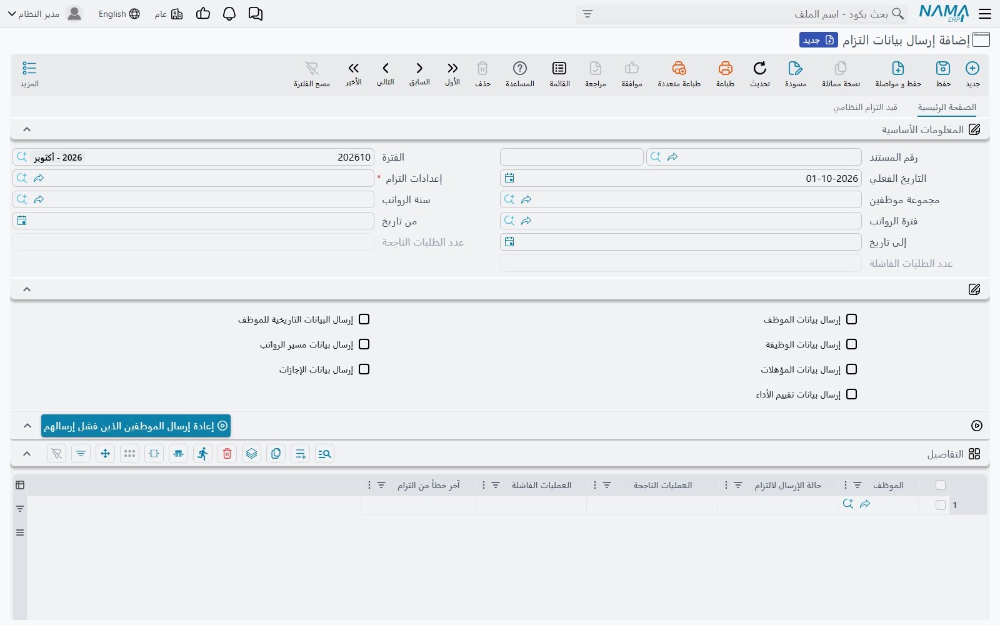
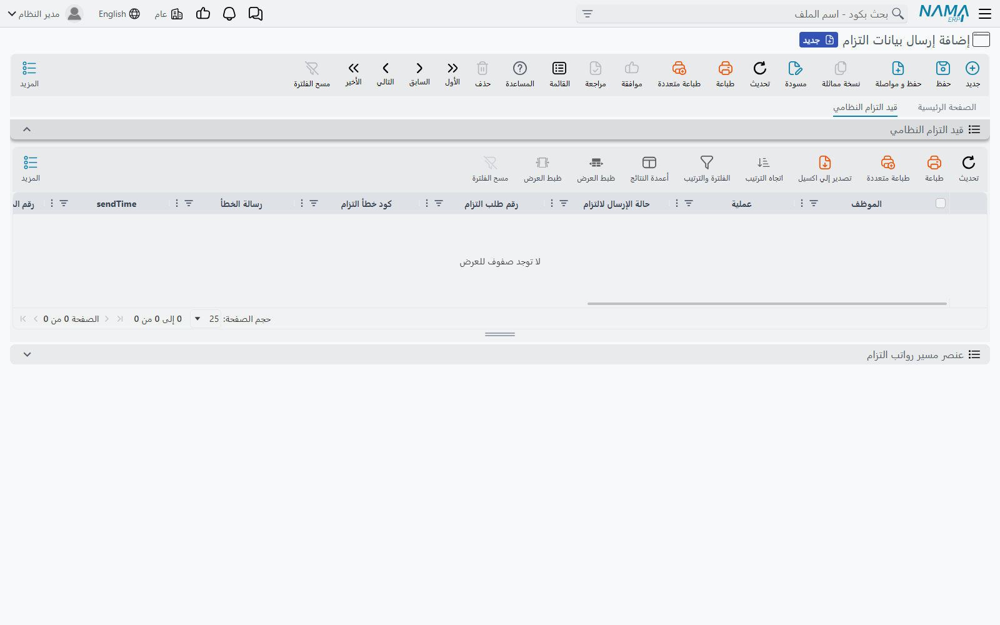

# مستندات إرسال التزام وطريقة الإرسال

في كل مرة تُبلغ فيها الجهة الوزارة — مسيرات الرواتب الشهرية، أو دفعة من المعيّنين الجدد، أو تقييمات
السنة — تفعل ذلك عبر مستند **إرسال بيانات التزام** (MCS Eltezam Submission)، تحت
**المستندات ← إرسال بيانات التزام** في قائمة التكاملات. يحدد المستند *من* يُبلغ عنهم، وعن *أي فترة*،
و*ماذا* يُرسل. وبعد إرساله يصبح سجلاً لما حدث: أي الموظفين وصلت بياناتهم، وأيهم فشل، وكل طلب مع رد
الوزارة عليه.

## تعبئة المستند



| الحقل | معناه |
|---|---|
| **كود المستند، الفترة المالية، التاريخ** | كما في أي مستند. والتاريخ هو أيضاً التاريخ الذي تُحسب فيه أرصدة الإجازات |
| **إعدادات التزام** (Eltezam Configuration) | **إجباري.** الإعدادات التي يتم الإرسال بها |
| **مجموعة موظفين** (Employee Group) | الموظفون المُبلَغ عنهم. اتركها فارغة لاستخدام مجموعة الإعدادات |
| **سنة الرواتب** (HR Year)، **فترة الرواتب** (HR Period)، **من تاريخ** (From Date)، **إلى تاريخ** (To Date) | الفترة التي تُرسل مستنداتها — انظر «أي المستندات تُعدّ داخل الفترة» في [ما الذي يرسله «نما» إلى التزام](./eltezam-data-sources). اترك الأربعة فارغة لإرسال التاريخ كله |
| خانات **إرسال …** السبع | العمليات التي يرسلها هذا المستند. اتركها كلها غير مفعّلة لأخذ اختيار الإعدادات |
| **عدد الطلبات الناجحة**، **عدد الطلبات الفاشلة** | يملؤها النظام بعد كل إرسال |

وعند الحفظ يُكمل «نما» المستند من تلقاء نفسه:

- **مجموعة الموظفين** الفارغة تُنسخ من الإعدادات؛
- إن لم تُفعَّل أي خانة **إرسال …**، تُنسخ الخانات السبع من الإعدادات؛
- إن كان جدول **التفاصيل** فارغاً، يُملأ بسطر لكل موظف في المجموعة.

ويمكنك بعد ذلك حذف موظفين من الجدول، أو إضافة غيرهم يدوياً، قبل الاعتماد. ولا يحتاج المستند إلى توجيه.

### جدول التفاصيل

| العمود | معناه |
|---|---|
| **الموظف** | الموظف المُبلَغ عنه في هذا السطر |
| **حالة الإرسال لالتزام** | **لم يرسل بعد** أو **نجح** أو **فشل** |
| **العمليات الناجحة** | العمليات التي قبلتها الوزارة لهذا الموظف |
| **العمليات الفاشلة** | العمليات التي فشلت |
| **آخر خطأ من التزام** | آخر خطأ لهذا الموظف |

يكون السطر **فشل** إذا فشل أي طلب من طلباته، و**نجح** إذا نجح طلب واحد على الأقل ولم يفشل أي طلب،
و**لم يرسل بعد** إذا لم يُنشأ أو يُرسل له شيء — مثلاً موظف ليس له سند راتب في الفترة حين تُرسل
المسيرات وحدها.

## الاعتماد لا يرسل

اعتماد مستند الإرسال يتحقق من أن فيه موظفين وعملية واحدة على الأقل، ثم يتوقف. **لا يُرسل شيء إلى
الوزارة عند الاعتماد، ولا يوجد زر إرسال في الشاشة.** يتم الإرسال بأحد إجراءين، يعملان من مسار كيان أو
من مهمة مجدولة. وإعداد أحدهما عمل يُنجز مرة واحدة على يد مسؤول النظام.

في حقل **إسم العنصر** بسطر مسار الكيان أو بالمهمة المجدولة يُكتب الإجراء **باسمه الكامل**:
`com.namasoft.modules.integrations.utils.actions.` يليه الاسم المختصر المستخدم في هذه الصفحة — مثل
`com.namasoft.modules.integrations.utils.actions.EASendEltezamSubmissionDoc`. الاسم المختصر وحده لا
يُعثر عليه. اكتب الاسم المختصر في الحقل ثم اختر الاسم الكامل من قائمة الاقتراحات.

### الإرسال عند الاعتماد: `EASendEltezamSubmissionDoc`

الترتيب المعتاد مسار كيان على **إرسال بيانات التزام** يشغّل `EASendEltezamSubmissionDoc` عند
**تأثيرات الحفظ** (PostCommit)، فيُرسل كل مستند لحظة اعتماده (انظر
[مقدمة عن مسارات الكيان](/ar/platform/entity-flows/introduction-to-entity-flows)). والإجراء لا يعمل
إلا على مستند إرسال معتمد.

| المُدخل | معناه |
|---|---|
| 1. **MCS Server (IP, host or full URL)** | **إجباري.** العنوان الذي يُرسل إليه |
| 2. **Eltezam Configuration Code (Can be Empty)** | إعدادات تُستخدم بدلاً من إعدادات المستند |
| 3. **From Date (yyyy-MM-dd, Can be Empty)** | يحل محل «من تاريخ» في المستند لهذا التشغيل |
| 4. **To Date (yyyy-MM-dd, Can be Empty)** | يحل محل «إلى تاريخ» في المستند |
| 5. **HR Period Code (Can be Empty)** | يحل محل فترة الرواتب في المستند |
| 6. **HR Year Code (Can be Empty)** | يحل محل سنة الرواتب في المستند |

كل مُدخل فترة مملوء يتقدم على قيمة المستند في هذا التشغيل فقط — ولا يتغير المستند نفسه. وتُكتب
التواريخ بصيغة `yyyy-MM-dd`، مثلاً `2026-01-31`.

### الإرسال بجدول زمني: `EASubmitEltezamData`

للإرسال ليلاً أو إعادة الإرسال عند الطلب، استخدم مهمة مجدولة من نوع **Action** مع
`EASubmitEltezamData` (انظر [المهام المجدولة](/ar/platform/automation-and-rules/scheduled-tasks)).

| المُدخل | معناه |
|---|---|
| 1. **Eltezam Configuration Code (Can be Empty when documents are given)** | الإعدادات التي يتم الإرسال بها |
| 2. **MCS Server (IP, host or full URL)** | **إجباري.** العنوان الذي يُرسل إليه |
| 3. **Eltezam Submission Document Codes (Comma Separated, Can be Empty)** | مستندات الإرسال المعتمدة المطلوب إرسالها، مثلاً `EZS-0012, EZS-0013` |
| 4–7. **From Date، To Date، HR Period Code، HR Year Code** | مُدخلات الفترة نفسها كما سبق |

مع أكواد المستندات، يُرسل كل مستند مذكور تماماً كما يرسله مسار الكيان عند الاعتماد، ويُحدَّث جدوله
وسجله. ومن دون أكواد المستندات، يرسل الإجراء موظفي مجموعة الإعدادات مباشرة، دون أي مستند إرسال —
فتُرسل الطلبات، لكن لا يعرض أي مستند نتائجها. استخدم مستندات الإرسال كلما أردت مراجعة ما حدث.

### مُدخل MCS Server

كلا الإجراءين يشترط مُدخل الخادم، حتى لو كان في الإعدادات عنوان خدمة. وما تكتبه فيه يُدمج مع
**عنوان الخدمة**:

- **العنوان الكامل** (`http://10.1.2.3/EltezamDataService.svc`) يُستخدم كما هو؛
- **اسم الخادم أو IP وحده** (`10.1.2.3`) يحتفظ ببروتوكول ومسار عنوان الخدمة في الإعدادات ويستبدل
  الخادم فقط — وهذا مفيد حين يُوصل إلى مسار الخدمة نفسه عبر بوابة مختلفة.

## ما يحدث أثناء الإرسال

1. يُمسح سجل الطلبات السابق للمستند.
2. لكل سطر موظف ولكل عملية مختارة، يبني «نما» الطلبات من بيانات الموارد البشرية، ويفحصها (انظر خانة
   **عدم إرسال السجلات التي بها أخطاء تحقق** في [الإعدادات](./eltezam-setup))، ثم يرسلها إلى
   الوزارة واحداً بعد الآخر.
3. يُسجَّل كل طلب مع رد الوزارة، وتُحدَّث حالة كل سطر وأعداد المستند.

**ينجح** الطلب حين ترد الوزارة برقم طلب. وأي رد آخر فشل، ويُحفظ كود خطأ الوزارة ورسالتها.

وإذا لم يرد خادم الوزارة — لتعذر الوصول إليه، أو انتهاء المهلة، أو رده بصفحة ويب — ثلاث مرات متتالية،
يتوقف «نما» بدلاً من انتظار كل الموظفين الباقين. وتبقى السطور التي لم يصل إليها **لم يرسل بعد**،
ويُبلغ التشغيل بأنه توقف؛ انظر [حل المشكلات](./eltezam-troubleshooting).

## سجل الطلبات (الصفحة الثانية)

الصفحة الثانية من المستند، **قيد التزام النظامي** (MCS Eltezam System Entry)، فيها قائمتان قابلتان
للطي.



**قيد التزام النظامي** فيها صف لكل طلب: الموظف، والعملية، وحالة الإرسال، و**رقم طلب التزام** الذي
أعادته الوزارة، و**كود خطأ التزام**، و**رسالة الخطأ**، ووقت الإرسال، وأهم القيم المُرسلة — رقم الموظف،
ورقم الوظيفة، وأكواد الوظيفة، والجهة، والموقع، وكود الحركة، والنوع، والحالة الصحية، والراتب الأساسي،
وIsActive. وهناك أعمدة أخرى كثيرة مخفية يمكن إظهارها من اختيار الأعمدة، منها **ملف الإرسال**
(Request XML) و**ملف الرد** (Response XML): الطلب المُرسل بالضبط والرد المستلم بالضبط، ما لم تكن خانة
**عدم حفظ ملف الإرسال** مفعّلة في الإعدادات. ويمكن تصفية القائمة بالموظف أو العملية أو حالة الإرسال أو
رقم الطلب أو كود الخطأ.

**عنصر مسير رواتب التزام** (MCS Eltezam Payslip Element) فيها صف لكل عنصر مسير مُرسل: الموظف،
والحالة، ورقم الموظف لدى الوزارة، والسنة والشهر الهجريان، ومجموعة الصرف، وكود العنصر واسمه وتصنيفه،
والمبلغ، والمرتب النهائي، وتاريخ الصرف. ويمكن تصفيتها بالموظف أو الحالة أو السنة والشهر الهجريين.

::: warning حفظ مستند مُرسل مرة أخرى يمسح سجله
حفظ مستند إرسال معتمد مرة أخرى — ولو دون تغيير أي شيء — يُفرغ سجل الطلبات في الصفحة الثانية، بينما
يحتفظ الجدول بحالات نجح / فشل. ولا يُعيد الحفظ إرسال المستند. راجع السجل قبل تعديل مستند سبق إرساله،
ولإرساله مرة أخرى أدرجه في المهمة المجدولة `EASubmitEltezamData` أو استخدم **إعادة إرسال الموظفين
الذين فشل إرسالهم**.
:::

## إعادة إرسال الموظفين الذين فشلوا

بعد تصحيح البيانات أو جداول الأكواد، اضغط **إعادة إرسال الموظفين الذين فشل إرسالهم**، الموجود في
مجموعة الإجراءات في المستند وفي قائمة المزيد من الإجراءات.

يسأل سؤالاً واحداً — **خادم الوزارة (اتركه فارغا لاستخدام عنوان الخدمة بالإعدادات)** — ثم يعيد إرسال كل
سطر ليس **نجح**. ولا تُستبدل إلا صفوف السجل القديمة لهؤلاء الموظفين؛ أما صفوف الموظفين الناجحين فتبقى.
ويُعاد حساب الأعداد، ويظهر ملخص بالإنجليزية، سطر لكل موظف:

```
Retried 3 employees: 5 requests succeeded, 1 failed
1045 Ahmed Ali: 2 succeeded, 0 failed
1046 Sara Omar: 1 succeeded, 1 failed (the ministry's error for her failed request)
…
```

وإذا توقف خادم الوزارة عن الرد أثناء إعادة الإرسال، ينتهي الملخص بسطر «Sending stopped…» نفسه الذي
يظهر في الإرسال العادي.

وتستخدم إعادة الإرسال إعدادات المستند وفترته هو، لا القيم البديلة التي قد يكون مررها مسار كيان أو
مهمة مجدولة.
