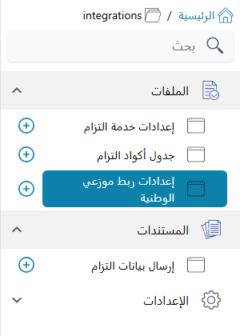

---
# Handcrafted landing — GenNamaDocsIndex skips this file because of the .custom-index
# marker in this folder (see hasHandcraftedHomePage in GenNamaDocsIndex.java)
title: التكاملات
---

# التكاملات

موديول التكاملات هو المكان الذي يحتفظ فيه «نما» بروابطه الجاهزة مع منصات خارجية *يُلزَم* العميل
بإبلاغها. ويضم اليوم ربطين، كلاهما سعودي، ولا يجمع بينهما شيء سوى القائمة:

- **التزام** للجهات الحكومية. تنتظر وزارة الخدمة المدنية (MCS) من كل جهة أن تبلغ خدمة التزام عن
  موظفيها — من هم، ووظائفهم، ومسيرات رواتبهم الشهرية، ومؤهلاتهم، وإجازاتهم، وتقييمات أدائهم —
  بأكواد الوزارة نفسها. يقرأ «نما» كل ذلك من موديول الموارد البشرية، ويحوّله عبر جداول الأكواد،
  ويرسله طلباً بعد طلب عبر قناة التكامل الحكومية.
- **موزعو الوطنية** للشركات التي توزّع لحساب «الوطنية». يدفع «نما» البيانات الأساسية للموزع —
  العملاء والمندوبين والأصناف والأماكن التي يتبعونها — وكل فاتورة مبيعات ومردود إلى منصة الوطنية.
  والربط في اتجاه واحد: «نما» يرسل، ولا يقرأ إلا رد المنصة على كل طلب.

لكل منهما ترخيصه وشاشاته وطريقة إرساله، فاقرأ الجزء الذي تحتاجه فقط. ولا يوجد زر إرسال في أي
منهما: البيانات تخرج من «نما» عندما يشغّل مسار كيان أو مهمة مجدولة أحد إجراءات الربط.

شكل القائمة واحد للاثنين: شاشات الإعدادات تحت **الملفات**، ومستند الإرسال — لالتزام وحده — تحت
**المستندات**. ويظهر جذر القائمة بالكلمة الإنجليزية *integrations* في اللغتين.

::: tip تبحث عن ربط آخر؟
التكاملات العامة على مستوى النظام — واجهة نما البرمجية، وأجهزة الحضور، ومستورد الفواتير، وتتبع
الأدوية لدى هيئة الغذاء والدواء وغيرها — موجودة في [التكاملات الخارجية](/ar/integration/). ولمنصات
التجارة الإلكترونية موديول خاص هو [تكامل التجارة الإلكترونية](/ar/modules/ecommerce/).
:::

## التزام — إبلاغ وزارة الخدمة المدنية عن الموظفين

الترخيص `integrations-ksa-estidamah-eltezam`. ثلاث شاشات: الإعدادات، وجداول الأكواد، ومستند الإرسال.

<LandingGrid>
  <LandingCard icon="🏛️" title="نظرة عامة على التزام" link="/ar/modules/integrations/eltezam/eltezam-overview.md" details="ما الذي تنتظره الوزارة، والعمليات السبع التي يرسلها نما، وخطوات العمل من بيانات الموارد البشرية إلى مستند مُرسَل." />
  <LandingCard icon="⚙️" title="إعداد التزام" link="/ar/modules/integrations/eltezam/eltezam-setup.md" details="الإعدادات: عنوان الخدمة، وأرقام الجهة، ومجموعة الموظفين، وقوالب حقول الموظف، والعمليات التي تُرسل." />
  <LandingCard icon="🔣" title="جداول أكواد التزام" link="/ar/modules/integrations/eltezam/eltezam-code-tables.md" details="إنشاء الجداول التسعة والعشرين دفعة واحدة، وربط سجلات نما وقيمه بأكواد الوزارة." />
  <LandingCard icon="📋" title="ما الذي يرسله نما إلى التزام" link="/ar/modules/integrations/eltezam/eltezam-data-sources.md" details="مصدر كل قيمة في كل عملية، وأي المستندات تُحسب داخل الفترة." />
  <LandingCard icon="📤" title="مستندات الإرسال وطريقة الإرسال" link="/ar/modules/integrations/eltezam/eltezam-submissions-and-sending.md" details="مستند الإرسال، وإجراءا الإرسال، وسجل الطلبات، وإعادة إرسال الموظفين الذين فشل إرسالهم." />
  <LandingCard icon="🩺" title="حل مشكلات التزام" link="/ar/modules/integrations/eltezam/eltezam-troubleshooting.md" details="قراءة أكواد الأخطاء، وقاعدة التوقف بعد ثلاثة إخفاقات، وكل رسالة يُظهرها الربط." />
</LandingGrid>

## موزعو الوطنية — إرسال البيانات الأساسية والمبيعات إلى الوطنية

الترخيص `integrations-ksa-watania-samil`. شاشة واحدة هي الإعدادات، وفيها سجلا الإرسال كلاهما.

<LandingGrid>
  <LandingCard icon="🚚" title="نظرة عامة على ربط الوطنية" link="/ar/modules/integrations/alwatania/alwatania-overview.md" details="ما الذي يُرسل، وكيف تقابل سجلات نما بيانات المنصة، والقواعد الثلاث التي تحكم كل تشغيل." />
  <LandingCard icon="🔑" title="إعداد ربط الوطنية" link="/ar/modules/integrations/alwatania/alwatania-setup.md" details="رابط التوكن ورابط الواجهة البرمجية، وبيانات دخول العميل، وأحجام الدفعات." />
  <LandingCard icon="📦" title="إرسال البيانات الأساسية والفواتير" link="/ar/modules/integrations/alwatania/alwatania-sending-data.md" details="الإجراءات الثلاثة ومدخلاتها، وأمثلة جاهزة للمهام المجدولة ومسارات الكيان." />
  <LandingCard icon="🧾" title="سجلات الإرسال وإعادة الإرسال" link="/ar/modules/integrations/alwatania/alwatania-send-logs.md" details="قراءة السجلين، ومعرفة سبب الرفض، وفرض إعادة الإرسال، والرسائل التي قد تظهر لك." />
</LandingGrid>
