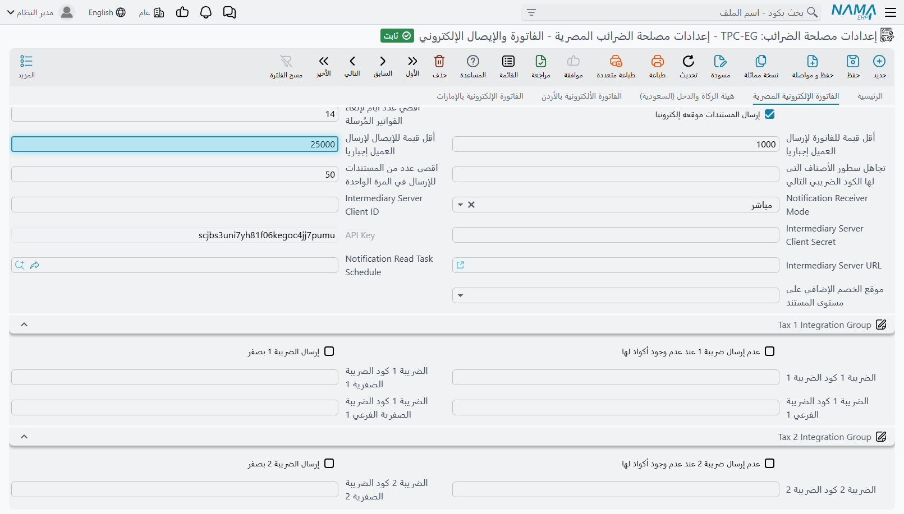
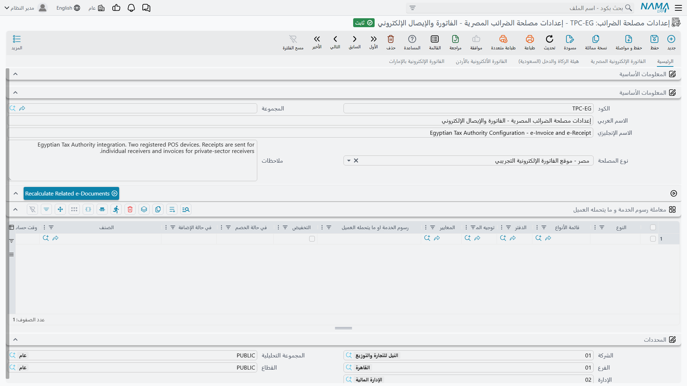
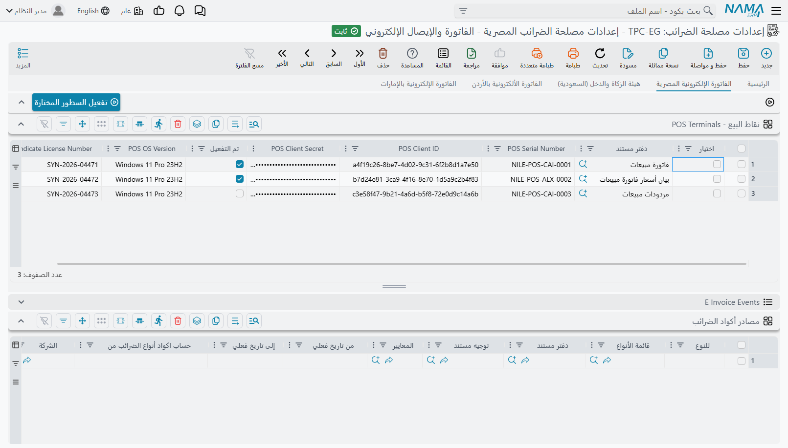

# الفاتورة الإلكترونية والإيصال الإلكتروني في مصر

تُشغِّل مصلحة الضرائب المصرية منظومتين إلكترونيتين جنبًا إلى جنب. **منظومة الفاتورة الإلكترونية** للبيع إلى الشركات والجهات الحكومية: كل فاتورة تُوقَّع رقميًا وتظهر في الملف الضريبي للمشتري نفسه. و**منظومة الإيصال الإلكتروني** للبيع إلى الجمهور: الإيصالات تخرج من أجهزة نقاط بيع مسجّلة، واحدًا تلو الآخر، بالسرعة التي يُصدرها بها الكاشير. والمحل الذي يبيع للنوعين يستخدم المنظومتين معًا.

في نما ERP يُدار الاثنان من سجل **إعدادات مصلحة الضرائب** نفسه، ويُرسلان عبر مستند **إرسال مستندات الي مصلحة الضرائب** نفسه. أما طريقة تجميع المستندات والتحقق منها وإرسالها فهي الآلية المشتركة الموصوفة في [الدليل العام للفوترة الإلكترونية](./e-invoices-guide.md)، فاقرأه أولًا. هذه الصفحة تغطي ما هو مصري فعلًا: الاتصال بالبوابة، ومن هو البائع ومن هو المشتري، وأكواد الأصناف، والبيانات البنكية في الفاتورة، والإيصالات وأجهزتها، والتوقيع، والإلغاء.

## ما الذي يختلف في مصر

| | كيف تعمل مصر |
|---|---|
| **منظومتان** | فواتير إلكترونية للشركات والجهات الحكومية، وإيصالات إلكترونية للجمهور. والإعدادات هي التي تقرر أيهما يصبح المستند. |
| **البيئات** | بيئتان: بوابة تجريبية (Pre Production) للتدريب، والبوابة الفعلية. |
| **التوقيع** | يمكن توقيع الفواتير الإلكترونية بالختم الإلكتروني للشركة (توكن USB) عبر برنامج توقيع صغير يُثبَّت بجوار نما. الإيصالات لا تُوقَّع. |
| **أكواد الأصناف** | كل سطر يحتاج كودًا تعرفه المصلحة: كود **EGS** تسجّله الشركة، أو باركود دولي **GS1**. |
| **هوية المشتري** | رقم تسجيل ضريبي من 9 أرقام للشركات، ورقم قومي من 14 رقمًا للأفراد. |
| **الإلغاء** | الفاتورة المقبولة تُسحب عبر **مستند إلغاء مستند**، في حدود عدد الأيام الذي تسمح به الإعدادات. |

## الاتصال بالبوابة

في **الإعدادات العامة**، الصفحة 2، اجعل **عرض صفحة الفاتورة الإلكترونية الخاصة بـ** = **الفاتورة الإلكترونية المصرية** (أو **كل الصفحات** إن كنت تتعامل مع أكثر من دولة)، ثم نفّذ **إعادة توليد الواجهة (Regen UI)** لتظهر صفحة مصر في شاشة الإعدادات.

أنشئ سجل **إعدادات مصلحة الضرائب** واختر **نوع المصلحة**. السجل الجديد يبدأ على البيئة التجريبية عن قصد، واختيار النوع يملأ العناوين الثلاثة تلقائيًا:

| نوع المصلحة | Portal URL | API URL | Identity Server URL |
|---|---|---|---|
| مصر - موقع الفاتورة الإلكترونية التجريبي | `https://preprod.invoicing.eta.gov.eg` | `https://api.preprod.invoicing.eta.gov.eg` | `https://id.preprod.eta.gov.eg` |
| مصر - موقع الفاتورة الإلكترونية | `https://invoicing.eta.gov.eg` | `https://api.invoicing.eta.gov.eg` | `https://id.eta.gov.eg` |

نظام الـ ERP يُسجَّل على البوابة كتطبيق، وتمنحه البوابة Client ID و Client Secret، ويوضعان هنا:

| الحقل في صفحة مصر | ما تضعه فيه |
|---|---|
| **اسم المستخدم** | الـ **Client ID** الخاص بنظام الـ ERP المسجَّل على البوابة |
| **كلمة المرور** | الـ **Client Secret** المرتبط به |
| **رقم التسجيل الضريبى** | رقم التسجيل الضريبي لشركتك (9 أرقام) |
| **نوع النشاط للفرع** | كود النشاط الذي صدر به تسجيلك، من قائمة أنشطة المصلحة |

البوابة التجريبية تُصدر Client ID و Secret خاصين بها، مختلفين عن بيانات البوابة الفعلية. فالانتقال إلى الفعلي يعني تغيير **نوع المصلحة** *ولصق* البيانات الفعلية معًا.

## ما المستندات التي تُرسل

يُرسل المستند إلى المصلحة عندما يكون **الدفتر** أو **التوجيه** الخاص به مُعلَّمًا عليه **إرسال الي مصلحة الضرائب** ويحدد الإعدادات في حقل **إعدادات الضريبة**. وإذا حدد الدفتر والتوجيه كلاهما إعدادات، فيجب أن تكون الإعدادات نفسها. وأي نوع مستند يحمل ضريبة يمكن إرساله بهذه الطريقة: فواتير المبيعات ومرتجعاتها، وإشعارات الخصم والإضافة، ومستندات العقارات والمستشفيات والمقاولات ونقاط البيع وغيرها.

ومن تلك اللحظة يدخل كل مستند معتمد تاريخه في **بدء الإرسال من تاريخ** أو بعده في قائمة التجميع التالية. وإعدادان يحرسان التواريخ:

- **أقصي عدد أيام لإرسال الفواتير** (3 أيام في السجل الجديد) — مهلة المصلحة. المستند المؤرَّخ قبل ذلك لا يمكن حفظه أصلًا ما دام دفتره أو توجيهه يرسل إلى المصلحة.
- **عدد الأيام للسماح بإنشاء مستندات مستقبلية** — كم يومًا للأمام يجوز أن يؤرَّخ المستند. الصفر يعني لا يجوز.

ويذهب كل مستند إلى البوابة بأحد هذه الأنواع:

| يُرسل كـ | متى |
|---|---|
| **فاتورة** | الحالة العادية. |
| **إشعار دائن** | مرتجعات المبيعات ومستندات المرتجعات الأخرى، ومستند إشعار الخصم والإضافة الذي جعل **يرسل ك** في توجيهه = *إشعار دائن*. |
| **إشعار مدين** | التوجيه مُعلَّم عليه **إشعار مدين**، أو مستند إشعار الخصم والإضافة الذي جعل **يرسل ك** في توجيهه = *إشعار مدين*. |
| فاتورة أو إشعار دائن أو مدين **تصدير** | التوجيه مُعلَّم عليه **مستند تصدير للخارج**. وعندها يجب أن يكون المشتري أجنبيًا، ويحتاج كل سطر وحدة وزن وكمية وزن. |
| **إيصال** أو **إيصال مرتجع** | الإعدادات ترسل هذا المستند كإيصال إلكتروني — انظر قسم «الإيصالات الإلكترونية» أدناه. |

المرتجع يعرف الفاتورة التي يعكسها من المستند الذي أُنشئ منه، ويرسل نما معه معرّف تلك الفاتورة على البوابة. لذلك أنشئ المرتجعات من الفاتورة الأصلية، واجعل الفاتورة والمرتجع على الإعدادات نفسها.

## من أنت في نظر البوابة

**حساب معرف الفرع من** يحدد المحدد — الشركة أو الفرع أو القطاع أو الإدارة أو مجموعة التحليل — الذي يمثّل المُصدِر. وفي كل مستند يقرأ نما ذلك المحدد من المستند نفسه، ويرسل اسمه وعنوانه و**كود مصلحة الضرائب** الخاص به، وهو كود الفرع الذي سجّلته لدى المصلحة.

ومصر تدقق عنوان المُصدِر تفصيلًا. المحدد المختار في سجل الإعدادات نفسه يُفحص عند حفظ الإعدادات ومرة أخرى قبل كل إرسال: يجب أن يكون فيه **كود مصلحة الضرائب** والدولة والمحافظة والمدينة والشارع ورقم المبنى. وأي حقل فارغ يوقف الإرسال برسالة «الحقل {0} في الفرع المختار {1} مطلوب».

## من العميل في نظر البوابة

حقل **الكيان القانونى للشركة** في البيانات الضريبية للعميل يحدد نوع المشتري الذي تراه البوابة، والرقم الذي يعرّفه:

| الكيان القانونى للشركة | نوع المشتري | الهوية المُرسلة | ما يتحقق منه نما |
|---|---|---|---|
| **جهة حكومية** أو **قطاع خاص** | شركة | **رقم التسجيل الضريبى** | أرقام فقط، 9 أرقام بالضبط |
| **فرد** | شخص | **رقم البطاقة الشخصيه** | أرقام فقط، 14 رقمًا بالضبط، وتاريخ ميلاد صحيح بداخله |
| **اجنبي** | أجنبي | **رقم البطاقة الشخصيه** (رقم جواز السفر) | أن يكون مملوءًا |

والحقل مطلوب في مصر: العميل الذي لا يحمله لا يمكن الإرسال له.

والمشتري من نوع شركة في الفاتورة الإلكترونية يحتاج أيضًا عنوانًا كاملًا: الدولة والمحافظة والمدينة والشارع ورقم المبنى. أما الأفراد والأجانب فلا.

مطالبة كل عميل عابر برقمه القومي أمر غير عملي، والمصلحة لا تشترطه تحت مبلغ معين. لذلك في الإعدادات حدّان: **أقل قيمة للفاتورة لإرسال العميل إجباريا** للفواتير، و**أقل قيمة للإيصال لإرسال العميل إجباريا** للإيصالات. إذا كان مستند الفرد مساويًا للحد أو أقل منه، لا يُشترط الرقم. وإذا زاد عليه، يُشترط. وإذا تُرك الحد صفرًا، يُشترط الرقم في كل مستند لفرد.



::: tip مثال
إذا كان حد الإيصال 25,000 جنيه، فبيع بـ 300 جنيه لفرد يُرسل بدون رقم قومي. أما بيع بـ 40,000 جنيه فيتوقف حتى يُملأ **رقم البطاقة الشخصيه** للعميل.
:::

## أكواد الأصناف: EGS و GS1

المصلحة لا تعرف أكواد أصنافك. كل سطر يجب أن يحمل كودًا من أحد دليليها:

- **GS1** — الباركود الدولي للمنتج، للبضائع التي لها باركود.
- **EGS** — كود تسجّله شركتك على البوابة نفسها، لكل ما عدا ذلك. وشكله دائمًا `EG-<رقم تسجيلك الضريبي>-<كودك الخاص>`، مثل `EG-758965109-L20003`. وبعد أن تطلب كود EGS على البوابة، تراجعه المصلحة وتمنحه تاريخ تفعيل (وأحيانًا تاريخ انتهاء).

### من أين يأخذ نما الكود

**حساب الكود الضريبي للصنف من** يحدد السجل الذي يحمل الكود: **صنف** نفسه، أو **مجموعة** الصنف، أو أحد تصنيفات الصنف 1–10، أو إحدى فئات الصنف 1–5، أو **قسم صنف**، أو **ماركة صنف**. ويستخدم نما **كود مصلحة الضرائب** في ذلك السجل. فإن كان فارغًا، رجع إلى كود السجل نفسه، فاملأ الحقل ولا تعتمد على الأكواد الداخلية.

وحين يلزم بناء الكود من أكثر من جزء، اجعل **حساب الكود الضريبي للصنف من** = **من قالب كود الصنف** واكتب الصيغة في **قالب كود الصنف**. القالب يحل محل كل ما سبق، وهو مطلوب في هذا الوضع ويجب أن يكون فارغًا في غيره.

ويحدد نما دليل الكود بالنظر إليه: الكود الذي يبدأ بـ `EG-` ثم **رقم التسجيل الضريبى** المكتوب في الإعدادات ثم شَرطة هو كود EGS، وأي كود آخر يُرسل على أنه GS1.

### التحقق من أكواد EGS قبل الإرسال

عند تعليم **Validate EGS Codes**، يبحث **التأكد من صحة المستندات** والإرسال كلاهما عن كل كود EGS على البوابة، بين الأكواد المسجلة لشركتك، قبل أن يُرسل أي شيء:

- إن لم يكن الكود هناك، أو رفضت المصلحة طلبه، يفشل السطر بـ «كود الصنف غير مُسجل». إما أن الكود مكتوب خطأ، أو لم يُسجَّل قط تحت رقم التسجيل الضريبي هذا.
- إن كان الطلب ما زال قيد المراجعة، أو كان تاريخ المستند خارج فترة تفعيل الكود، يفشل السطر بـ «كود الصنف غير مٌفعل». وغالبًا لم تعتمد المصلحة الكود بعد، أو المستند مؤرخ قبل اعتماده.

أكواد GS1 لا يُبحث عنها — البوابة تتحقق منها حين يصلها المستند.

::: info تسجيل الكود يحل الخطأ فورًا
الكود غير المعتمد بعد يُسأل عنه من جديد في كل تحقق، فيكفي تسجيله على البوابة — أو انتظار اعتماد المصلحة له — ثم التحقق مرة أخرى. أما الأكواد المعتمدة فيتذكرها نما حتى إعادة تشغيل الخادم أو مسح ذاكرة النظام المؤقتة، فإذا غيّرت المصلحة تواريخ تفعيل كود معتمد، امسح الذاكرة المؤقتة قبل التحقق مرة أخرى.
:::

وعند ترك الخيار غير مُعلَّم، يرسل نما الأكواد دون فحص، فترفض البوابة الكود المجهول بنفسها وتُسجَّل حالة الرفض على ملفك الضريبي. فعّل الخيار.

### إعدادات السطر الأخرى

- **قالب كود نما** و**قالب الوصف** يحددان الكود الداخلي والوصف المُرسلَين لكل سطر (افتراضيًا كود الصنف واسمه الأول). و**اقصي عدد حروف لكود الصنف الداخلي** يحد طول الكود الداخلي؛ والصفر يعني 50 حرفًا.
- **تجاهل سطور الأصناف التى لها الكود الضريبي التالي** يُسقط كل سطر يساوي الكود الضريبي لصنفه هذه القيمة — مفيد لسطور الخدمات التي لا يجب أن تراها المصلحة.
- **لا ترسل مكونات الأصناف المجمعة** يرسل الصنف المجمَّع سطرًا واحدًا بدلًا من مكوناته.

## الوحدات والعملة والضرائب

ثلاثة أشياء أخرى في كل سطر يجب أن تكون بأكواد المصلحة نفسها:

- **الوحدة** — **كود مصلحة الضرائب** في وحدة القياس (`EA` و `KGM` وغيرهما). املأه في كل وحدة تبيع بها.
- **العملة** — **كود مصلحة الضرائب** في العملة. والمستند بعملة أخرى يحتاج سعر صرفها أيضًا.
- **الضريبة** — كل خانة من خانات الضريبة الأربع تُربط بنوع الضريبة ونوعها الفرعي لدى المصلحة في مجموعات *الضريبة 1*–*الضريبة 4* بصفحة مصر. والنوع والنوع الفرعي *الصفري* يُرسلان بدلًا منهما عندما تكون الضريبة في السطر صفرًا. و**عدم إرسال ضريبة N عند عدم وجود أكواد لها** يُسقط الخانة إذا لم تكن لها أكواد.

**حساب اكواد أنواع الضرائب من** يحدد مصدر أكواد الضريبة: هذه الإعدادات، أو السياسة الضريبية في التوجيه أو الصنف أو العميل. وجدول **مصادر أكواد الضرائب** يتجاوز هذا الاختيار لأنواع مستندات أو دفاتر أو توجيهات أو تواريخ أو محددات بعينها.

## البيانات البنكية وشروط الدفع

يمكن للفاتورة الإلكترونية المصرية أن تخبر المشتري بالمكان الذي يُحوّل إليه المبلغ — البنك، ورقم الحساب، ورقم الحساب البنكي الدولي (IBAN)، وشروط الدفع. ومصلحة الضرائب تعتبر هذا القسم اختياريًا بالكامل: إن تركته فارغًا خرجت فواتيرك كما كانت تمامًا، وإن ملأته توقف العملاء الذين يدفعون بالتحويل عن السؤال عن بيانات الحساب في كل مرة.

وهذا ينطبق على كل فاتورة إلكترونية مصرية — فواتير البيع وإشعارات الخصم والإضافة على حد سواء.

### حساب من الذي يُرسَل؟

لا يسألك النظام مرة ثانية، بل يستخدم نفس الإعداد الذي ضبطته من قبل: **حساب معرف الفرع من** (`branchIdDimension`) في **إعدادات مصلحة الضرائب** — وهو الإعداد الذي يخبر المصلحة أي جزء من نشاطك هو مُصدِر الفاتورة.

فإن كنت قد حددت أن المُصدِر هو **فرع**، أُرسل الحساب البنكي لهذا الفرع. وإن كان المُصدِر هو **الشركة**، أُرسل حساب الشركة.

::: tip لماذا يعمل بهذه الطريقة
الحساب البنكي والمُصدِر يخصان جهة واحدة. فالفاتورة التي تقول "صادرة من فرع الإسكندرية" ثم تطلب السداد في "حساب القاهرة" تخلق مشكلة في التسويات عاجلًا أو آجلًا. وربطهما بإعداد واحد يضمن ألا يفترقا.
:::

ويمكن لأغلب المستندات التي ترسلها أن تذهب خطوة أبعد، فتُرسل حسابًا مختلفًا — أو شروط دفع مختلفة — في كل مستند. راجع قسم **اختيار الحساب وشروط الدفع في كل فاتورة** أدناه.

### خطوات الضبط

1. في ملف **البنك**، املأ حقل **كود السويفت** (`swiftCode`). ويُؤخذ عنوان البنك من قسم **بيانات الاتصال** في نفس الملف (`contactInfo.address`)، فاحرص على ملئه أيضًا.
2. في ملف **الحساب البنكي**، املأ حقل **رقم الحساب البنكي المرسل لمصلحة الضرائب** (`accountNumberSentToTaxAuth`) بالرقم الذي يُحوّل إليه العملاء، وراجع **رقم الحساب البنكي** (`iban`).
3. افتح الملف الذي يشير إليه إعداد **حساب معرف الفرع من** — **شركة** أو **فرع** أو **قطاع** أو **إدارة** أو **مجموعة تحليلية** — واختر ذلك الحساب في حقل **حساب بنكي** (`dimensionInfo.bankAccount`).
4. اختياريًا، املأ حقل **شروط الدفع في الفاتورة الإلكترونية** (`eInvoicePaymentTerms`) في **إعدادات مصلحة الضرائب**. وهو سطر نصي واحد يُرسل مع كل فاتورة إلكترونية مصرية، فاقصره على الشروط التي تنطبق دائمًا، مثل "يستحق السداد خلال 30 يومًا من تاريخ الفاتورة".

::: warning إن تركت رقم الحساب فارغًا أُرسل الكود بدلًا منه
عندما يكون حقل **رقم الحساب البنكي المرسل لمصلحة الضرائب** فارغًا، يرجع النظام إلى **كود** الحساب البنكي — فتتحول تسمية داخلية إلى قيمة يقرأها عملاؤك في فواتيرهم.

لذا املأ الحقل. وهو يقبل الرقم كما يكتبه البنك تمامًا، بما فيه الشرطات والمسافات التي لا تقبلها الأكواد.
:::

### اختيار الحساب وشروط الدفع في كل فاتورة

الحساب الافتراضي الواحد يكفي معظم الشركات، لكن ليس كلها. فقد تُحصّل شركة مستحقاتها من العملاء الحكوميين في حساب مخصص لهم، أو تتفق مع موزع واحد على السداد خلال 60 يومًا بينما يسدد بقية العملاء خلال 30 يومًا. ولهذه الحالات يتيح لك توجيه المستند أن تدل النظام على حقل داخل المستند نفسه.

والحقلان موجودان في توجيهات المستندات التالية:

- **فاتورة مبيعات** و**مردودات مبيعات**
- **فاتورة مبيعات** و**مردودات مبيعات** في مركز الخدمة (SI)
- **فاتورة مبيعات نقاط البيع** و**مردودات مبيعات نقاط البيع**
- **إشعار دائن** و**إشعار مدين**
- **فاتورة مشتريات متنوعة**، وتوجيهها مشترك مع أمر وطلب المشتريات المتنوعة
- **فاتورة مقاولات متنوعة** و**فاتورة معدات موظف المقاول**

#### حقلا التوجيه

افتح **توجيه المستند** الخاص بالمستند. ستجد الحقلين في مجموعة **الفاتورة الإلكترونية** داخل تبويب **الإعدادات**؛ واملأ أحدهما أو كليهما.

| حقل التوجيه | معرّف الحقل | ماذا تكتب فيه |
|---|---|---|
| **حقل الحساب البنكي في الفاتورة الإلكترونية** (E-Invoice Bank Account Field) | `termConfig.eInvoiceBankAccountField` | معرّف **حقل مرجع** في الفاتورة، يختار فيه المستخدم الحساب البنكي |
| **حقل شروط الدفع في الفاتورة الإلكترونية** (E-Invoice Payment Terms Field) | `termConfig.eInvoicePaymentTermsField` | معرّف **حقل نصي** في الفاتورة، يكتب فيه المستخدم شروط الدفع |

#### حقول الفاتورة التي يمكن الإشارة إليها

يجب أن يكون الحقل في رأس الفاتورة — لا في جدول مثل سطور الأصناف — وأن يكون من النوع المناسب. والاختيارات المعتادة هي:

| معرّف حقل الفاتورة | النوع | يصلح لـ |
|---|---|---|
| `ref1` و`ref2` و`ref3` (**مرجع 1** و**مرجع 2** و**مرجع 3**) | حقل مرجع | **حقل الحساب البنكي في الفاتورة الإلكترونية** |
| من `description1` إلى `description5` (**الوصف 1** إلى **الوصف 5**) | حقل نصي | **حقل شروط الدفع في الفاتورة الإلكترونية** |
| `remarks` (**ملاحظات**) | حقل نصي | **حقل شروط الدفع في الفاتورة الإلكترونية** |

واكتب المعرّف كما هو تمامًا — `ref1` وليس "مرجع 1".

#### مثال عملي

لنفترض أن توجيه فاتورة المبيعات فيه `ref1` في **حقل الحساب البنكي في الفاتورة الإلكترونية**، و`description1` في **حقل شروط الدفع في الفاتورة الإلكترونية**:

- مستخدم يُصدر فاتورة لعميل حكومي، فيختار حساب التحصيل الحكومي في **مرجع 1** ويكتب "يستحق السداد خلال 60 يومًا" في **الوصف 1**. فيصل إلى مصلحة الضرائب هذا الحساب — ببنكه ورقم IBAN وكود السويفت ورقم الحساب — وهذه الشروط.
- والفاتورة التالية يُترك فيها الحقلان فارغين، فيُرسل معها الحساب البنكي للفرع و**شروط الدفع في الفاتورة الإلكترونية** من الإعدادات كالمعتاد.

ويرجع كل حقل إلى القيمة الافتراضية بشكل مستقل عن الآخر:

- **إن كان الحقل فارغًا في الفاتورة:** تُرسل القيمة الافتراضية — الحساب البنكي للفرع، أو `eInvoicePaymentTerms` من الإعدادات.
- **إن كان حقل الحساب البنكي يحتوي على شيء ليس حسابًا بنكيًا** (كأن يُختار عميل في **مرجع 1** بالخطأ): يُرسل الحساب البنكي للفرع.

::: warning المعرّف غير الموجود يمنع حفظ المستند
يبحث النظام عن الحقل بالمعرّف الذي كتبته. فإن لم يكن هذا الحقل موجودًا في المستند، فشل حفظ أي مستند يُرسل لمصلحة الضرائب برسالة فنية مثل `Can not find Field getter method : ref11`. وهي تذكر الحقل الذي كتبته دون أن تذكر التوجيه الذي جاء منه، فتذكّر هذا الإعداد عند ظهورها. وإن كان التحقق من بيانات الضرائب مع الحفظ موقوفًا في الدفتر أو التوجيه، حُفظ المستند وظهر الخطأ لاحقًا في سجل الإرسال.

أما بقية الأخطاء فأهدأ:

- **حقل الحساب البنكي يحتوي على شيء ليس حسابًا بنكيًا:** يُرسل حساب الفرع دون أي تنبيه.
- **حقل شروط الدفع ليس حقلًا نصيًا:** تُحوَّل قيمته إلى نص وتُرسل كشروط للدفع، وهو نادرًا ما يكون المقصود.

لذا وجّه كل إعداد إلى حقل في رأس المستند ومن النوع المناسب، وأصدر مستندًا تجريبيًا بعد تعديل التوجيه.
:::

### ما الذي يُرسل فعليًا

هذه هي الخريطة الكاملة: كل حقل تستقبله مصلحة الضرائب، ومن أين يقرؤه النظام.

| حقل مصلحة الضرائب | معناه | الملف | معرّف الحقل |
|---|---|---|---|
| `bankName` | اسم البنك | **البنك** | `name1` |
| `bankAddress` | عنوان البنك | **البنك** | `contactInfo.address` |
| `swiftCode` | كود السويفت | **البنك** | `swiftCode` |
| `bankAccountNo` | رقم الحساب | **الحساب البنكي** | `accountNumberSentToTaxAuth`، أو `code` إن كان فارغًا |
| `bankAccountIBAN` | رقم الحساب الدولي (IBAN) | **الحساب البنكي** | `iban` |
| `terms` | شروط الدفع | **فاتورة مبيعات** / **مردودات مبيعات** | حقل الفاتورة المحدد في `termConfig.eInvoicePaymentTermsField` |
| | | **إعدادات مصلحة الضرائب** | `eInvoicePaymentTerms` — إن كان ما سبق فارغًا أو غير محدد |

وتُقرأ صفوف **البنك** من حقل `bank` في **الحساب البنكي** نفسه. أما **الحساب البنكي** فيُختار بهذا الترتيب:

1. **من الفاتورة** — الحقل المحدد في `termConfig.eInvoiceBankAccountField` (مثل `ref1`)، إن كان يحتوي على حساب بنكي. وهذا للمستندات التي يحمل توجيهها الحقلين، وهي المذكورة أعلاه.
2. **من المُصدِر** — `dimensionInfo.bankAccount` في الملف الذي يشير إليه `branchIdDimension` (**شركة** أو **فرع** وغيرهما). وهذا ما تستخدمه دائمًا بقية الفواتير الإلكترونية، ومنها إشعارات الخصم والإضافة.

وكل ما تتركه فارغًا يُحذف من الإرسال. وإن تركت الجميع فارغًا حُذف قسم الدفع من الفاتورة بالكامل.

## الإيصالات الإلكترونية

### فاتورة أم إيصال؟

**نوع المستند المٌرسل**، في مجموعة **إعدادات نقطة بيع إيصال إلكتروني** بصفحة مصر، يحدد المنظومة التي يذهب إليها المستند:

| الإعداد | ما يحدث |
|---|---|
| **دائما فاتورة** (وهو أيضًا معنى الحقل الفارغ) | كل شيء فاتورة إلكترونية. |
| **دائما إيصال** | كل شيء إيصال إلكتروني؛ والمرتجعات تصبح إيصالات مرتجع. |
| **إيصال في حالة إصدارها لفرد** | الشركات والجهات الحكومية تأخذ فواتير إلكترونية؛ والأفراد والأجانب يأخذون إيصالات إلكترونية. |

والاختيار يتم لكل مستند على حدة، عند إرساله، بحسب حقل **الكيان القانونى للشركة** للعميل. والمحل الذي أغلب عملائه أفراد مع بعض الحسابات للشركات يستخدم الخيار الثالث.

### تسجيل الجهاز على البوابة

كل جهاز يُصدر إيصالات يُسجَّل لدى المصلحة كنقطة بيع.

1. سجّل **الرقم التسلسلي (Serial Number)** لكل كمبيوتر أو جهاز سيرسل الإيصالات لدى المصلحة.

2. نظام الـ ERP يُعرَّف على البوابة بـ **المورد (Vendor)** — شركة البرمجيات، مثل Nama Soft — و**الموديل (Model)** — النظام، مثل Nama ERP. ويُعرَّفان من شاشة **تسجيل نقطة بيع** على البوابة:

   

   

3. أضف الجهاز على البوابة:

   * اختر الفرع (غالبًا الفرع الرئيسي).
   * اختر المورد والموديل المعتمدين.
     
   * أدخل اسم نقطة البيع (اختياري) وتاريخ التفعيل.
   * أدخل الرقم التسلسلي للجهاز. وعلى جهاز ويندوز يمكنك قراءته بتشغيل الأمر التالي في موجّه الأوامر (CMD):

     ```bash
     wmic bios get serialnumber
     ```

     

   * اضغط "تسجيل وإضافة جديد".

4. تعرض البوابة **Client ID** و **Client Secret** الخاصين بالجهاز. احفظهما في مكان آمن. الجهاز الآن مسجَّل لكنه **غير نشط** حتى يُفعَّل من نما.

### تفعيل الجهاز في نما



**جهاز واحد.** في مجموعة **إعدادات نقطة بيع إيصال إلكتروني** بصفحة مصر، املأ **POS Serial Number** و **POS Client ID** و **POS Client Secret** و **POS OS Version** (مثل `Windows`)، واحفظ، ثم اضغط **تفعيل نقطة البيع على بوابة الإيصال الإلكتروني**. فيصبح الجهاز نشطًا على البوابة.

**أكثر من جهاز.** سجّل كل جهاز على البوابة كما سبق، ثم أضف سطرًا لكل جهاز في جدول **نقاط البيع - POS Terminals** أسفل صفحة مصر: **الدفتر** الذي تصدر منه إيصالات ذلك الجهاز ومرتجعاته، ورقمه التسلسلي، و Client ID، و Client Secret، وإصدار نظام التشغيل. احفظ، واختر السطور، واضغط **تفعيل السطور المختارة**. والسطور المُعلَّم عليها **تم التفعيل** يتم تخطيها.



ويختار نما جهاز الإيصال بحسب دفتر المستند. فإذا كان في الجدول سطور، فالإيصال الصادر من دفتر ليس له سطر يُرسل بدون رقم تسلسلي للجهاز، فاجعل لكل دفتر إيصالات سطره.

::: tip ماكينات نقاط البيع في نما تحمل جهازها
الإيصالات الصادرة من تطبيق نقاط البيع في نما تأخذ بيانات الجهاز من **الماكينة** بدلًا من ذلك — فالماكينة فيها الحقول نفسها، وزر **تفعيل نقطة البيع على بوابة الإيصال الإلكتروني** الخاص بها، وحقل يحدد الإعدادات.
:::

### كيف تنتقل الإيصالات

كل إيصال يحمل معرّف الإيصال السابق من الجهاز نفسه، لترى المصلحة سلسلة متصلة من كل جهاز. ونما يتذكر آخر إيصال مقبول لكل جهاز ويملأ ذلك عنك، وداخل مستند الإرسال الواحد تُسلسَل الإيصالات بترتيب التاريخ، المبيعات قبل المرتجعات.

وقاعدتان خاصتان بالإيصالات:

- الإيصال يجب أن يكون بعملة واحدة في كل سطوره.
- الإيصال المُرسل لا يُلغى — بل يُصحَّح بإيصال مرتجع. و**مستند إلغاء مستند** المُنشأ على مستند ذهب كإيصال لا يُجمَّع للإرسال أبدًا.

## توقيع الفواتير الإلكترونية

عند تعليم **إرسال المستندات موقعه إلكترونيا** تُوقَّع كل فاتورة إلكترونية بالختم الإلكتروني لشركتك قبل إرسالها. وعند تركه، تُرسل المستندات بدون توقيع، وهو ما لا تقبله المصلحة إلا من الممولين الذين سمحت لهم بذلك.

الختم الإلكتروني توكن USB، ونما يتعامل معه عبر **Nama eInvoice Signer**، وهو برنامج ويندوز صغير (`eSignerSetup.msi`) يعمل على المنفذ `7994`.

**التوقيع من المتصفح (الافتراضي).** في مستند **إرسال مستندات الي مصلحة الضرائب**، يسلّم **توقيع المستندات الكترونيا** أو **توقيع المستندات المختارة الكترونيا** المستندات لبرنامج التوقيع على كمبيوتر المستخدم الذي ضغط الزر. فيجب أن يكون التوكن موصولًا بهذا الكمبيوتر، والبرنامج يعمل، وتعريف التوكن نفسه مثبّتًا (ITIDA Web Sign لأختام Egypt Trust، أو برنامج MCDR). وفي متصفح Chrome يجب تعطيل الخيار `chrome://flags/#block-insecure-private-network-requests`، وإلا منع المتصفح الاتصال.

**التوقيع على الخادم.** علّم **Sign Documents On Server Side** ليقوم خادم الـ ERP بالتوقيع بدلًا من المتصفح. وعندها يكون التوكن والبرنامج على الخادم: يشغّل نما البرنامج بنفسه إن لم يكن يعمل، من **E Signer Installation Folder Path** و **E Signer Execution File Name**. و**E Invoice Signer URL** يشير إلى برنامج توقيع على عنوان آخر. ومسارات الإرسال التلقائي المجدولة توقّع على الخادم دائمًا.

وفي الحالتين يمرر نما لبرنامج التوقيع **E Invoice Signer Type** (E Seal أو MCDR) والرقم السري للتوكن **E Invoice Signer Pin** من الإعدادات.

## عندما لا ترد البوابة

يرسل نما السطور على دفعات. والحقل **اقصي عدد من المستندات للإرسال في المرة الواحدة** في الإعدادات يحدد حجم الدفعة؛ وإذا تُرك فارغًا ذهب كل ما ترسله في دفعة واحدة. وكل دفعة تصبح مجموعة إرسال مستقلة على البوابة، فإرسال 25 سطرًا بحد أقصى 10 ينتج ثلاث مجموعات.

وأحيانًا تقطع البوابة الاتصال، أو ترد بـ *504 Gateway Timeout*، قبل أن تقول هل استلمت الدفعة أم لا. عندها يتوقف نما، وتبقى الدفعات التي قبلتها البوابة قبل ذلك مسجَّلة على سطورها؛ ولا يبقى في حالة *لم يرسل بعد* إلا الدفعة التي لم يصلها رد. وتخبرك الرسالة بأيٍّ من أمرين حدث: إما أن البوابة لم ترد أصلًا، أو أنها تأخرت ثم رفضت إعادة المحاولة الآلية من نما باعتبارها تكرارًا. والرسالتان منقولتان بنصهما الكامل في قسم «رسائل قد تظهر لك» أدناه.

وفي الحالتين، راجع البوابة قبل أي شيء:

1. **المستندات موجودة على البوابة.** البوابة استلمت الدفعة لكنها لم تبلغ نما بذلك. اضغط **ربط معرف الفواتير الإلكترونية بفاتورة نما** في مستند الإرسال، والصق معرف مجموعة الإرسال من البوابة.
2. **المستندات غير موجودة على البوابة.** أعد إرسالها. البوابة تتذكر كل دفعة تصلها لمدة 10 دقائق، حتى الدفعة التي لم ترد عليها، وترفض الدفعة نفسها تمامًا خلال هذه المدة، وتذكر في الرفض عدد الثواني المتبقية. فإما أن تنتظر هذه المدة، وإما أن تغيّر الدفعة: علّم سطرًا أو سطرين إضافيين لم يُرسلا مع السطور العالقة واضغط **إرسال المستندات المختارة فقط**. فترى البوابة دفعة مختلفة وتقبلها. ثم أرسل ما تبقى.

::: tip إرسال عشرات المستندات على اتصال ضعيف
الدفعة الكبيرة تأخذ من البوابة وقتًا أطول للرد، وهذا بالضبط ما يقطع الاتصال عادةً. وتقليل **اقصي عدد من المستندات للإرسال في المرة الواحدة** يجعل كل دفعة سريعة، فإذا سقطت دفعة لم تحمل إلا مستندات قليلة.
:::

## إلغاء فاتورة مقبولة

1. أنشئ **مستند إلغاء مستند** يشير إلى المستند المُرسل.
2. اكتب السبب في **ملاحظات** — المصلحة تشترط سببًا.
3. اجمعه وأرسله عبر مستند **إرسال مستندات الي مصلحة الضرائب** مثل أي مستند آخر.

**أقصي عدد أيام لإلغاء الفواتير المُرسلة** (3 أيام في السجل الجديد) هو المهلة: مستند الإلغاء المؤرَّخ بعدها لا يُرسل. ولا يُلغى إلا مستند قبلته المصلحة.

## إشعارات الحالة من البوابة

إلى جانب **فحص حالة المستندات المُرسلة للضرائب**، تستطيع البوابة أن تدفع تغييرات الحالة — إلغاء، أو رفض من المشتري — إلى نما لحظة حدوثها. ويُضبط هذا من **Notification Receiver Mode**:

| الوضع | متى تستخدمه |
|---|---|
| **بدون** (الافتراضي) | لا إشعارات؛ تُفحص الحالة عند الطلب أو بالمسارات المجدولة. |
| **مباشر** | خادم الـ ERP يمكن الوصول إليه من الإنترنت. البوابة تتصل به مباشرة، ويُعرَف بـ **API Key** الخاص بالإعدادات. |
| **Intermediary Server** | الـ ERP داخل شبكتك. خادم نما عام يستقبل الإشعارات، ويجلبها الـ ERP الخاص بك عبر **Notification Read Task Schedule**، باستخدام **Intermediary Server URL** و Client ID و Secret الخاصين به. |

والإشعارات المستلمة تظهر في **E Invoice Events** أسفل صفحة مصر.

## المستندات التي يرسلها لك الموردون

حيث تكون وحدة الفواتير الإلكترونية المستقبلة مثبّتة، تظهر في صفحة مصر مجموعة **إعدادات الفواتير الإلكترونية المستقبلة**. والإجراء **استيراد المستندات الإلكترونية من مصلحة الضرائب** في قائمة **الفاتورة الإكترونية المستقبلة** يقرأ المستندات التي ظهرت في حسابك على البوابة منذ آخر قراءة، وينشئ سجلًا لكل منها في **رقم المستند المستقبل** و**توجيه المستند المستقبل**.

## رسائل قد تظهر لك

معظم الرسائل المصرية تشترك في إطار واحد — المستند، والسطر، والحقل الذي فيه المشكلة — لذلك يعرض الجدول الإطار ونصوص الحقول التي تدخل فيه.

| الرسالة | لماذا | ما تفعله |
|---|---|---|
| «خطأ عند التحقق من المستند  الخاص بمصلحة الضرائب {0} في السطر {1} الحقل {2} قيمة غير صالحة {3}» | الحقل {2} هو «كود الصنف غير مُسجل»: كود EGS في {3} ليس ضمن أكواد شركتك على البوابة. | راجع **كود مصلحة الضرائب** للصنف (أو للسجل الذي يشير إليه **حساب الكود الضريبي للصنف من**) على البوابة، وسجّل الكود إن لم يكن موجودًا، ثم تحقق مرة أخرى. |
| الرسالة نفسها، والحقل «كود الصنف غير مٌفعل» | طلب الكود ما زال قيد المراجعة، أو تاريخ المستند خارج فترة تفعيل الكود. | راجع حالة الطلب وتاريخ تفعيله على البوابة. |
| «خطأ عند التحقق من المستند  الخاص بمصلحة الضرائب {0} في السطر رقم {1} الحقل {2} مطلوب» | شيء تحتاجه المصلحة في سطر فارغ — غالبًا كود الصنف، أو الوحدة، أو كود ضريبة. | املأ **كود مصلحة الضرائب** في الصنف أو الوحدة أو ربط الضريبة المذكور في {2}. |
| «خطأ عند التحقق من المستند  الخاص بمصلحة الضرائب {0} الحقل {1} مطلوب» | شيء تحتاجه المصلحة في المستند أو عميله فارغ — مثل الكيان القانوني للعميل، أو رقمه، أو حقل في العنوان. | املأ الحقل المذكور في {1}، وغالبًا يكون في العميل. |
| «خطأ عند التحقق من المستند  الخاص بمصلحة الضرائب {0} في السطر {1} الحقل {2} كود غير صالح {3}» | كود وحدة أو عملة أو ضريبة ليس في قائمة المصلحة. | صحّح **كود مصلحة الضرائب** في تلك الوحدة أو العملة، أو ربط الضريبة. |
| «خطأ عند التحقق من المستند  الخاص بمصلحة الضرائب {0} - المشتري {1} طول المعرف {2} يجب ان يكون {3} رقم» | الرقم الضريبي لشركة ليس 9 أرقام، أو الرقم القومي لفرد ليس 14 رقمًا. | صحّح الرقم في العميل — أو كيانه القانوني، إن كانت شركة أُدخلت كفرد. |
| «خطأ عند التحقق من المستند  الخاص بمصلحة الضرائب {0} المشتري {1} المعرف {2} يجب ان يكون أرقام فقط» | شَرطات أو مسافات أو حروف في الرقم. | اترك الأرقام فقط. |
| «خطأ عند التحقق من المستند  الخاص بمصلحة الضرائب {0} - المشتري {1} الجزء الخاص بتاريخ الميلاد في المعرف {2} خطأ» | الأرقام من الثاني إلى السابع في الرقم القومي هي تاريخ ميلاد صاحبه، وهذه لا تكوّن تاريخًا صحيحًا. | الرقم مكتوب خطأ — راجعه على البطاقة. |
| «خطأ عند التحقق من المستند  الخاص بمصلحة الضرائب {0} - السطر {1} الكود الداخلي {2} تخطي عدد الحروف المسموح به{3}» | الكود الداخلي المُرسل للسطر أطول من **اقصي عدد حروف لكود الصنف الداخلي**. | اختصر القالب، أو ارفع الحد. |
| «الحقل {0} في الفرع المختار {1} مطلوب» | الفرع المُصدِر (أو المحدد الآخر) ينقصه **كود مصلحة الضرائب** أو جزء من عنوانه. | أكمله في سجل ذلك المحدد. |
| «الرجاء تحديد ملف إعدادت مصلحة الضرائب في دفتر او توجيه المستند» | الدفتر أو التوجيه يرسل إلى المصلحة لكنه لا يحدد إعدادات. | املأ **إعدادات الضريبة** في الدفتر أو التوجيه. |
| «الدفتر {0} يحتوي علي إعدادت ضرائب {1} والتوجيه {2} يحتوي علي إعدادات ضرائب {3}» | الدفتر والتوجيه يحددان إعدادات مختلفة. | اجعلهما يحددان الإعدادات نفسها، أو افرغ أحدهما. |
| «التاريخ الفعلي لا يمكن ان يكون {0} - حيث انه اقدم من تاريخ اليوم ب {1} أيام, لأن المستند {2} يتم إرساله للضرائب» | تاريخ المستند أقدم من **أقصي عدد أيام لإرسال الفواتير**. | أرّخه داخل المهلة. وإرسال المستندات الأقدم يحتاج إذن المصلحة أولًا. |
| «التاريخ الفعلي لا يمكن ان يكون {0} - حيث انه احدث من تاريخ اليوم ب {1} أيام, لأن المستند {2} يتم إرساله للضرائب» | تاريخ المستند أبعد في المستقبل من **عدد الأيام للسماح بإنشاء مستندات مستقبلية**. | أرّخه اليوم، أو ارفع الإعداد. |
| «لا يمكنك إلغاء المستند {0} لانه لم يُرسل لمصلحة الضرائب» | المستند المراد إلغاؤه لم تقبله المصلحة قط. | لا شيء يُلغى على البوابة؛ صحّح المستند في نما بدلًا من ذلك. |
| «تم إرسال المستند {0} من قبل» | المستند مقبول بالفعل. | لا شيء تفعله؛ وأي تعديل الآن يعني إلغاءه وإصدار مستند جديد. |
| «الرجاء التأكد من تفعيل أوبشن إرسال المستندات موقعه إلكترونيا الموجود في إعدادت مصلحة الضرائب أو إنك تحاول توقيع سند إلغاء» | ضُغط زر التوقيع لكن الإعدادات لا توقّع — أو السطور مستندات إلغاء، وهي لا تُوقَّع أبدًا. | علّم **إرسال المستندات موقعه إلكترونيا**، أو أرسل مباشرة. |
| «انقطع الاتصال بمصلحة الضرائب قبل أن ترد ({0}). لم تُسجَّل مستندات هذه المجموعة كمستندات مُرسلة. راجع بوابة مصلحة الضرائب: إذا ظهرت المستندات فيها فاستخدم «ربط معرف الفواتير الإلكترونية بفاتورة نما»، وإلا فأعد إرسالها.» | قطعت البوابة الاتصال، أو ظلت تتأخر، قبل أن تقول هل استلمت الدفعة. و{0} هو السبب الفني، مثل *Connection reset*. والدفعات المرسلة قبل هذه الدفعة مسجَّلة. | ابحث عن المستندات على البوابة. انظر قسم «عندما لا ترد البوابة» أعلاه. |
| «لم ترد مصلحة الضرائب على المحاولة الأولى (504 Gateway Timeout) ورفضت إعادة المحاولة الآلية لأن نفس المجموعة أُرسلت منذ أقل من 10 دقائق. لم تُسجَّل مستندات هذه المجموعة كمستندات مُرسلة. راجع بوابة مصلحة الضرائب: إذا ظهرت المستندات فيها فاستخدم «ربط معرف الفواتير الإلكترونية بفاتورة نما»، وإلا فانتظر {0} ثانية ثم أعد الإرسال، أو أضف أو احذف مستندًا لتتغير المجموعة.» | تأخرت البوابة فأعاد نما إرسال الدفعة، فرفضت البوابة الإعادة باعتبارها تكرارًا. وقد تكون النسخة الأولى وصلتها وقد لا تكون. | ابحث عن المستندات على البوابة. انظر قسم «عندما لا ترد البوابة» أعلاه. |
| «رفضت مصلحة الضرائب هذه المجموعة لأن نفس المجموعة أُرسلت منذ أقل من 10 دقائق. انتظر {0} ثانية ثم أعد الإرسال، أو أضف أو احذف مستندًا لتتغير المجموعة. إذا كانت المستندات ظاهرة بالفعل في بوابة مصلحة الضرائب فاستخدم «ربط معرف الفواتير الإلكترونية بفاتورة نما» بدلًا من إعادة إرسالها.» | الدفعة نفسها تمامًا وصلت البوابة منذ أقل من 10 دقائق. | انتظر {0} ثانية، أو غيّر الدفعة بتعليم سطر أو سطرين إضافيين. انظر قسم «عندما لا ترد البوابة» أعلاه. |
| *There is no connection on port 7994, please make sure that the e-signer server is running.* | المتصفح لم يستطع الوصول إلى Nama eInvoice Signer على هذا الكمبيوتر. | شغّل البرنامج (أو ثبّته)، وتأكد أن التوكن موصول، وعطّل خيار Chrome المذكور أعلاه. هذه الرسالة ليس لها نص عربي وتظهر بالإنجليزية في الواجهة العربية. |
| *Invalid Digital Signature Submitter Taxpayer of the document is not the same as the first signer of the invoice.* | رفضت البوابة التوقيع، لأن التوكن يحمل **توقيعًا إلكترونيًا** شخصيًا، وهو يمثل شخصًا طبيعيًا ويُستعمل مع الجمارك والتأمينات. أما مصلحة الضرائب فلا تقبل إلا **الختم الإلكتروني** للشركة. والرسالة تأتي من البوابة نفسها بالإنجليزية. | استخرج للشركة ختمًا إلكترونيًا باسمها من إيجي تراست (Egypt Trust) أو مصر للمقاصة (MCDR)، ووقّع بهذا التوكن. |
| *In Receipt Submission, You should use only one currency per whole document* | الإيصال يخلط عملات بين سطوره. | استخدم عملة واحدة للإيصال كله. هذه الرسالة ليس لها نص عربي وتظهر بالإنجليزية في الواجهة العربية. |
