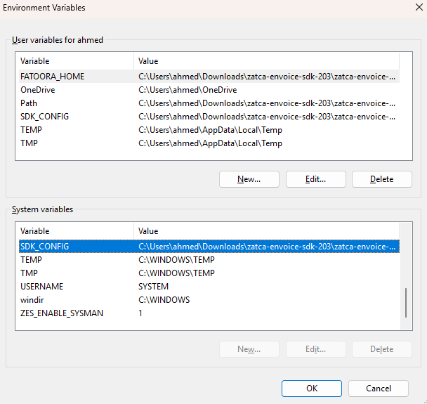
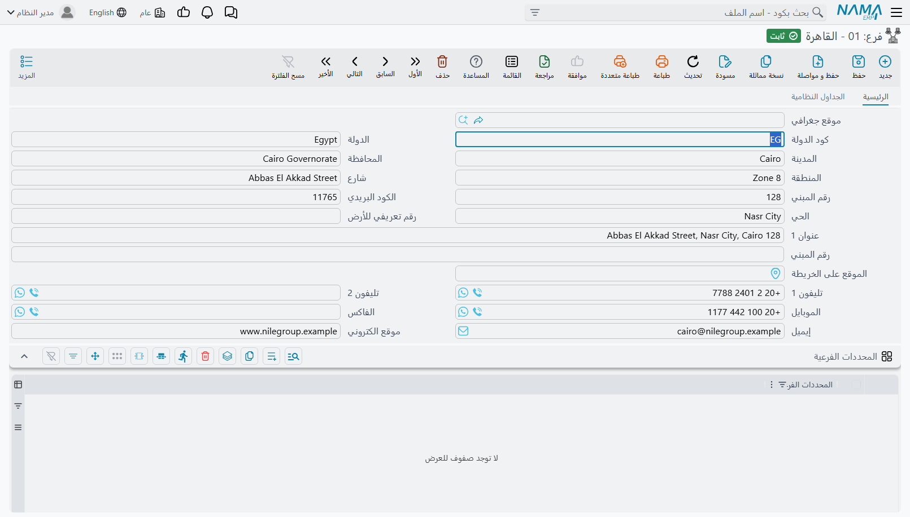
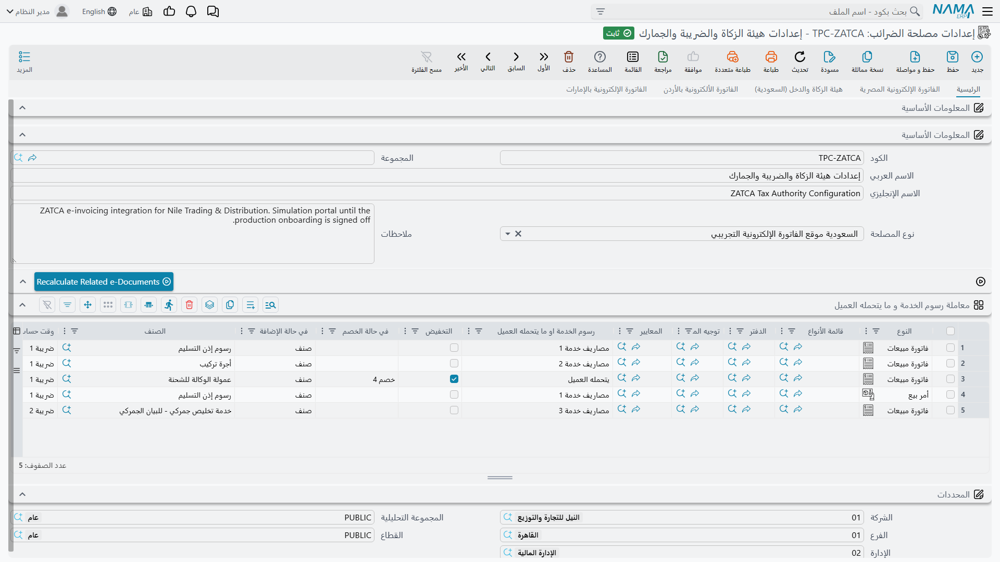
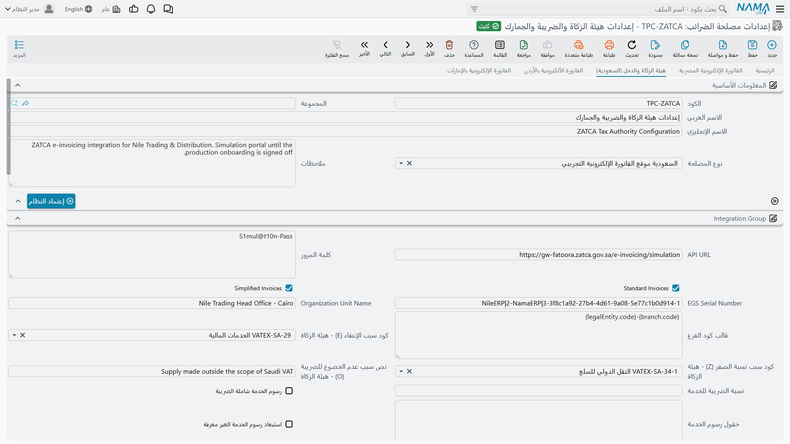
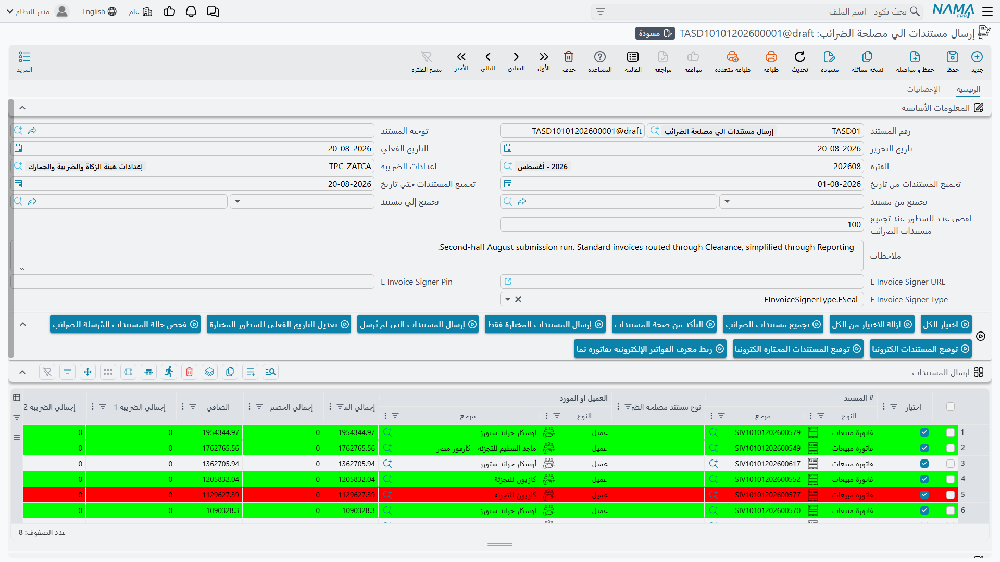

# الربط مع هيئة الزكاة والضريبة والجمارك بالسعودية (ZATCA – فاتورة)

تُلزم هيئة الزكاة والضريبة والجمارك (ZATCA) كل منشأة مسجلة في ضريبة القيمة المضافة بالمملكة العربية السعودية بإصدار فواتيرها إلكترونيًا عبر منصة **فاتورة**. ويطبّق نما **المرحلة الثانية**، مرحلة الربط والتكامل: تُبنى كل فاتورة ومرتجع وإشعار مدين بصيغة UBL 2.1 XML، وتُوقَّع، وتُرسَل إلى الهيئة مستندًا مستندًا.

التجميع والتحقق والإرسال هي الآلة نفسها التي يستخدمها نما مع كل دولة، وهي مشروحة مرة واحدة في [الفوترة الإلكترونية في نما](./e-invoices-guide.md). أما هذه الصفحة فتتناول ما تنفرد به السعودية: تجهيز الخادم، والاعتماد لدى الهيئة، وكيف يقرر نما نوع الفاتورة، ومن أين يُؤخذ كل جزء منها.

## ما الذي يختلف في السعودية

**نوعان من الفواتير، وطريقان.** تقسم الهيئة المبيعات إلى نوعين يسلك كلٌّ منهما طريقه:

| النوع | المشتري المعتاد | الطريق | متى تصبح فاتورة نظامية؟ |
|---|---|---|---|
| **الفاتورة الضريبية (Standard)** | منشأة أو جهة حكومية | **الاعتماد (Clearance)** — تفحصها الهيئة وتعيد نسخة مختومة | بعد اعتماد الهيئة لها فقط. والنسخة المعتمدة هي التي يستحقها المشتري. |
| **الفاتورة الضريبية المبسطة (Simplified)** | مستهلك | **الإبلاغ (Reporting)** — تسلّمها للعميل ثم تبلغ عنها خلال 24 ساعة | فورًا. وفحص الهيئة يأتي بعد ذلك. |

ولا تختار النوع لكل مستند بنفسك؛ بل يقرره نما من العميل كما في قسم «ضريبية أم مبسطة؟» أدناه.

**كل مستند مربوط بما قبله.** يحمل كل مستند عدّادًا متصاعدًا وبصمة (hash) المستند السابق المُرسَل من الوحدة نفسها، وبهذه السلسلة تكشف الهيئة أي فاتورة مفقودة أو معدّلة. وفي نما، كل سجل من **إعدادات مصلحة الضرائب** هو وحدة إرسال واحدة — تسميها الهيئة *وحدة EGS* — لها عدّادها وسلسلتها.

**لا إرسال قبل الاعتماد.** لا تقبل الهيئة مستندات إلا من وحدة اعتمدتها. والاعتماد عملية تتم مرة واحدة برمز تحقق لمرة واحدة (OTP) من بوابة فاتورة، ويشغّلها نما من زر **إعتماد النظام**.

## تجهيز الخادم

لا بد أن تكون أداة التوقيع الخاصة بالهيئة (ZATCA SDK) وخدمة التوقيع في نما `zatca.war` على خادم نما قبل أي خطوة أخرى.

1. حمّل الأداة من [صفحة SDK على موقع الهيئة](https://zatca.gov.sa/E-Invoicing/SystemsDevelopers/ComplianceEnablementToolbox/Pages/DownloadSDK.aspx) وفك ضغطها.
2. في المجلد الناتج، غيّر اسم الملف `install.ba_` إلى `install.bat` (حدده واضغط F2) ثم شغّله.
3. يُنشئ المثبّت متغير بيئة اسمه `SDK_CONFIG` للمستخدم الحالي فقط، وTomcat يعمل كخدمة فلا يراه، لذا انسخه إلى **متغيرات النظام (System Variables)**. افتح المحرر بالضغط على Win + R ثم:
   ```sh
   rundll32 sysdm.cpl,EditEnvironmentVariables
   ```

   ::: tip انسخ المتغير عبر PowerShell
   شغّل هذا في PowerShell **كمسؤول (Administrator)**:
   ```powershell
   $varName = "SDK_CONFIG"
   $userValue = [Environment]::GetEnvironmentVariable($varName, "User")
   if ($userValue) {
       Write-Host "Copying $varName with value '$userValue' to system environment..."
       [Environment]::SetEnvironmentVariable($varName, $userValue, "Machine")
       Write-Host "Copied successfully."
   } else {
       Write-Host "User environment variable '$varName' not found."
   }
   ```
   :::

   ويجب أن تبدو النتيجة هكذا:

   

4. افتح الملف `Configuration/config.json` في مجلد الأداة وتأكد أن كل مسار فيه يشير إلى ملف موجود.
5. حمّل `zatca.war` من <https://namasoft.com/bin/zatca.war> وضعه في مجلد `webapps` الخاص بـ Tomcat، ثم أعد تشغيل Tomcat ليقرأ متغير النظام الجديد.

وللتأكد من أن الخدمة تعمل، افتح `http://<server>:<port>/zatca/api` في المتصفح، فيجيب بـ **Zatca war is running**. وإذا ظهرت رسالة *Please update zatca JAR* عند الاعتماد أو الإرسال، فالخدمة غير منشورة أو متوقفة.

## إظهار صفحة الهيئة

في **الإعدادات العامة**، الصفحة الثانية، اجعل **عرض صفحة الفاتورة الإلكترونية الخاصة بـ** = **هيئة الزكاة والدخل (السعودية)**:

<GlobalConfigOption option-code="value.info.einvoicePageShowType" />

ثم شغّل **Regen UI** لتظهر صفحة الهيئة في الإعدادات وفي المستندات.

::: warning اختر صفحة الهيئة لا «كل الصفحات»
إذا تُرك الحقل فارغًا أو كان **كل الصفحات**، يفحص نما أكواد الضرائب والوحدات على قوائم الأكواد المصرية، فتفشل مستندات السعودية في التحقق بأكواد صحيحة تمامًا عند الهيئة. لا تختر **كل الصفحات** إلا إذا كانت قاعدة البيانات نفسها ترسل في مصر أيضًا.
:::

## من أنت في نظر الهيئة

تعرف الهيئة البائع برقمه الضريبي وسجله التجاري وعنوانه الوطني، ويأخذها نما من مكانين.

**من الإعدادات:** الرقم الضريبي للبائع هو **رقم التسجيل الضريبى** في الإعدادات، ويجب أن يكون 15 رقمًا يبدأ وينتهي بالرقم 3.

**من شركة المستند:** وكل ما عدا ذلك يُؤخذ من الشركة التي صدرت تحتها الفاتورة:

| ما تحتاجه الهيئة | من أين يأخذه نما |
|---|---|
| اسم البائع | الاسم العربي للشركة |
| السجل التجاري (CRN) | **كود مصلحة الضرائب** في بيانات الشركة. حروف وأرقام فقط. |
| العنوان الوطني | العنوان في بيانات الاتصال الخاصة بالشركة: **كود الدولة**، والدولة، والمحافظة، والمدينة، و**الحي**، والشارع، و**رقم المبني** (4 أرقام بالضبط)، و**الكود البريدي** (5 أرقام بالضبط)، و**رقم تعريفي للأرض**. |



وحقل **حساب معرف الفرع من** في الإعدادات يحدد السجل الذي يُفحص عند حفظ الإعدادات، والسجل الذي يُوصف للهيئة أثناء الاعتماد. اجعله **شركة**، واجعل شركة الإعدادات نفسها هي الشركة التي ترسل عنها. بذلك يتطابق السجل الذي يفحصه نما مع السجل الذي تعتمده الهيئة ومع السجل المطبوع على الفواتير. والمجموعة ذات الشركات المتعددة تحتاج سجل إعدادات لكل شركة.

## إنشاء الإعدادات

افتح **إعدادات مصلحة الضرائب**، وأنشئ سجلًا، واختر **نوع المصلحة**. يحدد النوع البيئة و**API URL** معًا:

| نوع المصلحة | البيئة |
|---|---|
| السعودية - موقع الفاتورة الإلكترونية للمطورين | بوابة المطورين لدى الهيئة. مناسبة لأول تجربة؛ لا شيء فيها حقيقي. |
| السعودية موقع الفاتورة الإلكترونية التجريبي | بيئة المحاكاة لدى الهيئة. استخدمها لبروفة كاملة على بياناتك. |
| السعودية - موقع الفاتورة الإلكترونية | التشغيل الفعلي. |



ثم املأ صفحة **هيئة الزكاة والدخل (السعودية)**:



| الحقل | ماذا تضع فيه |
|---|---|
| **كلمة المرور** | رمز OTP من بوابة فاتورة، ويستخدمه **إعتماد النظام**. والحقل مطلوب في كل حفظ، فبعد الاعتماد يمكن أن تبقى فيه أي قيمة. |
| **EGS Serial Number** | الرقم التسلسلي لوحدة الإرسال هذه. مطلوب. وصيغته موضحة أسفل الجدول. |
| **Standard Invoices** و **Simplified Invoices** | الأنواع التي ستصدرها هذه الوحدة. لا تحدد هذه العلامات إلا عينات المستندات التي تُرسل أثناء الاعتماد، ولا توجّه المستندات الفردية. |
| **Organization Unit Name** | لعضو في مجموعة ضريبية (الرقم الحادي عشر من الرقم الضريبي = 1): السجل التجاري للعضو من 10 أرقام. وفي غير ذلك: أي اسم للفرع. |
| **كود سبب الإعفاء (E) - هيئة الزكاة**، **كود سبب نسبة الصفر (Z) - هيئة الزكاة**، **نص سبب عدم الخضوع للضريبة (O) - هيئة الزكاة** | الأسباب المرسلة مع السطور المعفاة والصفرية وغير الخاضعة. انظر قسم «الضرائب وفئات ضريبة القيمة المضافة» أدناه. |
| **حساب معرف الفرع من** | **شركة** — كما سبق. |
| **نوع النشاط للفرع** | مطلوب. ولا يُرسل للهيئة إلا أثناء الاعتماد، كفئة النشاط. |
| **حساب اكواد أنواع الضرائب من** | المصدر الذي تُقرأ منه فئة كل ضريبة. انظر قسم «الضرائب وفئات ضريبة القيمة المضافة». |
| **رقم التسجيل الضريبى** | الرقم الضريبي للبائع من 15 رقمًا. |
| **أقصي عدد أيام لإرسال الفواتير** | أقصى عمر للمستند ليظل قابلًا للإرسال. ويبدأ بـ 3 في الإعدادات الجديدة. |
| **بدء الإرسال من تاريخ** | المستندات المؤرخة قبل هذا اليوم لا تُرسل أبدًا. استخدمه حتى لا يجرف تفعيل الهيئة الفواتير القديمة. |
| **عدد الأيام للسماح بإنشاء مستندات مستقبلية** | إلى أي مدى يمكن تأريخ مستند يُرسل للهيئة في المستقبل. |

وتتوقع الهيئة **EGS Serial Number** في ثلاثة أجزاء مرقّمة — اسم الحل، ثم طرازه أو إصداره، ثم الرقم التسلسلي للوحدة نفسها:

```text
1-Nama|2-ERP|3-0001
```

::: warning لا تعمل نسخة مماثلة من الإعدادات لإنشاء وحدة ثانية
**نسخة مماثلة** تنسخ الشهادة التي أصدرتها الهيئة للسجل الأصلي، فتُرسل وحدتان بهوية واحدة ولكل منهما عدّاد مستقل. أنشئ سجل الإعدادات الثاني من الصفر، أو اعتمد النسخة برمز OTP ورقم EGS خاصين بها قبل أن ترسل أي شيء.
:::

## الاعتماد: إعتماد النظام

احفظ الإعدادات أولًا، ثم:

1. ادخل بوابة فاتورة للبيئة نفسها (المحاكاة للمحاكاة، والفعلية للفعلية) وأنشئ رمز OTP لوحدة واحدة.
2. ضع الرمز في **كلمة المرور** واحفظ.
3. اضغط **إعتماد النظام**.

فيقوم نما دفعة واحدة بما يلي:

1. يبني طلب شهادة من الإعدادات: الرقم الضريبي، واسم الشركة وعنوانها وسجلها التجاري، ورقم EGS، و Organization Unit Name، ونوع النشاط.
2. يطلب من الهيئة شهادة الامتثال باستخدام الرمز.
3. يرسل عينات الامتثال: فاتورة ضريبية وإشعار دائن وإشعار مدين إذا كانت **Standard Invoices** مؤشرة، والثلاثة المبسطة إذا كانت **Simplified Invoices** مؤشرة.
4. إذا نجحت كل العينات، يطلب شهادة التشغيل الفعلي ويحفظها في الإعدادات.

عند النجاح يعود الزر دون رسالة، وتصبح الإعدادات جاهزة للإرسال. وعند أي فشل يعرض الزر أسباب الهيئة نفسها ولا يُحفظ شيء؛ أصلح ما تشير إليه، واحصل على رمز جديد، واضغط مرة أخرى.

الرمز صالح لساعة واحدة ولاستخدام واحد. والضغط على **إعتماد النظام** لاحقًا برمز جديد يعيد اعتماد الوحدة من البداية ويستبدل الشهادة المحفوظة.

## ضريبية أم مبسطة؟

يحدد نما نوع كل مستند من بيانات الضرائب الخاصة بالعميل، عبر حقل **الكيان القانونى للشركة**:

| الكيان القانونى للشركة | نوع المستند |
|---|---|
| جهة حكومية | ضريبية — تُعتمد |
| قطاع خاص | ضريبية — تُعتمد |
| فرد | مبسطة — يُبلَغ عنها |
| اجنبي | مبسطة — يُبلَغ عنها |
| فارغ | ضريبية إذا كان للعميل **رقم التسجيل الضريبى**، ومبسطة إن لم يكن |

والمستند الذي ليس له عميل أصلًا يُعامل كفاتورة ضريبية، والفاتورة الضريبية تحتاج مشتريًا، لذا اجعل لمبيعات النقد عميلًا — يكفي «عميل نقدي» عام كيانه **فرد**.

ولا دور هنا لعلامتي **Standard Invoices** و **Simplified Invoices** في الإعدادات. فالوحدة المعتمدة للفواتير الضريبية وحدها ستحاول إرسال فاتورة مبسطة إذا اقتضى العميل ذلك، والقرار في قبولها للهيئة.

## من العميل في نظر الهيئة

الفاتورة الضريبية لا بد أن تسمّي المشتري وتعرّفه. أما المبسطة فلا تحتاج أيًّا منهما، لكن ما تملؤه يُرسل.

اسم المشتري هو الاسم العربي للعميل، ورقمه الضريبي هو **رقم التسجيل الضريبى** للعميل، وعنوانه بالحقول نفسها التي للبائع. وإذا كانت الدولة SA فيجب أن يكون **الكود البريدي** 5 أرقام.

والهوية نوع وقيمة. إذا كان **نوع هوية المشتري (هيئة الزكاة)** محددًا في بيانات الضرائب للعميل، استخدم نما ذلك النوع وأخذ القيمة من الحقل المقابل:

| الكود | الهوية | القيمة من |
|---|---|---|
| `TIN` | الرقم الضريبي | **رقم التسجيل الضريبى** |
| `CRN` | السجل التجاري | **رقم السجل التجاري** |
| `700` | الرقم الوطني الموحد | **الرقم الوطني الموحد** |
| `NAT` | الهوية الوطنية | **رقم البطاقة الشخصيه** |
| `PAS` | جواز السفر | **رقم البطاقة الشخصيه** |
| `MOM`، `MLS`، `SAG`، `GCC`، `IQA`، `OTH` | تراخيص وزارة الشؤون البلدية ووزارة الموارد البشرية ووزارة الاستثمار، وهوية دول الخليج، والإقامة، وغير ذلك | **الرقم المميز** |

وإذا كان **نوع هوية المشتري (هيئة الزكاة)** فارغًا، يستنتجه نما بأول ما ينطبق:

1. **فرد** له **رقم البطاقة الشخصيه** ← `NAT`.
2. **اجنبي** له **رقم البطاقة الشخصيه** ← `PAS`.
3. **رقم السجل التجاري** ← `CRN`.
4. **الرقم الوطني الموحد** ← `700`.
5. **الرقم المميز** ← `CRN`.
6. **رقم التسجيل الضريبى** ← `TIN`.

والسجل التجاري الذي يبدأ هو نفسه بـ `700` هو رقم وطني موحد، فيُرسل دائمًا تحت `700` لا `CRN`.

::: warning الرقم المميز له الأولوية
متى امتلأ **الرقم المميز** للعميل فهو القيمة المرسلة، أيًّا كان النوع المختار. لا تملأه إلا للعملاء الذين تعرّفهم إحدى الرخص أو الهويات المخصص لها (`MOM`، `MLS`، `SAG`، `GCC`، `IQA`، `OTH`).
:::

وتُحذف الشرطات والمسافات من الهوية قبل الإرسال.

## ما المستندات التي تُرسل، وبأي نوع

يُرسل المستند إلى الهيئة إذا كان **دفتر المستند** أو **توجيهه** مؤشرًا عليه **إرسال الي مصلحة الضرائب** ويسمّي هذه الإعدادات في **إعدادات الضريبة**، كما في قسم «ما الذي تحدده الإعدادات» في [الدليل العام](./e-invoices-guide.md). وفواتير المبيعات ومرتجعاتها، وفواتير نقاط البيع ومرتجعاتها، والخدمات والإيجار والمقاولات وسائر مستندات الفوترة تتأهل بالطريقة نفسها.

ويُرسل كل مستند بأحد أنواع الهيئة الثلاثة:

| نوع الهيئة | المستندات |
|---|---|
| **إشعار دائن** | المرتجعات: مرتجعات المبيعات، ومرتجعات نقاط البيع، وسائر مستندات الإرجاع. |
| **إشعار مدين** | أي مستند في توجيهه **إشعار مدين** مؤشرًا. أما الإشعارات المدينة والدائنة ومستندات إلغاء عقود العقارات وغراماتها فتأخذ النوع من **يرسل ك** في التوجيه. |
| **فاتورة** | كل ما عدا ذلك. |

وتحتاج الإشعارات الدائنة والمدينة أمرين لا تحتاجهما الفاتورة:

- **الفاتورة الأصلية.** تريد الهيئة معرفة الفاتورة التي يُصحَّح عليها. يرسل نما كود المستند الموجود في **بناءا على**، لذا أنشئ المرتجع من الفاتورة التي يعكسها.
- **السبب.** يُرسل حقل **ملاحظات** في المستند سببًا للإشعار، ويرفض التحقق إشعارًا بدونه.

ويحتاج كل مستند كذلك إلى **وسيلة دفع**. يأخذ نما **كود طريقة الدفع** من التوجيه أولًا، ثم **كود مصلحة الضرائب** [لطريقة الدفع](/ar/platform/payments/payment-methods-and-terminals) في أول سطر من سطور الدفع، ثم `10` (نقدي) إذا دُفع المستند نقدًا، وإلا `1` (غير محدد).

## ما يحمله كل سطر

- **الصنف** يُعرَّف بـ **كود مصلحة الضرائب** الخاص به، أو بكوده إن كان فارغًا. ويمكن أن يأخذ **حساب الكود الضريبي للصنف من** الكود من مجموعة الصنف أو علامته التجارية أو تصنيفه بدلًا منه، ويمكن أن يبنيه **قالب كود الصنف** من نمط. وهذه القيمة هي التي تظهر اسمًا للصنف في السطر لدى الهيئة.
- **الوحدة** هي **كود مصلحة الضرائب** للوحدة.
- **السعر** هو سعر الوحدة قبل الضريبة بخانتين عشريتين. وتصبح الخصومات قبل الضريبة خصمًا على السطر، ويُوزَّع خصم رأس المستند على السطور.
- **رسوم الخدمة** المحمّلة على العميل تُرسل رسمًا على مستوى المستند، ما لم تُعدّ لتصبح سطور أصناف.

**العملة.** تريد الهيئة إجمالي الضريبة بالريال، لذا يجب أن يكون في قاعدة البيانات عملة افتراضية **كود مصلحة الضرائب** الخاص بها `SAR`. والمستند بعملة أخرى يُرسل بعملته، مع تحويل إجمالي الضريبة إلى الريال أيضًا بسعر المستند.

**التقريب.** يُقرَّب المبلغ المستحق إلى أقرب ريال صحيح ويُرسل الفرق مبلغَ تقريب، فقد يختلف المبلغ المستحق في الـ XML عن صافي المستند بما يصل إلى نصف ريال.

## الضرائب وفئات ضريبة القيمة المضافة

تصنّف الهيئة كل سطر بفئة ضريبية:

| الفئة | المعنى | السبب المطلوب |
|---|---|---|
| `S` | النسبة الأساسية (15%) | لا شيء |
| `Z` | نسبة صفرية | كود `VATEX` |
| `E` | معفى | كود `VATEX` |
| `O` | غير خاضع للضريبة | نص حر — ويرسل نما الكود `VATEX-SA-OOS` دائمًا |

وفئة كل ضريبة تأتي من أكواد الضرائب الخاصة بها، وهي تحمل نوع الهيئة (`VAT`) والنوع الفرعي (`S` أو `Z` أو `E` أو `O`). ويحدد **حساب اكواد أنواع الضرائب من** المصدر الذي تُقرأ منه هذه الأكواد — الإعدادات نفسها، أو الخطة الضريبية للصنف أو التوجيه أو العميل، أو إعدادات الضريبة — ويمكن للخطة الضريبية أن تحمل أسباب إعفاء خاصة بها تتقدم على أسباب الإعدادات. والمستند الذي أُزيل منه تأشير **خاضع للضريبة** يُرسل معفى.

وتأتي الأسباب من **كود سبب الإعفاء (E) - هيئة الزكاة** و**كود سبب نسبة الصفر (Z) - هيئة الزكاة** و**نص سبب عدم الخضوع للضريبة (O) - هيئة الزكاة** في الإعدادات، ما لم يكن للخطة الضريبية أسبابها. وقائمة الهيئة:

| الكود | السبب |
|---|---|
| `VATEX-SA-29` | الخدمات المالية |
| `VATEX-SA-29-7` | عقد تأمين على الحياة |
| `VATEX-SA-30` | التوريدات العقارية |
| `VATEX-SA-32` | صادرات السلع |
| `VATEX-SA-33` | صادرات الخدمات |
| `VATEX-SA-34-1` | النقل الدولي للسلع |
| `VATEX-SA-34-2` | النقل الدولي للركاب |
| `VATEX-SA-34-3` | الخدمات المرتبطة بالنقل الدولي للركاب |
| `VATEX-SA-34-4` | توريد وسائل نقل مؤهلة |
| `VATEX-SA-34-5` | الخدمات ذات الصلة بنقل السلع أو الركاب |
| `VATEX-SA-35` | الأدوية والمعدات الطبية |
| `VATEX-SA-36` | المعادن المؤهلة |
| `VATEX-SA-EDU` | الخدمات التعليمية الخاصة للمواطنين |
| `VATEX-SA-HEA` | الخدمات الصحية الخاصة للمواطنين |
| `VATEX-SA-MLTRY` | توريد السلع العسكرية المؤهلة |
| `VATEX-SA-OOS` | خارج نطاق ضريبة القيمة المضافة |

ولأن `VATEX-SA-EDU` و `VATEX-SA-HEA` لا ينطبقان إلا على المواطنين، تتوقع الهيئة الهوية الوطنية للمشتري (`NAT`) في تلك الفواتير.

## الإرسال

يتبع الإرسال الدورة العامة — اجمع، تحقق، أرسل — على **مستند إرسال المستندات إلى مصلحة الضرائب**، كما في قسم «الإرسال: اجمع، تحقق، أرسل» في [الدليل العام](./e-invoices-guide.md).



وما تنفرد به الهيئة:

- **مستند واحد في كل طلب.** تذهب الضريبية إلى الاعتماد والمبسطة إلى الإبلاغ، ويعود الرد في الطلب نفسه. فيصبح السطر **تم ارساله** أو **لم يتم ارساله بشكل صحيح** فورًا، وعليه أسباب الهيئة. ولا شيء يُسأل عنه بعد ذلك، لذا لا أثر لـ **فحص حالة المستندات المُرسلة للضرائب** على مستندات السعودية.
- **لا خطوة توقيع تضغطها.** التوقيع جزء من الإرسال.
- **أرسل بالترتيب.** لأن كل مستند يحمل بصمة ما قبله، أرسل مستندات الوحدة بترتيب تواريخها، وأعد إرسال المرفوض بعد تصحيحه بدلًا من تركه خلفك.
- **النسخة المعتمدة محفوظة.** في الفاتورة الضريبية تُحفظ نسخة الهيئة المعتمدة — بختم الهيئة ورمز QR الخاص بها — على سطر الإرسال.

### المهل

تسمح الإعدادات الجديدة بـ **3 أيام** بين تاريخ المستند وإرساله. فالمستند الأقدم من **أقصي عدد أيام لإرسال الفواتير** لا يُحفظ بتاريخ فعلي بهذا القِدم، والمستند الذي يتقادم قبل إرساله لا يُجمَّع بعد ذلك. والهيئة تتوقع الإبلاغ عن الفاتورة المبسطة خلال 24 ساعة، فجدول المسارات الآلية الموصوفة في [الدليل العام](./e-invoices-guide.md) بدلًا من الاعتماد على تذكُّر أحد.

### تصحيح مستند مُرسَل

متى صار المستند **تم ارساله** أقفله نما: لا يُعدَّل ولا يُحذف. ولا إلغاء لدى الهيئة كذلك. والتصحيح مستند جديد — مرتجع مبيعات (إشعار دائن) لتخفيض الفاتورة أو عكسها، أو مستند يُرسل إشعارًا مدينًا لزيادتها — يُنشأ من المستند الأصلي ليحمل المرجع.

### الـ XML وملف PDF

**تصدير XML المُرسَل/المعتمَد للسطور المختارة** في مستند الإرسال يعطيك الـ XML الذي تحتفظ به الهيئة: النسخة المعتمدة للفاتورة الضريبية، والمُبلَغ عنها للمبسطة. و**تصدير XML الحالي للسطور المختارة** يعيد بناءه من بيانات اليوم دون توقيع. فإن اختلفا فقد تغيّر المستند بعد إرساله.

ولتسليم العملاء ملف PDF بداخله الـ XML، كما يتوقع نموذج PDF/A-3 لدى الهيئة، أشّر **Include ZATCA XML In PDF** على نموذج طباعة الفاتورة في **تعريف تقرير**. وهو متاح لتقارير نماذج الشاشات الخاصة بالفواتير والمرتجعات، ويُرفق الـ XML الذي تحتفظ به الهيئة.

## رسائل قد تظهر لك

رسائل التحقق العامة — حقل مطلوب، أو كود غير صالح، أو تاريخ فعلي خارج المهلة، أو دفتر وتوجيه يسمّيان إعدادات مختلفة — مذكورة في قسم «رسائل قد تظهر لك» في [دليل مصر](./egypt-einvoice-guide.md)، وتُقرأ بالطريقة نفسها في مستندات السعودية. أما الرسائل التالية فخاصة بالهيئة، ومعظمها ليس له نص عربي فيظهر بالإنجليزية على الشاشات العربية.

| الرسالة | السبب | ماذا تفعل |
|---|---|---|
| *Please update zatca JAR* | لم يصل نما إلى خدمة التوقيع `zatca.war`. | انشر `zatca.war` في `webapps` وأعد تشغيل Tomcat. انظر «تجهيز الخادم». |
| *Please approve system first in tax payer configuration file* | لا شهادة تشغيل في الإعدادات بعد. | شغّل **إعتماد النظام**. |
| *CSR is not generated, please check company vat information* | تعذّر بناء طلب الشهادة من الإعدادات. | راجع **رقم التسجيل الضريبى** و **EGS Serial Number** واسم الشركة وعنوانها، ثم أعد المحاولة. |
| *In case of a company belongs to a group please provide field {0} with a valid 10 numbers (Record Number)* | الرقم الضريبي لمجموعة ضريبية (رقمه الحادي عشر 1)، و **Organization Unit Name** ليس رقمًا من 10 أرقام. | ضع السجل التجاري للعضو من 10 أرقام في **Organization Unit Name**. |
| *Error while approving system {0}* | رفضت الهيئة الرمز أو إحدى عينات الامتثال، و{0} يحمل أسبابها. | السبب المعتاد رمز منتهٍ أو مستخدم — أنشئ رمزًا جديدًا. وإلا فأصلح ما تشير إليه الأسباب. |
| *Error while validating tax authority document {0} - the seller VAT registration number is required by ZATCA (BR-KSA-39)* | **رقم التسجيل الضريبى** في الإعدادات فارغ. | املأه. |
| *Error while validating tax authority document {0} - the seller VAT registration number {1} must be 15 digits starting and ending with 3 (BR-KSA-44)* | خطأ في كتابة الرقم الضريبي. | صحّح **رقم التسجيل الضريبى** في الإعدادات. |
| *Error while validating tax authority document {0} - the branch commercial registration field {1} is required by ZATCA (BR-KSA-08)* | شركة المستند ليس لها **كود مصلحة الضرائب**. | أدخل رقم السجل التجاري في **كود مصلحة الضرائب** للشركة. |
| *Error while validating tax authority document {0} - the branch commercial registration {1} must contain only letters and digits (BR-KSA-08)* | في **كود مصلحة الضرائب** للشركة شرطات أو مسافات أو رموز. | اترك الحروف والأرقام فقط. |
| *Error while validating tax authority document {0} - the seller building number {1} must contain 4 digits (BR-KSA-37)* | **رقم المبني** للشركة ليس 4 أرقام. | صحّحه من العنوان الوطني. |
| *Error while validating tax authority document {0} - the seller postal code {1} must be 5 digits (BR-KSA-66)* | **الكود البريدي** للشركة ليس 5 أرقام. | صحّحه. |
| *Error while validating tax authority document {0} - the buyer postal code {1} must be 5 digits (BR-KSA-67)* | **الكود البريدي** لعميل سعودي ليس 5 أرقام. | صحّحه في بيانات العميل. |
| *Error while validating tax authority document {0} - VAT category {1} requires a VATEX exemption reason code, please fill field {2} in the tax payer configuration (BR-KSA-CL-04)* | سطر معفى (`E`) أو صفري (`Z`) ولا كود سبب له. | املأ الحقل المذكور في {2} في الإعدادات، أو السبب في الخطة الضريبية. |
| «يجب ان يكون هناك عملة بكود ضريبي SAR وان تكون هي العملة الافتراضية» | لا عملة افتراضية تحمل الكود `SAR`. | ضع `SAR` في **كود مصلحة الضرائب** للريال واجعله العملة الافتراضية. |
| «الحقل {0} في الفرع المختار {1} مطلوب» | تظهر عند حفظ الإعدادات: السجل المختار في **حساب معرف الفرع من** ينقصه **كود مصلحة الضرائب** أو جزء من عنوانه. | أكمل ذلك السجل. |
| «لا يمكنك تعديل او حذف المستند {0} حيث انه تم ارساله الي مصلحة الضرائب» | قبلت الهيئة المستند. | أصدر إشعارًا دائنًا أو مدينًا بدلًا من ذلك. انظر «تصحيح مستند مُرسَل». |
| «لن يتم إرسال المستند {0}, الرجاء التحقق من التاريخ الفعلي قبل {1} ايام من اليوم او بداخل الفتره المحدده بالحقلين من {2} الي {3}» | المستند أقدم من **أقصي عدد أيام لإرسال الفواتير**. | تتوقع الهيئة المستندات في وقتها، والمستند الذي تجاوز المهلة يمر بإجراء الإرسال المتأخر لدى الهيئة نفسها. |
