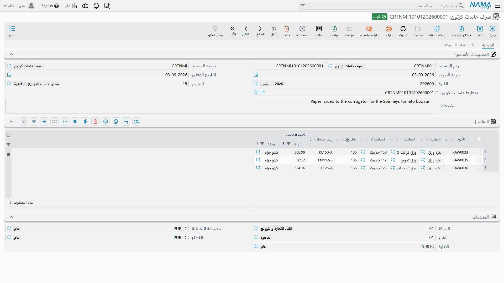
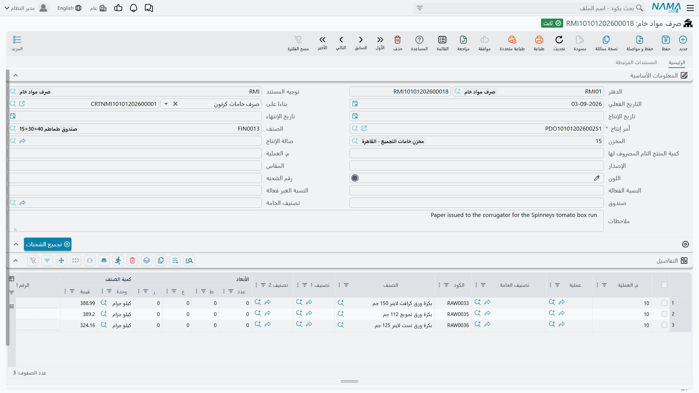

# صرف خامات الكرتون: من المخزن إلى صالة الإنتاج

## ما يصل التخطيط بالتنفيذ

لديك مستند تخطيط خامات. وقد حسب المُحسِّن أي بكرات تُستعمل، وبأي عروض، وبأي كميات. وأوامر الإنتاج مولَّدة وجاهزة.

والآن لا بد أن يغادر الورق المخزن ماديًا ويصل إلى ماكينة التمويج. وهذا ما يفعله **صرف خامات الكرتون**.

تجده في **التصنيع ← Cartoon ← صرف خامات كرتون**.

## القواعد الثلاث الحاكمة لهذه الشاشة

قبل كل شيء، ثلاث قواعد صارمة. كلها مطبَّقة، وكلها ستوقفك، ومعرفتها توفّر عليك نصف ساعة من الحيرة.

**لا بد أن يسمّي صرف خامات الكرتون مستند تخطيط.** فحقل **تخطيط خامات الكرتون** معلَّم بأنه إلزامي في الشاشة — والنجمة الحمراء عليه ليست زينة. ولا وجود لصرف خامات كرتون قائم بذاته. وإن أردت تحريك ورق دون خطة وراءه، فذاك [صرف مخزني](/ar/modules/supplychain/issuing-stock) عادي لا هذا المستند.

**ولا بد أن يكون مستند التخطيط ذاك يحمل خامات بالفعل.** فالصرف يُراجَع في مقابل ناتج القص في الخطة، والخطة التي لم تمرّ بـ**تجميع الخامات** ليس فيها ما يُراجَع في مقابله. جرّب الحفظ في مقابلها فيقولها Nama صراحةً: *لا يوجد خامات في مستند التخطيط*.

**ولا بد أن يكون مستند التخطيط ذاك قد ولّد أوامر إنتاجه بالفعل.** وهذه هي القاعدة التي تفاجئ الناس، لأن لا شيء في الشاشة يلمّح إليها. فالصرف لا يحمّل المادة على الخطة، بل على أمر الإنتاج الذي أنشأته الخطة، فيذهب باحثًا عن ذلك الأمر ويأبى الحفظ بدونه: *لا يوجد أمر انتاج منشأ بواسطة مستند التخطيط*. فالخطة المحلولة التي لم تمرّ بـ**توليد أوامر الإنتاج** ليست بعدُ شيئًا تصرف في مقابله.

::: warning ترتيب العمل ليس اختياريًا
الطلبية ← مستند التخطيط ← **تجميع الخامات** ← **توليد أوامر الإنتاج** ← الصرف. كل خطوة شرط لما بعدها، وتخطّي أي منها يُخفق عند الحفظ لا عند الترحيل — وهذا على الأقل تنبيه سريع.
:::

## ماذا يولّد هذا المستند

صرف خامات الكرتون ليس آخر السلسلة. فـ**ترحيله يولّد [صرف مواد خام](/ar/modules/manufacturing/raw-material-issue)** — وهو مستند التصنيع القياسي الذي يحمّل المادة فعليًا على أمر الإنتاج. فصرف الكرتون هو الواجهة العارفة بالكرتون، وصرف المواد الخام هو ما يراه محرك التكلفة.

ويظهر المستند المولَّد في صفحة **المستندات المرتبطة**، تحت **صرف مواد خام**. وافتحه تقرأ السلسلة كلها من بياناته الأساسية: فـ**بناءا على** يشير إلى صرف خامات الكرتون، و**أمر إنتاج** إلى الأمر الذي تُحمَّل عليه المادة، و**الصنف** إلى الكرتونة المصنوعة.

ولهذا أثر في الإعداد يوقع الناس. **فتوجيه صرف خامات الكرتون لا بد أن يسمّي الدفتر والتوجيه المستعملين للمستند الذي يولّده** — والإعدادان هما **دفتر مستند صرف مواد خام المنشأ** و**توجيه مستند صرف مواد خام المنشأ**، في مجموعة **الإنشاء التلقائي** بالتوجيه. اترك أيهما فارغًا فتُخفق كل محاولة ترحيل برسالة تسمّي الإعداد الناقص. وهو ضبط يُجرى مرة واحدة، لكن لا يعمل شيء قبله.

## ملء المستند

الشاشة صغيرة عن قصد. مجموعة بيانات أساسية واحدة، وجدول واحد، والمحددات.

### البيانات الأساسية

**رقم المستند** يحمل **الدفتر** والرقم، و**توجيه المستند** يحمل الإعدادات — ومنها إعدادات الإنشاء التلقائي أعلاه. و**تاريخ التحرير** و**التاريخ الفعلي** و**الفترة** تؤرّخ الحركة.

**المخزن** هو الموضع الذي يُسحب منه الورق. ولاحظ أنه في **البيانات الأساسية** لا في الأسطر: فصرف خامات الكرتون الواحد يسحب من مخزن واحد. والمواد الخارجة من مخزنين مختلفين تحتاج مستندين.

**تخطيط خامات الكرتون** هو الرابط الإلزامي بالخطة، كما سبق.

**ملاحظات** نص حر.

### جدول التفاصيل

كل سطر مادة واحدة تُصرف، والجدول قصير عن قصد:

**الكود** و**الصنف** يعرّفان صنف البكرة.

**التصنيف 1** و**التصنيف 2** هما درجة الورق ووزنه — التصنيفان نفساهما اللذان طابق عليهما المُحسِّن، منقولان إلى هنا ليصف الصرف نفسه بنفسه.

**صندوق** هو عرض البكرة. وهذا أهم عمود في الشاشة، ومن السهل تخطّيه لأن كلمة «صندوق» لا توحي بعرض. ففي صنف بكرة الورق، محدد الصندوق *هو* العرض، فالسطر الذي يقول `135` يقول «بكرة 135 سم» — وعروض البكرات في هذه الشاشات بالسنتيمتر، وهي الوحدة نفسها التي يعمل بها مستند التخطيط.

**رقم الشحنه** هو البكرة بعينها. وحيث حدّدت الخطة لوطًا، فطابقه.

**كمية الصنف | قيمة** و**وحدة** هما المقدار. والبكرات تُخزَّن عادةً بالوزن، فهذا كيلوجرامات في الغالب لا أمتار — والأمتار هي **الطول المتري** في الخطة، وهو ما تقصّه صالة الإنتاج لا ما يصرفه المخزن.

## ماذا يفعل الترحيل

ترحيل الصرف يخفض مخزون كل صنف، عند ذلك اللوط وذلك العرض في محدد الصندوق، في مخزن البيانات الأساسية، ويولّد صرف المواد الخام الذي يحمّل المادة على أمر الإنتاج.

والجانب متعدد الأبعاد يستحق التصريح، لأنه سبب سلوك مخزون الكرتون على ما هو عليه. فـNama يتتبع رصيدًا لكل صنف **لكل لوط لكل عرض صندوق لكل مخزن**. فصنف بكرة يحمل 8,000 كجم بعرض 135 سم و5,200 كجم بعرض 145 سم له رصيدان مستقلان، والصرف من 135 يترك 145 كما هو. فأخطئ قيمة الصندوق في سطر تسحب من عرض لم تقصده، ويبقى العرض الذي قصصته فعلًا في الدفاتر.

## العمل بالصرف عمليًا

اصرف في مقابل الخطة التي أنتجها المُحسِّن، وطابق عروضها. فإحلال بكرة 145 سم محل 135 سم المخططة ليس تبديلًا بالمثل: فنمط القص حُسب لعرض بعينه، وعلى عرض آخر قد لا تتّسع القطع كما تقول الخطة. وإن اضطررت إلى الإحلال، فتوقع تريمًا مختلفًا عن الخطة، واذكر السبب في الملاحظات — فهذه الملاحظة تكلّف ثوانٍ الآن وتجيب سؤالًا كانت إعادة تركيبه ستستغرق ساعة.

واصرف في حينه كذلك. فالخطة المبنية على صورة مخزون الأسبوع الماضي قد لا تكون قابلة للتنفيذ، لأن غيرك قد يكون سحب من اللوط نفسه في الأثناء. والفجوة بين التخطيط والصرف هي حيث تبلى الخطط في صمت.

واجعل الخطة الواحدة لصرف واحد ما استطعت. فالصرف الجزئي مدعوم، وله أسباب تشغيلية وجيهة — فمساحة التجهيز في الصالة قيد حقيقي — لكن كل مستند إضافي يجعل الأثر من الخطة إلى الاستهلاك أصعب تتبعًا قليلًا.

وأعطِ صالة الإنتاج اللوط والعرض لا الصنف وحده. فرقم اللوط الصحيح على الورق لا يجدي شيئًا إذا سحب العامل البكرة الخطأ من الرف، وفي مخزن الورق تبدو البكرة الخطأ في العادة كالبكرة الصحيحة تمامًا.

## أين يقع هذا من السلسلة

الصرف هو التسليم من عالم التخطيط المثالي إلى عالم الإنتاج الواقعي:

**[تخطيط خامات الكرتون](/ar/modules/manufacturing/carton-material-planning)** يقرر ماذا يُقص ومن أي بكرات.

**صرف خامات الكرتون** يُخرج ذلك الورق من المخزن ويولّد صرف المواد الخام الذي يحمّله على العمل.

**[تنفيذ الإنتاج](/ar/modules/manufacturing/production-execution)** يسجّل ما صُنع فعلًا.

**[إغلاق الأمر](/ar/modules/manufacturing/production-costing)** يقابل ما صُرف بما قالت الخطة إنه كان ينبغي صرفه، ويسوّي التكلفة.

وهذه المقابلة الأخيرة هي سبب إتقان كل ما سبق. فانحراف المواد بين المخطط والمصروف هو الرقم الذي يخبرك هل صمدت خطة المُحسِّن أمام واقع صالة الإنتاج — وهو صادق بقدر صدق العروض واللوطات التي كتبتها في هذه الشاشة.
