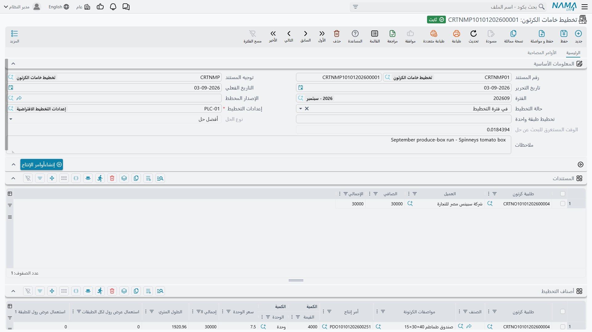
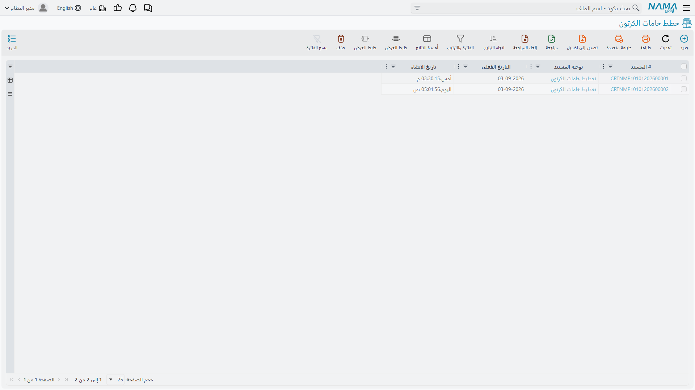
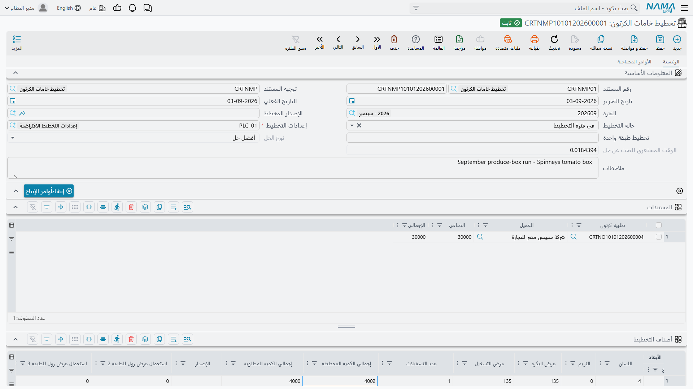
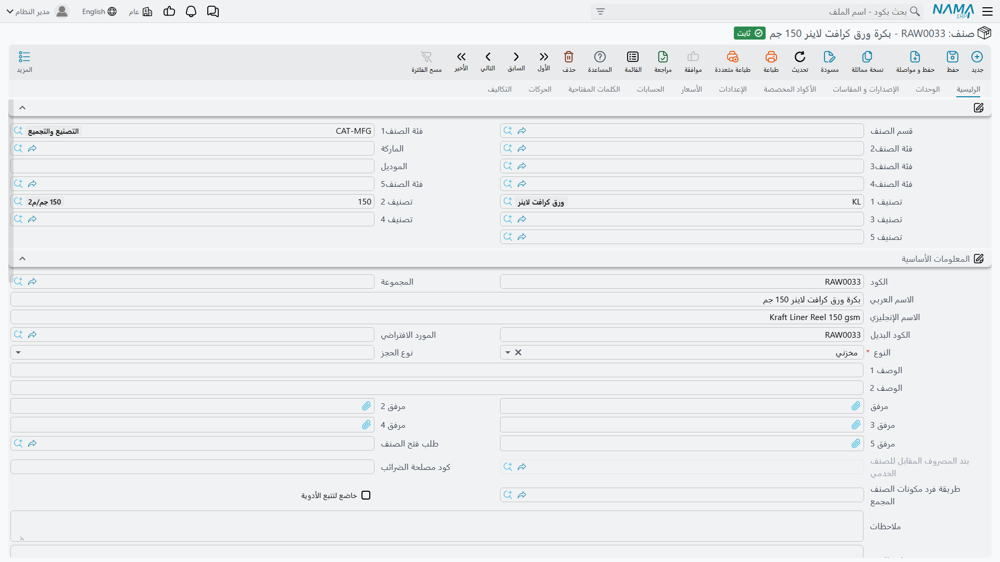
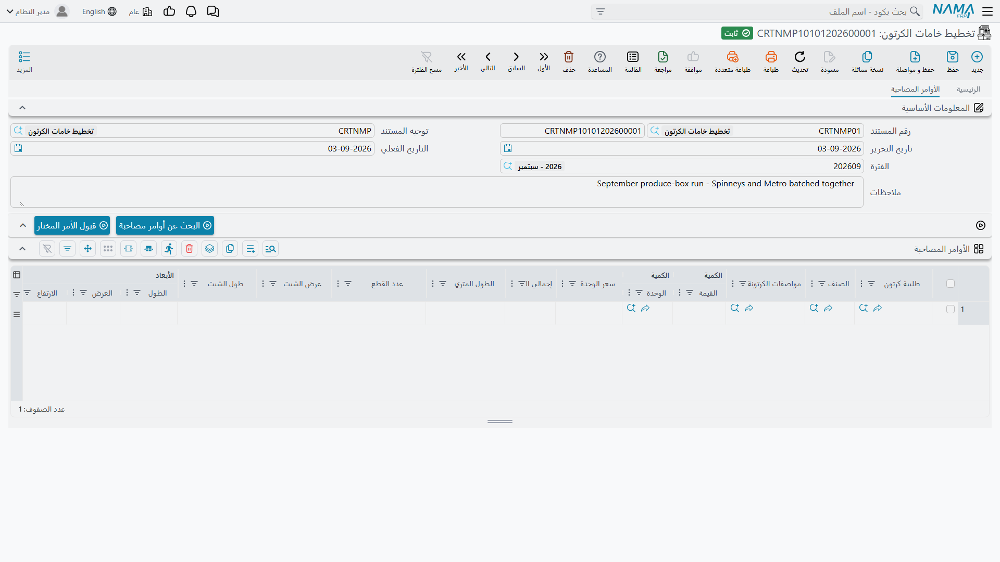
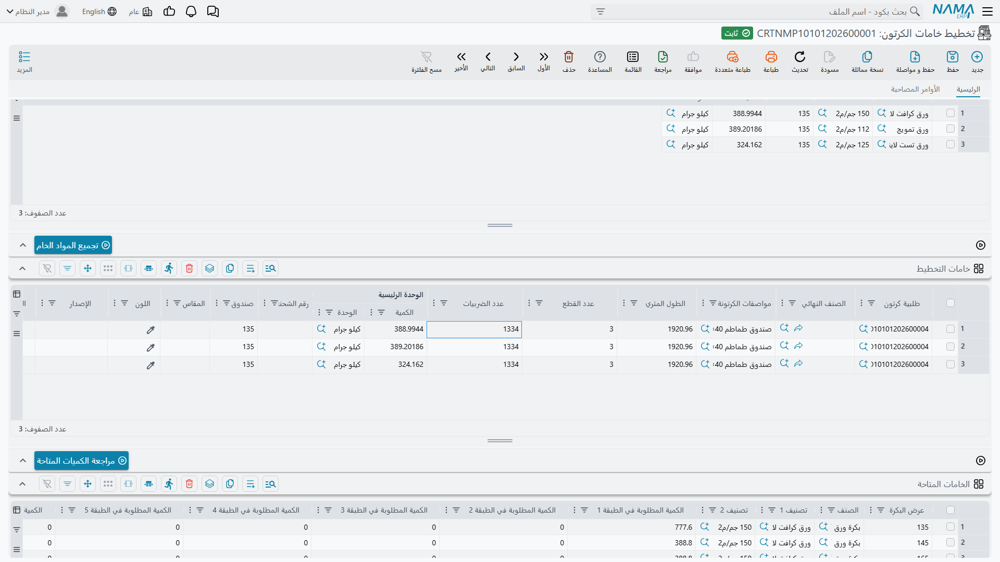
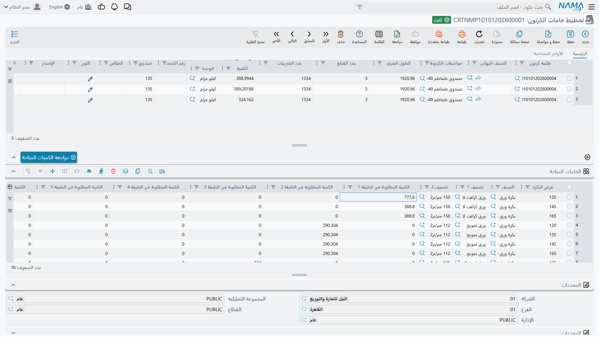
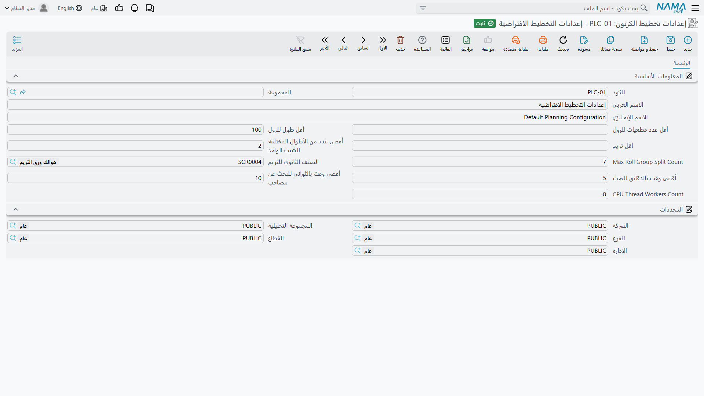
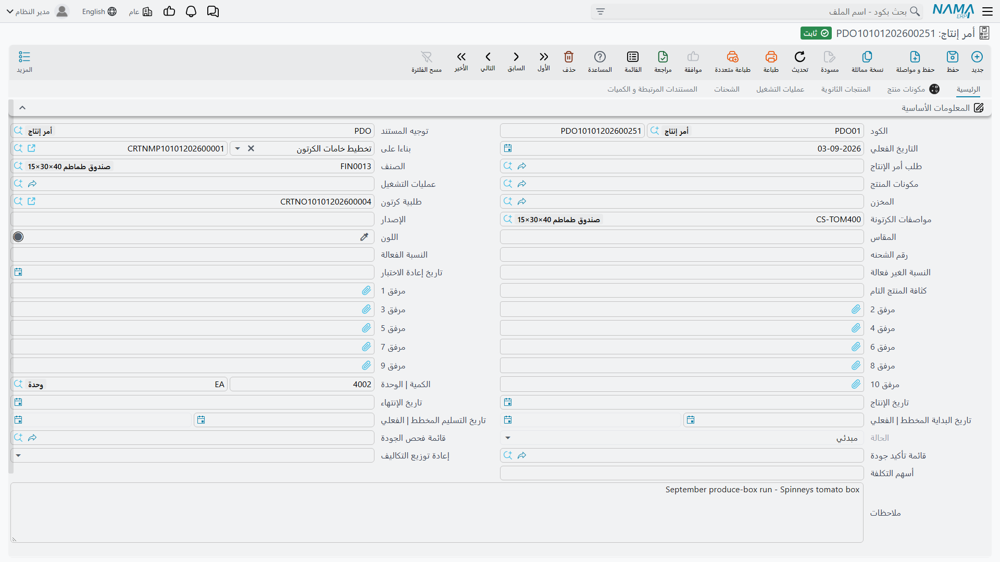

# تخطيط خامات الكرتون: محرك التحسين

## قلب كفاءة المواد

هنا يُثبت Nama ERP قيمته في تصنيع الكرتون. لديك طلبيات تنتظر التنفيذ، وبكرات ورق في المخزن، وهدف بسيط: أن تقص تلك البكرات لتنتج الكرتون المطلوب بأقل هدر.

يبدو بسيطًا، وليس كذلك.

فلديك طلبيات عدة بمقاسات مختلفة، وطبقات عدة في كل كرتونة من درجات ورق مختلفة، وعروض بكرات عدة في المخزن، وقيود على أقل تريم وأقل عدد قطعيات للرول وأقصى تعقيد إنتاجي مقبول. وعدد هائل من الطرق الممكنة لقص كل ذلك.

و**تخطيط خامات الكرتون** يأخذ هذا التعقيد ويبحث عن خطة القص الأقل هدرًا. تخبره بما ينبغي صنعه وبما لديك من مواد، فيخبرك كيف تقص كل بكرة.

تجده في **التصنيع ← Cartoon ← تخطيط خامات الكرتون**.

وشاشة القائمة هي سجل التخطيط — كل تشغيلة بحالتها وبالحل الذي بلغته.

## كيف تتوزع الشاشة

للمستند صفحتان، وصفحة **الرئيسية** كومة من أربعة جداول لا استمارة واحدة طويلة. والذي يجعلها مقروءة أن **لكل جدول زر إجراء خاصًا به يقف فوقه مباشرة**، وهذا الزر هو الذي يملأ الجدول الذي تحته:

| الإجراء | ماذا يفعل |
| --- | --- |
| **توليد أوامر الإنتاج** | يستهلك الخطة المكتملة وينشئ أوامر الإنتاج |
| **تجميع الخامات** | يملأ **خامات التخطيط** — خطة القص |
| **مراجعة الكميات المتاحة** | يملأ **الخامات المتاحة** — المخزون في مقابل المطلوب |
| **البحث عن أوامر مصاحبة** / **قبول الأمر المحدد** | يملآن **الأوامر المصاحبة**، في صفحتها الخاصة |

فتُقرأ الشاشة من أعلى إلى أسفل بترتيب العمل نفسه: صِف ما تحتاجه، ثم جِد المادة، ثم تحقق أنها موجودة فعلًا، ثم ولّد أوامر الإنتاج.

وصفحة **الأوامر المصاحبة** صفحة منفصلة لها نسختها من البيانات الأساسية وزراها. فهي مساحة بحث لا جزء من الخطة ذاتها، ولذلك تقف على حدة.

## إعداد مستند التخطيط

### البيانات الأساسية

**رقم المستند** يحمل **الدفتر** ورقم المستند، و**توجيه المستند** يحمل الإعدادات الحاكمة له. و**تاريخ التحرير** و**التاريخ الفعلي** و**الفترة** تؤرّخه كما في أي مستند آخر.

**إعدادات التخطيط** حقل **إلزامي** — معلَّم بنجمة حمراء، ولا يعمل شيء آخر في الشاشة بدونه. وهو يسمّي مجموعة المعاملات التي يلتزم بها المحرك: أقل تريم، وزمن البحث، وعدد الخيوط، وسائرها. وهي موصوفة أدناه.

**حالة التخطيط** لها قيمتان لا ثالث لهما:

- **مبدئي** — ما زلت تجمع المتطلبات.
- **تخطيط** — المستند جاهز للمُحسِّن.

ولا توجد حالة ثالثة بمعنى «مخطَّط». فالخطة المنتهية تظل معروضة بحالة **تخطيط**، والذي يخبرك بأنها حُلَّت هو حقل **نوع الحل** لا الحالة.

**تخطيط طبقة واحدة** يقصر التشغيلة على مرحلة إنتاج واحدة بدل كل المراحل. اتركه فارغًا لتخطيط كل المراحل معًا، وهو ما تريده كل تشغيلة تقريبًا.

**نوع الحل** و**الوقت المستغرق للبحث عن حل** معطّلان في الشاشة لأنهما نتيجتان. المحرك هو الذي يكتبهما، ولا تكتبهما أنت أبدًا.

**الإصدار المخطط** يحصر الخطة في إصدار صنف بعينه حيث تكون المواصفة خاضعة للإصدارات.

### إضافة الطلبيات

جدول **المستندات** هو مبدأ الخطة. وكل سطر يشير إلى **طلبية كرتون** ويعرض **العميل** و**الصافي** و**الإجمالي** المأخوذة منها.

ولملئه طريقان. من الطلبية نفسها، استخدم **توليد تخطيط خامات كرتون** فينشئ Nama مستند التخطيط والطلبية مدرجة فيه. أو أنشئ المستند وأضف أسطر الطلبيات بنفسك.

ويمكن إضافة أسطر إلى أصناف التخطيط مباشرة دون المرور بطلبية أصلًا، وهكذا تخطط للمخزون لا لعميل. وهذا استثناء لا قاعدة، ويكلّفك الرابط إلى الطلبية، فاستعمله حيث لا توجد طلبية يُربَط بها حقًا.

### ماذا يفعل الحفظ بجدول الأصناف

هذا هو الجزء الجدير بالمعرفة، لأنه يوفّر كتابة كثيرة.

**حين تحفظ مستند تخطيط فيه أسطر في `المستندات`، يملأ Nama جدول أصناف التخطيط نيابة عنك** من تفاصيل التصنيع في تلك الطلبيات. فيظهر سطر لكل مواصفة كرتونة، يحمل من الآن:

- **طلبية كرتون** و**مواصفات الكرتونة**
- **طول الشيت** و**عرض الشيت**، مأخوذين من المواصفة
- **الأبعاد | الطول** و**العرض** و**الارتفاع** و**اللسان**
- **سعر الوحدة** و**الإجمالي**

أما الذي **لا** يملؤه فهو **الكمية** و**إجمالي الكمية المطلوبة**. يبقيان فارغين وتكتبهما أنت.

وهذا مقصود لا سهو: فالكمية التي تخطط لها ليست دائمًا الكمية المطلوبة — فقد تخطط لجزء من الطلبية الآن وللباقي لاحقًا، أو تضيف هامشًا للهدر المتوقع — فيمتنع Nama عن التخمين.

::: warning راجع عمودي الكمية قبل التحسين
السطر الخالي من الكمية لا يضيف شيئًا إلى الخطة. وسيعمل المُحسِّن في هدوء، ويبلّغ بحل، ويكون قد خطط لأقل مما قصدت أن تصنع.
:::

### قراءة بقية جدول الأصناف

جدول الأصناف عريض، ونصفه الأيسر نتائج بالكامل. وقبل تشغيل المُحسِّن تقرأ كل تلك الأعمدة صفرًا.

وبعد التشغيل تحمل الإجابة لكل كرتونة. فـ**عرض البكرة** هو عرض البكرة الذي اختاره المحرك، و**عدد القطع** كم شيتًا يتّسع عرضها. و**عرض التشغيل** هو العرض الذي تستهلكه تلك القطع فعلًا، و**التريم** ما يتبقى — أي الهدر في هذا النمط. و**عدد التشغيلات** يعدّ عمليات القص المنفصلة التي تحتاجها الخطة، و**الطول المتري** الأمتار الطولية المطلوبة من البكرة. و**إجمالي الكمية المخططة** ما سيُنتَج فعلًا، وهو أعلى قليلًا في العادة من **إجمالي الكمية المطلوبة** لأن القص يجري بضربات كاملة.

أما أعمدة **استعمال عرض رول لكل الطبقات** و**استعمال عرض رول للطبقة 1** حتى **الطبقة 7** فتعمل في الاتجاه المعاكس: هي مدخلات، وهي تقيّد المحرك. املأ أحدها فلن ينظر إلا في بكرات ذلك العرض لتلك الطبقة. استعملها لمطلب حقيقي — إنهاء بكرة مستعملة جزئيًا، أو مطلب عميل يخص المظهر، أو ماكينة لا تدير إلا عروضًا بعينها — واتركها فارغة فيما عدا ذلك، لأن كل عرض مفروض اختيارٌ انتُزع من المُحسِّن.

## على أي شيء يطابق المُحسِّن البكرات

لا يعمل شيء من هذا ما لم يكن جانب المواد مهيّأً ليُعثر عليه، وهذا التهيئة ليست بيّنة من شاشة التخطيط.

بكرة الورق **صنف مخزني عادي**. وأربعة أمور هي التي تجعله بكرة.

**التصنيف 1 والتصنيف 2 يحملان الدرجة والوزن.** ففي الصنف، التصنيف 1 هو درجة الورق — كرافت لاينر، تست لاينر، ورق تمويج — والتصنيف 2 هو الوزن بالجرام لكل متر مربع.

والتصنيفان نفساهما يظهران في كل طبقة من [مواصفة الكرتونة](/ar/modules/manufacturing/carton-specifications). وهذه هي قاعدة المطابقة كلها: **يبحث المحرك عن مخزون تصنيفه 1 وتصنيفه 2 يساويان تصنيفَي الطبقة**. فأخطئ في أيهما، في الصنف أو في الطبقة، فلن تجد تلك الطبقة مادة البتة — مهما كان في المخزن من ورق.

**عرض البكرة يقيم في محدد الصندوق.** فلا يوجد حقل اسمه «عرض البكرة» في الصنف. العرض يُسجَّل في قيمة محدد **الصندوق** للصنف عند كل توريد، فيحمل كود الصنف الواحد مخزونًا بعدة عروض جنبًا إلى جنب — 120 و135 و145 و165 تحت صنف البكرة نفسه، لكل منها رصيده. ولهذا تعرض جداول التخطيط عمودًا اسمه **صندوق** حيث تتوقع عرضًا.

**إعدادات الصنف لا بد أن تتتبع اللوط والتعبئة.** فتتبع المحددات يُفعَّل من سجل **إعدادات الأصناف** الذي يشير إليه الصنف، لا من الصنف نفسه. وإن لم يكن ذلك السجل مفعَّلًا فيه تتبع التعبئة، رُفضت قيمة الصندوق عند توريد المخزون، ولن يجدي تعديل الصنف شيئًا. فأصناف البكرات تحتاج إعدادات تتتبع اللوط والتعبئة معًا.

**والوزن لا بد أن يُسجَّل رقمًا لا تصنيفًا فحسب.** فالمطابقة على التصنيف 2 تخبر المحرك *أي* البكرات وزنها 150 جم، ولا تخبره كم يزن الـ150 جم، وهو يحتاج ذلك ليحوّل وزن البكرة إلى طول. ويقرأ الرقم من **وزن الصنف** في الصنف، فإن كان فارغًا فمن **الوزن للمتر المربع** في أي من تصنيفات الصنف. وضبطه مرة واحدة في سجل التصنيف 2 — أي تصنيف الوزن نفسه — يغطي كل بكرة تحمل ذلك التصنيف. واتركه غير مضبوط في كل موضع فيتوقف **تجميع الخامات** برسالة *Could not determine weight per SQM for item* مسمّيًا البكرة التي عجز عنها.

وثمة نتيجة تستحق التصريح: البكرات تُخزَّن وتُصرف عادةً **بالوزن**، فالكميات في هذه الشاشات كيلوجرامات. و**الطول المتري** هو الرقم المنفصل الذي يعطي الأمتار الطولية، وهو ما تقصّه صالة الإنتاج فعلًا.

### الوحدة سنتيمترات

لا شيء في الشاشة يقول ذلك، وهو أغلى ما في الصفحة ثمنًا إن أخطأته.

فقبل أن يخطط المحرك شيئًا يحوّل وزن كل بكرة إلى طول: هذا القدر من الكيلوجرامات من ورق بهذا الوزن للمتر المربع، مفرودًا على بكرة بعرض معلوم، يساوي هذا القدر من أمتار البكرة. وهذا التحويل مكتوب على أساس **السنتيمتر**. فقيمة **الصندوق** في المخزون، و**طول الشيت** و**عرض الشيت** في المواصفة، كلها لا بد أن تكون بالسنتيمتر — فبكرة 135 سم تُسجَّل `135`، وشيت 1,440 × 450 مم يُسجَّل `144` × `45`.

سجّلها بالمليمتر بدلًا من ذلك فتبقى الهندسة صحيحة في الظاهر، لأن ثلاثة من 450 تتّسع فعلًا في 1350. لكن الحساب يزيغ حينئذ في اتجاهين معًا: فتُحسب البكرة أقصر من حقيقتها بعشر مرات، ويُحسب كل شيت أطول من حقيقته بعشر مرات، فيظن المحرك أن البكرة تعطي جزءًا من مائة مما تعطيه فعلًا. فالبكرة التي تكفي 27,000 ضربة تُعرض عليه بوصفها 274. فتُخفق التشغيلة برسالة **لا يمكن إيجاد حل ممكن**، وهي تُقرأ كأنها نقص مخزون وليست كذلك البتة.

::: tip كيف تعرف أيهما أمامك
قارن **عرض البكرة** بـ**عرض الشيت** في أي سطر. فبالسنتيمتر يكونان رقمين صغيرين بنسبة معقولة — 135 و45، ثلاثة عرضًا. فإن رأيت 1350 في مقابل 450، فالبيانات بالمليمتر ولن تُحَل خطة بكمية واقعية أبدًا.
:::

و**الطول المتري** هو الاستثناء: فهو يُعرض بـ**الأمتار**، لأن الأمتار هي ما تقيس به صالة الإنتاج استهلاك البكرات.

## تشغيل المُحسِّن

### البحث عن أوامر مصاحبة

هنا تظهر براعة الوحدة. لديك أمر واحد لتخطيطه. وقد تكون هناك طلبيات معلّقة أخرى لكرتون قريب التركيب — أيمكن قصّها من البكرات نفسها بهدر أقل؟

افتح صفحة **الأوامر المصاحبة** واستخدم **البحث عن أوامر مصاحبة**. يمرّ Nama على طلبيات الكرتون المرحّلة التي لم تُخطَّط بالكامل بعد، ويستبقي التي تتوافق تركيبة طبقات مواصفاتها، ثم يجري لكل مرشح تجربة سريعة: لو جُمعت هذه الطلبية مع طلبيتك، فكم يكون إجمالي الهدر؟ وتعود النتائج مرتبة بالهدر، الأفضل أولًا، ومع كل سطر **إجمالي الهدر**.

**ولماذا يهم هذا**: شيت عرضه 45 سم وحده على بكرة 165 سم يتّسع ثلاث مرات ويترك 30 سم تريم. أضف طلبية لشيت 39 سم فيمكن ترتيب الاثنين ليتركا أقل من ذلك بكثير. الوفر حقيقي، وهو أكبر رافعة منفردة في هذه الشاشة.

ولأخذ مرشح، حدد سطره واستخدم **قبول الأمر المحدد**. فتنضم الطلبية إلى جدول **المستندات** وتنضم مواصفاتها إلى الأصناف، ويمكنك البحث ثانيةً لإضافة غيرها.

والهدر ليس وحده ما يوزن. فقد يكون المرشح الأقل هدرًا لعميل يحتمل تسليمه التأجيل، والثاني في الترتيب عاجلًا. القائمة ترتّب بالمادة، وأنت ترتّب بالمادة *وبالوعد*.

و**أقصى وقت بالثواني للبحث عن مصاحب** يحدّ الزمن المبذول في تجربة كل مرشح. وهو ميزانية لكل مرشح، فالقيمة السخية مضروبة في مرشحين كثيرين انتظار طويل.

### تجميع الخامات

باكتمال جدول الأصناف وضبط الحالة على **تخطيط**، استخدم **تجميع الخامات**.

يبحث Nama في المخزون عن بكرات تطابق التصنيف 1 والتصنيف 2 لكل طبقة، عرضها يكفي الشيت زائد أقل تريم، وطولها يتجاوز أقل طول للرول، ثم يحسب كم قطعة وكم ضربة تعطي كل بكرة مرشحة، ويبني نموذج قيود على تلك الاحتمالات، ويحلّه بحثًا عن أقل هدر.

وحين ينتهي يكتب خطة القص في **خامات التخطيط**، والمجاميع في **إجماليات الخامات**، والإجابات لكل كرتونة في أعمدة النتائج في **أصناف التخطيط**، وحكمه على نفسه في **نوع الحل** و**الوقت المستغرق للبحث عن حل**.

و**نوع الحل** هو الجزء الصادق من الناتج:

- **الأمثل** — أثبت المحرك أنه لا توجد خطة أفضل.
- **ممكن** — وجد خطة صالحة لكن نفد وقته قبل أن يبرهن ذلك.

وفي العمل أغلب التشغيلات سريعة. فالطلبية المفردة المباشرة تُحَل عادةً بحالة **الأمثل** في جزء من الثانية، والدفعة من طلبيتين في ثوانٍ. لكن الصعوبة لا تتدرج برفق: فالتركيبة العسيرة تعمل حتى آخر ميزانيتها وتعود بحالة **ممكن**. وهذه إشارة إلى منحها **أقصى وقت بالدقائق للبحث** أطول وإعادة المحاولة — فدقائق بحث إضافية توفّر 2% من الورق تسدّد ثمنها في الحال.

### حين لا يجد المُحسِّن شيئًا

الأسباب المعتادة، بترتيب ما يستحق الفحص:

**الأبعاد بوحدة خاطئة.** أبعاد شيت أو عروض بكرات مسجّلة بالمليمتر لا بالسنتيمتر، كما سبق أعلاه. افحص هذا أولًا في التركيب الجديد: فهو غير ظاهر من الشاشة، ويُخفق بصورة توحي بشيء آخر تمامًا.

**لا مادة مطابقة.** والسبب الأشيع بفارق كبير ليس النقص بل عدم التطابق — طبقة تصنيفها 1 أو 2 لا يقابله صنف بكرة. راجع طبقات المواصفة في مقابل أصناف البكرات قبل أن تستنتج أنك بحاجة إلى شراء ورق.

**نقص حقيقي في المخزون.** لا بكرة بعرض كافٍ ولا بطول كافٍ ولا بالدرجة المطلوبة. و**مراجعة الكميات المتاحة** تُظهر هذا مباشرة.

**قيود ضيقة أكثر من اللازم.** أقل تريم مرتفع، أو أقل عدد قطعيات للرول يستبعد المخزون الذي تملكه فعلًا.

**وقت غير كافٍ.** دفعة معقدة في مقابل ميزانية بحث قصيرة.

## قراءة النتائج

### خامات التخطيط: خطة القص

هذا هو الناتج القابل للتنفيذ — سطر لكل طبقة من كل كرتونة، يقول أي مادة تُقص وكيف.

وكل سطر يحمل **طلبية الكرتون** و**الصنف النهائي** و**مواصفات الكرتونة** التي يخصها، ثم التعليمة: **عدد القطع** عرضًا، و**عدد الضربيات** طولًا، و**الطول المتري** المستهلك. و**التصنيف 1** و**التصنيف 2** يعرّفان الورق و**صندوق** يعرّف عرض البكرة، و**رقم الشحنه** يعرّف البكرة بعينها حيث تحدّدها الخطة.

والكرتونة ذات الثلاث طبقات تنتج ثلاثة أسطر، وذات الخمس طبقات المزدوجة الجدار تنتج خمسة. وقد تقع على عروض مختلفة، لأن كل طبقة تُختار بحسب ما يناسبها.

### إجماليات الخامات: ما يُسحب من المخزن

جدول قصير يجمّع الخطة حسب **التصنيف 1** و**التصنيف 2** و**صندوق**، مع إجمالي **الكمية** لكل تركيبة. وهذه قائمة السحب — «لهذه الخطة كلها، هذا القدر من كرافت لاينر 150 جم بعرض 135 سم» — وأسرع طريق لمعرفة هل يستطيع المخزن خدمة التشغيلة أصلًا.

### الخامات المتاحة: المخزون في مقابل المطلوب

**مراجعة الكميات المتاحة** تملأ هذا الجدول، وهو يجيب سؤالًا لا تجيبه خطة القص: هل الورق موجود؟

ويسأل الزر سؤالًا واحدًا قبل أن يعمل — **تضمين الصنف في النتيجة**، وقيمته الافتراضية «لا». أجب بـ«نعم» فيسمّي كل سطر أيضًا صنف البكرة الذي يخصه، وهو ما تريده كلما حمل أكثر من كود صنف الدرجة والوزن نفسيهما.

كل سطر عرض بكرة، ومعه **الصنف** و**التصنيف 1** و**التصنيف 2**، ثم **الكمية المطلوبة في الطبقة 1** حتى **الطبقة 7**، و**إجمالي الكميات المطلوبة**، و**الكمية المتاحة** في المخزون، و**الكمية الغير متاحة** — أي العجز.

والتفصيل طبقةً طبقة هو الجزء النافع. فقد يكون عرض ما موفورًا لطبقة وناقصًا لأخرى، ورقم واحد مجمَّع كان سيخفي أيهما. وأي **كمية غير متاحة** لا تساوي صفرًا تعني أن الخطة بحالها لا يمكن تنفيذها من المخزون الحالي.

وشغّل هذا قبل قبول الأوامر المصاحبة لا بعده. فالالتزام بخطة مجمّعة لا تستطيع توفير موادها أسوأ من تخطيط الطلبيات منفردة، لأن الإخفاق يأتي متأخرًا وفي لحظة أسوأ.

## إعدادات التخطيط

الإعدادات ملف رئيسي صغير في **التصنيع ← Cartoon ← إعدادات تخطيط الكرتون**، وفيه كل معامل يلتزم به المحرك.

**أقل عدد قطعيات للرول** — لا بد أن تعطي البكرة هذا العدد من القطعيات على الأقل لتستحق الاستعمال، وهو ما يمنع الخطة من تجهيز بكرة من أجل حفنة قطع.

**أقل طول للرول** — تجاهل البكرات الأقصر من هذا. يمنع المُحسِّن من استهلاك بقايا قصيرة تكلّف في التجهيز أكثر مما توفّر في الورق.

**أقل تريم** — أصغر تريم تقبله الخطة. وهذا يُقرأ بالمقلوب حتى تراه على ماكينة: لماذا يُرفض نمط *أقل* هدرًا؟ لأن شريحة التريم الرفيعة تعطّل المعدات، ولا تُعاد تدويرها نظيفة، وتعني في الغالب أن عرضًا فُرض ليتّسع. فالقُصاصة الأعرض قليلًا التي تخرج من الماكينة سليمة أثمن من الرفيعة التي توقف الخط.

لكنه سيف ذو حدين، لأنه يُطبَّق حدًّا صارمًا على كل بكرة ينظر فيها المحرك. اضبطه على 3 سم فيصير النمط الذي يُدخل ثلاثة شيتات بعرض 45 سم في بكرة 135 سم بالضبط — وهو أقل الترتيبات هدرًا على الإطلاق — غير جائز، فيقنع المحرك باثنين عرضًا. وحيث تكون عروض بكراتك مضاعفات قريبة لعروض شيتاتك، فأقل تريم غير الصفري يرمي بأفضل إجابة.

**أقصى عدد من الأطوال المختلفة للشيت الواحد** — يحدّ كم طول شيت مختلف يمكن قصّه من الشيت الواحد. وهو قيد على تعقيد صالة الإنتاج لا على الرياضيات.

**أقصى عدد لتقسيم مجموعة الرولات** — كم نمط قص منفصل يمكن استعماله عبر بكرات المجموعة الواحدة.

**الصنف الثانوي للتريم** — الصنف المخزني الذي يُقيَّد إليه التريم. اضبطه فيصير الهدر منتجًا ثانويًا على أوامر الإنتاج المولَّدة بدل أن يتبخر، وهو ما يتيح لك تقييم القُصاصات المستردة بدل إعدامها.

**أقصى وقت بالدقائق للبحث** — ميزانية المحرك. وحين تعود التشغيلات بحالة **ممكن** مرارًا، فهذا هو الرقم الذي تُصعّده.

**أقصى وقت بالثواني للبحث عن مصاحب** — ميزانية كل مرشح في تجارب المصاحبة.

**عدد خيوط المعالج** — كم خيطًا يجوز للبحث استعماله. ولا تضبطه فوق عدد الأنوية التي يملكها الخادم فعلًا.

وأغلب المواقع تعمل بإعدادات واحدة. ويستحق إنشاء ثانية حين يحتاج صنف من العمل قواعد مختلفة حقًا — كتشغيلة ليلية طويلة تحتمل ميزانية بحث أكبر بكثير.

## الانتقال إلى الإنتاج

قبل الالتزام، انظر في ثلاثة. هل الكميات المخططة مقبولة — إن طلبت 4,000 فأنتجت الخطة 4,020 لأن القص يخرج هكذا، أفتقبل الزيادة؟ وهل مستوى التريم معقول — بضعة بالمائة عادي، وخمسة عشر يوحي بانتظار مادة أخرى أو تجميع مختلف؟ وهل تُظهر **الخامات المتاحة** أي عجز؟

فإذا استقامت الخطة، استخدم **توليد أوامر الإنتاج**. وثلاثة إعدادات لا بد أن تكون مضبوطة أولًا، ولكل منها رسالة إخفاق خاصة:

- **توجيه التخطيط لا بد أن يسمّي الدفتر والتوجيه المولَّد إليهما.** وهما **دفتر أمر الإنتاج المنشأ** و**توجيه أمر الإنتاج المنشأ** في توجيه تخطيط خامات الكرتون. اترك أيهما فارغًا فيخبرك Nama بأيهما.
- **كل مواصفة كرتونة لا بد أن تسمّي صنفًا وأن تحمل عملية تشغيل واحدة على الأقل.** فالأمر المولَّد يأخذ منتجه النهائي من حقل **الصنف** في المواصفة، وتوضع كل المكونات على أول عملية في مسار التشغيل — فالمواصفة الخالية من مسار التشغيل تُخفق برسالة *This operation is not in routing*.
- **توجيه أمر الإنتاج لا بد أن يسمح بأسطر مكونات بلا صنف.** فمكونات الكرتون تُعرَّف بالتصنيف 1 والتصنيف 2 وعرض البكرة لا بكود صنف، فتخرج أسطر المكونات المولَّدة بلا صنف البتة. فعّل **السماح بترك الصنف فارغاً في سطور المكونات** في توجيه أمر الإنتاج، وإلا توقف التوليد برسالة *Field Item is required*.

وبتوفر ذلك، ينشئ Nama أمر إنتاج لكل مواصفة كرتونة في الأصناف، يحمل كل أمر الكمية المخططة، والمكونات من خطة القص، والعمليات من مسار تشغيل المواصفة، والمنتج الثانوي للتريم إن كان مضبوطًا. وكل أمر يشير إلى مستند التخطيط وإلى طلبية الكرتون الأصلية، فتبقى السلسلة من طلبية العميل إلى صالة الإنتاج متصلة. ويُملأ عمود **أمر إنتاج** في الأصناف بالأمر الذي أُنشئ لذلك السطر.

ثم تُصرف المواد بـ[صرف خامات كرتون](/ar/modules/manufacturing/carton-material-issue) يقرأ أسطره من هذه الخطة.

## مثال محلول

سبينس تريد 4,000 صندوق طماطم بمقاس 40×30×15 سم — كرتونة قياسية مشرشرة على تركيب ثلاثي: كرافت لاينر 150 جم من الخارج، وورق تمويج 112 جم، وتست لاينر 125 جم من الداخل. ونمطها يحوّل تلك الأبعاد إلى شيت 144 × 45 سم.

أنشئ مستند تخطيط، واختر إعدادات التخطيط، وأضف الطلبية إلى **المستندات**. احفظ. يمتلئ جدول الأصناف بالمواصفة ومقاسي الشيت، فاكتب 4,000 في الكمية، لأنه العمود الذي يتركه Nama لك.

ثم انظر في العروض. يحمل المخزن بكرات بعرض 120 و135 و145 و165 سم. فشيت 45 سم يتّسع ثلاث مرات بالضبط في 135 سم دون بقية، وهذا أفضل ما يبلغه القص؛ وفي 165 سم يتّسع ثلاثًا كذلك لكنه يترك 30 سم تريم.

اضبط الحالة على **تخطيط** واستخدم **تجميع الخامات**. فيعود بحالة **الأمثل** في جزء من الثانية، ويضع الكرتونة على بكرة 135 سم: **عدد القطع** 3، و**عرض التشغيل** 135، و**التريم** صفر. و**إجمالي الكمية المخططة** يقرأ 4,002 لا 4,000، لأن 1,334 ضربة في ثلاثة عرضًا تساوي 4,002 كرتونة والقص يجري بضربات كاملة — وهو داخل حدود 5% نسبة السماحية في المواصفة براحة.

ويعرض **خامات التخطيط** ثلاثة أسطر، سطرًا لكل طبقة، يستهلك كل منها 1,920.96 مترًا من بكرة 135 سم. وتحوّل **إجماليات الخامات** ذلك إلى قائمة السحب: 389.0 كجم كرافت لاينر 150 جم، و389.2 كجم ورق تمويج 112 جم، و324.2 كجم تست لاينر 125 جم.

والرقم الأوسط يستحق نظرة ثانية. فورق التمويج أخف الثلاثة، ومع ذلك هو الأثقل وزنًا، لأن معامل التضليع 1.34 يعني أن ما يدخل منه في اللوح نفسه أكثر بنسبة 34% — فالمويجات أطول من الشيت الذي تسكنه. وإن كنت تساءلت يومًا لماذا ينفد ورق التمويج قبل اللاينرات، فهذا هو السبب.

ثم راجع **الخامات المتاحة** قبل توليد أي شيء. فإن أظهر تمويج 135 سم عجزًا، فالخطة التي بدت الأفضل على الورق ليست الخطة التي تستطيع تشغيلها هذا الأسبوع.

## العمل بالتخطيط عمليًا

التجميع هو موضع المال. فتخطيط الطلبيات واحدة واحدة لا يترك للمُحسِّن ما يعمل به، وتجميع الطلبيات المتوافقة عبر الأوامر المصاحبة أكبر رافعة منفردة في هذه الشاشة. لكن لها سقفًا — فطلبيات أكثر من اللازم بمقاسات مختلفة كثيرة تجعل المسألة أصعب لا أغنى، وثلاث إلى خمس طلبيات نقطة توازن عملية.

وخطّط بانتظام بدل ادخار عمل أسبوع. فالدفعات الأصغر والأكثر تكرارًا تحفظ لك مرونة إقحام طلبية عاجلة، وهو ما لا تحفظه خطة أسبوعية واحدة ضخمة.

واقتصد في فرض العروض. فالمُحسِّن أقدر على هذا من الحدس، والعروض المفروضة ينبغي أن تُدَّخر للقيود الحقيقية — مطلب عميل، أو إنهاء بكرات مستعملة جزئيًا، أو حدّ ماكينة — لا لظنّ.

وراقب نوع الحل. فالتشغيلة التي تعود بحالة **ممكن** لا **الأمثل** مرارًا تخبرك أن وقتها نفد، والعلاج ميزانية بحث أطول لا القبول بالنتيجة.

وحين لا تجد تشغيلة شيئًا البتة، فانظر في التصنيفات قبل أن تنظر في المخزون. فالطبقة التي تشير إلى درجة أو وزن لا يحمله أي صنف بكرة تُخفق تمامًا كما يُخفق مخزن فارغ، وهي أشيع منه كثيرًا.
