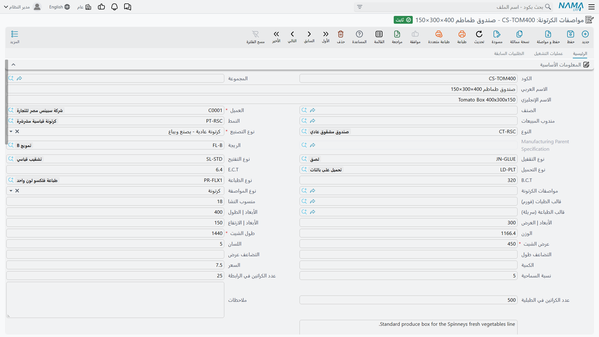
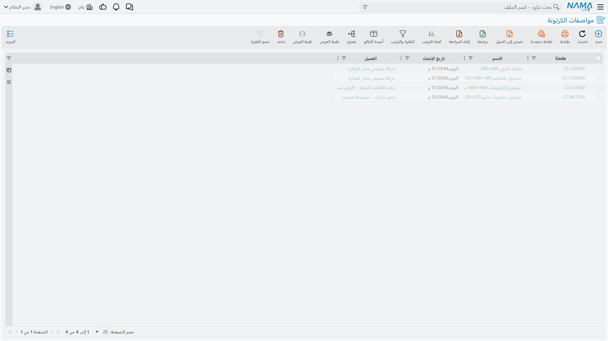
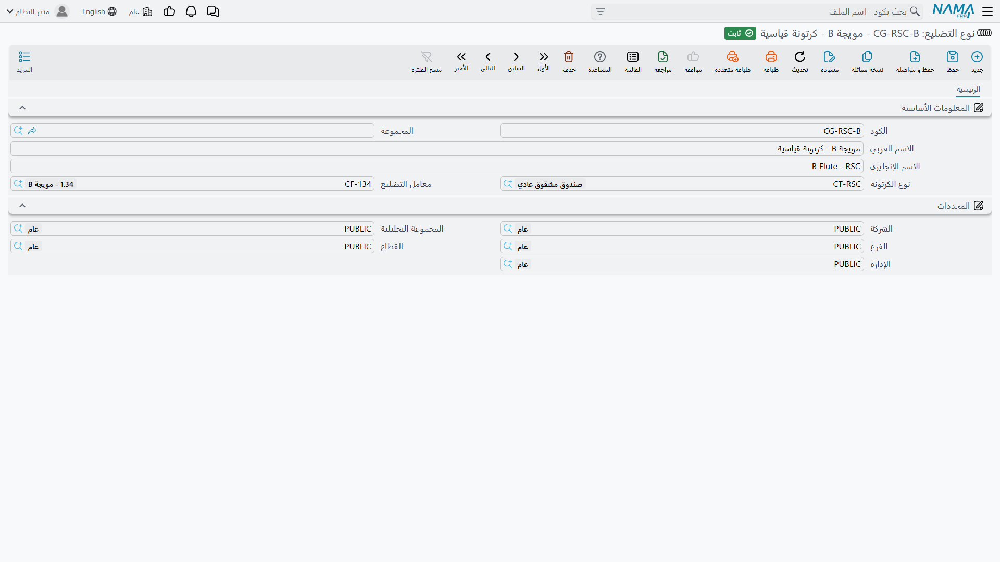
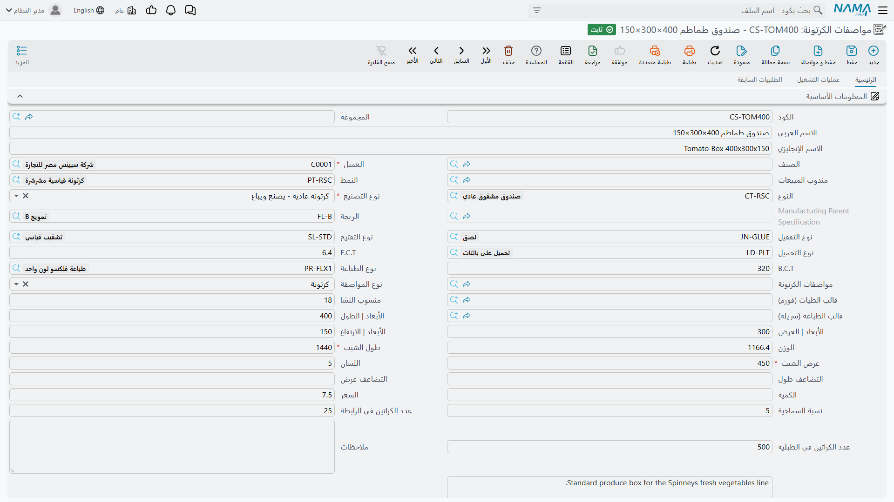
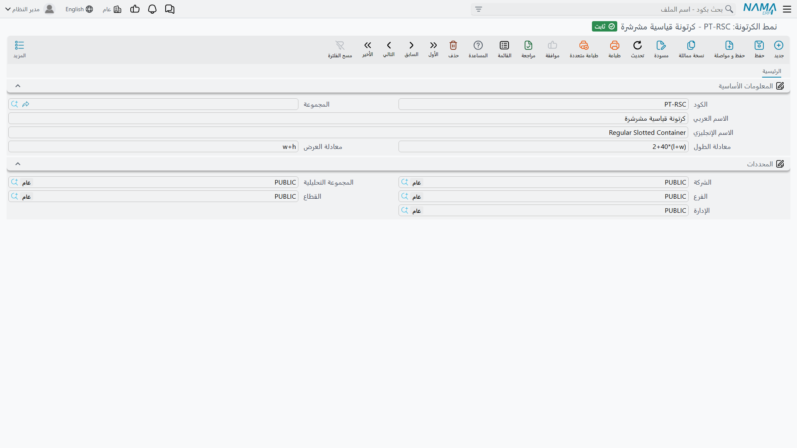

# مواصفات الكرتونة: تعريف منتجاتك

## ما هي مواصفة الكرتونة فعلاً

فكّر في مواصفة الكرتونة باعتبارها المخطط الكامل لمنتج الكرتون. فهي ليست مجرد أبعاد - بل كل ما يحتاج أي شخص معرفته لتصنيع تلك الكرتونة بالضبط: ما المواد التي تدخل في كل طبقة، وما حجم الورقة المسطحة المطلوبة، وما أنماط الطباعة أو التخريم المستخدمة، وأي قوالب تُستخدم، بل وكيف تُعبَّأ الكرتونات النهائية.

تُنشئ هذه المواصفات مرة واحدة لكل تصميم كرتون تبيعه. حين يطلب العملاء "صندوق طماطم 250" أو "تغليف إلكترونيات كبير"، فهم يستندون إلى مواصفة قمتَ بتعريفها مسبقاً. وكل تعقيدات التصنيع - متطلبات المواد، ومراحل الإنتاج، والعمليات - محسومة ومخزّنة في المواصفة.

ستجد المواصفات في **التصنيع > Cartoon > مواصفات الكرتونة** (Manufacturing > Cartoon > CRTN Specification).

وشاشة القائمة هي فهرس منتجاتك — كل تصميم كرتونة تستطيع تسعيره وصنعه.

## الأنواع الأربعة للمواصفات

يدعم Nama أربعة أساليب تصنيع للكراتين:

### كرتونة عادية (نوع التصنيع: كرتونة عادية)

هذه هي الكرتونة المموجة القياسية - وجه خارجي وتموج وبطانة داخلية، كلها ملصقة معاً في الماكينة المموِّجة، ثم تُطبع وتُخرَّم وتُطوى. معظم مواصفاتك ستكون من هذا النوع.

حين تختار "كرتونة عادية" نوعاً للتصنيع، فأنت تقول: "هذا منتج مستقل يمر بعملية الإنتاج القياسية لدينا."

### فاصل عادي (نوع التصنيع: فاصل عادي)

الفواصل (أو الحواجز) توضع داخل الكراتين لحماية المنتجات. وهي أبسط من الكراتين الكاملة - عادةً مجرد لوح مموج مقطوع بالحجم المناسب، ربما مع شقوق للتشابك.

مثل الكراتين العادية، هذه منتجات مستقلة. تصنّعها وتخزّنها وتبيعها بشكل منفرد.

### كرتونة مجمّعة (نوع التصنيع: كرتونة مجمعة)

هنا تصبح الأمور أكثر إثارة. الكرتونة المجمّعة تُصنَع بتجميع عدة كراتين عادية معاً. فكّر في كرتونة عرض تتكون من قاعدة علبة وغطاء منفصل.

عند إنشاء مواصفة كرتونة مجمّعة:
1. لا تزال تُعرّف الأبعاد الكلية والخصائص العامة
2. لكنك بدلاً من تعريف طبقات المواد، تضيف "أسطر كراتين فرعية"
3. كل سطر فرعي يستند إلى مواصفة كرتونة عادية

اطلب الكرتونة المجمّعة، وسيعرف Nama تلقائياً أنه يحتاج إلى تصنيع جميع المكونات الفرعية.

**مهم**: الكراتين المجمّعة تستند إلى كراتين عادية كمكونات فرعية. يجب أن تكون المكونات الفرعية موجودة مسبقاً كمواصفات "كرتونة عادية" منفصلة.

### فاصل مجمّع (نوع التصنيع: فاصل مجمع)

مشابه للكراتين المجمّعة، لكن لتكوينات الفواصل المعقدة. الفاصل المجمّع مكوّن من عدة مكونات "فاصل صغير".

تُعرّف الفاصل المجمّع وتربطه بمكوناته الفرعية الصغيرة. هذا النوع أقل شيوعاً - يُستخدم أساساً لأنظمة التغليف الداخلي المعقدة.

### فاصل صغير (نوع التصنيع: فاصل صغير)

الفواصل الصغيرة هي المكونات الفردية للفاصل المجمّع. عادةً لا تطلبها مباشرة - تُصنَّع كجزء من الفاصل المجمّع الأصلي.

## إنشاء مواصفة كرتونة أساسية

لنستعرض معاً إنشاء مواصفة لصندوق خضروات شائع.

### الخطوة الأولى: المعلومات الأساسية

ابدأ مواصفة جديدة وأدخل البيانات الأساسية:

**الكود والاسم**: شيء وصفي مثل "TOMATO-250" و"Tomato Box 250mm"

**العميل**: اختر العميل الذي صُمِّمت هذه المواصفة من أجله. سيُصفّي Nama المواصفات حسب العميل عند إنشاء الطلبات، فلا ترى إلا المواصفات ذات الصلة بكل عميل.

**نوع التصنيع**: اختر "كرتونة عادية" (أو أي نوع آخر مناسب)

**الصنف**: إذا كانت هذه المواصفة تُنتج صنف مخزوناً محدداً (ربما تخزّن هذه الكراتين)، اختر الصنف. هذا يربط المواصفة بإدارة المخزون.

### الخطوة الثانية: الأبعاد الفيزيائية

هذه أبعاد الكرتونة المطوية والنهائية:

**الطول** (l): البعد الأطول عند النظر إلى الصندوق
**العرض** (w): البعد الأفقي الأقصر
**الارتفاع** (h): البعد الرأسي

مثلاً، صندوق بأبعاد 250mm × 200mm × 150mm بعد التجميع.

### الخطوة الثالثة: أبعاد الورقة

هنا تبدأ التفاصيل التصنيعية. الورقة المموجة المسطحة، قبل الطي، تحتاج أن تكون أكبر من الصندوق النهائي.

**طول الورقة**: الطول المطلوب للورقة المسطحة
**عرض الورقة**: العرض المطلوب للورقة المسطحة

**قيمة اللسان** (اللسان): المادة الإضافية لألسنة الطي. القيمة الافتراضية عادةً 5mm أو نحو ذلك.

**الجزء الذكي**: لا تحسب هذه الأبعاد يدوياً دائماً. يمكنك استخدام صيغ حسابية.

إذا اخترت **باترون** (Pattern) فيه صيغ محددة، أو **قالب طيات** (Crease Mold) يحتوي على صيغ، فإن Nama يحسب أبعاد الورقة تلقائياً باستخدام تلك الصيغ.

يمكن أن تستند الصيغ إلى:
- `l` - الطول
- `w` - العرض
- `h` - الارتفاع
- `f` - قيمة اللسان
- `ml`, `mw`, `mh` - أبعاد القالب (إذا كان قالب طيات محدداً)

مثلاً، قد يتضمن الباترون:
- صيغة العرض: `2*(l+w) + f`
- صيغة الطول: `h + w + f`

اختر ذلك الباترون، وستُحسب أبعاد الورقة تلقائياً بناءً على أبعادك الفيزيائية.

**معاملات التضعيف**: إذا أردت قطع عدة كراتين من ورقة واحدة (ربما اثنتين جانباً لجانب)، يمكنك ضبط معامل تضعيف العرض أو الطول. معظم المواصفات تتركها فارغة (كرتونة واحدة لكل ورقة).

### الخطوة الرابعة: تركيب الكرتونة والمواد

حدد الآن من ماذا تُصنَع الكرتونة:

**نوع الكرتونة** (نوع الكرتونة): اختر نوعاً مثل "Standard Corrugated" أو "Double Wall" وما إلى ذلك. قد يكون للأنواع مستويات نشا افتراضية.

**نوع التموج** (نوع التموج): اختر نمط التموج - E-flute أو C-flute أو B-flute وما إلى ذلك. يحدد هذا سمك وقوة الوسط المموج.

و**التمويج** و**نوع التضليع** و**معامل التضليع** ثلاثة أشياء مختلفة يسهل خلطها. فـ**التمويج** في البيانات الأساسية وصف للّوح كله. أما **نوع التضليع**، وهو يُختار لكل طبقة، فسجل يربط مويجة بنوع كرتونة ويحمل **معامل التضليع** — أي نسبة الاستهلاك الرقمية التي تستعملها الحسابات فعلًا. فالبيانات الأساسية تخبر الإنسان ما هو اللوح، والطبقة تخبر النظام كم يأكل من ورق.

**نوع التلصيق** (نوع التلصيق): طريقة الربط - لاصق أو دباسة أو شريط وما إلى ذلك.

**نوع التخريم** (نوع التخريم): نمط التخريم - قياسي أو خاص وما إلى ذلك.

**الباترون** (باترون): نمط التصميم الكلي (كرتونة ذات شقوق منتظمة، نصف شقوق، وما إلى ذلك).

**نوع التحميل**: كيف تُكدَّس الكراتين النهائية أو تُحمَّل.

**منسوب النشا** (منسوب النشا): كمية النشا/اللاصق المستخدمة بالغرام لكل متر مربع. يؤثر على حسابات الوزن والصلابة.

**ECT و BCT**: قيم Edge Crush Test وBox Compression Test - معدلات المقاومة للكرتونة.

### الخطوة الخامسة: مراحل الإنتاج (الجزء المهم)

هنا تُعرّف المواد التي تدخل فعلياً في تصنيع الكرتونة. معظم مواصفات الكراتين تستخدم **مرحلة الإنتاج الأولى** (مرحلة الإنتاج الأولى) بشكل مكثف.

#### مرحلة الإنتاج الأولى: الطبقات

كل سطر في جدول **مرحلة الإنتاج الأولى** طبقة مادة واحدة، من الخارج إلى الداخل.

**نوع الطبقة** يقول ما هي الطبقة، وله أربع قيم: **الوجه** وهو البطانة الخارجية، و**الحشو** وهو الورق المموج، و**الظهر** وهي البطانة الداخلية، و**أخرى** لما عدا ذلك، كالبطانة الوسطى في اللوح المزدوج الجدار.

**التصنيف 1** و**التصنيف 2** أهم عمودين، لأنهما الطريق الذي تُوجد به المادة. فالتصنيف 1 درجة الورق والتصنيف 2 وزنه، و[مخطط الخامات](/ar/modules/manufacturing/carton-material-planning) يبحث في المخزون عن أصناف بكرات تحمل هذا الزوج بعينه. و**قسم الصنف** و**التصنيف 3** حتى **التصنيف 5** تضيّق البحث أكثر حيث لا تكفي الدرجة وحدها. أما **الصنف** فيثبّت الطبقة على صنف مخزني بعينه، وهو ما يستحق الفعل فقط حين تكون المادة واحدة فعلًا ولا اختيار فيها.

**نوع التضليع** و**معامل التضليع** يخصان الطبقة المموجة ويبقيان فارغين في البطانات المسطحة. والمعامل هو نسبة الاستهلاك: فالورق الأوسط مموَّج، فيستهلك من الورق لكل متر مربع من اللوح أكثر مما تستهلكه الورقة المسطحة. فمويجة B بمعامل 1.34 تستهلك زيادة 34%، ومويجة C بمعامل 1.44 تستهلك زيادة 44%. ويستعمل Nama هذا في حساب وزن الكرتونة وفي حساب ما يجب أن تجده الخطة من ورق أوسط.

والكرتونة أحادية الجدار ثلاثة أسطر — الوجه والحشو والظهر. والمزدوجة الجدار خمسة — الوجه والحشو وأخرى والحشو والظهر — أي طبقتان مموجتان، بمويجتين مختلفتين في العادة، يفصل بينهما بطانة وسطى.

#### مرحلة الإنتاج الثانية (اختيارية)

استخدمها إذا كانت لديك طلمبة إضافية أو معالجة بعد التمويج الأولي. ربما تُلمع صفائح مطبوعة أو تضيف طلاءات خاصة. نفس بنية المرحلة الأولى - عرّف الطبقات والمواد.

#### مرحلة الإنتاج الثالثة (اختيارية)

لعمليات التشطيب النهائي التي تضيف مواد - ربما ملصقات أو لافتات أو شريط خاص وما إلى ذلك.

### الخطوة السادسة: القوالب والطباعة

إذا كانت هذه الكرتونة تستخدم قوالب:

**قالب الطيات** (قالب الطيات): اختر القالب المستخدم للطي. يجب أن يكون القالب مُعداً في ملف القوالب الرئيسية كنوع "قالب طيات".

**قالب الطباعة** (قالب الطباعة): اختر الأسطوانة أو اللوحة المستخدمة للطباعة إذا كانت هذه كرتونة مطبوعة. يُعدّ كنوع "قالب طباعة".

**نوع الطباعة** (نوع الطباعة): اختر عملية الطباعة (flexo أو offset أو digital وما إلى ذلك). قد تكون لأنواع الطباعة حدود قصوى لطول الورقة - يتحقق Nama من عدم تجاوزها.

**يحتوي على شارة**: ضع علامة إذا كانت الكرتونة تتضمن شارة أو ملصقاً.

### الخطوة السابعة: عمليات التشغيل (Routings)

عرّف خطوات الإنتاج في تبويب **عمليات التشغيل** (Routings).

كل سطر عملية يحدد:
- **العملية**: استند إلى عملية قياسية Standard Operation مثل "Corrugating" أو "Printing" أو "Slotting" أو "Stitching"
- تُعرّف العملية مراكز العمل وتقديرات الوقت والموارد المطلوبة

عند توليد أوامر الإنتاج من هذه المواصفة، تصبح أسطر عمليات التشغيل هذه بنداً في مسار أمر الإنتاج.

### الخطوة الثامنة: التعبئة والكميات

**الكمية**: كمية الطلب الافتراضية (اختياري)

**السعر**: سعر البيع الافتراضي (اختياري)

**النسبة المسموح بها**: مقدار الزيادة أو النقص المسموح به في الإنتاج (مثل 5% لاستيعاب الهدر والزيادات)

**العدد في العبوة**: عدد الكراتين النهائية في عبوة واحدة
**العدد على البالية**: عدد الكراتين على بالية واحدة

يساعد هذا في تخطيط الشحن واللوجستيات.

### الخطوة التاسعة: معلومات المنتج المعبّأ (اختياري)

إذا كانت هذه الكرتونة مصممة لمنتج معبّأ محدد (شائع في قطاع الغذاء والخضروات)، يمكنك توثيق:
- نوع المنتج (خضار طازجة، بضائع مجمدة، وما إلى ذلك)
- وزن المنتج
- طريقة التعبئة
- ما إذا كانت للتبريد أو التجميد أو التصدير
- مرفقات العينات (صور، صفحات مواصفات)
- ارتفاع تكديس الكراتين

هذا بشكل رئيسي توثيق للمبيعات وخدمة العملاء.

## السيناريوهات المتقدمة

### الكراتين المجمّعة مع المكونات الفرعية

لنفترض أنك تنشئ مواصفة لكرتونة عرض - كرتونة بقاعدة علبة وغطاء منفصل.

**الخطوة الأولى**: أنشئ مواصفتي كرتونة عادية:
- "DISPLAY-BASE" - قاعدة العلبة
- "DISPLAY-LID" - الغطاء

عرّف كلاً منهما بأبعاده الخاصة والمواد وعمليات التشغيل وما إلى ذلك.

**الخطوة الثانية**: أنشئ مواصفة كرتونة مجمّعة:
- **الكود**: "DISPLAY-FULL"
- **نوع التصنيع**: "كرتونة مجمعة"
- **الأبعاد**: الأبعاد الكلية بعد التجميع

**الخطوة الثالثة**: في تبويب **أسطر الكراتين الفرعية**، أضف:
- السطر 1: مواصفات الكرتون = "DISPLAY-BASE"، الكمية = 1
- السطر 2: مواصفات الكرتون = "DISPLAY-LID"، الكمية = 1

الآن حين يطلب أحد "DISPLAY-FULL"، ستُظهر تفاصيل التصنيع في Nama أنه يحتاج إلى إنتاج قاعدة واحدة وغطاء واحد.

**تحقق مهم**:
- يجب أن تكون جميع الكراتين الفرعية للعميل ذاته كالكرتونة الأصلية
- يجب أن تكون الكراتين الفرعية من نوع "كرتونة عادية" (ليست كراتين مجمّعة أخرى - لا تداخل في التجميع)
- يمكن أن تنتمي الكرتونة الفرعية إلى كرتونة أصلية مجمّعة واحدة فقط في كل مرة

### استخدام المعادلات لحساب أبعاد الشيت

كتابة أبعاد الشيت يدويًا مملّة وعرضة للخطأ. و**النمط** يتولاها عنك.

وملف النمط الرئيسي، في **التصنيع ← Cartoon ← نمط الكرتونة**، يحمل معادلتين لا ثالث لهما: **معادلة الطول** و**معادلة العرض**. وتُكتبان بدلالة مقاسات الكرتونة نفسها — `l` للطول و`w` للعرض و`h` للارتفاع — مع ما يحتاجه الشيت من ثوابت.

وفي الكرتونة القياسية المشرشرة تكون الهندسة ثابتة، فتخرج المعادلتان منها مباشرة. فالشيت يلفّ الجدران الأربعة كلها زائد لسان اللصق، فطوله `(l+w)*2` زائد ذلك اللسان. وعرضًا للتمويج يحمل ارتفاع الصندوق زائد لسانين عرض كل منهما نصف العرض، فعرضه `w+h`:

- معادلة الطول: `(l+w)*2+40`
- معادلة العرض: `w+h`

وتحقّق منها على صندوق حقيقي. فكرتونة 400×300×150 مم تعطي `(400+300)*2+40 = 1440` و`300+150 = 450` — وهو الشيت الذي تحتاجه تلك الكرتونة بالضبط.

أما الفاصل المسطح فلا يحتاج أكثر من `l` و`w`، لأن الفاصل ببساطة بمقاس الحيز الذي يقسمه.

اختر النمط في المواصفة، وأدخل الأبعاد الفعلية، فتتبعها أبعاد الشيت.

### حسابات الوزن

يحسب Nama وزن الكرتونة تلقائياً بناءً على:
- أوزان الورق (GSM) من كل طبقة
- معاملات التموج (التموج يتمدد، فيلزم مزيد من المواد لكل مساحة)
- مساحة الورقة (الطول × العرض)
- منسوب النشا

الصيغة: `weight = ((sum of layer weights × corrugating factors) + starch level) × sheet area / 10000`

النتيجة بالوحدات المناسبة (عادةً غرام أو كيلوغرام).

يساعد هذا في حسابات الشحن وتكلفة المواد.

### فرض مراحل الإنتاج

معظم الكراتين تستخدم مرحلة الإنتاج الأولى فقط. لكن في حالة المعالجة متعددة المراحل:

**المرحلة الأولى**: التمويج/الطلمبة - تُنتج اللوح المموج الأساسي
**المرحلة الثانية**: الطباعة - تضيف الرسومات
**المرحلة الثالثة**: طلاء أو لمبة خاصة - تضيف طبقات حماية

يمكن أن تكون لكل مرحلة متطلبات مواد مختلفة. يتعامل مُحسّن تخطيط المواد مع المواصفات متعددة المراحل بإيجاد المواد المناسبة لكل مرحلة بشكل مستقل.

## العمل بالمواصفات عمليًا

تبنَّ عرفًا للتسمية قبل إنشاء المائة مواصفة الأولى لا بعدها. فصيغة مثل `ACME-300-RSC` — عميل، ومقاس، ونمط — تجعل البحث والترشيح يعملان، والأسماء الحرة لا تفعل، وإعادة التسمية لاحقًا ليست أمسية محببة لأحد.

وأعدّ أنماطك وقوالبك الشائعة بمعادلاتها قبل إنشاء المواصفات بالجملة. فالمواصفات المبنية على أنماط جاهزة أسرع إنشاءً وأكثر اتساقًا من تلك التي يرتجل فيها كل مؤلف.

ولا تفرط في تفصيل الطبقات. عرّف طبقاتٍ مستقلة فقط لما تخزنه مستقلًا فعلًا — فإن كانت طبقتان تصلان دومًا مغلَّفتين معًا فهما طبقة واحدة بقدر ما يحتاج النظام أن يعرف، وفصلهما يضيف صيانة دون أن يضيف معلومة.

وقاوم إغراء مشاركة مواصفة بين عملاء تختلف أبعادهم ولو قليلًا. فالمواصفات المنفصلة تتفادى صنفًا كاملًا من الأخطاء وتبقي الترشيح نظيفًا.

وتحقق من صحة المواصفة الجديدة قبل أن تحمل التزامًا حقيقيًا: أنشئ طلبية اختبار صغيرة، وشغّل تخطيط المواد، وتأكد أن النظام يجد موادّ مناسبة ويحسب كميات معقولة. وقارن الوزن المحسوب بعينة مادية كذلك — فالرقم البعيد كثيرًا عن الحقيقي يعني عادةً خطأً في قيمة الجراماج أو في معامل التمويج، واكتشاف ذلك الآن أرخص كثيرًا من اكتشافه أثناء دفعة إنتاج.

وحيث تكون للمواصفة أبعاد غير معتادة، فبيّن السبب في الوصف. وإلا لن يستطيع الزميل الذي يرثها أن يميز الاختيار المتعمَّد من خطأ الكتابة.

## التحقق وقواعد العمل

يفرض Nama عدة تحققات عند حفظ المواصفة:

**يجب أن تتطابق قوالب الطيات والطباعة مع أنواعها**: إذا اخترت قالباً في "قالب الطيات"، يجب أن يكون مُعداً كقالب طيات في ملف القوالب الرئيسية. وبالمثل لقوالب الطباعة.

**حدود طول الورقة**: إذا اخترت نوع طباعة بحد أقصى لطول الورقة، يتحقق Nama من أن طول ورقتك لا يتجاوزه.

**يجب أن تتطابق معاملات التموج مع الأنواع**: إذا اخترت نوع تموج في طبقة، يجب أن يتطابق معامل التموج الخاص به مع المعامل المحدد في بيانات نوع التموج الرئيسية.

**يجب أن تتطابق مستويات النشا مع الأنواع**: إذا كان نوع كرتونتك يحتوي على منسوب نشا محدد، يجب أن يتطابق منسوب النشا في المواصفة معه.

**عميل المواصفة لا بد أن يكون عميل الطلبية**: لا تقبل طلبية الكرتون إلا مواصفات تخص العميل المدوَّن في بياناتها الأساسية. ضع مواصفة تخص سبينس في طلبية لمترو ماركت فيُرفض الحفظ برسالة تسمّي العميلين معًا. وهذا مقصود — فمواصفات الكرتون عُدَد وتصميمات خاصة بعميل بعينه لا فهرس مشترك — لكنه يعني أن المنتج نفسه لعميل ثانٍ يحتاج مواصفة خاصة به.

**الكراتين المجمّعة تتطلب مكونات فرعية**: إذا كان نوع التصنيع "كرتونة مجمعة" أو "فاصل مجمع"، يجب إضافة أسطر كراتين فرعية. وعلى النقيض، لا يمكن للكراتين العادية أن تحتوي على مكونات فرعية.

**قيود الكراتين الفرعية**:
- يجب أن تكون للعميل ذاته
- يجب أن تكون من النوع المناسب (كراتين عادية للكراتين المجمّعة، وفواصل صغيرة للفواصل المجمّعة)
- لا يمكنها الإشارة إلى نفسها (لا مراجع دائرية)
- لا يمكنها أن تكون مستخدمة بالفعل كمكون فرعي في مواصفة أخرى

**اتساق العميل**: يجب أن تكون جميع الكراتين الفرعية للعميل ذاته المحدد في المواصفة الأصلية.

## أسئلة شائعة

**س: هل يمكنني تغيير مواصفة بعد استخدامها في الطلبات؟**
ج: نعم، لكن كن حذراً. التغييرات تؤثر على الطلبات المستقبلية لا الماضية. إذا غيّرت متطلبات المواد، لن تتحدث أوامر الإنتاج الموجودة تلقائياً. فكر في إنشاء نسخة معدّلة من المواصفة بدلاً من ذلك (انسخها وعدّلها).

**س: ماذا لو كان لديّ الكرتونة ذاتها لعملاء متعددين؟**
ج: أنشئ مواصفات منفصلة. حتى لو كانت الأبعاد متطابقة، فإن وجود مواصفات خاصة بكل عميل يجعل الفلترة أنظف ويمنع الخطأ في تسعير عميل واحد بسعر عميل آخر.

**س: كيف أتعامل مع المتغيرات (مثل طباعة مختلفة للكرتونة الأساسية ذاتها)؟**
ج: أنشئ مواصفات منفصلة لكل متغير. قد تكون البنية الأساسية ذاتها، لكن قوالب الطباعة مختلفة، فهي منتجات مختلفة من منظور التصنيع.

**س: هل يمكن أن تستخدم الطبقات أصنافاً من مخازن مختلفة؟**
ج: نعم. التصنيفات لا تحدد المخازن. عند تخطيط المواد، يمكنك اختيار المخزن الذي تسحب منه. المواصفة فقط تُعرّف نوع المادة المطلوبة.

**س: ماذا يحدث لو حذفت مواصفة؟**
ج: يمنع Nama الحذف إذا كانت المواصفة مستخدمة في أي طلبات أو أوامر إنتاج. ستحتاج إلى حذف تلك أولاً، وهو نادراً ما يُنصح به. بدلاً من ذلك، ضع علامة "منع الاستخدام" لمنع اختيارها في الطلبات الجديدة مع الحفاظ على السجل التاريخي.

---

::: tip الخطوة التالية
بمجرد تعريف المواصفات، أنت مستعد لإنشاء طلبات العملاء. راجع [طلبات الكراتين](./carton-orders.md) للخطوة التالية.
:::

::: warning متطلبات تخطيط المواد
لكي يعمل تخطيط المواد، تحتاج إلى أصناف مخزون مُعدّة بنفس تصنيفات الأصناف (القسم، والتصنيف 1، والتصنيف 2، وما إلى ذلك) التي حددتها في مراحل الإنتاج. لا يستطيع المُحسّن إيجاد المواد إذا لم تتطابق التصنيفات.
:::
