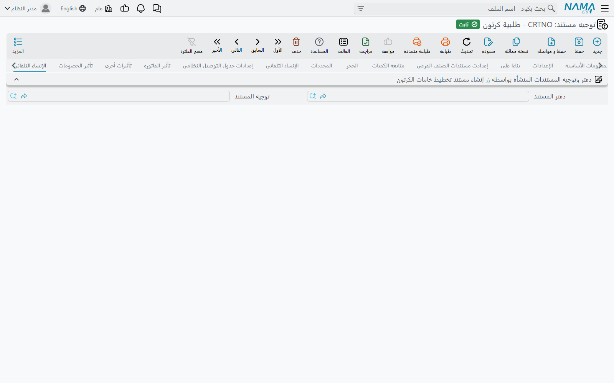

# توجيهات مستندات الكرتون

سلسلة الكرتون سباق تتابع: **طلبية كرتون** تسلّم إلى مستند **تخطيط خامات الكرتون**، ومستند التخطيط يُنشئ **أوامر إنتاج**، و**صرف خامات كرتون** يُنشئ **صرف المواد الخام** الذي يُخرج الورق من المخزن. وكل تسليم يأخذ دفتره وتوجيهه من توجيه المستند الذي يسلّم، وهذا تقريبًا كل ما وُجدت له هذه التوجيهات الثلاثة.

كيف تعمل توجيهات التصنيع عمومًا تجده في [توجيهات مستندات أوامر الإنتاج والتخطيط](/ar/modules/manufacturing/document-terms/mfg-terms-production-orders). وسلسلة الكرتون نفسها في [تصنيع الكرتون](/ar/modules/manufacturing/carton-manufacturing-overview).

::: info الترخيص المطلوب
هذه التوجيهات ضمن ترخيص `manufacturing-crtn-pln`.
:::

## طلبية كرتون

يشبه توجيه طلبية الكرتون توجيه مستند مبيعات — فيحمل تبويبات سلسلة الإمداد وتبويبات تأثير الفاتورة والتأثيرات الأخرى والخصومات. وما تستخدمه سلسلة الكرتون هو تبويب **الإنشاء التلقائي** الأخير، ومجموعته الوحيدة بعنوان **دفتر وتوجيه المستندات المنشأة بواسطة زر إنشاء مستند تخطيط خامات الكرتون**: **دفتر المستند** و**توجيه المستند**. وهما دفتر وتوجيه مستند التخطيط الذي يُنشئه **إنشاء مستند تخطيط خامات الكرتون** من طلبية محفوظة (انظر [طلبيات الكرتون](/ar/modules/manufacturing/carton-orders)).

## تخطيط خامات الكرتون

**دفتر أمر الإنتاج المنشأ** و**توجيه أمر الإنتاج المنشأ** هما دفتر وتوجيه أوامر الإنتاج التي يُنشئها **إنشاءأوامر الإنتاج** من خطة محلولة.

ويجب أن يكون **السماح بترك الصنف فارغاً في سطور المكونات** مفعّلًا في توجيه أمر الإنتاج المذكور هنا: فمكونات الكرتون توصف بالتصنيف والمقاس لا بصنف، وبدون هذا الخيار تُرفض الأوامر المنشأة لغياب الصنف. انظر [توجيهات مستندات أوامر الإنتاج والتخطيط](/ar/modules/manufacturing/document-terms/mfg-terms-production-orders).

## صرف خامات كرتون

**دفتر مستند صرف مواد خام المنشأ** و**توجيه مستند صرف مواد خام المنشأ**، في مجموعة **الإنشاء التلقائي**، هما دفتر وتوجيه صرف المواد الخام الذي يُنشئه صرف خامات الكرتون. ويُفحصان في كل حفظ.

## حين يُترك حقل فارغًا

الحقول الستة أعلاه كلها مطلوبة من المستند الذي يستخدمها. اترك أحدها فارغًا فيتوقف زر الإنشاء، أو حفظ صرف خامات الكرتون، برسالة «الحقل {0} الموجود في التوجية لا يمكن أن يكون فارغاً» — حيث `{0}` اسم الحقل الناقص. افتح التوجيه واملأه.
