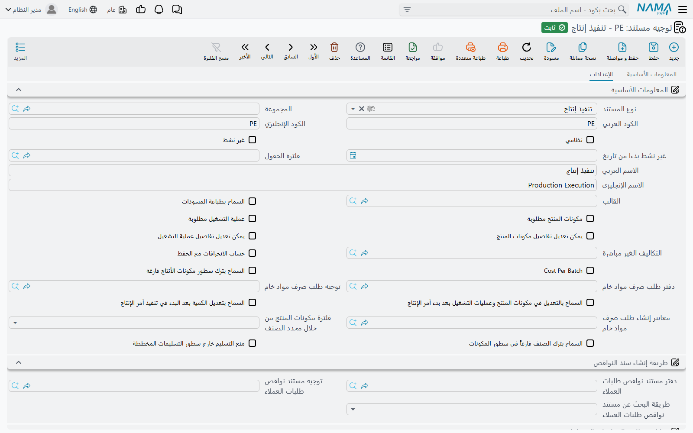

# توجيهات مستندات التنفيذ والتسليم

المستندات في هذه الصفحة تسجل ما حدث في المصنع وما خرج منه: تنفيذ الإنتاج، وتسليم المنتج وإرتجاعه، واستلام التالف، وسند سحب العينة. وتوجيهاتها أهم من غيرها، لأن التنفيذ هو المُنشِئ الأكبر في الموديول — فتنفيذ واحد محفوظ قد يُنشئ صرف مواد وسند موارد وسند استهلاك قالب وتسليمًا وسند فحص جودة وعينات، وكل منها يأخذ دفتره وتوجيهه من هنا.

كيف تعمل توجيهات التصنيع عمومًا، وما يحمله أعلى الشاشة المشترك، تجده في [توجيهات مستندات أوامر الإنتاج والتخطيط](/ar/modules/manufacturing/document-terms/mfg-terms-production-orders).

::: info الترخيص المطلوب
هذه التوجيهات ضمن ترخيص التصنيع الأساسي `manufacturing`. ومجموعة إنشاء سند استهلاك القالب لا تهم إلا حيث يكون `manufacturing-molds` مفعّلًا.
:::

## تنفيذ الإنتاج

### ما يُنشئه التنفيذ

في كل مرة يُحفظ فيها التنفيذ يعيد بناء المستندات المسؤول عنها، مستندًا لكل أمر إنتاج يمسّه. ولكل منها مجموعة في التوجيه فيها **دفتر المستند** و**توجيه المستند**:

| المجموعة | ما يُنشأ | متى |
|---|---|---|
| **صرف المواد الخام** | صرف مواد خام | من سطور مكونات الأمر التي يقول نوع صرفها إنها تُصرف مع التنفيذ. |
| **سند موارد** | سند موارد | من موارد عمليات التشغيل المنفَّذة. |
| **سند استهلاك قالب تصنيع** | سند استهلاك قالب | من القوالب التي استخدمتها العمليات المنفَّذة. |
| **تسليم منتج** | تسليم منتج | فقط عند تفعيل **تسليم المنتج النهائي تلقائيا** — انظر أدناه. |
| **انشاء سند سحب العينة** | سندات سحب عينة | فقط عندما يكون التنفيذ مضبوطًا على إنشاء العينات. |

والمستند المنشأ الذي ينتهي بلا سطور يُحذف. أما الذي له سطور وليس له دفتر أو توجيه فيوقف الحفظ برسالة *To generate {0}, you must define book and term for it* — وهي بالإنجليزية فقط — فاملأ المجموعات لكل مستند ستُنتجه تنفيذاتك فعلًا.

ولكل مجموعة مفتاح **اعتبار الموافقة على إنشاء …**. ومع تفعيله يمر المستند المنشأ بدورة الموافقة الخاصة به بدل أن يُعتمد مباشرة — مفيد حين يجب أن تراجع محاسبة التكاليف سندات الموارد قبل ترحيلها مثلًا.

### التسليم التلقائي

**تسليم المنتج النهائي تلقائيا** يُنسخ إلى التنفيذ عند اختيار التوجيه. ومع تفعيله، كل سطر ينقل كمية إلى **آخر** عملية في الأمر يُنشئ أو يحدّث تسليم منتج لذلك الأمر، فيصبح إنهاء الدفعة واستلام المنتج في المخزن خطوة واحدة. والسطر الذي لم تصل كميته إلى آخر عملية يُرفض برسالة «لا يمكن تسليم المنتج تلقائيا لأن الكميات لم تتحرك لأخر عملية». وإلغاء تفعيله في تنفيذ أنشأ تسليمات بالفعل يلغي تلك التسليمات.

وخياران يشكّلان التسليم المنشأ:

- **استخدام إلى تاريخ بالتنفيذ كالتاريخ الفعلي في تسليم المنتج** — يصبح التاريخ الفعلي للتسليم **إلى تاريخ** في السطر بدل تاريخ التنفيذ، وتتبعه الفترة. استخدمه حين تُدخَل التنفيذات بعد وقوعها ويجب أن يؤرَّخ المخزون بوقت انتهاء العمل فعلًا.
- **استخدام مخزن المنتج الثانوي** — مع تعطيله يُضبط مخزن وموقع رأس التسليم المنشأ على مخزن وموقع المنتج الرئيسي. ومع تفعيله يُترك الرأس كما هو فتحتفظ المنتجات الثانوية بمخازنها.

### تعديل وحذف ما أُنشئ

- **إمكانية تعديل المستندات الناتجة** — مفعّل افتراضيًا. ألغِ تفعيله فلا يستطيع المستخدمون تعديل التسليمات التي أنشأها تنفيذ بتسليم تلقائي: «لا يمكنك التعديل في المستند {0} حيث أنه منشأ تلقائيًا». فيبقى التنفيذ هو المكان الوحيد لتغييرها.
- **حذف المستندات المنشأة تلقائياً مع حذف السند** — المعتاد ألا يُحذف التنفيذ ما دامت المستندات التي أنشأها تشير إليه. ومع تفعيله تُحذف تلك المستندات معه.

### فحص الجودة

| الخيار | ما يفعله |
|---|---|
| **نوع فحص الجودة المنشأ** | **مستند فحص جودة** أو **طلب فحص جودة**. بعد الحفظ يُنشئ التنفيذ مستندًا واحدًا من هذا النوع للسطور الداخلة إلى عمليات لها قائمة فحص جودة. |
| **دفنر مستند فحص جودة** / **توجيه مستند فحص جودة** | دفتره (مطلوب) وتوجيهه (اختياري). وبدون دفتر ونوع لا يُنشأ شيء. والتسمية العربية للدفتر تظهر على الشاشة بهذا الإملاء. |
| **لايمكن تنفيذ عملية تشغيل في أمر إنتاج بدون سند فحص جودة تمت الموافقة عليه** | لا تغادر الكمية عملية لها قائمة فحص جودة حتى يوافق سند فحص جودة معتمد للأمر على تلك العملية (أو يعلّمها غير منطبقة). وتُرفض برسالة «العملية {0} لم يتم الموافقة عليها عن طريق سند فحص جودة». |
| **لايمكن تنفيذ عملية تشغيل في أمر إنتاج بدون سند تأكيد جودة تمت الموافقة عليه** | البوابة نفسها للعمليات التي لها قائمة تأكيد جودة: «العملية {0} لم يتم الموافقة عليها عن طريق سند تأكيد جودة». |

## تسليم منتج

تسليم المنتج يُنشئ دائمًا **توريد مخزني** للمنتج النهائي ومنتجاته الثانوية. ومجموعة **توريد المخزن** تحدد **دفتر المستند** و**توجيه المستند** لذلك التوريد.

| الخيار | ما يفعله |
|---|---|
| **منع تسليم المنتج مع عدم وجود مستند فحص جودة** | يسري على كل تسليم رغم كلمة "Auto" في اسمه الإنجليزي: إذا كانت لآخر عملية في الأمر قائمة فحص جودة، فيجب أن يوافق عليها سند فحص جودة معتمد أولًا. والرسالة نفسها التي في بوابة التنفيذ. |
| **منع تسليم المنتج مع عدم وجود مستند تأكيد جودة** | الشيء نفسه لقائمة تأكيد الجودة. |
| **عدم تحديث المخزن على السطور من المخزن الرئيسى** | تغيير مخزن الرأس لا يعود يكتب فوق مخازن السطور — للتسليمات التي توزّع الإنتاج على عدة مخازن. |
| **عدم استخدام قيود حركة الإنتاج** | حيث تُستخدم قيود حركة الإنتاج، يتحقق التسليم عادة من الكمية المنتظرة في آخر عملية للأمر ويستهلكها. ومع تفعيله تتخطى التسليمات بهذا التوجيه ذلك التحقق — لاستلام منتج لم يمر بتنفيذات. |

## إرتجاع منتج

إرتجاع المنتج يُنشئ دائمًا **صرف مخزني** يُخرج المنتج من المخزون. ومجموعة **الإنشاء التلقائي** تحدد **دفتر المستند** و**توجيه المستند** له.

## إستلام تالف

استلام التالف يُنشئ دائمًا **توريد مخزني** للتالف. ومجموعة **الإنشاء التلقائي** تحدد **دفتر المستند** و**توجيه المستند** له. والمستند نفسه في [إستلام التالف](/ar/modules/manufacturing/scrap-receipt).

## سند سحب عينة

**عدم التأثير على كميات أمر الإنتاج**، في مجموعة **التأثير**، يجعل العينات بهذا التوجيه لا تمس كميات عمليات الأمر: تُسجَّل العينة لكن لا يُخصم شيء من العملية التي سُحبت منها. استخدمه لعينات الاحتفاظ التي لا تضيع من الإنتاج.

## رسائل قد تظهر لك

| الرسالة | لماذا | ما تفعله |
|---|---|---|
| *To generate {0}, you must define book and term for it* | يحتاج التنفيذ إلى إنشاء مستند ليس لمجموعته في التوجيه دفتر أو توجيه. ولا ترجمة عربية للرسالة. | املأ **دفتر المستند** و**توجيه المستند** في تلك المجموعة من توجيه تنفيذ الإنتاج. |
| «لا يمكن تسليم المنتج تلقائيا لأن الكميات لم تتحرك لأخر عملية» | التسليم التلقائي مفعّل، لكن سطرًا لم ينقل كميته إلى آخر عملية. | نفّذ حتى آخر عملية، أو ألغِ **تسليم المنتج النهائي تلقائيا** في هذا التنفيذ. |
| «العملية {0} لم يتم الموافقة عليها عن طريق سند فحص جودة» | للعملية قائمة فحص جودة ولا يوافق عليها سند فحص جودة معتمد. | اعتمد سند فحص جودة موافقًا للأمر والعملية، ثم احفظ من جديد. |
| «العملية {0} لم يتم الموافقة عليها عن طريق سند تأكيد جودة» | الشيء نفسه لقائمة تأكيد الجودة. | اعتمد سند تأكيد جودة موافقًا أولًا. |
| «لا يمكنك التعديل في المستند {0} حيث أنه منشأ تلقائيًا» | المستند أنشأه تنفيذ لا يسمح توجيهه بتعديل المستندات المنشأة. | عدّل التنفيذ بدلًا منه؛ فهو يعيد بناء المستند عند الحفظ. |
