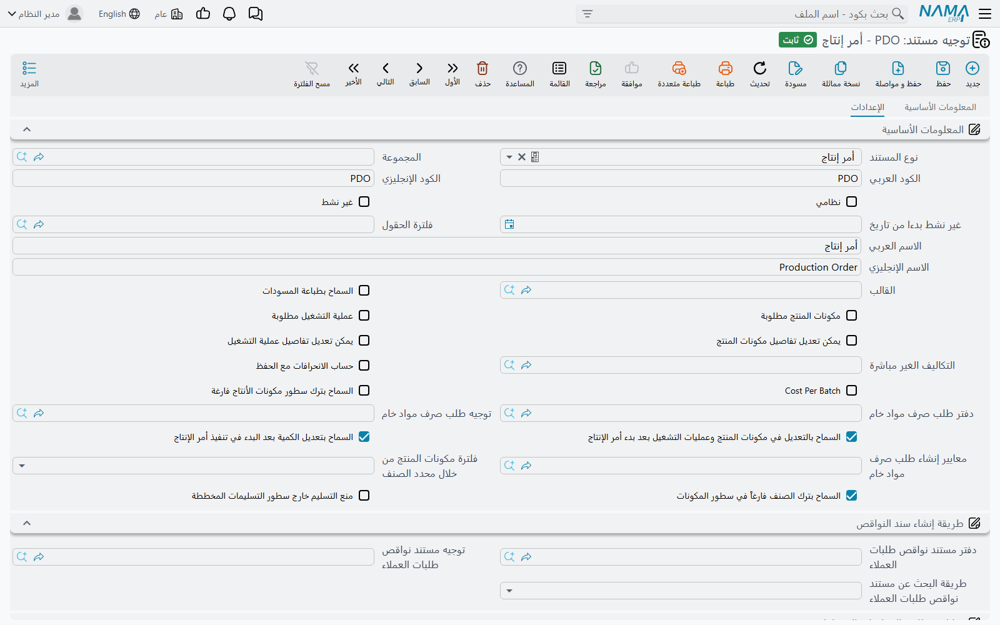

# توجيهات مستندات أوامر الإنتاج والتخطيط

وراء كل مستند تصنيع **توجيه مستند**، والتوجيه هو المكان الذي تعيش فيه معظم قواعد الموديول: هل يُحفظ أمر الإنتاج بدون مكونات منتج، وفي أي دفتر يُكتب التسليم المنشأ، وماذا يُرحَّل إلى أي حساب عند إغلاق الأمر. وأمرا إنتاج يتصرفان بشكل مختلف على الشاشة نفسها لهما في الغالب توجيهان مختلفان.

تتناول هذه الصفحة توجيهات المستندات التي *تخطط* للإنتاج — أمر الإنتاج وطلبه والمستندات المجمعة الثلاثة وسند التخطيط. أما المستندات التي تسجل ما حدث في المصنع ففي [توجيهات مستندات التنفيذ والتسليم](/ar/modules/manufacturing/document-terms/mfg-terms-execution-and-delivery)، والخامات في [توجيهات مستندات المواد الخام](/ar/modules/manufacturing/document-terms/mfg-terms-materials)، والتكاليف والمحاسبة في [توجيهات مستندات التكاليف والموارد والقوالب](/ar/modules/manufacturing/document-terms/mfg-terms-costing)، وشاشات الكرتون في [توجيهات مستندات الكرتون](/ar/modules/manufacturing/document-terms/mfg-terms-carton).

::: info الترخيص المطلوب
التوجيهات في هذه الصفحة ضمن ترخيص التصنيع الأساسي `manufacturing`، ما عدا توجيه سند التخطيط الذي يحتاج `manufacturing-mrp`.
:::

## كيف تعمل توجيهات التصنيع

افتح التوجيه من **الأساسيات ← الإعدادات ← توجيه المستند** واختر **نوع المستند**؛ فتعرض الشاشة خيارات ذلك النوع. وثلاثة أمور تصدق على كل توجيهات التصنيع.

**أعلى الشاشة واحد دائمًا.** الكود والأسماء و**نظامي** و**غير نشط** و**فلترة الحقول** و**السماح بطباعة المسودات** ومجموعة **طريقة إنشاء سند النواقص** مشتركة بين كل توجيهات المستندات، وموصوفة مرة واحدة في [إعدادات عامة](/ar/modules/supplychain/document-terms/doc-term-general). وهذه الصفحة لا تتناول إلا ما يضيفه كل توجيه تصنيع.

**التوجيه الذي يُنشئ مستندات يحدد دفترها وتوجيهها.** كثير من مستندات التصنيع تُنشئ غيرها — الأمر المجمع يُنشئ أوامر إنتاج، والتنفيذ يُنشئ تسليمات وسندات صرف. وتوجيه المستند *المُنشِئ* هو الذي يحدد دفتر المستند *المُنشأ* وتوجيهه. اتركهما فارغين فيرفض المستند المُنشِئ الحفظ، أو لا يُنشئ شيئًا في صمت، بحسب المستند؛ وكل حالة موضحة أدناه.

**توجيهات المستندات المخزنية تحمل تبويبات سلسلة الإمداد أيضًا.** صرف المواد الخام وإرتجاعها وطلباتهما تحمل تبويبات سلسلة الإمداد كاملة (بناءا على، الصنف الفرعي، متابعة الكميات، الحجز، المحددات، الإنشاء التلقائي، جدول التوصيل النظامي)، وهي موصوفة في [توجيهات مستندات سلسلة الإمداد](/ar/modules/supplychain/document-terms/doc-term-general).

## أمر الإنتاج

توجيه أمر الإنتاج أطول توجيه في الموديول، وأجدرها بالقراءة قبل التشغيل الفعلي. خياراته في مجموعة **المعلومات الأساسية** ومجموعتين تحتها.

### ما يجب أن يحمله الأمر

| الخيار | ما يفعله |
|---|---|
| **مكونات المنتج مطلوبة** (Required Bom) | يجب ملء حقل **مكونات المنتج** في الأمر قبل الحفظ. |
| **عملية التشغيل مطلوبة** (Required Routing) | الشيء نفسه لحقل **عملية التشغيل**. |
| **السماح بترك سطور مكونات الأنتاج فارغة** (Allow Empty Bom Lines) | معطّل افتراضيًا، فيُرفض الأمر الذي لا سطور مكونات له برسالة «لا يمكن ترك مكونات المنتج فارغة». فعّله للأوامر التي لا تستهلك فعلًا شيئًا تتتبعه — أمر إعادة تشغيل بحت مثلًا. |
| **السماح بترك الصنف فارغاً في سطور المكونات** (Allow Empty Item In Component Lines) | معطّل افتراضيًا، فكل سطر مكوّن يحتاج صنفًا. وإنتاج الكرتون يحتاجه مفعّلًا، لأن مكونات الكرتون توصف بالتصنيف والمقاس لا بكود صنف. |

### ما يجوز تغييره في الأمر

| الخيار | ما يفعله |
|---|---|
| **يمكن تعديل تفاصيل مكونات المنتج** (Can Update Bom Details) | ما دام الأمر *مبدئي* ويذكر مكونات منتج، يسمح بتغيير سطور المكونات بحيث لا تطابق مكونات المنتج. ومع تعطيله يُرفض سطر المكوّن المتغيّر برسالة «لا يمكن تغير سطور مكونات المنتج». |
| **يمكن تعديل تفاصيل عملية التشغيل** (Can Update Routing Details) | الشيء نفسه لسطور عمليات التشغيل ومواردها ما دام الأمر مبدئيًا. ومع تعطيله تُرفض برسالة «لا يمكن تغيير سطور سطور عمليات التشغيل» أو «لا يمكن تععديل سطور موارد التشغيل». |
| **السماح بالتعديل في مكونات المنتج وعمليات التشغيل بعد بدء أمر الإنتاج** | بمجرد خروج الأمر من الحالة المبدئية تُجمَّد سطور مكوناته وعملياته وموارده بالرسائل الثلاث نفسها. وتفعيل هذا الخيار يرفع التجميد. ويسمح كذلك لأمر الإنتاج المجمع بتغيير سطور بدأ أمر إنتاجها بالفعل. |
| **السماح بتعديل الكمية بعد البدء في تنفيذ أمر الإنتاج** | مع تعطيله لا تتغير كمية الأمر ووحدتها بعد خروجه من الحالة المبدئية: *Quantity can be changed only if status is still initial*. ولا ترجمة عربية لهذه الرسالة فتظهر بالإنجليزية. |

### التكاليف

| الخيار | ما يفعله |
|---|---|
| **التكاليف الغير مباشرة** (Overhead) | نوع التكاليف غير المباشرة الافتراضي لهذه الأوامر. ويأخذ سند الإغلاق تكاليفه غير المباشرة من توجيه إغلاق الأمر أولًا ثم من هنا. |
| **حساب الانحرافات مع الحفظ** | عند إغلاق الأمر يقارن تكلفة الوحدة الفعلية بالقياسية ويملأ أرقام الانحراف في سند الإغلاق — الكمية والخامات والموارد والتكاليف غير المباشرة. ولا يُرحَّل **مدين الإنحراف / دائن الإنحراف** في توجيه الإغلاق إلا مع تفعيله. |
| **Cost Per Batch** | يحسب تكلفة الأمر لكل شحنة مسلَّمة على حدة بدل حوض واحد. ويصبح **رقم الشحنة** عندها مطلوبًا في صرف المواد الخام وإرتجاعها وسندات الموارد على الأمر. ولا يجتمع مع *حساب الانحرافات مع الحفظ*: فإغلاق مثل هذا الأمر يفشل برسالة *Cost Per Batch Not Supported for deviation calculation*. واسم الخيار نفسه يظهر بالإنجليزية على الشاشات العربية. |

والتكاليف نفسها مشروحة في [تكاليف الإنتاج](/ar/modules/manufacturing/production-costing).

### طلب صرف المواد الخام

| الخيار | ما يفعله |
|---|---|
| **دفتر طلب صرف مواد خام** / **توجيه طلب صرف مواد خام** | عند ملء الاثنين، يُنشئ حفظ أمر له مكونات منتج — أو يحدّث — **طلب صرف مواد خام** يحمل سطور مكونات الأمر، ليعرف المخزن ما عليه تجهيزه. اترك أحدهما فارغًا فلا يُنشأ طلب. وإلغاء الأمر يحذف الطلب. |
| **معايير إنشاء طلب صرف مواد خام** | يقصر ذلك على الأوامر المطابقة للمعايير. والفارغ يعني كل الأوامر. والأمر الذي يكفّ عن المطابقة يُحذف طلبه في الحفظ التالي. |

### اختيار مكونات المنتج بمحدد الصنف

**فلترة مكونات المنتج من خلال محدد الصنف** يوسّع بحث مكونات المنتج في الأمر. فالمعتاد أن تُعرض فقط مكونات المنتج الخاصة بصنف الأمر. اختر محددًا — **قسم صنف** أو **تصنيف صنف 1** حتى **تصنيف صنف 10** — فتُعرض أيضًا مكونات المنتج التي لا تذكر صنفًا لكنها تحمل قيمة ذلك المحدد نفسها التي يحملها الصنف. وهكذا تخدم مكونات منتج عامة واحدة عائلة كاملة من الأصناف.

### التسليمات المخططة

يمكن أن يحمل الأمر جدولًا للتسليمات المخططة — كذا من هذا الصنف، في هذه الشحنة، إلى هذا المخزن. وكل تسليم منتج وإرتجاع منتج يُطابَق مع هذه السطور لتحديث الكمية المسلمة فيها: أولًا بـ**كود التسليم المتوقع**، وإلا فبأول سطر مخطط للصنف نفسه تتطابق محدداته المعلَّمة.

ومجموعة **خيارات مطابقة التسليمات المخططة** تحدد المحددات التي يجب أن تتطابق: **اعتبار المقاس**، **اعتبار اللون**، **اعتبار الإصدار**، **اعتبار الصندوق**، **اعتبار الشحنة**، **إعتبار المخزن**، **إعتبار الموقع**، **إعتبار المقاسات**، **اعتبار الرقم المسلسل**، **اعتبار المسلسل الثاني**، **اعتبار الصنف الفرعي**، **طريقة اعتبار نسبة الفعالية** (وهو مفتاح نعم/لا رغم اسمه) و**اعتبار النسبة غير الفعالة**.

و**منع التسليم خارج سطور التسليمات المخططة** يحوّل المطابقة إلى قاعدة. فيجب عندها أن يطابق سطر التسليم أو الإرتجاع سطرًا مخططًا، وألا يسلّم أكثر من المخطط، وألا يرتجع أكثر مما سُلِّم. والرسائل مذكورة في آخر الصفحة.

## طلب أمر الإنتاج

لتوجيه الطلب خيار واحد خاص به. **فلترة عمليات التشغيل من خلال محدد الصنف** يفعل لبحث **عملية التشغيل** في الطلب ما يفعله *فلترة مكونات المنتج من خلال محدد الصنف* لبحث مكونات المنتج في الأمر: تُعرض أيضًا عمليات التشغيل التي لا تذكر صنفًا لكنها تحمل قيمة المحدد المختار للصنف.

والطلب نفسه في [طلبات أوامر الإنتاج](/ar/modules/manufacturing/production-order-request).

## سند أوامر الإنتاج المجمعة

| الخيار | ما يفعله |
|---|---|
| **دفتر أمر انتاج** / **توجيه أمر الإنتاج** | دفتر وتوجيه أوامر الإنتاج التي يُنشئها الأمر المجمع، أمرًا لكل سطر. والاثنان مطلوبان: فالحفظ بدونهما يفشل برسالة «توجية و دفتر أمر الإنتاج الموجودين في التوجيه لا يمكن ان يكونا فارغين». |
| **إعادة تحميل التكلفة الافتراضية** | يملأ **إعادة توزيع التكاليف** في المستند، وهي تعيد توزيع التكلفة على الأوامر التي أنشأها الأمر المجمع: **أسهم التكلفة فقط** بحسب سهم تكلفة كل سطر، أو **الكمية فقط** بحسب الكمية المسلمة، أو **أسهم التكلفة مرجحة بالكمية** بحاصل ضرب الاثنين، أو بلا توزيع. |
| **إجمالي أسهم التكلفة 100%** | عند اختيار طريقة توزيع يجب أن يكون مجموع أسهم التكلفة في السطور 100: «إجمالي أسهم التكلفة يجب أن يكون 100%». |
| **إعادة إنشاء أوامر الإنتاج مع الحفظ بغض النظر عن وجود تغيرات أم لا** | المعتاد أن سطور عمليات التشغيل والموارد والمنتجات الثانوية في الأمر المنشأ لا يُعاد بناؤها إلا إذا تغيّرت مكونات المنتج أو عملية التشغيل. ومع تفعيله يُعاد بناؤها في كل حفظ للأمر المجمع. |

## تسليم منتج مجمع وسند إغلاق أوامر إنتاج مجمع

كلا التوجيهين لا يحدد إلا دفتر وتوجيه المستندات التي يُنشئها، والزوجان مطلوبان.

- **تسليم منتج مجمع**: **دفتر تسليم المنتج** / **توجيه تسليم المنتج**. وغياب أحدهما يعطي *Both Book and term of generated product delivery must be provided* (بالإنجليزية فقط).
- **سند إغلاق أوامر إنتاج مجمع**: **دفتر إغلاق أمر الإنتاج** / **توجيه إغلاق أمر الإنتاج**. وغياب أحدهما يعطي *You must fill order voucher close book and term in term {0}* (بالإنجليزية فقط).

## سند التخطيط

يُنشئ سند التخطيط مستندات شراء وإنتاج من سطوره المخططة، وتوجيهه يحدد كيف.

| الخيار | ما يفعله |
|---|---|
| **نوع مستند الشراء المنشأ** | **أمر شراء** أو **أمر شراء تخطيط** أو **طلب شراء** — ما تتحول إليه سطور الشراء المخططة. |
| **نوع مستند الإنتاج المنشأ** | **أمر إنتاج** أو **طلب أمر إنتاج** — ما تتحول إليه سطور الإنتاج المخططة. |
| **دفتر أمر شراء** / **توجيه أمر شراء** | عند تحويل سطور الشراء إلى أوامر شراء. |
| **دفتر أمر شراء تخطيط** / **توجيه أمر شراء تخطيط** | عند تحويلها إلى أوامر شراء تخطيط. |
| **دفتر طلب شراء** / **توجيه طلب شراء** | عند تحويلها إلى طلبات شراء. |
| **دفتر أمر انتاج** / **توجيه أمر الإنتاج** | عند تحويل سطور الإنتاج إلى أوامر إنتاج. |
| **دفتر طلب أمر الإنتاج** | عند تحويلها إلى طلبات أوامر إنتاج. ولا يوجد حقل توجيه لهذه الحالة. |
| **حقول تاريخ سندات الطلب** | جدول صغير من **النوع** وحقل تاريخ. لكل نوع مستند طلب مُدرج يُقرأ تاريخ سطر التخطيط من حقل التاريخ المختار بدل تاريخ المستند نفسه — تاريخ التسليم الموعود في أمر البيع بدل تاريخ الأمر، مثلًا. وعمود التاريخ بلا عنوان مترجم، فيظهر باسمه الداخلي. |

كل دفتر يُستخدم في الإنشاء يجب أن يكون **آلي التكويد**؛ وإلا يتوقف الإنشاء برسالة «في توجيه هذا المستند , لابد ان يكون تكويد دفتر {0} آلي». والدفتر أو التوجيه الغائب يوقفه برسالة تذكر نوع المستند، مثل «لانشاء طلب الشراء , من فضلك قم باختار الدفتر والتوجيه الخاص به من  توجيه هذاالمستند». والرسائل العربية لهذه المجموعة لا تطابق دائمًا نوع المستند المذكور في الإنجليزية.

وسند التخطيط نفسه في [تخطيط احتياجات المواد](/ar/modules/manufacturing/material-requirements-planning).

## رسائل قد تظهر لك

| الرسالة | لماذا | ما تفعله |
|---|---|---|
| «لا يمكن ترك مكونات المنتج فارغة» | الأمر بلا سطور مكونات وتوجيهه لا يسمح بذلك. | أضف المكونات، أو فعّل **السماح بترك سطور مكونات الأنتاج فارغة** في التوجيه. |
| *Quantity can be changed only if status is still initial* | بدأ الأمر وتوجيهه لا يسمح بتغيير الكمية. | فعّل **السماح بتعديل الكمية بعد البدء في تنفيذ أمر الإنتاج**، أو حرّر أمرًا جديدًا بالكمية الإضافية. |
| «توجية و دفتر أمر الإنتاج الموجودين في التوجيه لا يمكن ان يكونا فارغين» | توجيه الأمر المجمع لا يحدد دفتر وتوجيه الأوامر التي يُنشئها. | املأ الاثنين في توجيه سند أوامر الإنتاج المجمعة. |
| «إجمالي أسهم التكلفة يجب أن يكون 100%» | اختيرت طريقة توزيع وأسهم التكلفة لا يبلغ مجموعها 100. | صحّح الأسهم، أو امسح **إعادة توزيع التكاليف**. |
| «لا يوجد سطر تسليم مخطط في أمر الإنتاج {0} بكود التسليم المتوقع {1}» | سطر التسليم يذكر كود تسليم متوقعًا ليس في الأمر. | صحّح الكود، أو امسحه ليطابق السطر بالصنف. |
| «الصنف {0} لا يطابق أي سطر تسليم مخطط في أمر الإنتاج {1}» | التسليم خارج الخطة ممنوع ولا يوجد سطر مخطط لهذا الصنف بمحددات مطابقة. | أضف سطر تسليم مخطط في الأمر، أو صحّح محددات التسليم. |
| «الكمية المسلمة {0} تتجاوز الكمية المخطط تسليمها {1} في سطر التسليم المخطط {2}» | التسليم سيتجاوز كمية السطر المخطط. | ارفع الكمية المخططة في الأمر، أو سلّم أقل. |
| «الكمية المرتجعة {0} تتجاوز الكمية المسلمة {1} في سطر التسليم المخطط {2}» | الإرتجاع أكبر مما سُلِّم على ذلك السطر المخطط. | لا ترتجع أكثر مما سُلِّم. |
| «يجب أن تكون قيمة الحقل {0} هي {1} كما في سطر التسليم المخطط {2} في أمر الإنتاج» | محدد مطابقة معلَّم يختلف عن قيمة السطر المخطط. | استخدم القيمة المخططة، أو ألغِ تعليم ذلك المحدد في **خيارات مطابقة التسليمات المخططة**. |
| «في توجيه هذا المستند , لابد ان يكون تكويد دفتر {0} آلي» | دفتر مذكور في توجيه سند التخطيط للمستندات المنشأة يدوي التكويد. | اختر دفترًا آلي التكويد. |
