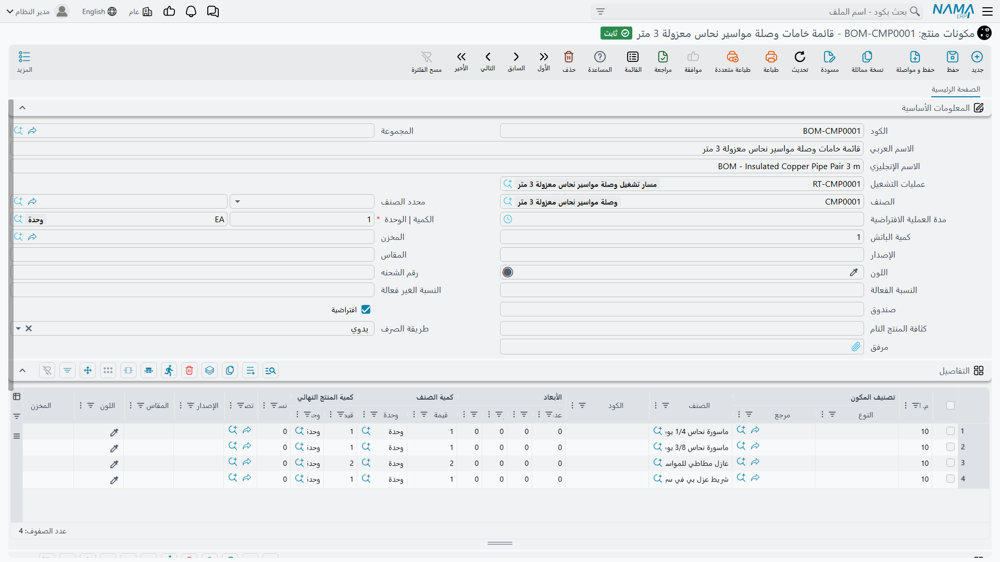
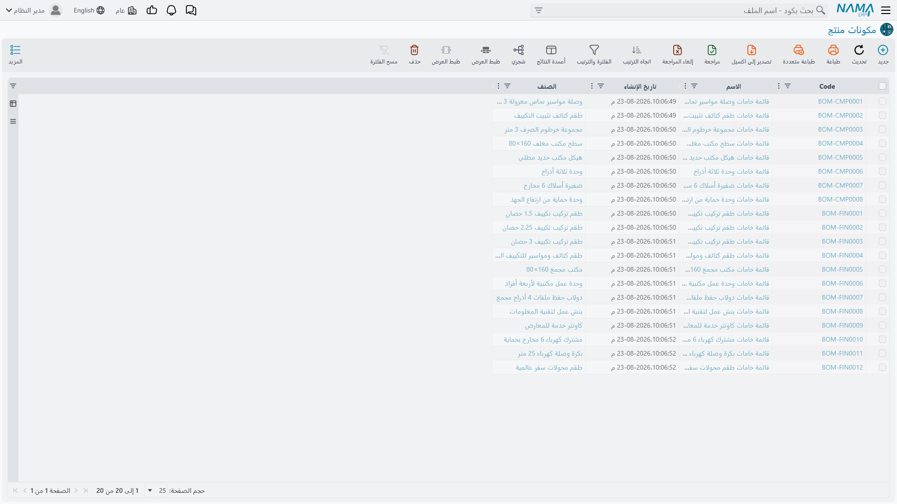
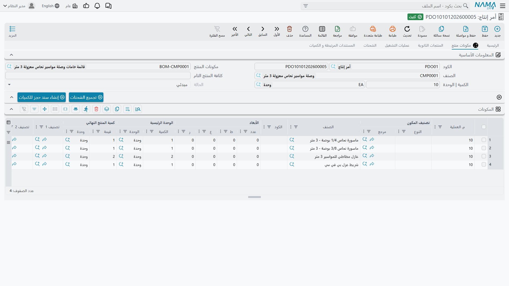

# مكونات المنتج (BOM): وصفة تصنيع المنتج

## لماذا تبدأ من قائمة المكونات

لا يعمل أي شيء آخر في وحدة التصنيع قبل أن يعرف النظام مِمَّ يتكوّن المنتج. أمر إنتاج بعشر وصلات مواسير نحاس معزولة يظل مجرد رغبة إلى أن يستطيع النظام أن يجيب وحده عن السؤال التالي: *وما الذي يستهلكه هذا الأمر؟* و**مكونات المنتج** (BOM) هي الإجابة — قائمة المكونات التي تدخل في وحدة واحدة من المنتج التام، ومقدار كل منها.

تشبيه الطبخ هو الأصدق هنا. الوصفة تقول: «لكعكة واحدة: 500 جرام دقيق، 4 بيضات، 200 جرام سكر». وقائمة المكونات تقول: «لوصلة مواسير نحاس معزولة 3 متر: ماسورة نحاس 1/4 بوصة، وماسورة نحاس 3/8 بوصة، وعازلان مطاطيان، ولفة شريط عزل PVC». وكما أن مضاعفة الكعك إلى اثنتي عشرة تضاعف الدقيق إلى ستة كيلوجرامات، فإن رفع أمر الإنتاج إلى عشر وحدات يرفع المكونات بالنسبة نفسها.

تجد قوائم المكونات في **التصنيع ← الملفات ← مكونات منتج**.

وتعرض شاشة القائمة كل قوائم المكونات لديك، والمنتج الذي تنتجه كل منها.

## البيانات الأساسية: ماذا تُنتج هذه الوصفة

يجيب النصف العلوي من الشاشة عن سؤال: ما الذي تصنعه هذه القائمة، وبأي كمية؟

**الكود** و**الاسم العربي / الاسم الإنجليزي** تعرّف القائمة نفسها. اختر كودًا تتعرف عليه من النظرة الأولى — نمط مثل `BOM-CMP0001` بمعنى «قائمة مكونات الصنف CMP0001» يوفّر وقتًا حقيقيًا أول مرة يضطر فيها أحدهم إلى اختيار قائمة من بين مئتين.

**الصنف** هو المنتج الذي تنتجه هذه القائمة، وهذا هو الرابط الذي يجعل كل ما بعده آليًا: حين يذكر أمر الإنتاج صنفًا، يبحث النظام عن قائمة مكوناته ويسحب المكونات منها.

**الكمية | الوحدة** هما الحقلان الحاسمان، وأكثر ما يُساء فهمه. يحددان *عدد الوحدات التامة التي تشير إليها كميات المكونات في الجدول أدناه*. اجعلها 1 فيصير الجدول بيانًا لما تستهلكه وحدة واحدة، واجعلها 100 فيصير بيانًا لما تستهلكه دفعة من مائة، ويقسّم النظام تلقائيًا حين يطلب أمرٌ 250 وحدة.

::: tip استخدم كمية الدفعة حين تصبح الأرقام الصغيرة قبيحة
إذا كانت الوحدة الواحدة تستهلك 0.0035 كجم من مادة لاصقة، فلا تكتب 0.0035. اجعل **الكمية** 1000 وسجّل 3.5 كجم. الحساب واحد، لكن الرقم في الجدول يصبح رقمًا يستطيع الإنسان مراجعته.
:::

**كمية الدفعة** حقل مستقل عن ذلك، وهو موضع لبس متكرر. فـ«الكمية | الوحدة» هي الكمية *المرجعية* للوصفة، أما «كمية الدفعة» فهي الكمية التي ينتجها المصنع فعليًا في المرة الواحدة — سعة الخلّاط، أو حمولة الفرن. اتركها 1 ما لم تكن عمليتك ذات حجم دفعة ثابت بالفعل.

**مسار التشغيل** يشير إلى خطوات التصنيع التي يمر بها المنتج. قائمة المكونات تقول ما الذي يدخل، و[مسار التشغيل](/ar/modules/manufacturing/manufacturing-routing) يقول ماذا يحدث. وذكره هنا يعني أن أمر الإنتاج الذي يلتقط هذه القائمة يلتقط معها العمليات المناظرة دون أن يختارها أحد على حدة.

**قائمة المكونات الافتراضية** خانة اختيار أهم مما يوحي به حجمها. فقد يكون للصنف الواحد أكثر من قائمة مكونات — وصفة قياسية وأخرى مخفّضة التكلفة، أو مراجعة قديمة وأخرى جديدة. ينبغي أن تكون واحدة منها فقط هي الافتراضية، وهي التي سيلجأ إليها أمر الإنتاج ما لم يحدد أحد غيرها.

**نوع الصرف** يحدد كيف تخرج المكونات من المخزن. فإذا كان **يدوي**، سجّل أحدهم [صرف مواد خام](/ar/modules/manufacturing/raw-material-issue) وقرّر بنفسه ما الذي يخرج فعليًا. أما البديل فيُسند هذه المهمة إلى النظام، فيسحب المكونات آليًا مع تسجيل الإنتاج.

أما بقية حقول البيانات الأساسية — **المجموعة** و**مصنّف الصنف** و**المخزن** و**رقم المراجعة** و**المقاس** و**اللون** و**رقم اللوط** و**الصندوق** و**النسبة الفعالة / غير الفعالة** و**كثافة المنتج التام** و**المدة الافتراضية للعملية** و**المرفق** — فهي تفصيلات اختيارية، وأغلب التطبيقات تترك جُلَّها فارغًا دون ضرر.

## جدول التفاصيل: ما الذي يدخل

كل سطر في **التفاصيل** مكوّن واحد. في مثال وصلة المواسير أعلاه أربعة أسطر، وهذه هي الأعمدة التي يستحق فهمها.

**رقم العملية** هو الخطوة التي يُستهلك عندها هذا المكوّن. الأسطر الأربعة كلها تحمل `10`، أي أن كل شيء يُصرف عند العملية الأولى. وعلى مسار تشغيل أطول تصبح هذه النقطة هي موضع الطرافة في الوصفة: النحاس يدخل عند القص (10)، والعزل عند اللف (20)، والملصق عند التعبئة (30). وضبط هذه الأرقام هو ما يتيح للنظام أن يخبرك بأن أمرًا متوقفًا عند العملية 20 لم يستهلك بعدُ رصيد الملصقات.

**الصنف** هو المكوّن نفسه — المادة الخام أو التجميعة الفرعية المستهلَكة.

**كمية الصنف** (**القيمة** + **الوحدة**) هي المقدار. وتُقرأ مع «الكمية | الوحدة» في الأعلى: فمع كمية = 1 وسطر يقرأ `2 لكل`، تستهلك الوصلة التامة الواحدة عازلين اثنين.

**الكمية النهائية** هي ما سيخطط له النظام فعليًا بعد أن تقول أعمدة النِّسَب كلمتها. وفي قائمة نظيفة بلا نسبة هالك تساوي كمية الصنف، ولهذا يبدو العمودان متطابقين كثيرًا — وهما ليسا زائدَين، بل متفقان فحسب.

**فئة المكوّن** (**نوع الكيان** + **المرجع**) هي ما يجعل سطر القائمة يتجاوز كونه قطعة واحدة ثابتة. فبدلًا من تسمية صنف بعينه، يمكن للسطر أن يسمي *فئة* من الأصناف، ويُختار الصنف الفعلي عند إنشاء الأمر. وبهذا تُنمذج «أي من مواسير 3/8 بوصة المعتمدة الثلاث» دون أن تصون ثلاث قوائم مكونات شبه متطابقة.

وتكمل بقية الأعمدة السطر: **النسبة** و**المراجعة** و**المقاس** و**اللون** و**المخزن** — نسبة هالك، وأي مراجعة من المكوّن تنطبق، ومن أين يُسحب إن لم يكن من مخزن الأمر الافتراضي.

::: warning قائمة المكونات ملف رئيسي وليست مستندًا
تعديل قائمة المكونات يغيّر ما ستستهلكه أوامر الإنتاج *المستقبلية*، ولا يمتد أثره إلى أوامر أُنشئت بالفعل — فتلك التقطت قائمة مكوناتها لحظة إنشائها. هذا سلوك مقصود وهو المطلوب، لكنه يعني أن تصحيح قائمة خاطئة لا يصحح الأوامر التي بُنيت عليها، وهذه لا بد من تصحيحها فرادى.
:::

## المنتجات متعددة المستويات

لا يحتاج النظام إلى خاصية خاصة اسمها «قائمة مكونات متعددة المستويات»، لأن المستويات تنشأ من التصميم نفسه. فالمكتب له قائمة مكونات تضم لوح سطح مغلّفًا وهيكلًا معدنيًا مطليًا بالبودرة. واللوح نفسه صنف مُصنَّع له قائمة مكوناته الخاصة التي تضم الخشب المضغوط وشريحة التغليف. والهيكل له قائمته التي تضم المواسير الصلب وطلاء البودرة.

وحين تصنع المكتب يكون أمامك خياران: أن تنتج اللوح والهيكل بأمري إنتاج مستقلين ثم تستهلكهما في أمر المكتب، أو أن تدع التخطيط يفكك الشجرة كاملة فيخبرك بأن أمرًا لخمسين مكتبًا يحتاج في النهاية إلى خمسين شريحة تغليف. و[تخطيط احتياجات المواد](/ar/modules/manufacturing/material-requirements-planning) يقوم بهذا التفكيك بالضبط، وهو السبب في أن دقة قوائم التجميعات الفرعية تظل مهمة حتى حين لا ينتجها أحد على حدة.

## أين تظهر قائمة المكونات بعد ذلك

بمجرد وجود القائمة، تقرأ منها معظم أجزاء الوحدة بدلًا من أن تطلب من أحد إعادة إدخالها:

- **أمر الإنتاج** للصنف يسحب المكونات باعتبارها خطته للمواد، في صفحة **BOM** الخاصة به.
- **[صرف المواد الخام](/ar/modules/manufacturing/raw-material-issue)** على ذلك الأمر يقترح المكونات نفسها بوصفها ما يُسحب من المخزن.
- **[تخطيط احتياجات المواد](/ar/modules/manufacturing/material-requirements-planning)** يفككها ليحدد ما يجب شراؤه ومتى.
- **[إغلاق الأمر](/ar/modules/manufacturing/production-costing)** يقارن ما قالت القائمة إنه كان يجب استهلاكه بما استُهلك فعلًا — وهذا هو أساس انحراف المواد كله.

والنقطة الأخيرة جديرة بالتأمل. فقائمة المكونات غير الدقيقة لا تعلن عن نفسها، بل تنتج بهدوء انحرافًا في المواد مع كل إغلاق أمر، ويُحمَّل الانحراف على المصنع. فإذا أظهرت تكاليفك انحرافًا مستمرًا في اتجاه واحد على منتج بعينه، فاتّهم الوصفة قبل أن تتهم العمّال.
