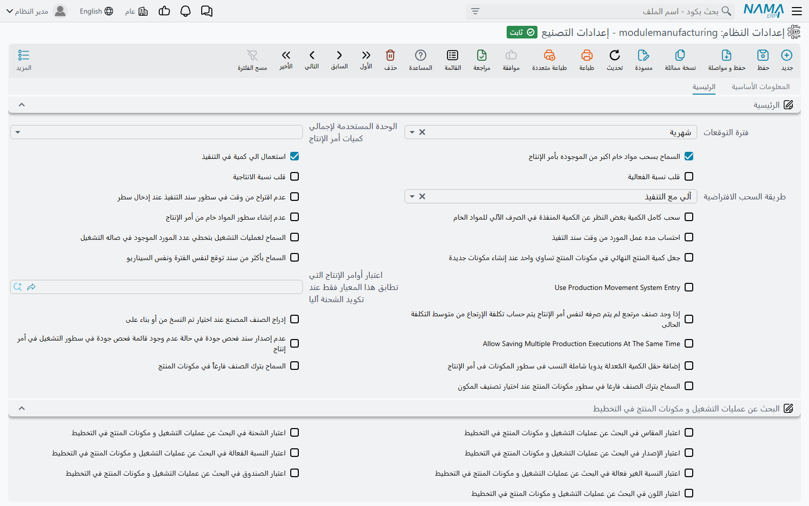

# إعدادات التصنيع

معظم سلوك مستند التصنيع يتحدد في [توجيه المستند](/ar/modules/manufacturing/document-terms/mfg-terms-production-orders) الخاص به. لكن مجموعة أصغر من القرارات يجب أن تكون واحدة لكل مستند في قاعدة البيانات — هل يجوز للمخزن أن يصرف أكثر مما طلبه الأمر، وهل يعامل التخطيط لونين من الصنف نفسه كاحتياج واحد، وهل تُحسب التنفيذات بحركات الكميات — وهذه تعيش في شاشة إعدادات الموديول نفسه، **إعدادات التصنيع**، التي تُفتح من منطقة الإعدادات لا من قائمة التصنيع.

الشاشة تبويب واحد فيه أربع مجموعات. وبعض الخيارات موضوعة في مجموعة لا علاقة لها بما تتحكم فيه، لذلك ترتّب هذه الصفحة الخيارات بحسب ما تؤثر فيه لا بحسب مكانها على الشاشة.

::: info الترخيص المطلوب
شاشة الإعدادات ضمن ترخيص التصنيع الأساسي `manufacturing`. وخيارات التخطيط لا تهم إلا حيث يكون `manufacturing-mrp` مفعّلًا.
:::

## سجل واحد يُقرأ مباشرة

**يوجد سجل واحد فقط.** كل ما يقرأ هذه الإعدادات يقرأ السجل نفسه دون تمرير شركة، فالمجموعة التي تشغّل عدة شركات في قاعدة بيانات واحدة تشغّلها كلها بإعدادات التصنيع نفسها.

**يُقرأ مباشرة.** التغيير يسري على المستند التالي الذي يُحفظ، بما في ذلك المستندات القديمة حين تُفتح وتُحفظ من جديد.

**خمسة خيارات فقط تبدأ مفعّلة**: *السماح بسحب مواد خام اكبر من الموجوده بأمر الإنتاج* وخيارات التخطيط الأربعة *استخدام الإصدار* و*استخدام اللون* و*استخدام المقاس* و*استخدام الابعاد*. وخيار آخر يتصرف كأنه مفعّل حتى تُحفظ الإعدادات أول مرة: *استعمال الي كمية في التنفيذ*. وحفظ الشاشة مرة دون تعليمه يعطّله، فتختفي أعمدة «إلى كمية» من التنفيذ — علّمه قبل الحفظ الأول إن كانت تنفيذاتك تستخدمها.

## أوامر الإنتاج ومكونات المنتج

| الخيار | ما يفعله |
|---|---|
| **طريقة السحب الافتراضية** | عند حفظ مكونات منتج أو أمر إنتاج أو طلب أمر إنتاج، كل سطر مكوّن بلا طريقة سحب يأخذ هذه: **يدوي** أو **آلي مع الإستلام** أو **آلي مع التنفيذ** أو **مستلزمات لا تصرف**. و«آلي مع التنفيذ» هو ما يجعل التنفيذ يُنشئ صرف المواد الخام لذلك السطر. |
| **جعل كمية المنتج النهائي في مكونات المنتج تساوي واحد عند إنشاء مكونات جديدة** | عند الحفظ تأخذ سطور المكونات التي بلا كمية منتج نهائي القيمة 1. ولا يعمل إلا إذا كانت **طريقة السحب الافتراضية** مضبوطة أيضًا. |
| **السماح بإدراج "المتج" النهائي في مكوناته** | مع تعطيله يُرفض سطر المكوّن الذي صنفه هو المنتج النهائي نفسه: «لا يمكن أستخدام هذا الصنف لانه المنتج النهائي». فعّله للمنتجات التي تستهلك جزءًا من نفسها — سطر خامة معاد تدويرها مثلًا. أما سطر المنتج الثانوي فلا يجوز أبدًا أن يكون المنتج نفسه. |
| **السماح بترك الصنف فارغاً في مكونات المنتج** | مع تعطيله يجب أن تذكر مكونات المنتج صنفها التام. فعّله لمكونات المنتج العامة التي تُختار بمحدد الصنف لا بالصنف. |
| **السماح بترك الصنف فارغا في سطور مكونات المنتج عند اختيار تصنيف المكون** | مع تعطيله يحتاج كل سطر صنفًا. ومع تفعيله يجوز ترك الصنف فارغًا إذا ذكر السطر **تصنيف المكون** — لكن لا يجوز ترك الاثنين: «لا يمكن ترك الصنف و تصنيف المكون كلاهما فارغين, يجب أن يكون إحداهما له قيمة». |
| **عدم نسخ المخزن من رأس مكونات المنتج عند الإدخال** | مع تعطيله يأخذ السطر الجديد مخزن الرأس؛ ومع تفعيله يبدأ فارغًا. |
| **عدم إدراج مكونات منتج افتراضية في حالة وجود أكثر من واحده لنفس الصنف** | حين يكون للصنف أكثر من مكونات منتج افتراضية مطابقة لمحدداته، لا يختار أمر الإنتاج واحدة نيابة عنك؛ بل يختار المستخدم. |
| **الوحدة المستخدمة لإجمالي كميات أمر الإنتاج** | تُحوَّل الكمية الإجمالية المحسوبة لكل سطر مكوّن ومنتج ثانوي في الأوامر والطلبات إلى هذه الوحدة من الصنف: **الوحدة الأساسية(الأصغر)** أو **وحدة التقارير 1** أو **وحدة التقارير 2** أو **وحدة البيع** أو **وحدة الشراء**. والفارغ يُبقي وحدة السطر. |
| **قلب نسبة الفعالية** | تُرفع كمية المكوّن عادة بالفعالية: الكمية × 100 ÷ الفعالية. ومع التفعيل تُقرأ النسبة على أنها *الفاقد*: الكمية × 100 ÷ (100 − الفعالية). |
| **قلب نسبة الانتاجية** | المفتاح نفسه لنسبة الإنتاجية. |
| **إضافة حقل الكمية المٌعدلة يدويا شاملة النسب فى سطور المكونات فى أمر الإنتاج** | يضيف عمودًا إلى جدول مكونات الأمر تُكتب فيه الكمية المعدلة شاملة النسبتين الفعالة وغير الفعالة؛ ويحسب النظام منها الكمية اليدوية. |
| **عدم تحديث أى شئ بعد تحديث الكمية في أوامر الإنتاج إذا كان الكمية المٌعدلة يدويا لا تساوى صفر** | حين يحمل أي مكوّن كمية معدلة يدويًا، لا يعيد تغيير كمية الأمر حساب المكونات والمنتجات الثانوية — فتبقى الأرقام اليدوية. |
| **السماح لعمليات التشغيل بتخطي  عدد المورد الموجود في صاله التشغيل** | مع تعطيله يتحقق حفظ عملية التشغيل أو أمر الإنتاج من أن كل مورد ينتمي إلى صالة إنتاج العملية وأن المستخدم منه لا يتجاوز ما في الصالة: «{1} المورد {0} غير موجود في صاله الانتاج» أو *Resource {0} count in workcenter {1} is {2} and you are using {3}*. |
| **اعتبار أوامر الإنتاج التي تطابق هذا المعيار فقط عند تكويد الشحنة اَليا** | حين يكوّد أمر الإنتاج رقم شحنته بنفسه، لا يُنظر إلا في الأوامر السابقة المطابقة لهذه المعايير لإيجاد آخر تسلسل — فيحتفظ خطّا إنتاج بتسلسلي شحنات منفصلين. |
| **إدراج الصنف المصنع عند اختيار تم النسخ من أو بناء على** | المستند المخزني المنشأ من أمر إنتاج أو طلبه ينسخ مكونات الأمر عادة. ومع التفعيل ينسخ سطرًا واحدًا: المنتج التام بكمية الأمر ومحدداته. |
| **نسخ السطور اليدوي فقط عند عمل سند بناءا على أمر إنتاج** | حين يُنشأ مستند سلسلة إمداد من أمر إنتاج لا تُنسخ إلا المكونات التي طريقة سحبها «يدوي». أما صرف المواد الخام وطلباته فتنسخ السطور اليدوية فقط دائمًا. |

## صرف المواد الخام وإرتجاعها

| الخيار | ما يفعله |
|---|---|
| **السماح بسحب مواد خام اكبر من الموجوده بأمر الإنتاج** | مفعّل افتراضيًا. ومع تعطيله لا يجوز لمجموع الصرف على الأمر — لكل صنف وعملية — أن يتجاوز كمية المكوّن مع نسبته المسموحة: «إجمالي السحب من الصنف {0} لا يمكن أن يتخطي كمية {1}». |
| **عدم إنشاء سطور المواد خام  من أمر الإنتاج** | تغيير أمر الإنتاج في الصرف أو الإرتجاع أو طلباتهما يعيد ملء السطور من الأمر عادة. ومع التفعيل تبقى السطور المكتوبة؛ والجدول الفارغ يُملأ مع ذلك. |
| **استخدام مستندات المواد الخام مع أمر الإنتاج المبدئي** | *طلبات* صرف المواد الخام وإرتجاعها لا تقبل عادة إلا الأوامر قيد التنفيذ: «حالة امر الانتاج مبدئي». ومع التفعيل تُعرض الأوامر المبدئية وتُقبل أيضًا، ليجهّز المخزن قبل بدء الأمر. |
| **عدم السماح بارتجاع مواد خام لم تصرف على أمر الإنتاج** | لا يرتجع إرتجاع المواد الخام إلا ما صُرف على الأمر نفسه، ولا أكثر منه. ويُرفض برسالة «لا يمكن ارتجاع الصنف  {0} حيث انه لم يتم صرفه لأمر الانتاج» أو «لايمكن ارتجاع الصنف  {0} بكميه اكبر من الكميه المصروف بها لأمر الإنتاج». |
| **استخدام اللون / المقاس / الصندوق / الشحنه / رقم الإصدار في ارتجاع المواد الخام** | تجعل ذلك التحقق لكل لون أو مقاس أو صندوق أو شحنة أو إصدار بدل كل صنف. ولا تهم إلا مع تفعيل الخيار السابق. |
| **نسخ المخزن من سطور أمر الإنتاج إلي سطور ارتجاع المواد الخام** | سطور الإرتجاع المملوءة من الأمر تكون عادة بلا مخزن أو موقع؛ ومع التفعيل تأخذ مخزن المكوّن وموقعه. |
| **إذا وجد صنف مرتجع لم يتم صرفه لنفس أمر الإنتاج يتم حساب تكلفة الإرتجاع من متوسط التكلفة الحالى** | الصنف المرتجع الذي لم يُصرف للأمر قط يُكلَّف عادة بتكلفته القياسية. ومع التفعيل يُكلَّف بمتوسط تكلفته الحالي. |

## تنفيذ الإنتاج

| الخيار | ما يفعله |
|---|---|
| **Use Production Movement System Entry** | يغيّر طريقة احتساب كميات العمليات: كل تنفيذ وتسليم وإرتجاع واستلام تالف وعينة يسجّل حركة، ويُعاد بناء رصيد كل خطوة من الحركات. و**السماح بالكمية السالبة** في عمليات التشغيل والأوامر يحتاجه. واسمه يظهر بالإنجليزية على الشاشات العربية أيضًا. انظر [تنفيذ الإنتاج](/ar/modules/manufacturing/production-execution). |
| **استعمال الي كمية في التنفيذ** | يُظهر أعمدة **إلى كمية** في سطور التنفيذ، للخطوات التي يختلف ناتجها كمّيًا عن مدخلها. |
| **استعمال الي عملية في احتساب معامل التحويل** | يُؤخذ معامل تحويل الوحدة لسطر التنفيذ من عملية *إلى* بدل عملية *من*. وموضعه على الشاشة في مجموعة التخطيط. |
| **عدم اقتراح من وقت في سطور سند التنفيذ عند إدخال سطر** | سطر التنفيذ الجديد يأخذ الوقت الحالي في **من وقت** عادة؛ ومع التفعيل يُترك فارغًا. |
| **احتساب مده عمل المورد من وقت سند التفيذ** | حين يكون لسطر التنفيذ وقت بداية ونهاية، يحمّل سند الموارد المنشأ منه الساعات بينهما، بدل الزمن المحسوب من عملية التشغيل. |
| **خصم كميات السطور من الكمية المحسوبة من العملية** | حين يقترح التنفيذ كمية سطر مما ينتظر عند عملية، يخصم ما أخذته سطور أخرى في التنفيذ نفسه من الأمر والعملية نفسيهما. وموضعه على الشاشة في مجموعة إرتجاع المواد الخام. |
| **Allow Saving Multiple Production Executions At The Same Time** | مع تعطيله لا يُحفظ إلا تنفيذ واحد في كل لحظة على مستوى النظام كله؛ والمستخدم الثاني الذي يحفظ في اللحظة نفسها يرى «جاري حفظ سند تنفيذ أخر الأن. يرجي الانتظار الي ان ينتهي حفظ هذا السند. معرف السند الآخر {0}» ويكفيه أن يحفظ مرة أخرى. فعّله فقط حين لا تمس التنفيذات المتزامنة الأوامر نفسها. واسمه يظهر بالإنجليزية على الشاشات العربية أيضًا. |
| **عدم إصدار سند فحص جودة في حالة عدم وجود قائمة فحص جودة في سطور التشغيل في أمر إنتاج** | يُرفض مستند فحص الجودة الصادر من أمر أو تنفيذ للعمليات التي ليست لها قائمة فحص جودة: «لا يمكن إصدار سند فحص جودة للعملية {0} لأن عملية التشغيل الخاصة به لا يوجد لها قائمة فحص جودة». |

## التخطيط

هذه الخيارات لا تهم إلا مع ترخيص `manufacturing-mrp`. وسند التخطيط نفسه في [تخطيط احتياجات المواد](/ar/modules/manufacturing/material-requirements-planning).

**ما يُعدّ احتياجًا واحدًا.** الخيارات التسعة في مجموعة **إعدادات تخطيط الإنتاج** — **استخدام الإصدار**، **استخدام اللون**، **استخدام المقاس**، **استخدام الشحنه**، **استخدام الصندوق**، **استخدام الابعاد**، **استعمال النسبة الفعالة**، **استعمال النسبة الغير فعالة** و**استخدام الصنف الفرعي** — تحدد المحددات التي تفصل الاحتياجات. فمع التعليم يبقى احتياجان للصنف نفسه بلونين مختلفين سطرين؛ ومع إلغائه يندمجان في سطر. والإصدار واللون والمقاس والأبعاد تبدأ معلَّمة.

**إيجاد مكونات المنتج وعملية التشغيل.** مجموعة **البحث عن عمليات التشغيل و مكونات المنتج في التخطيط** تحدد أي محددات الاحتياج تُستخدم حين يبحث التخطيط عن مكونات المنتج وعملية التشغيل التي يفجّره بها: اعتبار المقاس، والشحنة، والإصدار، واللون، والنسبة الفعالة، والنسبة الغير فعالة. وكل منها لا يسري إلا إذا كان الصنف يتتبع ذلك المحدد وكان للاحتياج قيمة فيه. علّمها حيث تُصنع مقاسات أو ألوان الصنف الواحد بمكونات منتج مختلفة.

| الخيار | ما يفعله |
|---|---|
| **الوحده المستخدمة في تخطيط الإنتاج** | تُحوَّل الكميات المطلوبة إلى هذه الوحدة من كل صنف. والفارغ يعني الوحدة الأساسية. |
| **حذف خيارات التحديد بمستند التخطيط بعد إنشاء المستندات** | بعد إنشاء المستندات من سند التخطيط تُمسح علامات **اختيار** في سطوره المخططة، فلا يعيد ضغط ثانٍ إنشاء السطور نفسها بالخطأ. |
| **فترة التوقعات** | الفترة الافتراضية لسند التوقعات الجديد: **أسبوعي** أو **شهرية** أو **ربع سنوية**. تُنسخ عند إنشاء السند؛ وبعدها تحكم فترة السند نفسه. |
| **السماح بأكثر من سند توقع لنفس الفترة ونفس السيناريو** | مع تعطيله يُرفض سند التوقعات الذي تتداخل تواريخه مع سند آخر للسيناريو نفسه: «تم عمل سند توقعات لنفس الفترة بنفس السيناريو». |

## رسائل قد تظهر لك

| الرسالة | لماذا | ما تفعله |
|---|---|---|
| «إجمالي السحب من الصنف {0} لا يمكن أن يتخطي كمية {1}» | الصرف بأكثر من الأمر معطّل، وهذا الصرف سيتجاوز بالصنف كمية الأمر مع نسبته المسموحة. | اصرف أقل، أو ارفع النسبة المسموحة للمكوّن في الأمر، أو فعّل **السماح بسحب مواد خام اكبر من الموجوده بأمر الإنتاج**. |
| «لا يمكن ارتجاع الصنف  {0} حيث انه لم يتم صرفه لأمر الانتاج» | الإرتجاع مقصور على ما صُرف، وهذا الصنف لم يُصرف للأمر قط (بالمحددات المعلَّمة). | راجع الأمر في الإرتجاع، أو محددات السطر. |
| «لايمكن ارتجاع الصنف  {0} بكميه اكبر من الكميه المصروف بها لأمر الإنتاج» | الإرتجاع أكبر مما صُرف. | لا ترتجع أكثر مما صُرف. |
| «حالة امر الانتاج مبدئي» | طلب مواد خام يذكر أمرًا لم يبدأ. | ابدأ الأمر، أو فعّل **استخدام مستندات المواد الخام مع أمر الإنتاج المبدئي**. |
| «{1} المورد {0} غير موجود في صاله الانتاج» | عملية تشغيل أو أمر يستخدم موردًا ليس في صالة إنتاجه. | أضف المورد إلى صالة الإنتاج، أو فعّل **السماح لعمليات التشغيل بتخطي  عدد المورد الموجود في صاله التشغيل**. |
| «جاري حفظ سند تنفيذ أخر الأن. يرجي الانتظار الي ان ينتهي حفظ هذا السند. معرف السند الآخر {0}» | كان تنفيذ آخر يُحفظ في اللحظة نفسها. | احفظ من جديد بعد ثوانٍ. |
| «لا يمكن أستخدام هذا الصنف لانه المنتج النهائي» | سطر مكوّن يذكر المنتج النهائي نفسه. | احذف السطر، أو فعّل **السماح بإدراج "المتج" النهائي في مكوناته**. |
