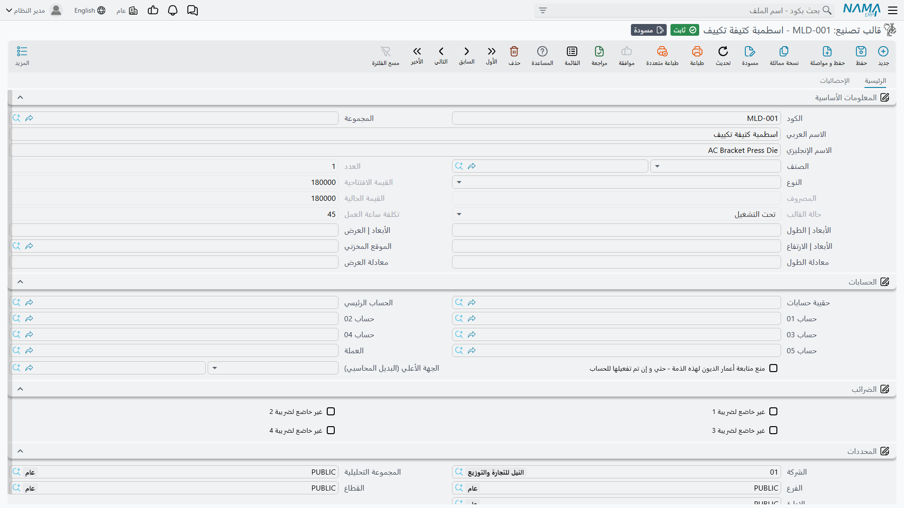
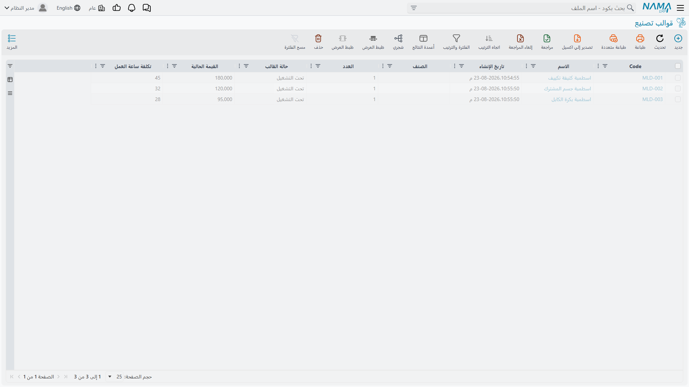
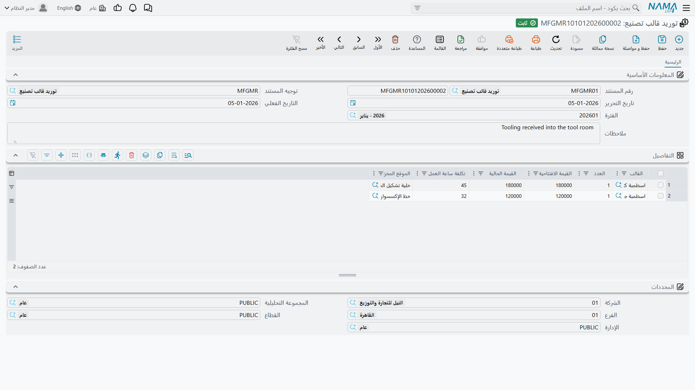

# قوالب التصنيع: عُدَدٌ تَبلى

## لماذا تحتاج العُدَّة إلى ملف خاص بها

اسطمبة كبس لكتيفة تكييف تكلف 180,000. وهي ليست مادة خام — فهي لا تُستهلك في المنتج فتذهب معه. وليست أصلًا ثابتًا تمامًا كذلك، لأنها بخلاف المبنى أو الشاحنة يُقاس عمرها بعدد *الكبسات* لا بالسنوات، والذي يستهلكها هو الإنتاج.

هذه الطبيعة الوسيطة هي سبب إفراد القوالب بعائلة صغيرة من الشاشات. فـ**قالب التصنيع** قطعة عُدَّة لها قيمة ومعدل بلى ورصيد جارٍ، ووُجدت هذه الوحدة لتجيب بصدق عن ثلاثة أسئلة: كم تساوي هذه الاسطمبة الآن، وكم استهلك هذا العمل من عمرها، ومتى تحتاج إلى إحلال؟

وكل ذلك تحت **التصنيع ← قوالب تصنيع**.

وشاشة القائمة هي سجل العُدَد — كل قالب تملكه وحالته.

## الملف الرئيسي للقالب

**الكود** و**الاسم العربي / الإنجليزي** تعرّف العُدَّة — `MLD-001`، اسطمبة كبس كتيفة تكييف.

**الصنف** يربط القالب بالمنتج الذي يصنعه حين تكون العلاقة واحدًا لواحد. و**النوع** يصنّف العُدَّة، و**العدد** كم تملك من هذا القالب.

وحقول القيمة هي قلب الشاشة، وتعمل مجموعةً واحدة:

- **القيمة المبدئية** ما كان يساويه القالب حين دخل الخدمة — 180,000 هنا.
- **القيمة المستهلَكة** كم استُهلك منها بالإنتاج حتى الآن. وهي غير قابلة للتحرير، لأنها نتيجة للعمل الذي أدّاه القالب لا شيئًا تقرره أنت.
- **القيمة الحالية** ما تبقّى.

**التكلفة للساعة** (45) هي المعدل الذي يُستهلك به القالب وهو يدور. وهذا هو الرقم الذي يحوّل العُدَّة من كتلة رأسمالية إلى تكلفة منتج للوحدة: أدِر الاسطمبة ساعتين على عمل، تنتقل 90 من قيمتها إلى تكلفة ذلك العمل.

**حالة القالب** — `يعمل` هنا — غير قابلة للتحرير المباشر كذلك. فهي تعكس موضع القالب من عمره، وتتحرك مع تحرير المستندات أدناه عليه.

::: tip التكلفة للساعة قرار سياسة لا قياس
لا شيء في النظام يستطيع أن يخبرك بالبلى الساعي الحقيقي لاسطمبة. فأنت تختار كيف توزّع تكلفة رأسمالية معلومة على عمر مقدَّر — 180,000 على 4,000 ساعة متوقعة تعطي 45. وإذا كان التقدير خاطئًا، ظلت تكاليف المنتج خاطئة في الاتجاه نفسه ما دام القالب يدور، ولذلك يستحق الأمر مراجعة حين يتبين أن العمر الفعلي لقالب مختلف عن المخطط.
:::

**المقاييس | الطول** و**العرض** و**الارتفاع** تسجّل الحجم المادي للعُدَّة، و**معادلة الطول** / **معادلة العرض** تتيحان اشتقاق الأبعاد بدلًا من كتابتها حيث تتبع هندسة القالب هندسة المنتج. و**الموقع** حيث يُحفظ.

ويربط قسم **الحسابات** القالبَ بشجرة الحسابات فيصل استهلاكه إلى الدفاتر، ويعمل قسما **الضرائب** و**المحددات** كما في سائر الملفات الرئيسية.

أما صفحة **الإحصائيات** فتحمل حركات القالب — السجل الجاري لما جرى له.

## توريد القالب

تدخل العُدَّة الخدمة بمستند **توريد قالب تصنيع**، في **التصنيع ← قوالب تصنيع ← توريد قالب تصنيع**.

تحمل البيانات الأساسية **كود المستند** و**التوجيه** و**تاريخ الإصدار** و**تاريخ القيمة** و**الفترة المالية**. وكل سطر في **التفاصيل** يُدخل قالبًا واحدًا إلى الخدمة، والأعمدة هي بعينها حقول القيمة في الملف الرئيسي: **القالب** و**العدد** و**القيمة المبدئية** و**القيمة الحالية** و**التكلفة للساعة** و**الموقع**.

وهذا التكرار مقصود. فالتوريد هو ما *يُنشئ* هذه الأرقام — الملف الرئيسي يعرضها، لكن هذا المستند هو مصدرها وموضع بدء أثرها المستندي. وتوريد اسطمبتين بـ180,000 و120,000 في مستند واحد، كما في المثال، يُدير القالبين بقيمتيهما ومعدليهما.

## استهلاك القالب

**استهلاك قالب تصنيع**، في **التصنيع ← قوالب تصنيع ← استهلاك قالب تصنيع**، يسجّل الاستهلاك — الساعات التي قضاها القالب على عمل، محوَّلةً بتكلفته الساعية إلى قيمة تنتقل من القالب إلى أمر الإنتاج.

وكثير من هذا يجري دون مستند. فـ[العملية القياسية](/ar/modules/manufacturing/manufacturing-work-centers) يمكنها أن تسرد قوالبها في جدول **القوالب**، بـ**عدد ساعات** و**نوع تحميل**، فيُحمَّل الاستهلاك مع تسجيل الإنتاج. وبتفعيل **تحديد عدد الساعات من تنفيذ العملية** في ذلك الجدول تأتي الساعات مما يبلّغ عنه التنفيذ فعلًا بدلًا من رقم ثابت.

والمستند لِما يقع خارج ذلك: قالب استُخدم في عمل لا يسرده مسار تشغيله، أو دفعة انشغلت فيها العُدَّة أطول كثيرًا من المعتاد.

## تخريد القالب

تتشقق الاسطمبة في النهاية، أو تبلى فوق الحد المسموح، أو يتوقف المنتج الذي تصنعه. و**تخريد قالب تصنيع**، في **التصنيع ← قوالب تصنيع ← تخريد قالب تصنيع**، يُخرجها من الخدمة ويسوّي ما تبقّى لها من قيمة.

::: warning تخريد قالب له قيمة متبقية ليس مجانيًا
تخريد قالب ما زال يُظهر قيمة حالية يُعدم تلك القيمة المتبقية — فلا بد أن تذهب إلى مكان، وهي تحطّ خسارةً لا تتوزع على إنتاج مستقبلي. وهذه هي المعالجة الصادقة، لكنها تعني أن تخريدًا غير متوقع ضربةٌ للفترة لا حدثًا عابرًا. وحيث يكون القالب قد أخفق مبكرًا، يكون هذا الإعدام بعينه هو الرقم الجدير بعرضه على من اختار المورّد.
:::

## موقع القالب

**موقع قالب تصنيع** ملف رئيسي صغير يسرد أماكن حفظ العُدَد — مخزن أو رفّ أو ماكينة بعينها. والقوالب تشير إليه، والتوريدات تضبطه، ومصنعٌ فيه مائتا اسطمبة موزعة على ثلاثة مبانٍ يحتاجه أكثر كثيرًا من مصنع فيه ثلاث.

## كيف تجتمع القطع

الدورة قصيرة وتحاكي حياة شيء مادي. **التوريد** يُدخل الاسطمبة الخدمة بقيمة ومعدل ساعي. و**سندات الاستهلاك** — المحرَّرة آليًا في أغلبها عبر العمليات القياسية — تستهلك تلك القيمة وهي تدور، فتنقلها إلى أوامر الإنتاج التي استخدمتها. وقيمتا القالب **المستهلَكة** و**الحالية** تتتبعان النزف. وحين لا يبقى شيء نافع، يُحيله **التخريد** إلى التقاعد.

وما تجنيه من ذلك هو القدرة على إجابة سؤال يعجز عنه أغلب المصانع: لا *كم كلّف هذا العمل من مواد وعمالة* فحسب، بل *كم كلّف من عُدَد*. وفي المنتجات المصنوعة باسطمبات باهظة، هذا ليس خطأ تقريب، بل هو غالبًا الفرق بين منتج يبدو مربحًا ومنتج هو كذلك فعلًا.
