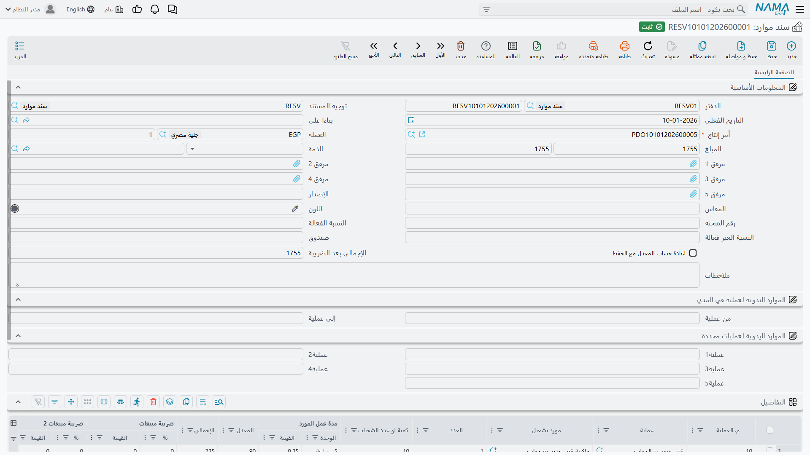

# سندات الموارد: تحميل زمن الماكينات والعمالة

## التكلفة التي ليست مادة

اصرف النحاس والعزل والشريط على عمل ما، تكن قد حسبت ما يتكوّن منه المنتج ماديًا، ولا تكون قد حسبت الساعات الأربع التي دارت فيها ماكينة القص، ولا الطاقم الذي وقف عليها. وهذه تكاليف حقيقية، وتشكل نصيبًا كبيرًا مما يكلفه المنتج المصنّع فعلًا، ولا يلتقطها أي مستند مواد.

و**سند الموارد** يلتقطها. فهو يحمّل الزمن الذي أنفقته ماكينة أو طاقم أو أي مورد آخر على أمر إنتاج، ويحوّله إلى مال على ذلك العمل.

تجده في **التصنيع ← المستندات ← سند موارد**.

## متى تحتاج إليه فعلًا

وهذا ما يستحق أن يُفهم قبل إدخال سند واحد: **أغلب استهلاك الموارد لا يحتاج إلى سند أصلًا**.

فإذا كانت [العملية القياسية](/ar/modules/manufacturing/manufacturing-work-centers) مفعَّلًا فيها **التحميل الآلي**، حُمِّلت مواردها آليًا مع تسجيل الإنتاج. مسار التشغيل يعرف أن الماكينة تدور 0.25 ساعة للصنف، وتنفيذ الإنتاج يقول إن 90 صنفًا مرّت، فيهبط التحميل من تلقائه. ولا يكتب أحد شيئًا.

وسند الموارد لِما يفلت من ذلك:

- **موارد ليست على مسار التشغيل أصلًا.** ضاغط مستأجَر أُحضر لعمل واحد. أو طاقم مقاول استُدعي لتصفية تكدّس.
- **عمليات لا صلة لزمنها الحقيقي بالقياسي.** انحشرت الماكينة فاستغرقت الخطوة ثلاثة أضعاف. والتحميل الآلي هنا يسجّل خيالًا مريحًا.
- **التصحيحات.** كان المعدل القياسي خاطئًا في فترة، والعمل يحتاج إلى الفرق.

::: tip إن كنت تدخل سندًا لكل أمر، فثمة خلل أعلى المنبع
استهلاك الموارد الروتيني الذي يمكن التنبؤ به مكانه العملية القياسية مع تفعيل التحميل الآلي. والمصنع الذي يُدخل سندًا لكل أمر كل يوم غالبًا ترك التحميل الآلي معطّلًا حيث كان ينبغي تفعيله — وهو يدفع ثمن ذلك وقتَ إدخالٍ للبيانات، وأخطاءً تصاحبه.
:::

## البيانات الأساسية

**الدفتر** و**التوجيه** و**تاريخ القيمة** تعمل كما في كل مستند.

**أمر الإنتاج** إلزامي، للسبب نفسه الذي في صرف المواد: فتكلفة المورد لا بد أن ترتبط بعمل وإلا لم تجد موضعًا.

**العملة** وسعرها يعالجان الموارد المفوترة بعملة أخرى — المقاول الذي يفوتر بالدولار. و**المبلغ** يحمل قيمة السند، و**الصافي بعد الضرائب** الرقم بعد تطبيق الضريبة — 1,755 في الحقلين في المثال، لأنه لا ضريبة عليه.

**الذمة** تسمي الطرف حين يكون المورد خارجيًا وهناك من يُدفع له.

**إعادة حساب المعدل مع الحفظ** خانة تستحق التفكير. اتركها معطّلة فتبقى المعدلات في الأسطر كما أُدخلت تمامًا، وفعّلها فيعيد الحفظ اشتقاقها من المعدلات القياسية الحالية. وأيهما تريد يتوقف على سبب تحرير السند: فإعادة الحساب صحيحة حين تُلحق مستندًا بالمعدلات الجارية، وخاطئة حين يكون مقصد السند كله تسجيل معدل *مختلف* عن القياسي — ففي هذه الحالة يُلقي تفعيلها في صمت بما جئت لتسجيله.

**المرفق 1** إلى **المرفق 5** تحمل الإثبات — فاتورة المقاول، أو سجل الصيانة، أو كشف الساعات. وفي مستند غرضه تفسير تكلفة غير معتادة، تستحق هذه الحقول موضعها.

## اختيار العمليات المراد تحميلها

بين البيانات الأساسية والجدول قسمان، وُجدا لتوفير الكتابة في الأوامر ذات مسارات التشغيل الطويلة.

**مورد يدوي لعمليات في نطاق** يأخذ **من عملية** و**إلى عملية** — فتحمّل كل شيء من الخطوة 20 إلى الخطوة 60 دفعة واحدة.

**مورد يدوي لعمليات محددة** يأخذ حتى خمس خطوات مفردة في **عملية1** إلى **عملية5** — لِما تكون فيه الخطوات المطلوبة متفرقة لا متجاورة.

وكلاهما اختصار لملء الجدول. اتركهما فارغين فتسمي العمليات سطرًا سطرًا بدلًا من ذلك، وهو أمر غير شاقّ في مسار قصير.

## جدول التفاصيل

كل سطر يحمّل موردًا واحدًا على عملية واحدة.

**رقم العملية** و**العملية** يقولان أين — `10`، قص وتوسيع المواسير، في المثال.

**المورد** هو ما استهلك الزمن: ماكينة قص وتوسيع المواسير. و**عدد الموارد** كم منها — 1 هنا.

**الكمية أو عدد اللوط** هو الحجم الذي يُوزَّع عليه التحميل: 10.

**معدل المورد** (**الوحدة** + **القيمة**) هو المعدل القياسي — `5 - ساعة` عند `0.25`، أي ربع ساعة للوحدة.

**المعدل** (90) هو المعدل النقدي، و**الإجمالي** (225) هو التحميل الناتج. وهذا الرقم هو ما يحطّ على تكلفة أمر الإنتاج.

**ضريبة الصنف** (**النسبة** + **قيمة الضريبة**) و**الضريبة 2** (**النسبة** + **القيمة**) تُطبَّقان حيث يكون المورد مفوترًا خارجيًا وخاضعًا للضريبة. أما الماكينة الداخلية فتبقيان صفرًا.

## إلى أين تذهب التكلفة

سند الموارد المحفوظ يضيف إلى التكلفة المتراكمة لأمر الإنتاج، إلى جانب المواد المصروفة والأعباء المحمَّلة. وتُرفع آثاره طلبات أعمال تُعالَج في الخلفية، فيكون الحفظ نفسه فوريًا؛ وإذا فشلت آثار سند ظهرت في شاشة **طلبات الأعمال** لإعادة معالجتها.

وعند [إغلاق الأمر](/ar/modules/manufacturing/production-costing) تُقارن تكلفة الموارد بما قال مسار التشغيل إن العمليات كان ينبغي أن تستهلكه. والفجوة المستمرة تستحق التتبع، لأنها تعني عادةً أحد أمرين بعينهما: إما أن المعدلات القياسية على عملياتك ابتعدت عن الواقع، وإما أن المصنع يستغرق فعلًا وقتًا أطول مما يزعمه مسار التشغيل. والاستجابتان مختلفتان تمامًا، وانحراف الموارد هو الرقم الذي يميز بينهما.
