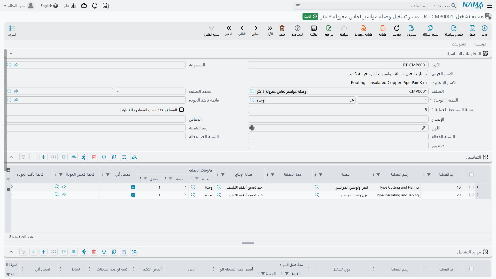
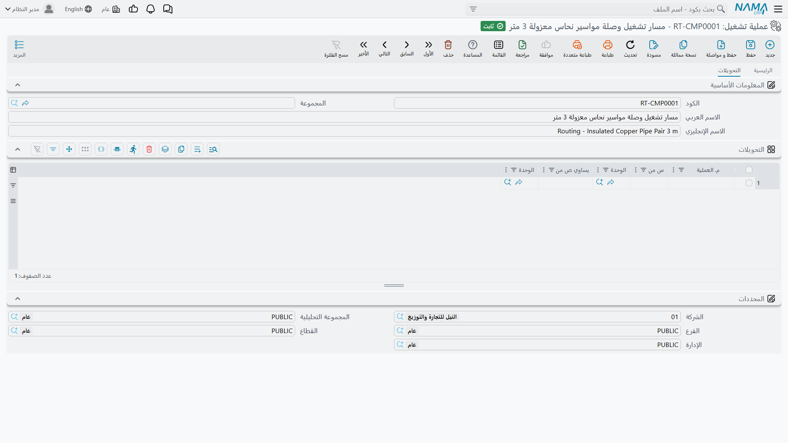
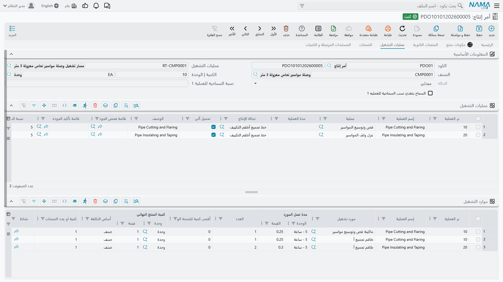

# مسارات التشغيل: الخطوات التي يمر بها المنتج

## ما الذي يضيفه مسار التشغيل إلى قائمة المكونات

[قائمة المكونات](/ar/modules/manufacturing/manufacturing-bom) تخبرك مِمَّ يتكوّن المنتج، ولا تقول شيئًا عن كيفية صنعه — والنصف الثاني لا يقل أهمية في أي شيء أعقد من وضع قطع في صندوق. فوصلة المواسير النحاسية المعزولة تحتاج إلى قص المواسير وتوسيعها، ثم عزلها ولفّها. خطوتان، بهذا الترتيب، على خط بعينه، وباستغراق زمن بعينه. هذا التسلسل هو **مسار التشغيل**.

فإذا كانت قائمة المكونات هي قائمة مقادير الوصفة، فمسار التشغيل هو طريقتها: *سخّن الفرن، اخفق الزبد والسكر، أضف الدقيق، اخبز أربعين دقيقة*. وكما في الطبخ، الترتيب ليس زينة. لا يمكنك لفّ العازل على ماسورة لم تقصّها بعد، والنظام في حاجة إلى معرفة ذلك ليخبرك أين يقف الأمر فعليًا.

تجد مسارات التشغيل في **التصنيع ← الملفات ← عملية تشغيل**.

## البيانات الأساسية

**الكود** و**الاسم العربي / الإنجليزي** و**الصنف** تعمل تمامًا كما في قائمة المكونات — ومزاوجة الأكواد (`BOM-CMP0001` مع `RT-CMP0001`) انضباط صغير يجعل التعامل مع الملفين أيسر كثيرًا.

**الكمية | الوحدة** هي الكمية المرجعية مرة أخرى: عدد الوحدات التامة التي تُنسب إليها المدد والمعدلات أدناه.

**النسبة المسموح بها للعملية 1** و**تجاوز غير محدود للعملية 1** هما الحقلان اللذان يكافئان القراءة المتأنية في هذه الشاشة. فالتصنيع نادرًا ما ينتج المطلوب بالضبط — قد تعطي دفعة من 100 عددَ 103 لأن الماكينة كانت مضبوطة بالفعل فاستمر العامل. وهذان الحقلان يحددان استجابة النظام لذلك عند العملية *الأولى*. النسبة المسموح بها تضبط حد التسامح (5 في الصورة: أمر بمائة يجوز أن يكتمل حتى 105 عند العملية 1). وتفعيل التجاوز غير المحدود يرفع السقف بالكامل.

::: warning هذا التسامح يخص العملية الأولى وحدها
اسما الحقلين يقولان «للعملية 1»، وهما يعنيان ذلك حرفيًا. أما حدود التسامح للعمليات اللاحقة فتُضبط على العمليات نفسها لا هنا. ووضع نسبة سخية على مسار التشغيل لا يُرخي الخط كله في صمت.
:::

**قائمة ضمان الجودة** تربط قائمة فحص يجب استيفاؤها للمنتج. أما **المجموعة** و**مصنّف الصنف** و**رقم المراجعة** و**المقاس** و**رقم اللوط** و**اللون** و**الصندوق** وزوج **النسبة الفعالة / غير الفعالة** فتفصيلات اختيارية، كما في قائمة المكونات.

## جدول التفاصيل: العمليات

كل سطر خطوة واحدة، والأسطر تجري بالترتيب الذي يسلكه المنتج.

**رقم العملية** هو رقم الخطوة، وعادة العدّ بالعشرات — 10، 20، 30 — تستحق التبني. فهي لا تكلف شيئًا، وتعني أن من يحتاج لاحقًا إلى إقحام خطوة إزالة الحواف بين القص واللف يجعلها 15، بدلًا من إعادة ترقيم المسار كله وكل سطر في قائمة المكونات كان يشير إليه.

**العملية** تشير إلى [عملية قياسية](/ar/modules/manufacturing/manufacturing-work-centers) — تعريف قابل لإعادة الاستخدام لخطوة، بموارده ومعدلاته المضبوطة سلفًا. و**اسم العملية** هو التسمية التي تظهر أمامها. وسحب الخطوات من العمليات القياسية بدلًا من وصفها من جديد في كل مسار هو ما يمنع مائة مسار من أن يحمل كلٌّ منها تصوّره المختلف قليلًا لتكلفة «القص».

**صالة الإنتاج** هي مكان وقوع الخطوة — الخط أو الخلية أو منطقة الإنتاج. والسطران في الصورة يجريان على خط تجميع أطقم التكييف.

**مدة العملية** هي الزمن الذي تستغرقه. وإن تُركت فارغة أُخذت المدة من العملية القياسية.

**الكمية المنتجة** (**الوحدة**، **القيمة**، **المعدل**) هي ناتج الخطوة. فمعدل 1 مع قيمة 1 يعني وحدة تدخل ووحدة تخرج، وهي الحالة المعتادة. وتظهر أهمية المعدلات حين تغيّر العملية طريقة العدّ: خطوة تقص لوحًا واحدًا إلى أربع قطع لها معدل ناتج لا يساوي 1، وضبطه هو ما يبقي الكميات صادقة في بقية الخط.

**التحميل الآلي**، وهو مفعّل في السطرين هنا، يعني تطبيق تكلفة العملية آليًا مع تسجيل الإنتاج، بدلًا من انتظار من يحرّر [سند موارد](/ar/modules/manufacturing/manufacturing-resource-voucher) يدويًا. وهذا هو المطلوب في خطوة روتينية يمكن التنبؤ بها. أما الخطوات التي يتفاوت زمنها الحقيقي بما يجعل التحميل الآلي ضربًا من الخيال فالأولى إلغاء تفعيله فيها.

**قائمة الفحص الرقابي** و**قائمة ضمان الجودة** تربطان فحوصًا على مستوى العملية — البوابة التي يجب اجتيازها قبل أن تنتقل الوحدات.

## جدول الموارد: ما تستهلكه الخطوات

العمليات تستهلك وقتًا على الماكينات ومن البشر، وليس أيٌّ منهما مجانيًا. وجدول **الموارد** ينسب هذا الاستهلاك خطوةً خطوة.

**رقم العملية** و**اسم العملية** يربطان كل سطر مورد بخطوة في الجدول أعلاه، فيمكن لعملية واحدة أن تستعين بموارد عدة — ماكينة *و* الطاقم الذي يشغّلها.

**المورد** هو الماكينة أو الطاقم أو صالة الإنتاج المستهلَكة، و**عدد الموارد** كم منها.

**معدل المورد** (**القيمة** + **الوحدة**) هو أساس التكلفة — معدل مُسعَّر بالساعة أو بالوحدة أو بما يناسب. و**أساس التكلفة** و**الكمية أو عدد اللوط** يحددان كيفية تطبيق هذا المعدل: لكل صنف مُنتَج، أم لكل لوط بصرف النظر عن حجمه. وهذا التمييز هو بعينه الفرق بين تكلفة تتناسب مع الحجم وتكلفة تجهيز لا تتناسب، وعنده يُكسب كثير من دقة التكاليف أو يُخسر.

**أقصى كمية للوط** يحدّ ما يغطيه سطر المورد الواحد قبل الحاجة إلى غيره. و**النشاط** يصنّف العمل لأغراض التقارير. و**التحميل الآلي** يعمل كما سبق.

## صفحة التحويلات

الصفحة الثانية تعالج المنتجات التي تتغير وحدة قياسها وهي تسير على الخط. فالمادة تصل بالكيلوجرام، وتُجهَّز إلى أمتار، وتُباع بالقطعة.

ويُقرأ كل سطر كأنه جملة: عند **رقم عملية** معيّن، **س من** وحدة **يساوي ص من** وحدة أخرى. فسطر يقول «عند العملية 20، لفّة واحدة تساوي 250 لوحًا» هو ما يبقي الكميات متسقة من عملية إلى أخرى بدلًا من الحاجة إلى تسوية يدوية في النهاية. وأغلب مسارات التشغيل لا تحتاج إلى أي سطر هنا — فالصفحة لا تهم إلا حيث تتغير الوحدة فعلًا في منتصف العملية.

## كيف يُستخدم مسار التشغيل

أمر الإنتاج الذي يذكر هذا المسار ينسخ العمليات إلى صفحة **مسارات التشغيل** الخاصة به، ومن تلك اللحظة يصير للأمر شكل: قائمة خطوات، لكل منها صالة إنتاج ومدة وكمية لم تمر بها بعد.

وهذا ما يجعل [تنفيذ الإنتاج](/ar/modules/manufacturing/production-execution) ممكنًا.

 فكل مستند تنفيذ يسجّل تقدمًا *على عملية بعينها* — كذا وحدة انتقلت من الخطوة 10 إلى الخطوة 20 — ودون مسار تشغيل لا توجد خطوات يُسجَّل عليها. وهو أيضًا ما يجعل الإنتاج تحت التشغيل رقمًا حقيقيًا لا تخمينًا: فالوحدات التي تجاوزت العملية 10 ولم تتجاوز 20 هي، بدقة وبإمكان الإجابة، إنتاج تحت التشغيل.
