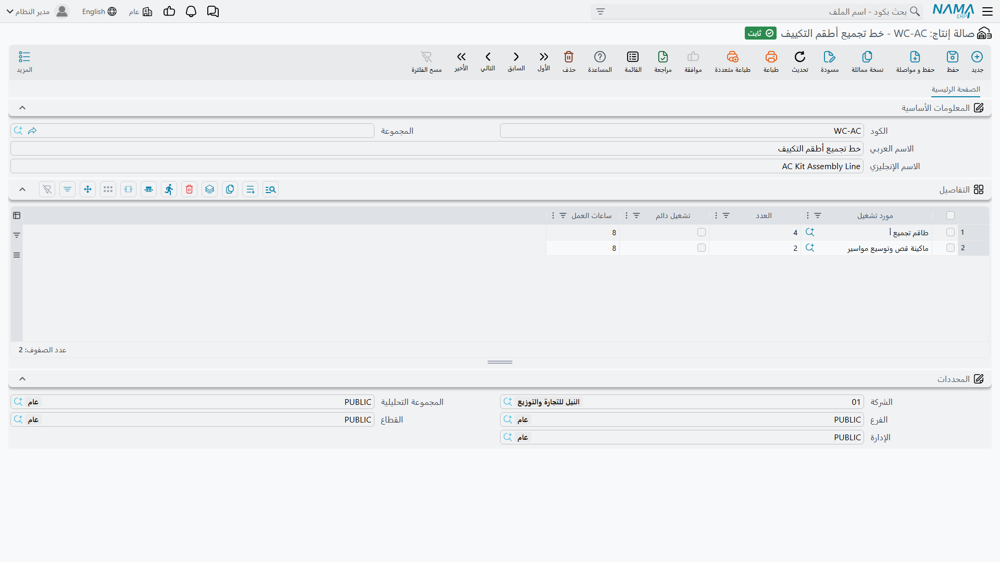
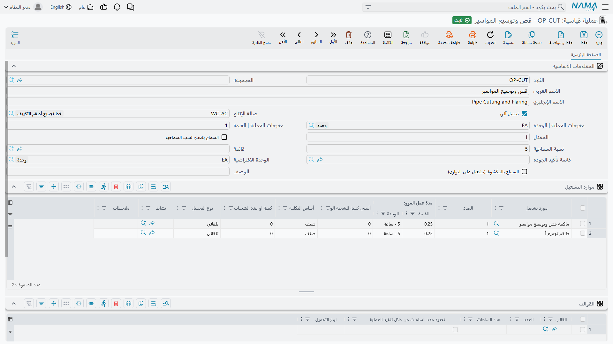
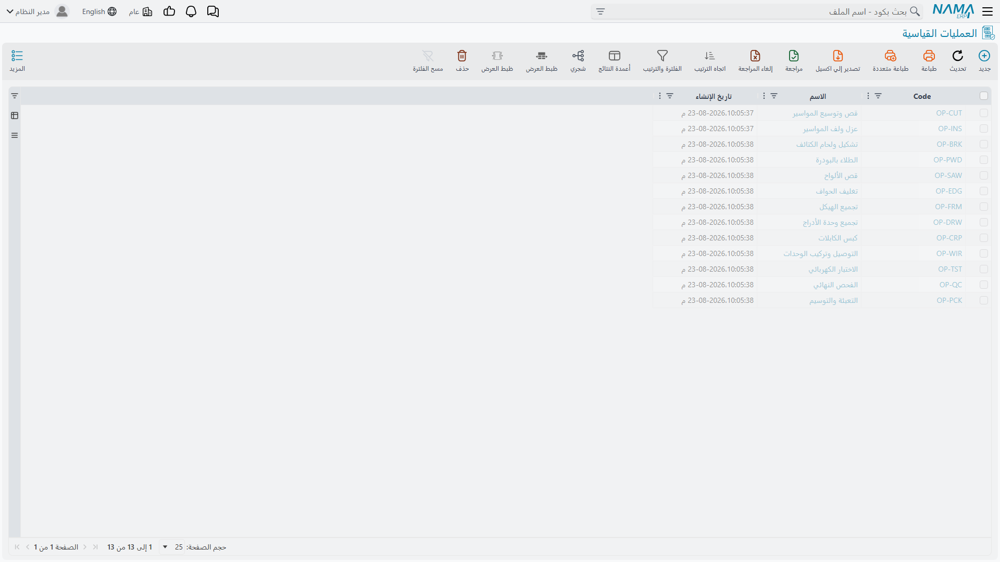

# صالات الإنتاج والعمليات القياسية

## ملفان يجيبان عن «أين» و«بكم»

[مسار التشغيل](/ar/modules/manufacturing/manufacturing-routing) يسرد الخطوات التي يمر بها المنتج، لكنه لا يريد أن يحمل كل تفصيلة عن كل خطوة. فإذا كان أربعون منتجًا تمر جميعها بخطوة القص، فأنت لا تريد أربعين مسار تشغيل يحمل كلٌّ منها نسخته الخاصة من تكلفة القص وزمنه والماكينة التي تؤديه — لأنك يوم يتغير معدل الماكينة سيكون أمامك أربعون موضعًا للتصحيح، وستفوتك بعضها.

لذلك يقبع تحت مسارات التشغيل ملفان رئيسيان يحملان هذه التفصيلة مرة واحدة:

- **صالة الإنتاج** *مكان* — خط أو خلية أو منطقة في المصنع — والموارد المرابطة فيه.
- **العملية القياسية** *خطوة* — قص أو لف أو تعبئة — بمواردها ومعدلاتها وحدود تسامحها.

ثم يكتفي مسار التشغيل بالإشارة إليهما. غيّر المعدل على العملية القياسية فيُصحَّح في الحال كل مسار يشير إليها.

## صالات الإنتاج

تجدها في **التصنيع ← الملفات ← صالة إنتاج**.

الشاشة صغيرة عن قصد. **الكود** و**الاسم العربي / الإنجليزي** و**المجموعة** الاختيارية تعرّف الصالة، وكل ما هو جوهري في الجدول أدناه.

كل سطر في **التفاصيل** مورد مرابط في هذه الصالة:

**المورد** هو الماكينة أو الطاقم. ولخط تجميع أطقم التكييف أعلاه موردان — طاقم التجميع «أ» وماكينة قص وتوسيع المواسير.

**عدد الموارد** كم من هذا المورد يوجد هنا. وأربعة للطاقم تعني أربعة أشخاص، وهذا الرقم هو ما يحوّل صالة الإنتاج إلى رقم طاقة إنتاجية لا مجرد اسم.

**ساعات العمل** عدد الساعات التي يتاح فيها المورد يوميًا — 8 في السطرين. و**متاح طوال اليوم** هو التجاوز الخاص بالموارد التي لا تعمل بنمط ورديات: فعّله فيتوقف سريان رقم الساعات.

::: tip الطاقة الإنتاجية تأتي من هذا الجدول لا من حقل للطاقة
لا يوجد في هذه الشاشة حقل يقول «هذا الخط ينتج 400 وحدة يوميًا». فالطاقة مشتقة: الموارد × العدد × ساعات العمل، في مقابل المدد والمعدلات على العمليات التي تجري هنا. فإذا أخبرك التخطيط بأن خطًا محمَّل فوق طاقته وخالفته الرأي، فهذا الجدول أول موضع تنظر فيه — و«عدد الموارد» المنقوص هو المتهم المعتاد.
:::

أما قسم **المحددات** — **الشركة** و**الفرع** و**الإدارة** و**مجموعة التحليل** و**القطاع** — فيضع الصالة في الهيكل التنظيمي، وهو ما يتيح لاحقًا عرض التكاليف والإنتاج حسب الفرع أو الإدارة.

## العمليات القياسية

تجدها في **التصنيع ← الملفات ← عملية قياسية**.

وشاشة القائمة هي فهرس الخطوات التي تستطيع مسارات التشغيل السحب منها.

هذا أغنى الملفين، لأن الخطوة تحمل معنى أكثر مما يحمله المكان.

**الكود** و**الاسم العربي / الإنجليزي** تعرّفها. و**صالة الإنتاج** تسمي المكان الذي تقع فيه الخطوة عادةً — فعملية قص وتوسيع المواسير أعلاه تجري على خط تجميع أطقم التكييف.

**الناتج | الوحدة** و**الناتج | القيمة**، مع **المعدل**، تصف ما تنتجه الخطوة في المرور الواحد. و**الوحدة الافتراضية** هي الوحدة التي تُقاس بها العملية حين لا ينطبق ما هو أخص.

**التحميل الآلي**، وهو مفعّل هنا، يطبّق تكلفة العملية آليًا مع تسجيل الإنتاج. واتركه معطّلًا في الخطوات التي يتفاوت استهلاكها الحقيقي بما يجعل الرقم الآلي غير صادق — فهذه يُدخَل لها [سند موارد](/ar/modules/manufacturing/manufacturing-resource-voucher) يدويًا بدلًا من ذلك.

**النسبة المسموح بها** (5 هنا) و**تجاوز غير محدود** تضبطان حد التسامح مع الإنتاج الزائد لهذه الخطوة، بالطريقة نفسها التي تضبطها بها بيانات مسار التشغيل للعملية الأولى.

**السماح بالتجاوز (تشغيل التوازي)** هو الحقل الجدير بالوقوف عنده. فالمعتاد أن تنهي الوحدة عملية قبل أن تبدأ التالية — تسلسل صارم. وتفعيل هذا الحقل يتيح للخطوة أن تجري بالتوازي مع جاراتها، وهو ما تحتاجه في خط يبدأ فيه قص الدفعة التالية بينما لفّ الحالية ما زال جاريًا. واتركه معطّلًا فسيحجز النظام العمل حتى تفرج عنه الخطوة السابقة.

**القائمة** و**قائمة ضمان الجودة** تربطان الفحوص التي تحرس الخطوة، و**الوصف** نص حر للعاملين.

### جدول الموارد

من هنا تأتي تكلفة العملية فعليًا. وكل سطر مورد تستهلكه الخطوة:

**المورد** و**عدد الموارد** — ماذا وكم. و**معدل المورد** (**القيمة** + **الوحدة**) هو المعدل: والسطران أعلاه يقرآن `0.25` مقابل `5 - ساعة`.

**أساس التكلفة** يحدد ما الذي يرتبط به المعدل. والسطران هنا يقرآن **صنف**، أي أن التكلفة تتناسب مع عدد الأصناف المنتَجة. أما البديل فيربط التكلفة باللوط بدلًا من ذلك، وبه تُنمذج تكلفة تجهيز واحدة سواء أنتجت عشر وحدات أو ألفًا. وخطأ هذا الاختيار من أهدأ الطرق التي تضلّ بها تكلفة المنتج — فتكلفة تجهيز محمَّلة على كل صنف تجعل الدفعات الصغيرة تبدو رخيصة والكبيرة تبدو باهظة، وهو عكس الحقيقة تمامًا.

**الكمية أو عدد اللوط** و**أقصى كمية للوط** يحدّان مدى امتداد سطر المورد الواحد. و**نوع التحميل** — **آلي** في السطرين — يتحكم في هبوط التحميل من تلقائه أو انتظاره الإدخال. و**النشاط** يصنّف العمل للتقارير، و**الوصف** يوثّق السطر.

### جدول القوالب

العمليات التي تحتاج عُددًا تسردها هنا. **القالب** يشير إلى [قالب التصنيع](/ar/modules/manufacturing/manufacturing-molds)، و**العدد** كم منها يلزم، و**عدد الساعات** مدة انشغال العُدَّة.

**تحديد عدد الساعات من تنفيذ العملية** يغيّر مصدر هذا الرقم: فبدلًا من الرقم الثابت في السطر، تُؤخذ الساعات مما يسجّله مستند التنفيذ فعليًا. استخدمه حين يتتبع زمن العُدَّة العملَ حقًا لا أن يكون ثابتًا — وهو حال أغلب المكابس والاسطمبات.

و**نوع التحميل** يتحكم في كيفية تطبيق تكلفة العُدَّة، كما يفعل مع الموارد.

## كيف يجتمع الملفان

تسير السلسلة في اتجاه واحد، وكل حلقة تنزع التكرار عن التي فوقها:

**صالة الإنتاج** تقول إن خطًا موجود وعليه أربعة أفراد وماكينة. و**العملية القياسية** تقول إن القص يقع على ذلك الخط، ويستهلك تلك الموارد بتلك المعدلات، ويتسامح مع تجاوز 5%. و**مسار التشغيل** يقول إن هذا المنتج يمر بالقص ثم اللف. و**أمر الإنتاج** للمنتج يلتقط ذلك المسار، فيصير له فجأة خطة كاملة — خطوات وأماكن ومدد وموارد وتكاليف — دون أن يدخل أحد شيئًا منها على الأمر نفسه.

وهذا هو المقصود. اضبط هذين الملفين بعناية مرة واحدة، فيصير إنشاء الأوامر شبه مجاني.
