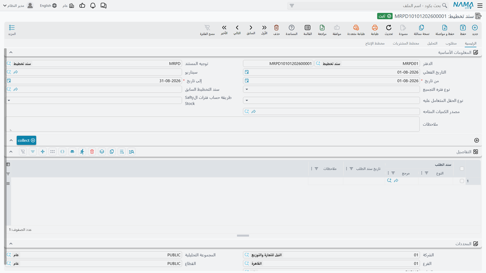

# تخطيط احتياجات المواد: ماذا تشتري ومتى

## السؤال الذي يجيب عنه التخطيط

يطلب عميل خمسين مكتبًا للتسليم بعد ستة أسابيع. وأنت تعرف مِمَّ يتكوّن المكتب لأن [قائمة المكونات](/ar/modules/manufacturing/manufacturing-bom) تقول ذلك: لوح سطح مغلَّف وهيكل معدني مطليّ بالبودرة. وتعرف كذلك أن اللوح مصنوع من خشب مضغوط وشريحة تغليف، وأن الهيكل من مواسير صلب وطلاء بودرة. وتعرف أن مواسير الصلب تستغرق ثلاثة أسابيع لتصل من مورّدك.

إذن: أتحتاج إلى طلب مواسير الصلب اليوم أم لا؟ وبأي كمية، مع أن لديك بعضها في المخزن، وبعضها تحت الطلب، ومستوى مخزون أمان تفضّل ألا تنزل تحته؟

هذا سؤال يسهل الخطأ فيه ويشقّ ضبطه، وهو يتضاعف. فخمسون مكتبًا أربعة أنواع مكونات وقرار شراء واحد. أما دفتر طلبات شهر على تشكيلة منتجات حقيقية فآلاف من هذه القرارات، لكل منها مهلة توريده، وموقفه المخزني، واعتماده على صنع شيء آخر أولًا. و**تخطيط احتياجات المواد** هو الآلة التي تجيب عنها جميعًا دفعة واحدة.

تجد سند التخطيط في **التصنيع ← تخطيط موارد ← سند تخطيط**.



## كيف يفكّر الحساب

تحت كل هذه الحقول، يفعل التخطيط شيئًا واحدًا مرارًا، ويستحق فهمه قبل استخدام الشاشة — لأن النتيجة حين تفاجئك تكون إحدى هذه الخطوات هي تفسيرها دائمًا تقريبًا.

**يبدأ من الطلب، والطلب نوعان.** الطلب *المستقل* هو ما يطلبه العالم الخارجي: أوامر البيع والتوقعات والاحتياجات المُدخلة يدويًا. والطلب *التابع* هو ما يستلزمه الأول — فأنت لم تطلب مائتي رِجل طاولة، لكن خمسين مكتبًا تعني مائتي رِجل، وهذا احتياج حقيقي كاحتياج العميل تمامًا.

**ثم يفكّك.** فمن طلب المنتج التام ينزل في شجرة قائمة المكونات مستوًى مستوى، محوّلًا كل احتياج منتج إلى احتياجات مكونات، حتى يبلغ ما يُشترى لا ما يُصنع. فخمسون مكتبًا تصير خمسين لوح سطح وخمسين هيكلًا، والخمسون هيكلًا تصير كذا مترًا من مواسير الصلب.

**ثم يخصم ما لديك بالفعل.** فاحتياج إجمالي بمائتي رِجل ليس أمر شراء بمائتي رِجل. اطرح ما في المخزن، واطرح ما هو تحت الطلب ويصل في موعده، وأضف ما قررت حمايته من مخزون أمان، فيكون الباقي هو الاحتياج *الصافي* — القدر الذي يلزم إيجاده فعلًا.

**ثم يحسب رجوعًا من التاريخ.** وهذا ما يجعل التخطيط أكثر من قائمة مشتريات. فإذا كانت المكاتب تُشحن بعد ستة أسابيع، وجب أن تكتمل الهياكل قبل ذلك، فوجب أن تصل مواسير الصلب قبل *ذلك*، فوجب تحرير أمر الشراء قبله بثلاثة أسابيع. فمُهَل التوريد تحوّل الكمية إلى تاريخ، والتاريخ عادةً هو النصف الأجدى من الإجابة.

**ثم يقرّب إلى الطريقة التي تشتري وتصنع بها فعلًا.** فالاحتياجات الصافية نادرًا ما تطابق المقاسات التي يتعامل بها العالم. وتحديد حجم اللوط يطبّق القيود الحقيقية — حجم دفعة ثابت، أو حد أدنى للمورّد، أو «لوط بلوط» حيث تأخذ ما تحتاجه بالضبط.

::: tip حين تبدو النتيجة خاطئة، امشِ في الخطوات الخمس
تكاد كل شكوى من نوع «التخطيط يخبرني بهراء» ترجع إلى واحدة من هذه: طلب لم يُجمَّع، أو مستوى في قائمة المكونات لا يتفكك لأن تجميعة فرعية بلا قائمة مكونات، أو رصيد خُصم من مخزن لم تقصد إدراجه، أو مهلة توريد لم يصنها أحد، أو حجم لوط يقرّب الاحتياج إلى أعلى. وفحصها بهذا الترتيب أسرع من التحديق في النتيجة.
:::

## القطع في النظام

**سند التخطيط** هو موضع حدوث كل ذلك — سند واحد لكل تشغيلة تخطيط، يحمل الطلب الذي جمّعه، والتحليل الذي أجراه، والأوامر التي يقترحها.

وهو يستقي من ملفات تعرفها بالفعل، ومن قليل غيرها لا يوجد إلا للتخطيط:

| الشاشة | بالإنجليزية | ما تسهم به |
|---|---|---|
| مكونات منتج | BOM | هيكل المكونات الذي يُفكَّك |
| عملية تشغيل | Routing | العمليات وزمن التصنيع الذي تستلزمه |
| أمر بيع | Sales Order | طلب العملاء الحقيقي |
| سند توقعات | Sales Forecast | الطلب المتوقع، للتخطيط بعد دفتر الطلبات |
| سند طلب يدوي | Manual Demand | احتياجات تُدخل يدويًا ولا يحملها مستند آخر |

ويستحق سندا التوقعات والطلب اليدوي وقفة. فالتخطيط من أوامر البيع المؤكدة وحدها يعني ألا تطلب أبدًا شيئًا مهلة توريده أطول من مدى رؤيتك لدفتر الطلبات — وهو ما يعني عند أغلب المصنّعين ألا تطلب شيئًا نافعًا في وقته. فالتوقعات هي كيف تخطط لما بعد حافة ما التزم به العملاء فعلًا، والطلب اليدوي هو منفذ النجاة للاحتياجات الحقيقية التي لا مستند خاصًا بها.

## المتطلبات الأساسية

قبل استخدام MRP في Nama ERP، تأكد من إعداد البيانات الرئيسية التالية:

### 1. إعداد الأصناف

لكل صنف، قم بإعداد:
- ✅ **وحدة القياس الأساسية (Primary UOM)**
- ✅ **وقت انتظار التصنيع (Manufacturing Lead Time)** (للأصناف المصنّعة)
- ✅ **وقت انتظار الشراء (Purchase Lead Time)** (للأصناف المشتراة)
- ✅ إعدادات **مخزون الأمان (Safety Stock)**
- ✅ **الحد الأدنى لكمية الطلب (Minimum Order Quantity)**
- ✅ **علامة قابلية التصنيع (Manufacturable Flag)** (حدد إذا كان الصنف قابلاً للتصنيع)

### 2. قائمة المكونات (BOM)

للأصناف المصنّعة، أنشئ قوائم BOM تتضمن:
- أصناف المكونات وكمياتها
- حجم الدفعة (lot size)
- التوجيه المرتبط
- المحددات المحددة (إن وُجدت)
- علامة BOM الافتراضية

### 3. التوجيه (Routing)

للأصناف المصنّعة، أنشئ توجيهات تتضمن:
- تسلسل العمليات
- الموارد المطلوبة
- تقديرات الوقت
- BOM المرتبط (اختياري)

### 4. المخازن (Warehouses)

أعدّ المخازن بتفعيل:
- علامة MRP (لتضمينها في حسابات MRP)

### 5. السيناريوهات (اختياري)

أنشئ سيناريوهات MRP من أجل:
- آفاق تخطيطية مختلفة
- تحليل "ماذا لو"
- حسابات مخصصة للكميات المتاحة

### 6. توجيهات المستند (Document Terms)

أعدّ توجيهات مستند MRP لتشمل:
- دفتر/توجيه أمر الشراء
- دفتر/توجيه أمر الإنتاج
- دفتر/توجيه طلب الصنف
- دفتر/توجيه طلب شراء MRP

---

## سير عمل سند تخطيط MRP

تتبع عملية MRP في Nama ERP هذا المسار:

### الخطوة 1: إنشاء سند تخطيط MRP

1. انتقل إلى: **التصنيع > تخطيط الموارد المادية > سند تخطيط MRP**
2. انقر **جديد** لإنشاء سند تخطيط MRP جديد
3. أدخل معلومات الرأس:

#### حقول الرأس

| الحقل | الاسم بالعربية | الوصف |
|-------|----------------|-------|
| **Code** | الكود | كود المستند المولّد تلقائياً |
| **Value Date** | التاريخ | تاريخ المستند |
| **From Date** | من تاريخ | تاريخ بداية تجميع الطلب |
| **To Date** | إلى تاريخ | تاريخ نهاية تجميع الطلب |
| **Aggregation Period Type** | نوع فترة التجميع | طريقة تجميع الاحتياجات (يومي، أسبوعي، شهري، ربع سنوي، سنوي) |
| **Req Qty Method Type** | نوع الحقل المتعامل عليه | للتوقعات: استخدام الكميات الفعلية أو المتوقعة |
| **Scenario** | السيناريو | سيناريو اختياري لتحليل "ماذا لو" |
| **Previous MRP Document** | سند التخطيط السابق | ربط بتشغيل MRP السابق (للتخطيط المتجدد) |
| **Purchase Doc Type** | نوع مستند الشراء | نوع مستند الشراء المراد توليده (أمر شراء، طلب صنف، طلب شراء MRP) |
| **Production Doc Type** | نوع مستند الإنتاج | نوع مستند الإنتاج المراد توليده (أمر إنتاج، طلب أمر إنتاج) |

::: tip فترة التجميع (Aggregation Period)
يحدد **نوع فترة التجميع (Aggregation Period Type)** كيفية تجميع الطلب:
- **يومي (Daily)**: احتياجات منفصلة لكل يوم
- **أسبوعي (Weekly)**: تجميع الاحتياجات أسبوعياً
- **شهري (Monthly)**: تجميع الاحتياجات شهرياً (موصى به لمعظم السيناريوهات)
- **ربع سنوي (Quarterly)**: تجميع كل ربع سنة
- **سنوي (Yearly)**: تجميع سنوياً
:::

### الخطوة 2: تجميع الطلب

بعد ملء معلومات الرأس، انقر زر **تجميع (Collect)**.

#### معاملات نافذة التجميع

سيطلب منك النظام تحديد مصادر الطلب التي تريد تضمينها:

- ☑️ **تضمين أوامر البيع (Include Sales Orders)**
  - يشمل أوامر العملاء المؤكدة ضمن النطاق الزمني

- ☑️ **تضمين الطلبات اليدوية (Include Manual Demands)**
  - يشمل مستندات الطلب المنشأة يدوياً

- ☑️ **تضمين التوقعات (Include Forecasts)**
  - يشمل مستندات توقعات المبيعات

::: warning مهم
يجب اختيار مصدر طلب واحد على الأقل. سيعرض النظام رسالة خطأ إذا لم يُحدد أي منها.
:::

#### ما يحدث أثناء التجميع

سيقوم النظام بـ:
1. البحث عن مستندات الطلب ضمن النطاق الزمني المحدد
2. استخراج احتياجات الأصناف من كل مستند
3. تعبئة مجموعة **التفاصيل (Lines)** بمصادر الطلب
4. إنشاء **سطور الاحتياجات (Required Lines)** بتجميع الطلب حسب فترة التجميع
5. حساب الكميات المتاحة لكل صنف

### الخطوة 3: مراجعة سطور الاحتياجات

بعد التجميع، راجع تبويب **سطور الاحتياجات**:

#### حقول سطور الاحتياجات

| الحقل | الاسم بالعربية | الوصف |
|-------|----------------|-------|
| **Item** | الصنف | الصنف المطلوب |
| **Required Qty** | الكمية المطلوبة | الكمية المحتاجة |
| **Required On** | مطلوب في | التاريخ الذي تُحتاج فيه الكمية |
| **Dimensions** | الأبعاد | المحددات المحددة (مخزن، موقع، lot، مقاس، لون، إلخ) |
| **Total Available** | الإجمالي المتاح | كمية المخزون الحالية |
| **Predicted Purchase** | المشتريات المتوقعة | المشتريات الواردة المتوقعة |
| **Predicted Sales** | المبيعات المتوقعة | المبيعات الصادرة المتوقعة |
| **BOM** | مكونات المنتج | قائمة المكونات المراد استخدامها (إذا كان الصنف قابلاً للتصنيع) |
| **Routing** | عملية التشغيل | التوجيه المراد استخدامه (إذا كان الصنف قابلاً للتصنيع) |

::: tip التعديلات اليدوية
يمكنك تعديل يدوياً:
- اختيارات **BOM** و**Routing** لأصناف محددة
- **الاحتياج الصافي المعدل (Edited Net Required)**: تجاوز الاحتياج الصافي المحسوب
- **عدد الدفعات المعدل (Edited Batches Count)**: تحديد عدد دقيق من الدفعات للإنتاج
:::

### الخطوة 4: تحليل الاحتياجات

انقر زر **تحليل (Analyze)** لتنفيذ تفجير MRP.

::: warning احفظ أولاً
يجب حفظ المستند قبل تشغيل التحليل.
:::

#### ما يحدث أثناء التحليل

يجري النظام هذه الحسابات:

1. **لكل سطر احتياج:**
   - يجلب BOM (إذا كان الصنف قابلاً للتصنيع)
   - يجلب التوجيه
   - يحسب الكمية المتاحة
   - يحسب مخزون الأمان
   - يحدد الاحتياج الصافي

2. **حساب الاحتياج الصافي:**
   ```
   Net Requirement = Required Qty + Safety Stock - (Available Qty + Potential Available)
   ```

3. **حساب حجم الدفعة:**
   - إذا كان BOM يحتوي على حجم دفعة، يحسب عدد الدفعات المطلوبة
   - يعدّل الاحتياج الصافي ليكون بدفعات كاملة
   - يأخذ في الاعتبار الحد الأدنى لكميات الطلب

4. **تفجير MRP:**
   - للأصناف المصنّعة، يُفجّر BOM لإيجاد احتياجات المكونات
   - يحلل احتياجات المكونات بشكل متكرر (الطلب التابع)
   - يأخذ في الاعتبار أوقات الانتظار لحساب تواريخ الطلب

5. **إنشاء سطور التحليل:**
   - سطر تحليل واحد لكل مجموعة صنف-فترة-محددات
   - يربط علاقات الأصل والفرع لتفجيرات BOM

### الخطوة 5: مراجعة نتائج التحليل

بعد اكتمال التحليل، راجع تبويب **التحليل**:

#### حقول سطر التحليل

| الحقل | الاسم بالعربية | الوصف |
|-------|----------------|-------|
| **Item** | الصنف | الصنف الجاري تحليله |
| **Required On** | مطلوب في | التاريخ المطلوب فيه |
| **Order On** | تاريخ الطلب | تاريخ تقديم الطلب (مع مراعاة وقت الانتظار) |
| **Required Qty** | الكمية المطلوبة | الاحتياج الإجمالي |
| **Available** | المتاح | الكمية المتاحة حالياً |
| **Potential Available** | المتاح المحتمل | المتوقع توفره |
| **Safety Stock** | مخزون الأمان | احتياج مخزون الأمان |
| **Total Required** | الإجمالي المطلوب | الاحتياج الإجمالي قبل التعديلات |
| **Net Required** | الاحتياج الصافي | الاحتياج الصافي بعد مراعاة التوافر |
| **Net Required After Edit** | الاحتياج الصافي بعد التعديل | الاحتياج النهائي بما يشمل التعديلات اليدوية |
| **Batch Size** | حجم الدفعة | حجم دفعة الإنتاج |
| **Batches Count** | عدد الدفعات | عدد الدفعات المراد إنتاجها |
| **Remaining** | المتبقي | الكمية المتبقية بعد تلبية الاحتياج |
| **BOM** | مكونات المنتج | قائمة المكونات المستخدمة |
| **Routing** | عملية التشغيل | التوجيه المستخدم |

::: details فهم الكميات المتاحة
يمكن حساب **الكمية المتاحة** من:
- **المخزون الحالي** في المخازن المفعّلة لـ MRP
- الكميات المتبقية من **سند تخطيط MRP السابق** (للتخطيط المتجدد)
- **استعلام سيناريو مخصص** (إذا تم تحديد سيناريو)
- **مستند مصدر الكميات المتاحة (Available Qty Source Document)** (إذا تم إعداده)
:::

### الخطوة 6: مراجعة الأوامر المخططة

يولّد التحليل تلقائياً أوامر مخططة في تبويبين:

#### خطوط الإنتاج المخطط (Planned Production Lines)

تحتوي على أوامر الإنتاج المراد إنشاؤها:

| الحقل | الوصف |
|-------|-------|
| **Selected** | حدد للتضمين في توليد المستند |
| **Item** | الصنف المراد إنتاجه |
| **Quantity** | الكمية المراد إنتاجها |
| **Date** | تاريخ الإنتاج (مع مراعاة وقت الانتظار) |
| **BOM** | قائمة المكونات المراد استخدامها |
| **Routing** | التوجيه المراد استخدامه |
| **Warehouse** | مخزن الإنتاج |
| **Order Type** | أمر إنتاج أو طلب أمر إنتاج |
| **Doc** | المستند المولّد (بعد التوليد) |

#### خطوط الشراء المخطط (Planned Purchase Lines)

تحتوي على أوامر الشراء المراد إنشاؤها:

| الحقل | الوصف |
|-------|-------|
| **Selected** | حدد للتضمين في توليد المستند |
| **Item** | الصنف المراد شراؤه |
| **Quantity** | الكمية المراد شراؤها |
| **Date** | تاريخ الشراء (مع مراعاة وقت الانتظار) |
| **Supplier** | المورد المفضل (إذا تم إعداده) |
| **Warehouse** | مخزن الاستلام |
| **Order Type** | أمر شراء، طلب صنف، أو طلب شراء MRP |
| **Doc** | المستند المولّد (بعد التوليد) |

::: tip تصفية الخطوط المخططة
تُفصل الخطوط المخططة إلى:
- **الأصناف القابلة للتصنيع** ← خطوط الإنتاج المخطط
- **الأصناف المشتراة** ← خطوط الشراء المخطط

تُصنَّف الأصناف بناءً على علامة **Manufacturable** في ملف الصنف الرئيسي.
:::

### الخطوة 7: توليد أوامر الشراء والإنتاج

#### تحديد الخطوط المراد توليدها

1. راجع خطوط الإنتاج والشراء المخططة
2. ضع علامة في خانة **Selected** للخطوط التي تريد توليدها
3. استخدم أزرار **تحديد الكل (Select All)** لتحديد جميع الخطوط في التبويب بسرعة

#### توليد المستندات

انقر أحد أزرار الإجراءات التالية:

- **إنشاء أوامر إنتاج (Generate Production Orders)**
  - ينشئ مستندات إنتاج من خطوط الإنتاج المحددة
  - مستند واحد لكل سطر (افتراضياً)

- **إنشاء أوامر شراء (Generate Purchase Orders)**
  - ينشئ مستندات شراء من خطوط الشراء المحددة
  - مستند واحد لكل سطر (افتراضياً)

- **إنشاء أمر شراء واحد (Gen Single Purchase Order)**
  - يدمج جميع خطوط الشراء المحددة في مستند شراء واحد
  - يجمع الأصناف حسب المورد (إذا تم إعداده)

::: warning توجيهات المستند مطلوبة
تأكد من إعداد توجيهات المستند مع دفاتر لـ:
- أمر الشراء
- أمر الإنتاج
- طلب الصنف
- طلب شراء MRP
- طلب أمر إنتاج

سيعرض النظام رسالة خطأ إذا لم يتم إعداد الدفاتر/التوجيهات المطلوبة.
:::

#### بعد توليد المستندات

- ترتبط المستندات المولّدة في حقل **Doc** لكل خط مخطط
- تُنشأ المستندات بحالة مسودة (برمز @ في الكود)
- يمكنك مراجعة المستندات المولّدة وتعديلها قبل الاعتماد
- تُمسح علامة **Selected** تلقائياً (إذا تم إعداد ذلك)

::: tip مراجعة المستندات المولّدة
انقر مرجع المستند في حقل **Doc** لفتح المستند المولّد ومراجعته.
:::

---

## فهم نتائج MRP

### قراءة تبويب التحليل

يعرض تبويب التحليل تفجير MRP الكامل بجميع مستويات BOM:

```
Level 0: Finished Product (from sales orders/forecasts)
    ├─ Level 1: Sub-assembly 1
    │       ├─ Level 2: Component A
    │       └─ Level 2: Component B
    └─ Level 1: Raw Material C
```

**العلاقات الهرمية:**
- **معرف سطر التحليل الأصل (Parent Analysis Line ID)**: يرتبط بالأصل في هيكل BOM
- **معرف الصف الرئيسي (Master Row ID)**: يرتبط بسطر الاحتياج الأصلي
- **BOM الأصل (Parent BOM)**: BOM الذي ولّد هذا الاحتياج

### منطق حساب الاحتياج الصافي

يحسب النظام الاحتياجات الصافية وفق هذا المنطق:

```
1. Start with Gross Requirement (from demand)
2. Add Safety Stock
3. Subtract Available Quantity
4. Subtract Potential Available (incoming purchases/production)
5. Result = Net Requirement (if positive)
```

إذا كان للصنف **حجم دفعة**:
```
6. Calculate batches needed = CEILING(Net Requirement / Batch Size)
7. Final Net Requirement = Batches Needed × Batch Size
```

إذا كان للصنف **حد أدنى لكمية الطلب**:
```
8. Final Net Requirement = CEILING(Net Requirement / Min Order Qty) × Min Order Qty
```

### طرق حساب مخزون الأمان

يدعم Nama ERP ثلاث طرق لحساب مخزون الأمان:

#### 1. القائمة على الكمية (Quantity-Based)
- كمية ثابتة محددة في ملف الصنف الرئيسي
- بسيطة ومباشرة
- الأفضل للأصناف ذات الطلب الثابت

#### 2. عدد الفترات - الفترة الحالية (Periods Count - Current Period)
- مخزون الأمان = الكمية المطلوبة × معامل مخزون الأمان
- مثال: إذا كانت الكمية المطلوبة = 100 والمعامل = 1.2، فمخزون الأمان = 20

#### 3. عدد الفترات - الفترات القادمة (Periods Count - Next Periods)
- ينظر إلى الأمام N فترات
- يجمع الاحتياجات من الفترات المستقبلية
- أكثر ديناميكية، يستجيب لأنماط الطلب

#### 4. عدد الفترات - متوسط الخطة (Periods Count - Plan Average)
- يحسب متوسط الطلب عبر جميع الفترات
- يضرب في معامل مخزون الأمان
- يخفف تذبذب الطلب

::: tip إعداد مخزون الأمان
أعدّ طريقة مخزون الأمان في ملف الصنف الرئيسي:
- **نوع حساب مخزون الأمان (Safety Stock Calculation Type)**: اختر الطريقة
- **مخزون الأمان (Safety Stock)**: الكمية أو المعامل (حسب الطريقة)
- **حد الطلب (Order Limit)**: بديل إذا لم يتم تعيين مخزون الأمان
:::

### فهم أوقات الانتظار

تؤثر أوقات الانتظار في حساب تاريخ **Order On**:

```
Order Date = Required Date - Lead Time
```

**للأصناف المصنّعة:**
- يستخدم **وقت انتظار التصنيع (Manufacturing Lead Time)** من ملف الصنف
- مثال: مطلوب في 15 مارس، وقت الانتظار = 5 أيام ← الطلب في 10 مارس

**للأصناف المشتراة:**
- يستخدم **وقت انتظار الشراء (Purchase Lead Time)** من ملف الصنف
- مثال: مطلوب في 15 مارس، وقت الانتظار = 10 أيام ← الطلب في 5 مارس

::: warning وحدات وقت الانتظار
يمكن تحديد أوقات الانتظار بـ:
- أيام
- أسابيع
- أشهر

تأكد من ضبط وحدة القياس (UOM) بشكل صحيح في حقل وقت الانتظار.
:::

---

## توليد أوامر الإنتاج والشراء

### عملية توليد المستندات

عند النقر على أزرار التوليد، يقوم النظام بـ:

1. **التحقق من الإعداد**
   - التحقق من إعداد توجيهات المستند
   - التحقق من تفعيل الترقيم التلقائي للدفاتر
   - التحقق من صحة الحقول المطلوبة

2. **إنشاء المستندات**
   - إنشاء نوع المستند المناسب
   - تعيين الدفتر والتوجيه من إعداد توجيه مستند MRP
   - نسخ المحددات من مستند MRP

3. **تعبئة سطور المستند**
   - لمستندات الشراء: إنشاء سطور شراء من الخطوط المخططة
   - لمستندات الإنتاج: إنشاء أمر إنتاج مع مكونات BOM

4. **تعيين تفاصيل المستند**
   - تاريخ القيمة من تاريخ الخط المخطط
   - المخزن من الخط المخطط
   - المورد (لمستندات الشراء)
   - BOM والتوجيه (لمستندات الإنتاج)

5. **اعتماد المستندات**
   - اعتماد المستندات تلقائياً
   - ربط المستندات المولّدة بالخطوط المخططة
   - تحديث حالة مستند MRP

### توليد أمر الإنتاج

لكل خط إنتاج محدد، ينشئ النظام:

**رأس أمر الإنتاج:**
- الصنف المراد إنتاجه
- الكمية
- BOM والتوجيه
- المخزن

**مكونات أمر الإنتاج:**
- مُفجَّرة من BOM
- الكميات محسوبة بناءً على كمية الإنتاج
- تأخذ في الاعتبار عوامل العائد والفاعلية

**المنتجات المصاحبة لأمر الإنتاج:**
- منسوخة من منتجات BOM المصاحبة
- الكميات محسوبة نسبياً

**موارد أمر الإنتاج:**
- منسوخة من موارد التوجيه
- الوقت محسوب بناءً على الكمية

**عمليات أمر الإنتاج:**
- منسوخة من عمليات التوجيه
- مرتبة وفق التوجيه

### توليد أمر الشراء

لكل خط شراء محدد، ينشئ النظام:

**رأس مستند الشراء:**
- المورد (إذا تم تحديده)
- المخزن
- الفترة المالية

**سطور مستند الشراء:**
- الصنف المراد شراؤه
- الكمية
- تاريخ القيمة من التاريخ المخطط
- السعر (فارغ - يُملأ يدوياً)

::: tip دمج أوامر الشراء
استخدم **إنشاء أمر شراء واحد (Gen Single Purchase Order)** لـ:
- إنشاء مستند شراء واحد لأصناف متعددة
- تقليل عدد أوامر الشراء
- سهولة إدارة أكبر مع الموردين

ستُدمج جميع خطوط الشراء المحددة في مستند واحد.
:::

### التعامل مع المستندات المولّدة

بعد التوليد:

1. **مراجعة المستندات المولّدة**
   - انقر مرجع المستند لفتحه
   - راجع الكميات والتواريخ
   - أضف معلومات الأسعار (للمشتريات)
   - تحقق من اختيار BOM/التوجيه (للإنتاج)

2. **التعديل عند الحاجة**
   - تُنشأ المستندات وتُعتمد تلقائياً
   - استخدم "بدء التعديل" إذا لزمت إجراء تغييرات
   - أجرِ التعديلات
   - أعدّ الاعتماد

3. **تتبع التوليد**
   - المستندات المولّدة تحتوي على **From Doc** يشير إلى مستند MRP
   - يتتبع مستند MRP عدد المستندات المولّدة
   - يمكن إعادة التوليد عند الحاجة (ستُحذف المستندات السابقة إذا لم تُعتمد)

::: warning سلوك إعادة التوليد
إذا أعدت توليد المستندات:
- ستُـ**حذف** المستندات المولّدة سابقاً من مستند MRP هذا
- ينطبق فقط على المستندات التي تحتوي على **From Doc** = مستند MRP هذا
- المستندات المعتمدة المستخدمة (بها معاملات) ستتسبب في أخطاء
:::

---

## الميزات المتقدمة

### 1. التخطيط المتجدد لـ MRP (Rolling MRP Planning)

استخدم **سند التخطيط السابق (Previous MRP Document)** لربط تشغيلات MRP:

**الفوائد:**
- ينقل الكميات المتبقية من التشغيل السابق
- يدعم التخطيط المستمر (مثل تشغيلات MRP الشهرية)
- يتجنب الاحتساب المزدوج للاحتياجات

**المتطلبات:**
- يجب أن يكون للمستندين السابق والحالي نفس **السيناريو**
- يجب أن يكون **إلى تاريخ** المستند السابق قبل **من تاريخ** المستند الحالي

**مثال:**
```
January MRP: From Date = Jan 1, To Date = Jan 31
February MRP: From Date = Feb 1, To Date = Feb 28, Previous = January MRP

February MRP will start with remaining quantities from January.
```

### 2. التخطيط القائم على السيناريو (Scenario-Based Planning)

أنشئ سيناريوهات لـ:
- افتراضات تخطيطية مختلفة
- تحليل "ماذا لو"
- حسابات توافر مخصصة

**ميزات السيناريو:**
- **استعلام الكميات المتاحة (Available Quantities Query)**: استعلام SQL مخصص لحساب الكميات المتاحة
- **استعلام المتاح المحتمل (Potential Available Query)**: استعلام SQL مخصص للمتاح المحتمل
- **عدم تقسيم الكمية حسب حجم الدفعة (Do Not Divide Qty By Batch Size)**: إنتاج كمية الدفعة كاملة بدلاً من التقسيم على أوامر إنتاج متعددة

::: details صيغة الاستعلام المخصص
يجب أن تعيد استعلامات السيناريو قيمة عددية واحدة تمثل الكمية.

مثال على الاستعلام:
```sql
SELECT SUM(netQty)
FROM QtyTransLine
WHERE item_id = {itemId}
  AND warehouse_id IN ({warehouseIds})
```

سينفذ النظام هذا الاستعلام لكل سطر احتياج، مع تمرير معاملات الصنف والمحددات.
:::

### 3. مستند مصدر الكميات المتاحة (Available Qty Source Document)

بدلاً من استعلامات السيناريو، يمكنك إنشاء مستند **MRP Available Qty Source**:

**الميزات:**
- تحديد الكميات المتاحة يدوياً لكل صنف/مخزن
- تحديد ما إذا كانت الكمية "الإجمالي المتاح" أو "المشتريات المتوقعة"
- أكثر تحكماً من استعلامات السيناريو
- أسهل للمستخدمين في الفهم والصيانة

**طريقة الاستخدام:**
1. أنشئ مستند MRP Available Qty Source
2. أضف سطوراً للأصناف ذات الكميات المتاحة المخصصة
3. حدد هذا المستند في حقل **Available Qty Source** في مستند MRP

### 4. التعديلات اليدوية على الاحتياجات

تجاوز الاحتياجات المحسوبة:

**الاحتياج الصافي المعدل (Edited Net Required)**:
- تحديد الاحتياج الصافي الدقيق يدوياً
- يتجاوز جميع الحسابات
- يُستخدم للحالات الخاصة أو التعديلات

**عدد الدفعات المعدل (Edited Batches Count)**:
- تحديد عدد دقيق من الدفعات للإنتاج
- يعمل فقط إذا كان للصنف حجم دفعة محدد
- لا يمكن استخدامه مع الاحتياج الصافي المعدل

::: warning قيود التعديل
- لا يمكن تعديل الاحتياج الصافي إذا كان حجم الدفعة > 0 (استخدم عدد الدفعات المعدل بدلاً من ذلك)
- لا يمكن تعديل عدد الدفعات إذا كان حجم الدفعة = 0 (استخدم الاحتياج الصافي المعدل بدلاً من ذلك)
- تُتحقق التعديلات عند الاعتماد
:::

### 5. دمج الخطوط المخططة (Merge Planned Lines)

استخدم إجراء **دمج (Merge)** لدمج الخطوط المخططة:

**دمج خطوط الإنتاج:**
1. حدد سطرين أو أكثر من خطوط الإنتاج المخططة (نفس الصنف ونوع الطلب)
2. انقر زر **دمج**
3. يدمج النظام الكميات في أول سطر محدد
4. يحذف السطور الأخرى المحددة

**المتطلبات:**
- يجب أن تتشارك السطور نفس **الصنف**
- يجب أن تتشارك السطور نفس **نوع الطلب**
- يجب تحديد سطرين على الأقل

::: tip متى تستخدم الدمج
استخدم الدمج عند:
- وجود احتياجات صغيرة متعددة لنفس الصنف
- دمج تشغيلات الإنتاج
- تقليل عدد أوامر الإنتاج
:::

### 6. التعامل مع المحددات في MRP

يراعي MRP محددات الأصناف أثناء التخطيط:

**المحددات المدعومة:**
- المخزن (Warehouse)
- الموقع (Locator)
- المقاس (Size)
- اللون (Color)
- Lot ID
- Revision ID
- نسبة الفاعل (Active Percentage)
- نسبة الخامل (Inactive Percentage)
- صندوق/عبوة (Box/Package)
- القياسات (Measures)
- صنف فرعي (Sub-item)
- الرقم التسلسلي (Serial Number)

**الإعداد:**
يتحكم إعداد وحدة التصنيع في المحددات التي:
- **تُؤخذ في الاعتبار في البحث عن BOM/التوجيه**
- **تُستخدم كمفاتيح تجميع** في تخطيط MRP

مثال: إذا تم تفعيل "المقاس" في MRP:
- تُخطَّط الكراسي الحمراء والزرقاء بشكل منفصل
- يمكن أن تتوافر قوائم BOM مختلفة لمقاسات مختلفة
- تُتتبع الاحتياجات لكل مقاس

### 7. مخزون الأمان القائم على الفترات (Period-Based Safety Stock)

للأصناف ذات الطلب المتغير:

**الإعداد:**
1. اضبط **نوع حساب مخزون الأمان (Safety Stock Calculation Type)** = "Periods Count"
2. اضبط **مخزون الأمان (Safety Stock)** = عدد الفترات أو المعامل
3. اختر طريقة الحساب في مستند MRP

**خيارات طريقة حساب الفترات:**

- **المطلوب في الفترة الحالية (Required In Current Period)**:
  مخزون الأمان = طلب الفترة الحالية × المعامل

- **الفترات القادمة (Next Periods)**:
  مخزون الأمان = مجموع طلب N فترات قادمة

- **متوسط الخطة (Plan Average)**:
  مخزون الأمان = (إجمالي الطلب / إجمالي الفترات) × المعامل

::: tip اختيار الطريقة
- **الفترة الحالية**: الأفضل للطلب الثابت
- **الفترات القادمة**: الأفضل للطلب المتزايد
- **متوسط الخطة**: الأفضل للطلب المتذبذب
:::

### 8. التعامل مع وحدات القياس المتعددة (Multiple UOM Handling)

يعمل MRP مع الأصناف ذات وحدات قياس متعددة:

**الوحدة المستخدمة لـ MRP** (تُعدّ في إعداد وحدة التصنيع):
- الوحدة الأساسية
- وحدة القياس الأساسية (Primary UOM)
- وحدة القياس الثانوية (Secondary UOM)

تُحوَّل جميع الاحتياجات إلى هذه الوحدة للتخطيط، ثم تُعاد إلى وحدة القياس الأساسية للصنف عند توليد المستندات.

### 9. التعامل مع الطلب المتكرر (Handling Recurring Demand)

لجداول الإنتاج المستمرة:

**النهج الأول: تشغيلات MRP الشهرية**
- تشغيل MRP شهرياً
- استخدام سند MRP السابق للترحيل
- توليد أوامر للشهر القادم

**النهج الثاني: التوقعات المتجددة (Rolling Forecast)**
- تحديث مستند التوقعات بانتظام
- إعادة تشغيل MRP بتوقعات محدّثة
- تعديل الأوامر المخططة حسب الحاجة

**النهج الثالث: الطلب اليدوي**
- إنشاء مستندات طلب يدوي للاحتياجات المنتظمة
- تضمينها في تجميع MRP
- مناسب لأنماط الاستهلاك الداخلي

---
## ما الذي يُنجح التخطيط وما الذي يُفشله

لتخطيط الاحتياجات سمعة بأنه إما لا غنى عنه وإما بلا فائدة، تبعًا للمصنع، والفارق ليس البرنامج. بل يرجع إلى حفنة من الأمور.

**دقة البيانات الرئيسية هي اللعبة كلها.** فالتخطيط مضخّم: يأخذ قوائم مكوناتك ومسارات تشغيلك ومُهَل توريدك ويضربها في كل أمر في الخطة. وقائمة مكونات ينقصها مكوّن لا تنتج خطأً صغيرًا، بل تنتج خطة شراء واثقة تُسقط ذلك المكوّن في كل تشغيلة، ولا ينتبه أحد حتى يقف الخط. ومُهَل التوريد أكثر الثلاثة إهمالًا، لأنها تُدخل مرة عند التنفيذ ثم لا تُراجع أبدًا ولو تغيّر المورّدون.

**ولا بد أن يكون الطلب صادقًا، بما فيه الجزء الذي لا تستطيع تأكيده.** فخطة مبنية على أوامر البيع المؤكدة وحدها ستتأخر دائمًا عن أي شيء طويل المهلة. ولهذا وُجدت التوقعات، وتوقّع تقريبي يُستخدم باطراد خير من دفتر طلبات دقيق يُستخدم متأخرًا.

**والتواتر أهم من الكمال.** فخطة تُشغَّل أسبوعيًا وتُراجَع عشر دقائق أثمن كثيرًا من خطة ربع سنوية يعاني أحدهم في إتقانها. والتخطيط المتدحرج وُجد تحديدًا لتصحح كل تشغيلة سابقتها، والتصحيحات تكون صغيرة حين تكون التشغيلات متواترة.

**وراجِع قبل أن تولّد.** فالنظام يقترح أوامر، ولا يعلم أن مورّدًا في نزاع، أو أن عميلًا على وشك الإلغاء، أو أن الخط متوقف للصيانة الأسبوع القادم. والتوليد دون قراءة هو موضع اكتساب التخطيط سمعته السيئة، وهو أمر يمكن تفاديه تمامًا — فأسطر التحليل موجودة لتُقرأ.

اضبط هذه، فيصير الاختبار في النهاية بسيطًا: أتنفد منك الأشياء؟ وهل تجلس على مخزون لا تحتاجه؟ ينبغي أن تتجه الإجابتان في الاتجاه الصحيح. فإن لم تفعل أيٌّ منهما، فالخلل أعلى المنبع في البيانات الرئيسية لا في الحساب.
