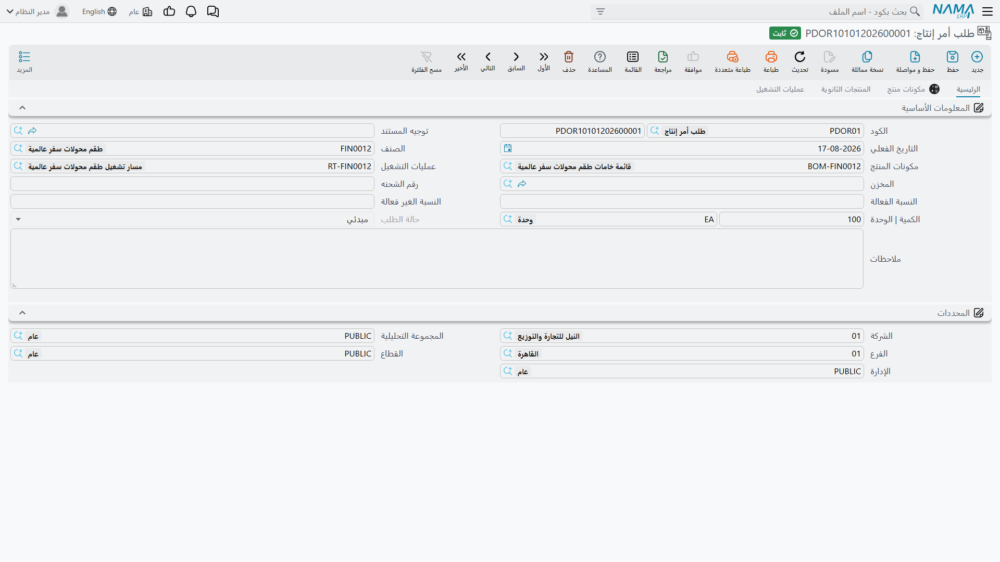

# طلبات أوامر الإنتاج: أن تطلب تصنيع شيء

## من يملك بدء العمل

في ورشة صغيرة، من يقرر ما يُصنع هو من يصنعه، ويكون [أمر الإنتاج](/ar/modules/manufacturing/production-orders) المحرَّر مباشرةً هو الحكاية كلها.

وأغلب المصانع ليست كذلك. فالمبيعات تريد مائة طقم محوّلات سفر لعميل التزم لتوّه. والمخزن يلاحظ صنفًا تامًا يوشك على النفاد. والتخطيط هو الإدارة التي تقرر أيصير أيٌّ من هذين عملًا أم لا، ومتى، وبأي كمية — لأنه الوحيد الذي يعرف بماذا التزم الخط بالفعل.

و**طلب أمر الإنتاج** هو تعبير عن هذا الفصل. فهو يتيح لأي أحد أن يطلب تصنيع شيء، دون أن يتيح للجميع أن يخلقوا عملًا للمصنع.

تجده في **التصنيع ← المستندات ← طلب أمر إنتاج**.

## الشاشة صغيرة عن قصد

قارن هذه الشاشة بشاشة أمر الإنتاج، فالفارق هو المقصود. الأمر له عشر خانات مرفقات، وتواريخ مخططة وفعلية، وإعادة توزيع للتكلفة، وقوائم فحص جودة، وتتبع لوطات. أما الطلب فبالكاد له اثنا عشر حقلًا.

وذلك لأن الطلب ليس أمر إنتاج مصغّرًا، بل هو *سؤال*. ماذا، وكم، ومتى. والإجابات التي تحوّله إلى عمل من حق التخطيط لا من حق الطالب.

**الكود** يحمل الدفتر (`PDOR01`) ورقم المستند. و**التوجيه** و**تاريخ القيمة** يعملان كما في أي مستند.

**الصنف** هو المطلوب — طقم محوّلات السفر العالمي في المثال.

**الكمية | الوحدة** كم منه: 100 وحدة.

**قائمة المكونات** و**مسار التشغيل** يسميان أي وصفة وأي طريقة ينبغي استخدامها. وكلاهما يأخذ قيمته الافتراضية من الصنف، وفي الحالة العادية تتركهما وشأنهما. وهما موجودان للحالة التي يعرف فيها الطالب ما لا يعرفه الافتراضي — كعميل حدّد النسخة المخفَّضة المواد مثلًا.

**المخزن** هو المكان الذي ينبغي أن تنتهي إليه الوحدات التامة. و**رقم اللوط** و**النسبة الفعالة** و**النسبة غير الفعالة** تحمل محددات الصنف حيث تنطبق. و**الوصف** هو موضع شرح الطالب لِـ*لماذا*، وهو أجدر الحقول بالملء — فالتخطيط على وشك اتخاذ قرار تقديري، والسياق هو ما يجعل ذلك القرار جيدًا.

أما قسم **المحددات** فيضع الطلب في الهيكل التنظيمي.

## حالة الطلب

**حالة الطلب** تعرض `مبدئي` في المثال، والحقل غير قابل للتحرير في الشاشة. وهذا مقصود: فالحالة تعكس ما جرى للطلب، وتتحرك بفعل معالجة الطلب لا بكتابة أحدهم فيها.

يبدأ الطلب مبدئيًا — مطلوبًا ولم يُتَصرَّف فيه بعد — ثم يتقدم مع إنشاء أوامر إنتاج عليه. وما تجنيه من ذلك إجابة مباشرة عن سؤال يصعب على نحو مفاجئ الإجابة عنه في مصنع مزدحم: *ما الذي طُلب ولم يبدأه أحد بعد؟* رشّح الشاشة بالحالة فيصير لديك رصيدك المتأخر.

::: tip قائمة الطلبات طابور تخطيط لا أرشيف
قيمة هذا المستند تكاد تكون كلها في شاشة القائمة لا في السجل المفرد. فطلبٌ قابع في الحالة المبدئية منذ ثلاثة أسابيع إشارة — إما أن المصنع محمَّل فوق طاقته، وإما أن أحدهم طلب شيئًا لا ينوي أحد صنعه. وكلاهما جدير بالمعرفة، ولا يظهر أيٌّ منهما إن كنت لا تفتح الطلبات إلا واحدًا واحدًا.
:::

## صفحات قائمة المكونات والمنتجات المصاحبة ومسارات التشغيل

تقف ثلاث صفحات إلى جوار **الرئيسية**، وهي تحاكي الصفحات نفسها في أمر الإنتاج:

- **قائمة المكونات** تعرض المكونات التي سيستهلكها الطلب، مفكَّكة من القائمة المذكورة.
- **المنتجات المصاحبة** تغطي المنتجات التي تخرج من الدفعة نفسها — النواتج المشتركة حيث يستلزم صنع شيء صنع آخر معه.
- **مسارات التشغيل** تعرض العمليات التي سيمر بها المنتج.

وهذه في الطلب للعلم لا للتنفيذ: فهي تتيح للطالب وللمخطط أن يريا ما يستلزمه الطلب فعلًا قبل أن يُلزم أحدٌ المصنعَ به. فطلبٌ بمائة وحدة يتبين أنه يحتاج مكوّنًا مهلة توريده ستة أسابيع، اكتشافه هنا خير كثيرًا من اكتشافه في صالة الإنتاج.

## من الطلب إلى الأمر

حين يقرر التخطيط المضيّ، يُنشَأ أمر إنتاج على الطلب. ويحمل الأمر في بياناته الأساسية حقل **طلب أمر الإنتاج** يشير إلى الوراء — فيعرف العمل ما الذي دفع إليه، ويعرف الطلب ما الذي آل إليه.

وهذا الربط ذو الاتجاهين هو ما يجعل تحرير الطلب ذا قيمة أصلًا. فبدونه يكون لديك عمل بلا سبب معلن وطلب بلا نتيجة مرئية؛ وبه تستطيع أن تمشي من طلب العميل إلى الوحدات التي لبّته، وأن تعود أدراجك حين يسأل أحدهم لماذا أنفق الخط أسبوعين على محوّلات السفر.
