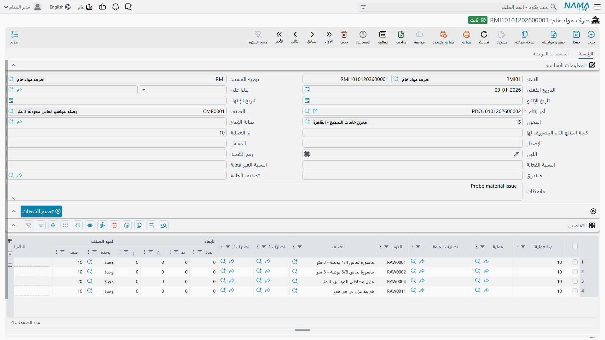
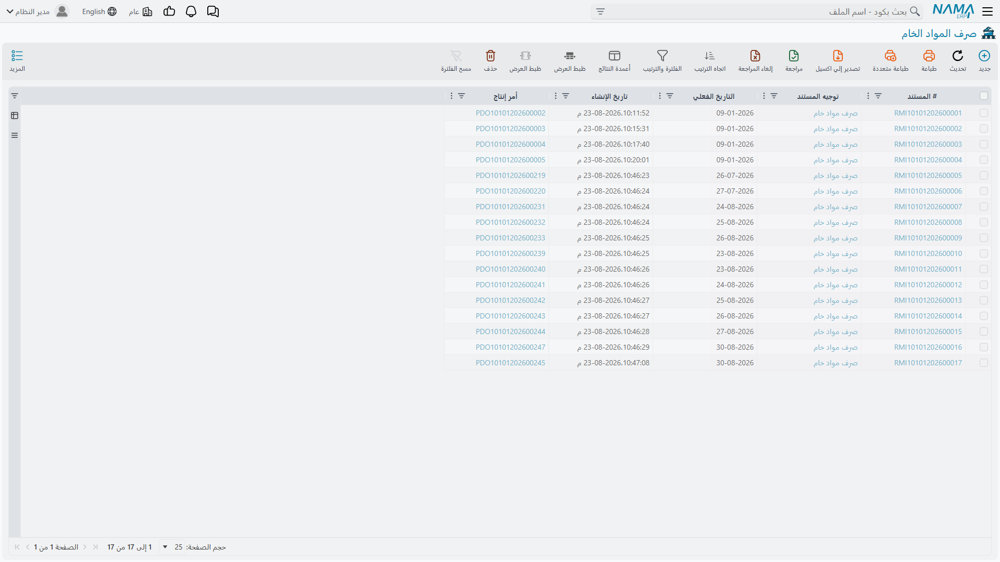
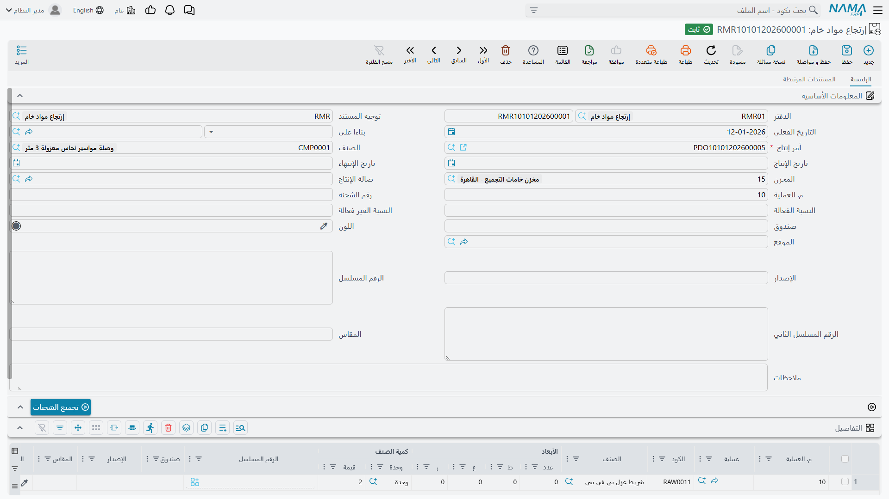

# صرف المواد الخام وإرتجاعها

## المستند الذي يحرّك المادة فعلًا

أمر الإنتاج يخطط لما سيستهلكه العمل، و[قائمة المكونات](/ar/modules/manufacturing/manufacturing-bom) تقول ما تطلبه الوصفة، ولا يُنزل أيٌّ منهما شيئًا عن الرف. أما المستند الذي يفعل ذلك — الذي يخفض الرصيد في المخزن، ويضع المادة في يد العمل، ويجعلها جزءًا من تكلفة المنتج — فهو **صرف المواد الخام**.

هذا هو حصان العمل في الوحدة، وهو الموضع الذي تكف عنده الخطة عن كونها خطة.

تجده في **التصنيع ← المستندات ← صرف مواد خام**.

وتعرض شاشة القائمة ما سُحب ومقابل أي أوامر.

## البيانات الأساسية

**الدفتر** و**التوجيه** هما دفتر المستند وتوجيهه — الإعدادات التي تقرر كيف يتصرف هذا النوع من المستندات وما أثره على المخزون وعلى الدفاتر. و**تاريخ القيمة** هو تاريخ سريان الحركة.

**أمر الإنتاج** هو الحقل الإلزامي الوحيد في الشاشة، وهو إلزامي لسبب. فصرف المواد الخام ليس سحبًا عامًا من المخزن، بل يوجد ليحمّل المادة *على عمل بعينه*. وبغير أمر لا تجد التكلفة موضعًا تحطّ فيه. وذكر الأمر هو ما يتيح للنظام أن يقترح المكونات الصحيحة، وأن يقابلها بالخطة، وأن يقارن في النهاية بين الاستهلاك المخطط والفعلي عند إغلاق الأمر.

**الصنف** يعرض المنتج التام الذي يصنعه الأمر — يُملأ من الأمر لا بالكتابة.

**المخزن** هو مصدر المادة. وفي المثال أعلاه هو مخزن خامات التجميع بالقاهرة. اضبطه في البيانات الأساسية فترثه كل الأسطر، وتجاوَزه في السطر الذي يقيم مكوّنه في مكان آخر.

**صالة الإنتاج** و**رقم العملية** ينسبان الصرف إلى مكان وخطوة. والمثال يحمل `10` — أي أن هذه المواد تدخل عند العملية الأولى. وملء هذا الحقل هو ما يجعل الإنتاج تحت التشغيل ذا معنى: فالمادة المستهلَكة عند الخطوة 10 تقف في موضع من العملية غير الذي تقف فيه المستهلَكة عند الخطوة 30.

**الصرف مقابل كمية المنتج التام** تسهيلة تستحق المعرفة. فبدلًا من حساب كميات المكونات بنفسك، أدخل عدد الوحدات التامة التي تصرف *من أجلها*، ودع النظام يضاعف قائمة المكونات. فالصرف من أجل عشر وصلات يملأ الأسطر بالمكونات التي تحتاجها عشر وحدات.

**تاريخ الإنتاج** و**تاريخ الانتهاء** يسريان حيث تحملهما المادة. و**تصنيف المادة** يجمّع الصرف لأغراض التقارير. و**رقم اللوط** و**المقاس** و**اللون** و**الصندوق** و**رقم المراجعة** وزوج **النسبة الفعالة / غير الفعالة** تحمل محددات الصنف حيث تستخدمها المكونات. و**الوصف** نص حر — «صرف خامات فحص» في المثال.

### تجميع اللوطات

زر **تجميع اللوطات** فوق الجدول يتولى الجزء الممل من الصرف المتتبَّع باللوطات. فبدلًا من تسمية أرقام اللوطات يدويًا لكل سطر، يجمع اللوطات المتاحة للمكونات ويوزّعها وفق القواعد السارية — الأقدم أولًا في المعتاد. وفي مخزن يحمل ستة لوطات من ماسورة النحاس نفسها، هذا هو الفرق بين مستند يستغرق ثلاثين ثانية وآخر يستغرق خمس دقائق.

## جدول التفاصيل

كل سطر مكوّن واحد يجري صرفه.

**رقم العملية** و**العملية** يضعان السطر في موضعه من العملية الإنتاجية، ويأخذان قيمتهما الافتراضية من البيانات الأساسية.

**الصنف** و**الكود** يعرّفان المكوّن، و**تصنيف المادة** و**التصنيف 1** و**التصنيف 2** تصنّفه.

**المقاييس** (**الكمية**، **الطول**، **العرض**، **الارتفاع**) و**كمية الصنف** (**الوحدة**، **القيمة**) تحمل المقدار. وأعمدة المقاييس الأربعة مهمة للمواد التي تُشترى بالأبعاد — الألواح والمواسير والكابلات — حيث يكون الطول والعرض هما الوصف الصادق، ولا يكون عدد القطع كذلك.

**المسلسل** يسري على المكونات المتتبَّعة بالأرقام المسلسلة.

::: tip دع الأمر يملأ الجدول
أسرع طريقة لتحرير الصرف هي أن تذكر أمر الإنتاج، وتضبط كمية المنتج التام، وتدع النظام يملأ الأسطر من قائمة المكونات — ثم تعدّل السطرين أو الثلاثة التي يختلف فيها الواقع. فكتابة كل سطر يدويًا ليست أبطأ فحسب، بل هي الطريق الذي تُترك به مكونات كان ينبغي استهلاكها خارج العمل في صمت.
:::

## إرتجاع المواد الخام

تخرج المادة إلى المصنع ويعود بعضها. تنتهي دفعة مبكرًا، أو يُلغى أمر، أو يُسحب أكثر مما احتاجه العمل. و**إرتجاع المواد الخام** يعيدها — إلى المخزون، وخارج تكلفة العمل.

تجده في **التصنيع ← المستندات ← إرتجاع مواد خام**.

الشاشة تحاكي شاشة الصرف عن قصد، حقلًا بحقل: **أمر الإنتاج** الإلزامي نفسه، وذات **المخزن** و**صالة الإنتاج** و**رقم العملية**، وزر **تجميع اللوطات** نفسه، والجدول نفسه. فمن يستطيع تحرير صرف يستطيع تحرير إرتجاع، وهذا هو المقصود من تشابههما.

ويظهر هنا حقلان لا تعرضهما شاشة الصرف: **الموقع**، للمخازن التي تتتبع الموضع داخل المخزن، و**المسلسل الثاني**، للمكونات التي تحمل رقمين مسلسلين.

::: warning الإرتجاع ليس تصحيحًا
إذا صرفت المادة الخطأ، فإن إرتجاعها وصرف الصحيحة يُبقي الحركتين في السجل — وهو غالبًا ما يريد المراجع أن يراه. لكن إن كنت قد صرفت *كمية* خاطئة على مستند حُرِّر قبل دقائق ولم يُعالَج شيء بعده، فتصحيح المستند الأصلي أنظف من تكديس إرتجاع فوقه. فقرّر أي حكاية ينبغي أن يرويها السجل قبل أن تمد يدك إلى الإرتجاع.
:::

## تغيير الخامة

في هذه العائلة مستند ثالث، لحالة يعالجها الآخران بعناء: أن يحتاج العمل إلى مادة *مختلفة* عن التي حددتها قائمة المكونات. فالماسورة المعتمدة نفدت، ونظيرتها من مورّد آخر تفي بالغرض. و**تغيير الخامة** يسجّل هذا الإحلال على الأمر، في **التصنيع ← المستندات ← تغيير خامة**.

يمكنك تحقيق الحركة نفسها بإرتجاع وصرف جديد، لكن ما ستفقده هو السبب. فمستند التغيير يقول *إن هذه المادة حلّت محل تلك في هذا العمل*، وهذا هو السجل الذي تريده حين يسأل أحدهم لاحقًا: لماذا خرجت تكلفة هذا المنتج في ذلك الشهر مختلفة عن كل شهر آخر؟

## ماذا يحدث بعد الحفظ

لا يتوقف الحفظ في انتظار حساب آثار المخزون والدفاتر. فالمستند يُخزَّن فورًا، وتُرفع آثاره طلبات أعمال تُعالَج في الخلفية — ولهذا يكون الحفظ فوريًا حتى في مستند طويل.

وفي المعتاد لن تفكر في هذا أصلًا. أما حين يقع خلل — فترة مقفلة، أو قاعدة مخزنية ترفض الحركة — فسيكون المستند محفوظًا وآثاره لم تكتمل، وموضع رؤية ذلك هو شاشة **طلبات الأعمال**. رشّح بحالة الفشل، وحدد الأسطر، واستخدم **المزيد ← إعادة المعالجة** بعد إصلاح المشكلة الأصلية.

## أين يقع هذا من الدورة

المواد المصروفة هنا أحد ثلاثة مسارات للتكلفة تلتقي عند [إغلاق الأمر](/ar/modules/manufacturing/production-costing). والمساران الآخران هما الموارد المستهلَكة — المسجَّلة على [سند موارد](/ar/modules/manufacturing/manufacturing-resource-voucher) أو المحمَّلة آليًا — والأعباء غير المباشرة.

وعند إغلاق الأمر يُقاس ما صُرف فعلًا في مقابل ما قالت قائمة المكونات إنه كان ينبغي صرفه. والفارق هو انحراف المواد، وهو أنفع رقم منفرد تنتجه الوحدة عن حقيقة ما جرى في العمل.
