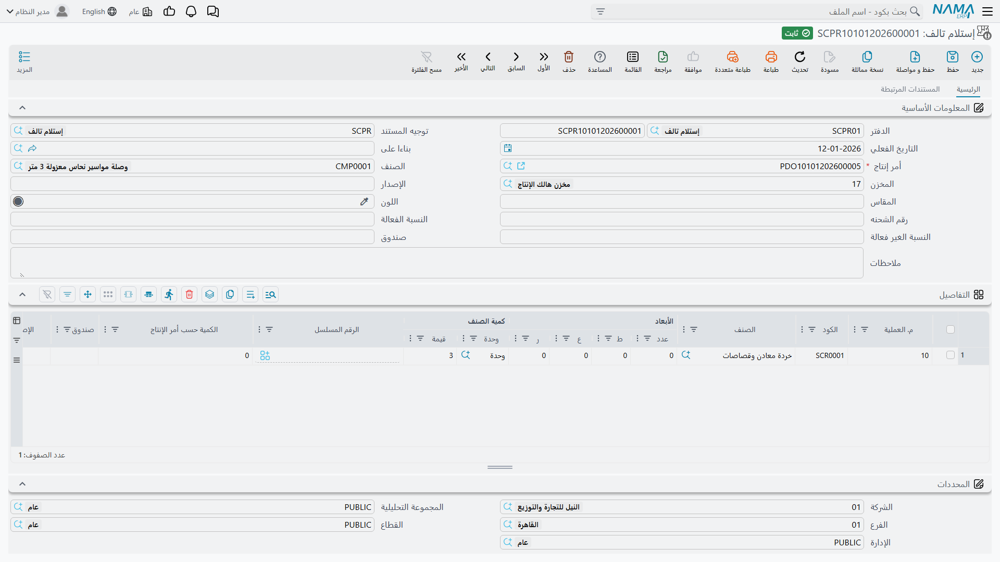

# إستلام التالف: إدخال المخلفات إلى المخزون

## لماذا التالف استلام لا خسارة

اقطع ماسورة نحاس طولها ثلاثة أمتار إلى الأطوال التي يحتاجها العمل، يتبقَّ لديك قصاصات. وأدِر قضيبًا من الصلب على المخرطة، تنتج كومة من البُرادة. لم يكن أيٌّ منها هو المقصود، لكن أيًّا منها ليس بلا قيمة أيضًا — فتاجر الخردة يدفع بالكيلو، والمصنع الذي يولّد طنًا من قصاصات المعادن شهريًا يجلس على مال حقيقي.

ولهذا يعامل النظام التالف بوصفه **استلامًا** لا إهلاكًا. فمستند **إستلام التالف** يأخذ المخلفات التي خرجت من أمر إنتاج ويدخلها *إلى* مخزن بوصفها صنفًا تملكه، ويمكن تقييمه وبيعه.

تجده في **التصنيع ← المستندات ← إستلام تالف**.

::: warning ناتج التالف ليس هو الإنتاج المعيب
شيئان مختلفان يُسمَّيان «تالفًا» في المصنع، ويُسجَّلان في موضعين مختلفين. **هذا المستند** لناتج التصنيع الثانوي — القصاصات والقُصاصات والبُرادة — أي المادة التي لم يكن مقدَّرًا لها أصلًا أن تكون المنتج. أما **الوحدات التي رسبت في الجودة** فأمر آخر: تُسجَّل معيبةً على [تنفيذ الإنتاج](/ar/modules/manufacturing/production-execution)، على العملية التي رسبت عندها، لأن السؤال المهم هناك هو: أي خطوة تنتج هذا الرسوب؟
:::

## البيانات الأساسية

**الدفتر** و**التوجيه** و**تاريخ القيمة** تعمل كما في أي مستند.

**أمر الإنتاج** إلزامي. فالتالف يخص العمل الذي أنتجه، وهذا الربط هو ما يتيح لك أن تسأل: أي المنتجات يولّد أكثر المخلفات؟ وكم يساوي المسترد من التالف في مقابل ما كلّفه العمل؟

**الصنف** يعرض المنتج التام الذي كان الأمر يصنعه، مأخوذًا من الأمر نفسه.

**المخزن** هو وجهة التالف، وينبغي عمومًا أن يكون مخزنًا مخصصًا لهذا الغرض — والمثال يُدخل إلى مخزن تالف الإنتاج. وحفظ التالف في مخزن خاص به بدلًا من خلطه بالمواد الخام هو ما يمنع أن يصرف أحدهم بُرادة معادن على عمل بالخطأ، وهو ما يجعل الرصيد الذي تخبر به تاجر الخردة رقمًا تقرؤه من النظام فعلًا.

**رقم اللوط** و**المقاس** و**اللون** و**الصندوق** و**رقم المراجعة** وزوج **النسبة الفعالة / غير الفعالة** تحمل محددات الصنف حيث يستخدمها صنف التالف. و**الوصف** نص حر.

أما قسم **المحددات** — **الشركة** و**الفرع** و**الإدارة** و**مجموعة التحليل** و**القطاع** — فيضع الاستلام في الهيكل التنظيمي لأغراض التقارير.

## جدول التفاصيل

كل سطر نوع واحد من التالف العائد.

**رقم العملية** هو الخطوة التي ولّدته. وهذا أنفع مما يبدو: فمعرفة أن أغلب مخلفاتك تظهر عند العملية 10 لا موزعة بالتساوي على المسار تشير مباشرة إلى خطوة القص باعتبارها موضع البحث عن خطة تعشيق أفضل.

**الكود** و**الصنف** يعرّفان صنف التالف — `SCR0001`، قصاصات وبُرادة معادن، في المثال. ولاحظ أن أصناف التالف أصناف عادية في ملف الأصناف، ولا بد من وجودها قبل أن تستطيع استلامها، وهي خطوة إعداد يغفل عنها الناس في أول استلام تالف لهم.

**المقاييس** (**الكمية**، **الطول**، **العرض**، **الارتفاع**) و**كمية الصنف** (**الوحدة**، **القيمة**) تحمل المقدار — 3 وحدات في المثال. وللتالف الذي يُباع بالوزن، الوحدة المعقولة هي التي يدفع بها التاجر، لا التي صُرفت بها المادة الأم.

**الكمية بناءً على أمر الإنتاج** تنسب التالف إلى كمية الأمر نفسه، وهو ما يحوّل رقمًا خامًا إلى معدل — فثلاثة كيلوجرامات قصاصة من أمر بعشر وحدات رقم تستطيع مقارنته بين الأعمال، بينما «ثلاثة كيلوجرامات» وحدها ليست كذلك.

**الرقم المسلسل** و**الصندوق** يسريان حيث يكون صنف التالف متتبَّعًا بهذه الطريقة.

## أثره على التكلفة

إستلام التالف يُدخل قيمة إلى المخزون، وهذه القيمة لا بد أن تأتي من مكان. وهي تأتي من أمر الإنتاج — وهي المعالجة الصحيحة، وتستحق أن تُقال صراحةً لأنها تفاجئ الناس: **استرداد التالف يخفض تكلفة الوحدات التي أنتجها الأمر.**

والمنطق سليم. فإذا استهلك عمل 100 كجم من الصلب وعاد منها 8 كجم بُرادةً قابلة للبيع، فإن الوحدات السليمة لم تستهلك حقًا قيمة 100 كجم من الصلب، بل استهلكت 100 كجم ناقصًا ما تساويه البُرادة. وتسجيل التالف هو ما يمنع ابتلاع هذا الاسترداد في تكلفة المنتج بصمت.

وهذه أيضًا هي الحجة على تحرير هذه المستندات فعلًا. فالمصنع الذي يتخطى إستلامات التالف لا يفقد تتبّع بند إيراد صغير فحسب، بل يبالغ منهجيًا في تكلفة كل ما يصنعه.
