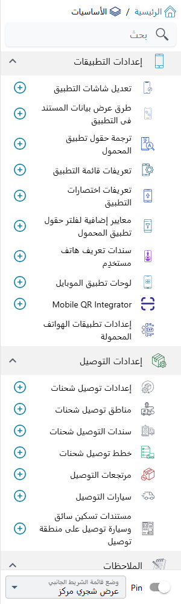
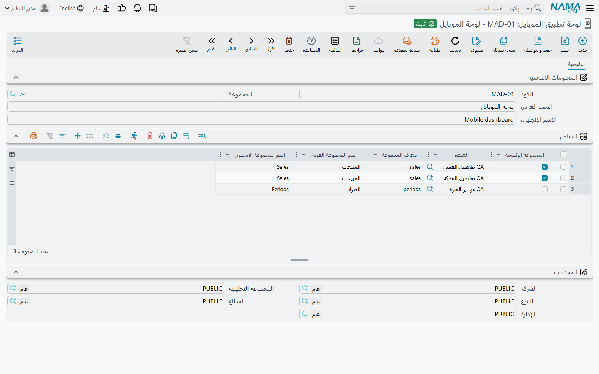

# إدارة تطبيق نما موبايل من النظام

لا يُضبط في تطبيق نما موبايل من الهاتف نفسه إلا عنوان الخادم والطابعة. أما أي الشاشات يراها المستخدم، وأي الحقول تظهر فيها، وماذا تقول بطاقة القائمة، وأي السجلات يعرضها حقل البحث، وأي هاتف مسموح له بالحفظ، وماذا ترسم لوحة المؤشرات — فكل ذلك يقرّره المسؤول من داخل النظام، تحت **الأساسيات ← إعدادات التطبيقات**. هذه الصفحة خريطة تلك القائمة: وظيفة كل شاشة، وأين شرحها، ومتى يصل التغيير فعلاً إلى الهاتف. وتشرح أيضاً الشاشة الوحيدة التي لا مكان آخر لها: **لوحة تطبيق الموبايل**.

## قائمة إعدادات التطبيقات شاشةً شاشة

| الشاشة (اسمها في القائمة) | بالإنجليزية | ماذا تحدد | الشرح في |
|---|---|---|---|
| **تعديل شاشة التطبيق** | Mobile App Screen Modifier | أي الحقول تظهر في شاشة المستند، وبأي ترتيب، وأيها إجباري | [تشكيل شاشات التطبيق](./mobile-screen-customisation.md) |
| **طريقة عرض بيانات المستند فى التطبيق** | Mobile Entity Title Modifier | سطور النص التي تظهر على كل بطاقة في القائمة أو في نتائج البحث | [تشكيل شاشات التطبيق](./mobile-screen-customisation.md) |
| **ترجمة حقول تطبيق المحمول** | Mobile App Translation Override | صياغتك الخاصة لأي عنوان يظهر في التطبيق | [تشكيل شاشات التطبيق](./mobile-screen-customisation.md) |
| **معايير إضافية لفلتر حقول تطبيق المحمول** | Mobile App Fields Extra Filter | أي السجلات يعرضها حقل البحث في التطبيق | [تشكيل شاشات التطبيق](./mobile-screen-customisation.md) |
| **تعريف قائمة التطبيق** | Mobile App Menu Definition | المجموعات والشاشات في تبويبي القائمة والمزيد | [نظرة عامة والتنقل والإعدادات](./mobile-application-guide.md) |
| **تعريف اختصارات التطبيق** | Mobile App Shortcut | بطاقات الاختصار التي يمكن أن تحل محل الصفحة الرئيسية | [نظرة عامة والتنقل والإعدادات](./mobile-application-guide.md) |
| **سند تعريف هاتف مستخدِم** | User Mobile Identifier Document | من أي هاتف يُسمح لكل مستخدم بحفظ المستندات | [ربط المستخدمين بهواتفهم](./mobile-device-binding.md) |
| **لوحة تطبيق الموبايل** | Mobile Application Dashboard | الرسوم البيانية في شاشة اللوحة بالتطبيق | في هذه الصفحة، أدناه |
| **Mobile QR Integrator** | Mobile QR Integrator | ما يحدث عندما يمسح التطبيق رمز QR | [Mobile QR Integrator](./mobile-qr-integrator.md) |
| إعدادات وحدة تطبيقات الجوال (آخر بند في القائمة) | — | الدفاتر وقوالب الطباعة والحفظ كمسودة وقواعد الحضور وبقية سلوك التطبيق | [نظرة عامة والتنقل والإعدادات](./mobile-application-guide.md) |

كل هذه الشاشات تأتي مع الترخيص الأساسي، عدا **لوحة تطبيق الموبايل** التي تحتاج الترخيص `basic-mobile-ess`.

## متى يصل التغيير إلى الهاتف

لا يسأل التطبيق الخادم عن إعداداته كلما فتح شاشة. بل ينزّل إعدادات المستخدم عند **تسجيل الدخول**، ومرة أخرى عندما يضغط المستخدم **إعادة تحميل بيانات التطبيق** في شاشة الإعدادات بالتطبيق، ثم يعمل من تلك النسخة. لذلك بعد أن تغيّر تعديل شاشة أو ترجمة حقول أو تعريف قائمة أو اختصاراً، لا يرى المستخدم التغيير إلا بعد إعادة تسجيل الدخول أو إعادة تحميل البيانات. وأنت تجرّب تغييراً، أعد التحميل على هاتف التجربة قبل أن تحكم بأنه لم يعمل.

ثلاثة أشياء تختلف، لأن الخادم يطبّقها لحظة طلب التطبيق للبيانات:

- **طريقة عرض بيانات المستند فى التطبيق** — يكتب الخادم عناوين البطاقات في كل قائمة يرسلها، فتظهر العناوين الجديدة في المرة التالية التي يفتح فيها المستخدم القائمة أو يحدّثها.
- **معايير إضافية لفلتر حقول تطبيق المحمول** — يضيف الخادم الفلتر إلى البحث في كل مرة يفتح فيها المستخدم حقل بحث، فيسري المعيار المعدَّل من البحث التالي مباشرة.
- **سند تعريف هاتف مستخدِم** — حيث يكون فحص الهاتف مفعّلاً، يفحصه الخادم عند كل حفظ، فقبول هاتف أو رفضه يسري من الحفظ التالي على ذلك الهاتف.

::: tip سجل واحد لكل شاشة
في تعديل شاشة التطبيق وفي طريقة عرض بيانات المستند، احتفظ بسجل نشط واحد (أو سطر واحد) لكل شاشة في التطبيق. فإذا انطبق سجلان نشطان على الشاشة نفسها استُخدم أحدهما فقط، ولا يمكنك الاعتماد على أيهما. اترك **غير نشط** فارغاً في السجل الذي تريده، وعلّمه في الباقي.
:::

## لوحة تطبيق الموبايل

شاشة **اللوحة** في التطبيق ترسم رسوماً بيانية. أي الرسوم يحدده سجل من **لوحة تطبيق الموبايل**، وأي سجل يحصل عليه المستخدم يُحدَّد في **سجل المستخدم نفسه**، في حقل **لوحة تطبيق الموبايل**. والمستخدم الذي ليس في سجله لوحة يرى شاشة لوحة فارغة.

الرسوم نفسها لا تُبنى هنا. كل رسم هو **عنصر اللوحة** (إدارة النظام ← لوحات ← عنصر اللوحة) — العناصر نفسها التي تستخدمها لوحات النظام، راجع [دليل وحدة ذكاء الأعمال](/ar/platform/bi/bi-module-guide.md). أما سجل لوحة التطبيق فيختار العناصر ويرتّبها في مجموعات، سطراً لكل رسم في جدول **العناصر**:

| العمود | وظيفته |
|---|---|
| **العنصر** | عنصر اللوحة الذي يُرسم. |
| **معرف المجموعة** | كود قصير. الأسطر التي تحمل المعرف نفسه تُعرض معاً كمجموعة واحدة. إجباري. |
| **إسم المجموعة العربي** / **إسم المجموعة الإنجليزي** | عنوان المجموعة. املأ أحدهما ويُنسخ إلى الآخر عند الحفظ. |
| **المجموعه الرئيسيه** | تحدد المجموعة التي تفتح عليها اللوحة. علّمها على أسطر مجموعة واحدة فقط. |

لا يستطيع التطبيق رسم إلا بعض أنواع العناصر: **PieChart** و**3D Pie Chart** و**جدول** و**ColumnWithRotatedLabels** و**Column With Categories And Labels** و**HTML**. والعنصر من أي نوع آخر يُرفض عند حفظ اللوحة.

العنصر الذي لا يملك المستخدم صلاحية عرضه يُتخطّى بصمت، وتُرسم بقية اللوحة. فإذا افتقد مستخدم رسماً يراه زميله، فابدأ بفحص صلاحية العرض لذلك المستخدم على العنصر.

### رسائل قد تظهر لك

| الرسالة | السبب | ماذا تفعل |
|---|---|---|
| «نوع العنصر {0} غير مدعم» | عنصر في أحد الأسطر من نوع لا يستطيع التطبيق رسمه. | اختر عنصراً من أحد الأنواع الستة المدعومة، أو غيّر نوع العنصر. |
| «مجموعة واحدة فقط يمكن ان تكون المجموعة الرئيسية» | **المجموعه الرئيسيه** معلَّمة على أسطر تتبع مجموعتين مختلفتين. | أزل العلامة من كل الأسطر إلا أسطر المجموعة التي يجب أن تفتح عليها اللوحة. |
