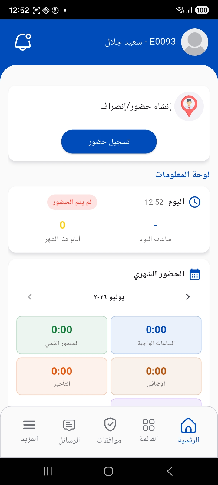
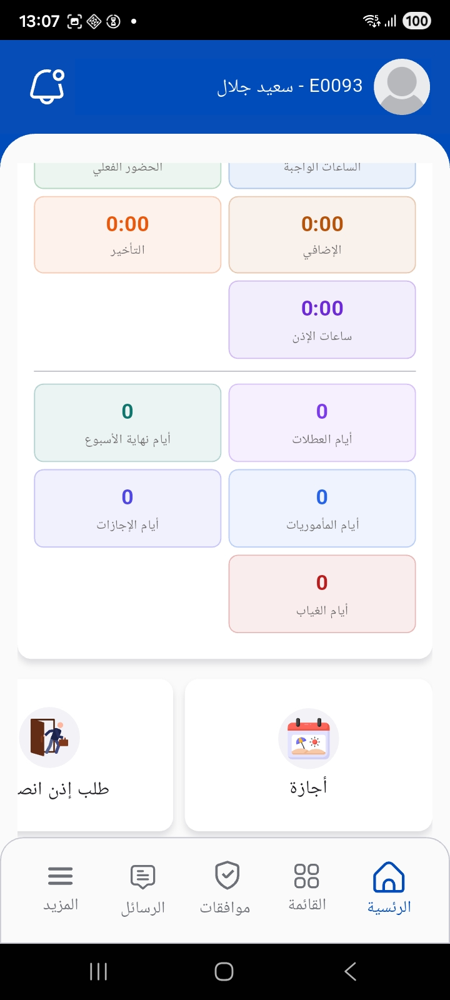
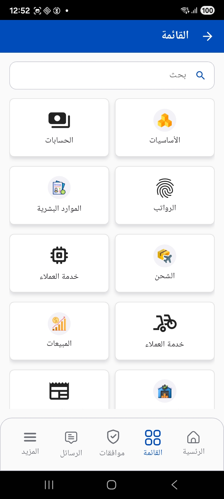
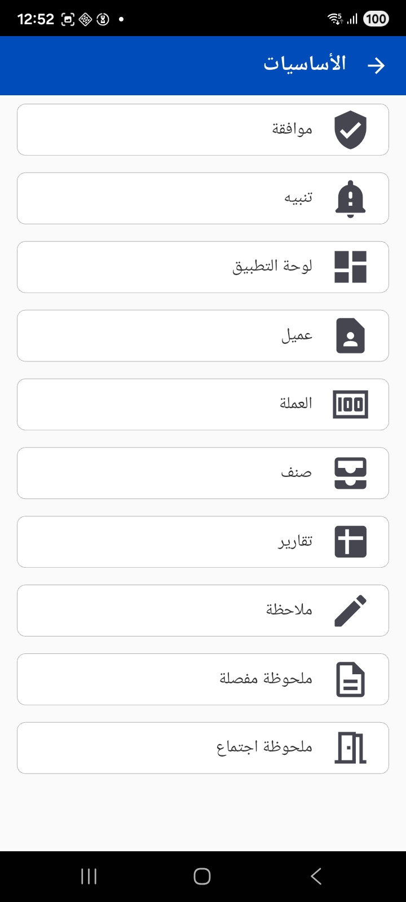

# تطبيق نما للهواتف المحمولة — نظرة عامة والتنقل والإعدادات

تطبيق **نما موبايل** (Nama Mobile) هو الواجهة المحمولة لنظام Nama ERP. يضع التطبيق بين يدي الموظف والمندوب وأمين المخزن وفني الصيانة طرفاً متنقلاً يتصل بنفس خادم الـ ERP الذي يعمل عليه فريق المكتب، فيسجّل الحضور، ويصدر الفواتير، ويجرد المخازن، ويتابع زيارات العملاء — كل ذلك من الهاتف.

::: tip فكرة عامة قبل أن نبدأ
يعمل التطبيق بأسلوب **«يعمل دون اتصال أولاً» (Offline-first)**: عند تسجيل الدخول يحمّل التطبيق نسخة من البيانات التي يحتاجها (العملاء، الأصناف، العملات، أنواع الإجازات… حسب الوحدات المرخّصة) ويخزّنها محلياً على الجهاز، ثم يزامن المستندات مع الخادم عند توفر الاتصال. هذا يعني أن المندوب يستطيع متابعة عمله في الميدان حتى مع ضعف الشبكة.
:::

يدعم التطبيق العربية والإنجليزية، ويمكن تشغيله بعلامات تجارية مختلفة (White Labeling) لعملاء نما المختلفين — مثل **NAMASOFT** و**SoftVision** و**Exceed** و**Capital** و**Cleopatra** — حيث يحمل كل إصدار اسمه وأيقونته الخاصة لكنه يشترك في نفس المزايا الموضّحة في هذا الدليل.

## ماذا يغطّي هذا الدليل

قسّمنا توثيق التطبيق إلى صفحات حسب طبيعة العمل:

- **هذه الصفحة** — تسجيل الدخول، الشاشة الرئيسية، التنقل بين الوحدات، والإعدادات (اللغة، الطابعة، المزامنة).
- [الخدمة الذاتية للموظفين — الحضور والإجازات](./mobile-hr-self-service.md) — الحضور الإلكتروني، الإجازات، الأذونات، المأموريات، السلف ومستندات الموارد البشرية.
- [المبيعات والمخازن والاستعلام عن الأصناف](./mobile-sales-inventory.md) — مستندات البيع، التحويلات المخزنية، الجرد الإلكتروني، والاستعلام عن الأصناف.
- [خدمة العملاء والتوصيل والقبض](./mobile-crm-delivery.md) — زيارات العملاء، الصيانة، الاستبيانات، سندات التوصيل، والقبض الإلكتروني.
- [دليل Mobile QR Integrator](./mobile-qr-integrator.md) — الاستجابة لرموز QR الممسوحة وإنشاء/تحديث الكيانات.
- [أسئلة شائعة](./mobile-apps-faq.md).

## تسجيل الدخول والاتصال بالخادم

عند فتح التطبيق لأول مرة تظهر شاشة الدخول، وتحتاج إلى:

- **عنوان الخادم (URL)** — رابط خادم الـ ERP الخاص بمؤسستك. يمكنك إدخاله يدوياً، أو **مسح رمز QR** يحتوي على الرابط لتوفير العناء.
- **اسم المستخدم وكلمة المرور** — نفس بيانات دخول المستخدم في نظام نما.

::: details خيارات متقدمة في شاشة الدخول
- **مصادقة NTLM/HTTP**: لبعض البيئات التي تستخدم مصادقة ويندوز، يمكن تفعيل خيار إدخال بيانات اعتماد NTLM منفصلة.
- **تخطّي التحقق من شهادة SSL**: يُستخدم في بيئات التطوير أو الخوادم ذات الشهادات الذاتية فقط.
:::

بعد نجاح الدخول يجلب التطبيق **إعدادات المستخدم والوحدات المرخّصة** من الخادم، ويبني القوائم والاختصارات بناءً عليها — لذلك يختلف ما يراه كل مستخدم حسب صلاحياته والوحدات المفعّلة لمؤسسته.

### الدخول بالبصمة (Biometric)

يمكن للتطبيق أن يطلب **بصمة الإصبع أو الوجه** عند كل فتح كطبقة حماية إضافية. يتحكم في هذه الخاصية إعداد على مستوى الخادم، ويمكن **تعطيل الدخول بالبصمة** أو جعله إجبارياً من إعدادات تطبيقات الجوال (انظر القسم الأخير من هذه الصفحة).

## الشاشة الرئيسية

الشاشة الرئيسية هي نقطة انطلاق الموظف اليومية. في أعلاها يظهر اسم المستخدم ورقمه الوظيفي وجرس الإشعارات، ثم تأتي البطاقات:

- **بطاقة تسجيل الحضور** — زر سريع لـ«تسجيل حضور / إنصراف» دون الدخول إلى قائمة الرواتب.
- **لوحة المعلومات** — ملخص يوم العمل الحالي (ساعات اليوم، هل تم الحضور أم لا، عدد أيام الحضور هذا الشهر).
- **الحضور الشهري** — بطاقات ملوّنة تلخّص الشهر: الحضور الفعلي، الساعات الواجبة، التأخير، الوقت الإضافي، ساعات الإذن، وأيام العطلات والإجازات والمأموريات والغياب.

أسفل الملخص توجد **اختصارات سريعة** لأكثر الإجراءات تكراراً مثل طلب الإجازة وطلب الإذن. ويستطيع المسؤول استبدال هذه الصفحة كلها بشبكة بطاقات اختصارات من اختياره — انظر قسم «تخصيص الشاشة الرئيسية والقائمة» أدناه.

### شريط التنقل السفلي

يحتوي أسفل الشاشة على خمسة تبويبات ثابتة، عددها وترتيبها واحد لكل المستخدمين؛ أما ما يستطيع المسؤول تغييره فهو محتوى تبويبات **الرئيسية** و**القائمة** و**المزيد**.

| التبويب | الوظيفة |
|---------|---------|
| **الرئيسية** | الشاشة الرئيسية ولوحة الحضور |
| **القائمة** | كل الوحدات والمستندات المتاحة للمستخدم |
| **موافقات** | المستندات المنتظرة لاعتماد المستخدم (مع عدّاد) |
| **الرسائل** | المحادثات والدردشة الداخلية (مع عدّاد غير المقروء) |
| **المزيد** | الإعدادات والأدوات المساعدة |

## القائمة ومجموعات الوحدات

تبويب **القائمة** يعرض الوحدات المرخّصة على شكل بطاقات مجمّعة، مع مربع بحث للوصول السريع لأي شاشة.

تتغيّر المجموعات الظاهرة حسب ترخيص مؤسستك وصلاحياتك؛ ومن أمثلتها: الحسابات، الأساسيات، الموارد البشرية، الرواتب، خدمة العملاء، الشحن، المبيعات، وإدارة المخازن. وعند فتح أي مجموعة تظهر شاشاتها التفصيلية:

مجموعة **الأساسيات** مثلاً تجمع الشاشات المشتركة: الموافقات، التنبيهات، لوحة التطبيق (Dashboard)، بيانات العميل والعملة والصنف، التقارير، إضافة إلى أنواع الملاحظات (ملاحظة، ملحوظة مفصلة، ملحوظة اجتماع).

::: info ترتيب القوائم قابل للتخصيص
يستطيع المسؤول إعادة تعريف هيكل القوائم والمجموعات بالكامل من جهة الخادم (انظر قسم «تخصيص الشاشة الرئيسية والقائمة» أدناه)، لذلك قد يختلف الترتيب لديك عمّا في الصور.
:::

## الموافقات والإشعارات والرسائل

- **الموافقات**: قائمة المستندات التي تنتظر اعتمادك (إجازات، أذونات، طلبات…)، يمكن مراجعة ملخص كل مستند واعتماده أو رفضه من الجهاز مباشرة.
- **الإشعارات** (جرس أعلى الشاشة): قائمة بالتنبيهات الواردة من النظام، مع إمكانية فتح المستند المرتبط بالتنبيه مباشرة، وتحديد الكل كمقروء أو حذفها.
- **الرسائل**: دردشة داخلية بين مستخدمي النظام تدعم الرسائل النصية والصور والفيديو والرسائل الصوتية، وتعمل لحظياً عبر اتصال دائم بالخادم.

## المزيد والإعدادات

تبويب **المزيد** يضم الإعدادات والأدوات المساعدة:

- **الإعدادات** — وقد يحميها رمز PIN خاص بالمسؤول إذا فعّلت المؤسسة ذلك.
- **إنشاء مستند معرّف الجهاز (Device ID)** — لتسجيل بصمة الجهاز عند ربطه بالنظام.
- **عناصر إضافية** يحددها المسؤول من جهة الخادم.

### شاشة الإعدادات

تنقسم الإعدادات إلى عدة تبويبات:

**الإعدادات العامة**
- **اللغة**: العربية أو الإنجليزية.
- **عنوان الخادم (URL)** والبريد الإلكتروني وكود الجهاز.

**إعدادات الطابعة** — يدعم التطبيق طيفاً واسعاً من الطابعات الحرارية ومنها طابعات Bluetooth وطابعات **Sunmi** وC75 وغيرها. يمكن ضبط:
- نوع الطابعة، وعرض الورق (مم أو بكسل) وارتفاعه.
- حجم الورق (80/72/58 مم) وأمر الطباعة (ESC/TSC/CPCL) حسب نوع الطابعة.
- زمن الانتظار قبل الطباعة.

**إعدادات أخرى**
- **حفظ سجلات الخادم**: لتفعيل تسجيل نداءات الخادم ومراجعتها لاحقاً عند تشخيص مشكلة.
- **جلب الشعار**: لتنزيل شعار الشركة المستخدم في طباعة المستندات.
- **إعادة تحميل بيانات التطبيق**: لإجبار التطبيق على مزامنة كل الإعدادات والبيانات من الخادم من جديد.

::: tip تغيير كلمة المرور ورمز الإدارة
من شاشة الملف الشخصي يمكن للمستخدم تغيير كلمة مروره، كما يمكن للمسؤول تغيير **رمز إعدادات المسؤول (Admin PIN)** الذي يحمي الوصول إلى شاشة الإعدادات.
:::

## تخصيص الشاشة الرئيسية والقائمة

افتراضياً يرى كل المستخدمين نفس الصفحة الرئيسية (بطاقة الحضور وملخص الشهر) ونفس القائمة المبنية على الوحدات المرخّصة للمؤسسة. لكن سائق التوصيل لا يحتاج لوحة الحضور، والمندوب يفضّل أن يبدأ مباشرة من أمر بيع جديد. لذلك يوفّر النظام شاشتين يعيد بهما المسؤول تشكيل ما يراه كل مستخدم دون أن يلمس الهواتف:

- **تعريف قائمة التطبيق** (Mobile App Menu Definition) — يحدد المجموعات والشاشات التي تظهر في تبويبي **القائمة** و**المزيد**، وشبكة الاختصارات التي تحل محل الصفحة الرئيسية.
- **تعريف اختصارات التطبيق** (Mobile App Shortcut) — مجموعة بطاقات اختصار (أيقونة وألوان والشاشة التي تفتحها كل بطاقة).

وتجدهما في **الأساسيات ← إعدادات التطبيقات**.

### أي تعريف قائمة يطبَّق على المستخدم

يختار التطبيق تعريف القائمة بهذا الترتيب:

1. **تعريف قائمة التطبيق** المحدد في سجل المستخدم نفسه، إن وُجد.
2. وإلا فتعريف القائمة المعلَّم عليه **القائمة الافتراضية للنظام**.
3. وإلا فالقائمة المدمجة في التطبيق.

فالإعداد المعتاد تعريف واحد معلَّم كافتراضي للجميع، مع تعريفات خاصة (للسائقين أو المندوبين مثلاً) تُحدَّد مباشرة في سجلات هؤلاء المستخدمين. ويظهر التغيير للمستخدم بعد إعادة تسجيل الدخول أو استخدام **إعادة تحميل بيانات التطبيق**.

### بناء تعريف القائمة

أسرع بداية هي زر **إنشاء قائمة افتراضية للتطبيق** في سجل جديد: يملأ الجدولين بالتخطيط القياسي — مجموعات الأساسيات والحسابات والرواتب والشحن وخدمة العملاء والمبيعات وإدارة المخازن وغيرها، كلٌّ بشاشاته المعتادة — ثم تحذف منها أو تعيد ترتيبها كما تريد.

يحتوي السجل على جدولين:

**المجموعات** — سطر لكل بطاقة في تبويب **القائمة**:

| العمود | الغرض |
|---|---|
| **الكود** | كود مختصر يُشار إليه من جدول الوصلات |
| **عنوان عربي** / **عنوان إنجليزي** | عنوان المجموعة بكل لغة |
| **اسم أيقونة المجموعة** | أيقونة البطاقة، تُختار من القائمة المقترحة |

**الوصلات المستهدفة** — سطر لكل شاشة:

| العمود | الغرض |
|---|---|
| **كود المجموعة** | المجموعة التي تتبعها الشاشة. اتركه فارغاً لتظهر الشاشة في تبويب **المزيد** بدلاً من تبويب **القائمة** |
| **Link Target** | شاشة التطبيق التي تُفتح (طلب إجازة، أمر بيع، زيارة عميل، الإعدادات، تسجيل الخروج…) |
| **لوحة التطبيق** | إلزامي عندما تكون الشاشة المستهدفة هي لوحة المعلومات: اللوحة التي تُعرض |
| **تعريف التقرير** | إلزامي عندما تكون الشاشة المستهدفة هي **التقارير**: التقرير الذي يُشغَّل |
| **اختصار التطبيق** | إلزامي عندما تكون الشاشة المستهدفة هي **اختصار**: مجموعة الاختصارات التي تُفتح |
| **العنوان بالعربية** / **العنوان بالإنجليزية** | عناوين اختيارية للسطر |
| **بديل الصفحة الرئيسية** | يجعل هذه الشاشة هي الصفحة الرئيسية للمستخدم — انظر أدناه |

وتبقى شاشات الوحدات غير المرخّصة لمؤسستك مخفية حتى لو أُدرجت هنا.

وفي رأس السجل خياران آخران:

- **إضافة إلى القائمة الافتراضية** — عند تفعيله **تُضاف** مجموعاتك إلى القائمة المدمجة، وتُضاف عناصر «المزيد» بعد العناصر المدمجة. وعند عدم تفعيله **يحل** تعريفك محل القائمة المدمجة وتبويب «المزيد» بالكامل، فلا تنسَ إدراج عناصر مثل الإعدادات وتسجيل الخروج.
- **اختصارات الصفحة الرئيسة** — انظر الفقرة التالية.

### استبدال الصفحة الرئيسية ببطاقات اختصار

لتكون الصفحة الرئيسية للمستخدم مجموعة بطاقات اختصار كبيرة، أنشئ أولاً سجل **تعريف اختصارات التطبيق**. كل سطر في جدوله بطاقة واحدة:

| العمود | الغرض |
|---|---|
| **اسم الوصلة** | الشاشة التي تفتحها البطاقة، ومنها يأتي عنوان البطاقة |
| **نوع الاختصار** | **شاشة التحرير** تفتح مستنداً جديداً فارغاً من هذا النوع، و**العرض بقائمة** تفتح قائمة السجلات الموجودة |
| **اسم أيقونة المجموعة** | أيقونة البطاقة، بنفس أسماء أيقونات مجموعات القائمة |
| **لون الايقونة** / **لون الخلفية** | ألوان البطاقة |

ثم اختر هذا السجل في حقل **اختصارات الصفحة الرئيسة** في تعريف القائمة. من تلك اللحظة يعرض تبويب **الرئيسية** لدى المستخدم شبكة البطاقات هذه فقط، ولا تظهر بطاقة الحضور ولا ملخص الشهر.

ويمكن أيضاً وضع مجموعة الاختصارات داخل القائمة بدلاً من الصفحة الرئيسية: أضف سطراً في **الوصلات المستهدفة** شاشته المستهدفة **اختصار**، واختر مجموعة الاختصارات في عمود **اختصار التطبيق**. وإذا تُرك كود المجموعة فارغاً تظهر بطاقة **اختصار** في تبويب **القائمة** تفتح شبكة البطاقات.

### فتح التطبيق على شاشة أخرى

فعّل **بديل الصفحة الرئيسية** في سطر واحد من **الوصلات المستهدفة** لتصبح تلك الشاشة هي الصفحة الرئيسية للمستخدم: كلما عاد التطبيق إلى الصفحة الرئيسية فتح هذه الشاشة بدلاً منها — مفيد مثلاً للسائق الذي يجب أن يبدأ دائماً من مهام التوصيل. لا يُسمح بهذا الخيار إلا في سطر واحد لكل تعريف، ولا يعمل إلا في سطر له **كود مجموعة**.

## المزامنة والعمل دون اتصال

عند تسجيل الدخول — أو عند استخدام **إعادة تحميل بيانات التطبيق** — يجلب التطبيق البيانات المرجعية ويخزّنها محلياً. المستندات التي تُنشأ في الميدان يمكن **حفظها كمسودة** على الجهاز ثم مزامنتها مع الخادم لاحقاً، حسب إعدادات المؤسسة. وعند تغيير الإعدادات على الخادم يمكن للتطبيق أن يُخطر بذلك لحظياً ويعيد تحميل الإعدادات تلقائياً.

## إعدادات الخادم التي تتحكم في سلوك التطبيق

معظم سلوك التطبيق يُضبط مركزياً من شاشة **إعدادات تطبيقات الجوال** في الـ ERP (إعدادات وحدة تطبيقات الجوال)، وليس من الهاتف. هذه الشاشة هي مرجع المسؤول لكل ما يخص التطبيق، ومنها على سبيل المثال:

- تحديد **الدفاتر** المسموح استخدامها لكل نوع مستند (الحضور، الإجازات، الأذونات، الجرد، القبض، التوصيل…).
- التحكم في **الدخول بالبصمة**، وإظهار/إخفاء حفظ المستندات كمسودة، وعدد المنازل العشرية للكميات.
- ضبط **المعايير** التي تحدد العملاء أو الأصناف المسموح بإرسالها للتطبيق.
- صياغة **قوالب طباعة** المستندات والإيصالات، والشروط والأحكام التي تظهر للعميل.
- قصر إنشاء بعض المستندات (الحضور، الإجازات، الجرد، القبض) على التطبيق فقط، أو السماح بتعديلها للمخوّلين فقط.

كذلك يحدد **ترخيص** مؤسستك أيّ وحدات تظهر أصلاً في التطبيق (الموارد البشرية، المبيعات، الصيانة، إدارة المخازن WMS، الجرد، التوصيل…)؛ فإذا لم تكن وحدة مرخّصة فلن تظهر شاشاتها في القائمة.

