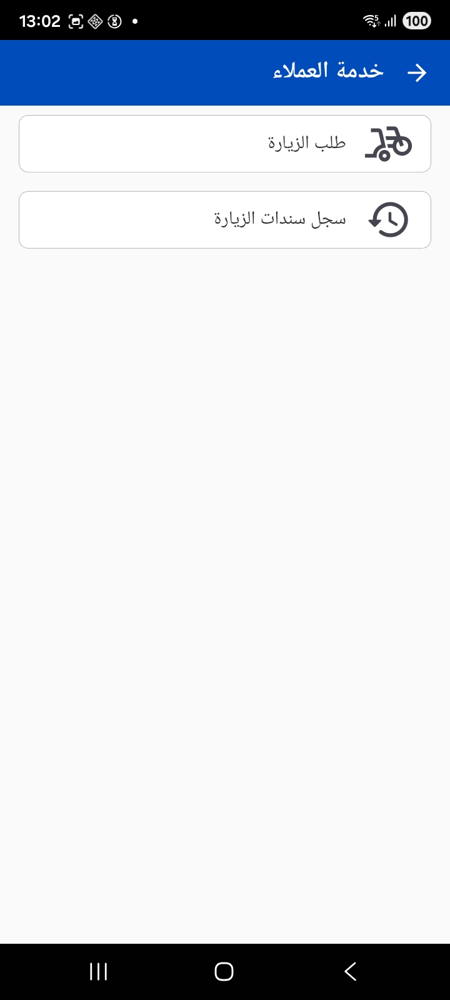
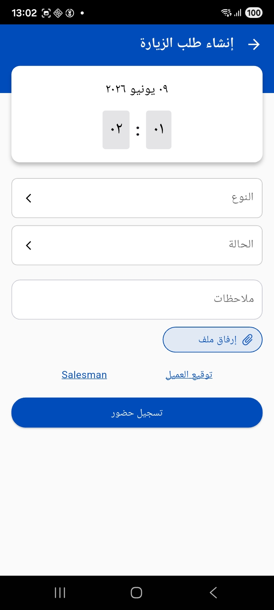
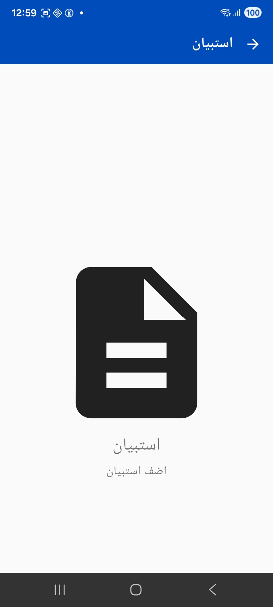
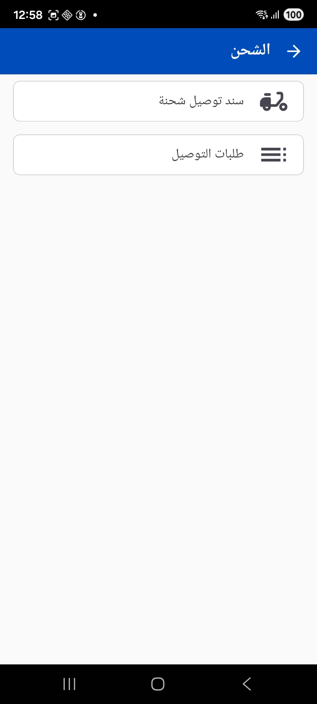
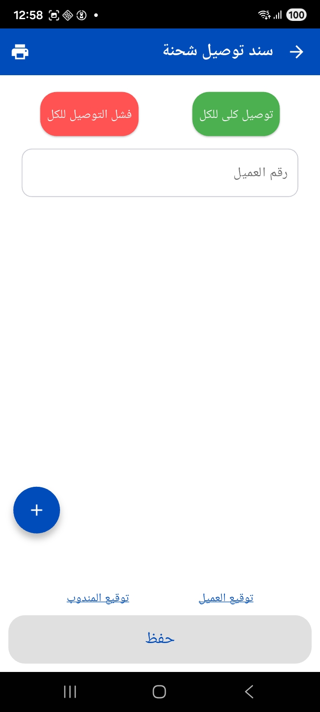
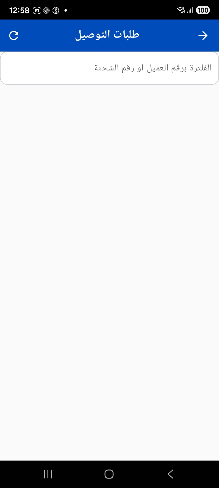
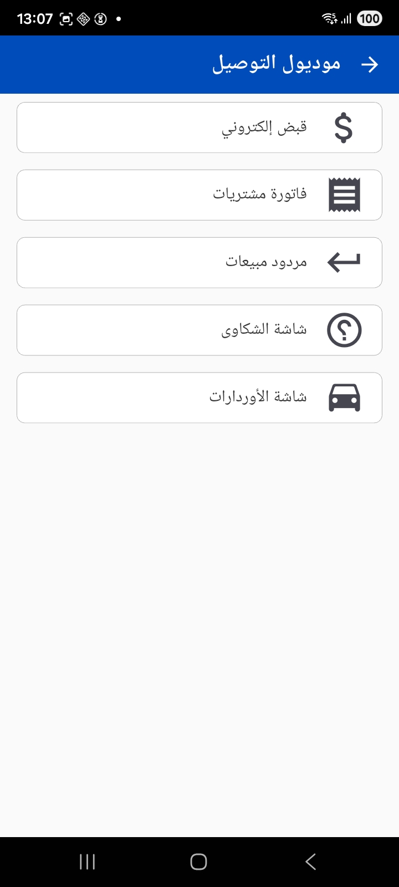
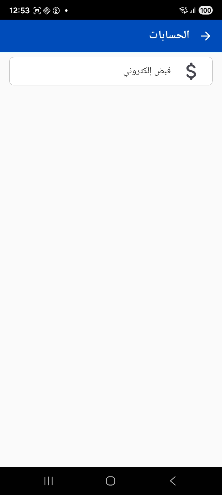

<rtl>

# خدمة العملاء والتوصيل والقبض

إلى جانب المبيعات والمخازن، يخدم التطبيق فرق الميدان الأخرى: مندوب خدمة العملاء الذي يسجّل زياراته، وفني الصيانة، وسائق التوصيل، والمحصّل الذي يصدر سندات القبض من عند العميل.

## زيارات العملاء

تظهر شاشات الزيارات تحت مجموعة **خدمة العملاء**:

عند **طلب الزيارة** يسجّل المندوب زيارته للعميل: يحدد **النوع** و**الحالة** ويضيف **ملاحظات**، ويمكنه **إرفاق ملف**، والتقاط **توقيع العميل** و**توقيع المندوب**، ثم **تسجيل حضور** الزيارة (Check-in) ولاحقاً انصرافها. ويلتقط التطبيق وقت وموقع الزيارة.

ومن **سجل سندات الزيارة** يتابع المندوب زياراته السابقة. ويمكن للمؤسسة منع فتح زيارة جديدة طالما توجد زيارة مفتوحة لم تُغلق بعد.

::: info الصيانة والاستبيانات
بالنسبة لفرق الصيانة، يتيح التطبيق متابعة **بلاغات وأوامر الصيانة**، وتسجيل **زيارات الصيانة** مع قطع الغيار المستخدمة وتواقيع العميل والفني. كما يدعم **الاستبيانات** لجمع آراء العملاء عبر قوالب أسئلة جاهزة مع التقاط التوقيع.
:::

### الاستبيانات

تتيح شاشة **الاستبيان** اختيار قالب استبيان وعميل، ثم تعبئة الأسئلة وجمع توقيع العميل والمندوب قبل الإرسال.

## التوصيل

تخدم وحدة التوصيل سائقي ومندوبي التوصيل، وتظهر شاشاتها تحت مجموعة **الشحن** أو **موديول التوصيل** حسب التهيئة:

- **سند توصيل شحنة** — يستعرض السائق فيه الأصناف المطلوب توصيلها، ويستطيع تأكيد **توصيل الكل** أو تسجيل **فشل التوصيل للكل**، أو معالجة كل عميل على حدة. ويلتقط **توقيع العميل** و**توقيع المندوب** كإثبات تسليم، مع إمكانية الطباعة.

  

- **طلبات التوصيل** — قائمة قابلة للفلترة برقم العميل أو رقم الشحنة لمتابعة الطلبات المسندة للسائق.

  

يجمع **موديول التوصيل** الأدوات التي يحتاجها مندوب التوصيل في مكان واحد — القبض الإلكتروني، فاتورة المشتريات، مردود المبيعات، شاشة الشكاوى، وشاشة الأوردارات:

::: tip أدوات السائق الميدانية
حسب التهيئة، يمكن للسائق فلترة مهامه حسب العميل أو المنطقة أو الفرع، ومشاركة تفاصيل الطلب عبر **واتساب**، والانتقال إلى موقع العميل على الخريطة، وإضافة ملاحظات صوتية.
:::

## القبض الإلكتروني

يصدر المحصّل **سند القبض الإلكتروني** من عند العميل مباشرة. تظهر الشاشة تحت مجموعة **الحسابات**:

في سند القبض يختار المحصّل العميل وتاريخ الدفع والعملة و**طريقة الدفع** (نقد، بنك…)، ويمكن أن يتضمن السند **أقساطاً** و**شروطاً وأحكاماً** يوافق عليها العميل. وبعد الحفظ يمكن **طباعة** الإيصال على الطابعة المهيّأة. وترتبط سندات القبض غالباً بمستندات المصدر مثل أمر البيع أو فاتورة المبيعات.

::: warning ربط الطريقة بالبنك
تُحمّل طرق الدفع والبنوك المتاحة في التطبيق من إعدادات الخادم؛ فإذا كانت طريقة الدفع بنكية وجب تحديد البنك المقابل.
:::

## ملاحظات للمسؤول

- تُضبط أنواع الزيارات وحالاتها، والحقول المرجعية المسموح بها، ومعايير العملاء/الأصناف من [إعدادات تطبيقات الجوال](./mobile-application-guide.md).
- تُحدّد دفاتر سندات القبض والتوصيل، وطرق الدفع والبنوك، وقوالب طباعة الإيصالات والشروط والأحكام من جهة الخادم.
- تظهر وحدات الزيارات والصيانة والتوصيل والقبض في القائمة فقط إذا كانت مرخّصة لمؤسستك.

</rtl>
