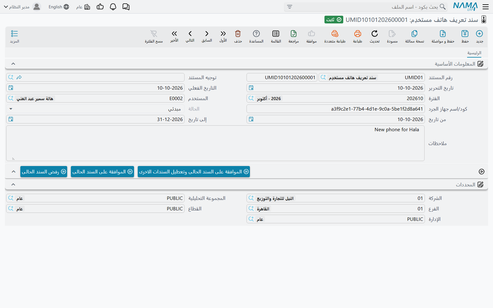

# ربط المستخدمين بهواتفهم

اسم المستخدم وكلمة المرور ينتقلان بسهولة. قد يسجّل موظف الدخول إلى نما موبايل من هاتف زميله ويسجّل له الحضور، أو يعطي مندوب بيانات دخوله لغيره في الميدان. وحين يجب أن يأتي الحضور وطلبات الإجازة والمستندات الميدانية من هاتف الموظف **نفسه**، يتيح لك النظام ربط كل مستخدم بالهواتف التي وافقت عليها. وبعد تفعيل الفحص، يُرفض المستند المحفوظ من أي هاتف آخر.

الربط مستند صغير اسمه **سند تعريف هاتف مستخدِم** (User Mobile Identifier Document): مستخدم واحد، وهاتف واحد، وحالة، وفترة تواريخ اختيارية. يطلبه المستخدم من الهاتف، ويقبله المسؤول أو يرفضه من النظام.

## كيف يعمل، من البداية إلى النهاية

1. **يحدد المسؤول أي المستندات تحتاج هاتفاً مقبولاً** (راجع «تفعيل الفحص» أدناه).
2. **يطلب المستخدم تسجيل هاتفه.** في التطبيق، في تبويب **المزيد**، يضغط المستخدم **طلب إنشاء سند معرف لهذا الجهاز**. يقرأ التطبيق معرّف الهاتف ويرسله، فيحفظ الخادم سند تعريف هاتف لذلك المستخدم بذلك المعرّف وبالحالة **مبدئي**.
3. **يراجع المسؤول الطلب** في النظام، تحت **الأساسيات ← إعدادات التطبيقات ← سند تعريف هاتف مستخدِم**، ويضغط أحد أزراره (راجع «قبول الهاتف أو رفضه» أدناه).
4. **من بعدها يُفحص كل حفظ.** عندما يحفظ المستخدم أحد المستندات الخاضعة للفحص، يبحث الخادم عن سند تعريف هاتف **مقبول** لذلك المستخدم نفسه ولذلك الهاتف نفسه، تشمل تواريخه اليوم. فإن لم يجده رُفض الحفظ.

## سند تعريف الهاتف

| الحقل | معناه |
|---|---|
| **المستخدم** | المستخدم صاحب الهاتف. يُملأ بالمستخدم الذي أرسل الطلب. |
| **كود/اسم جهاز الجرد** | معرّف الهاتف كما أرسله التطبيق. لا تعدّله: فالفحص يقارنه حرفاً بحرف بما يرسله الهاتف عند كل حفظ. |
| **الحالة** | **مبدئي** عند وصول الطلب، ثم **مقبول** أو **مرفوض** أو **لا يسمح بالتعديل** (Disabled) بحسب الزر المضغوط. والحالة **مقبول** وحدها تسمح للهاتف بالحفظ. |
| **من تاريخ** / **إلى تاريخ** | اختياريان. إذا مُلئا لا يُقبل الهاتف إلا بين هذين التاريخين. اتركهما فارغين لربط بلا نهاية. فالهاتف المؤقت لمشروع مدته أسبوعان يكفيه **إلى تاريخ** ليتوقف وحده. |

يُحدَّد الدفتر الذي يُحفظ فيه الطلب في إعدادات وحدة تطبيقات الجوال: إما حقل **دفتر سند تعريف هاتف مستخدم**، أو — وله الأولوية — سطر لنوع *سند تعريف هاتف مستخدِم* في جدول **إعدادات إنشاء مستندات وملفات من التطبيقات**.

## قبول الهاتف أو رفضه

في سند تعريف الهاتف ثلاثة أزرار:

| الزر | أثره |
|---|---|
| **الموافقة على السند الحالى وتعطيل السندات الاخرى** | يقبل هذا الهاتف ويجعل كل سندات تعريف الهاتف الأخرى لنفس المستخدم في الحالة **لا يسمح بالتعديل** (Disabled). استخدمه حين يغيّر المستخدم هاتفه: يتوقف الهاتف القديم فوراً. |
| **الموافقة على السند الحالى** | يقبل هذا الهاتف ويترك هواتف المستخدم الأخرى كما هي. استخدمه لمستخدم يعمل فعلاً من هاتفين. |
| **رفض السند الحالى** | يجعل الحالة **مرفوض**. ولا يستطيع الهاتف حفظ المستندات الخاضعة للفحص. |

تعمل الأزرار على سند محفوظ، ويحتاج من يضغطها صلاحية **التعديل بعد الحفظ** على سند تعريف هاتف مستخدِم. ولسحب هاتف لاحقاً، افتح سنده المقبول وارفضه، أو ضع له **إلى تاريخ**.

## تفعيل الفحص

الفحص معطّل حتى تفعّله، وتفعّله لكل نوع مستند على حدة، في إعدادات وحدة تطبيقات الجوال (آخر بند في قائمة **الأساسيات ← إعدادات التطبيقات**):

- في جدول **إعدادات إنشاء مستندات وملفات من التطبيقات**، علّم **التأكد من معرف الجهاز قبل الحفظ** على سطر كل نوع مستند يجب أن يأتي من هاتف مقبول — فاتورة مبيعات، أو سند قبض إلكتروني، أو نموذج، وهكذا.
- وللـ**حضور الإلكتروني** و**الإجازات** و**الأذونات** يوجد أيضاً مفتاح عام: **التأكد من معرف الجهاز قبل الحفظ** في مجموعة **إعدادات الحضور والإنصراف الإلكترونية** في صفحة **إعدادات تطبيق NAMA ESS**. ويسري كلما لم يكن في الجدول سطر لذلك المستند. أما إذا طابقه سطر في الجدول، فخانة السطر نفسه هي التي تقرر، معلَّمة كانت أم لا.

::: info لا يُفحص إلا الحفظ من التطبيق
الفحص يخص الهاتف الذي جاء منه المستند، لذا لا ينطبق إلا على المستندات المحفوظة من نما موبايل. والمستندات نفسها حين تُنشأ أو تُعدَّل من المتصفح لا تُفحص أبداً.
:::

## رسائل قد تظهر لك

| الرسالة | السبب | ماذا تفعل |
|---|---|---|
| «لا يوجد سند تعريف هاتف مقبول للمعرف {0} -والمستخدم {1}» | حفظ المستخدم مستنداً خاضعاً للفحص من هاتف ليس له سند تعريف **مقبول** لذلك المستخدم، أو أن تواريخ سنده لا تشمل اليوم. `{0}` معرّف الهاتف و`{1}` المستخدم. | ابحث في سندات تعريف الهاتف عن ذلك الكود. إن لم يوجد، اطلب من المستخدم إرسال الطلب من الهاتف. وإن كان **مبدئي** فاقبله. وإن كان **مرفوض** أو **لا يسمح بالتعديل** أو فات **إلى تاريخ** فقرر هل يُسمح للهاتف مجدداً. |
