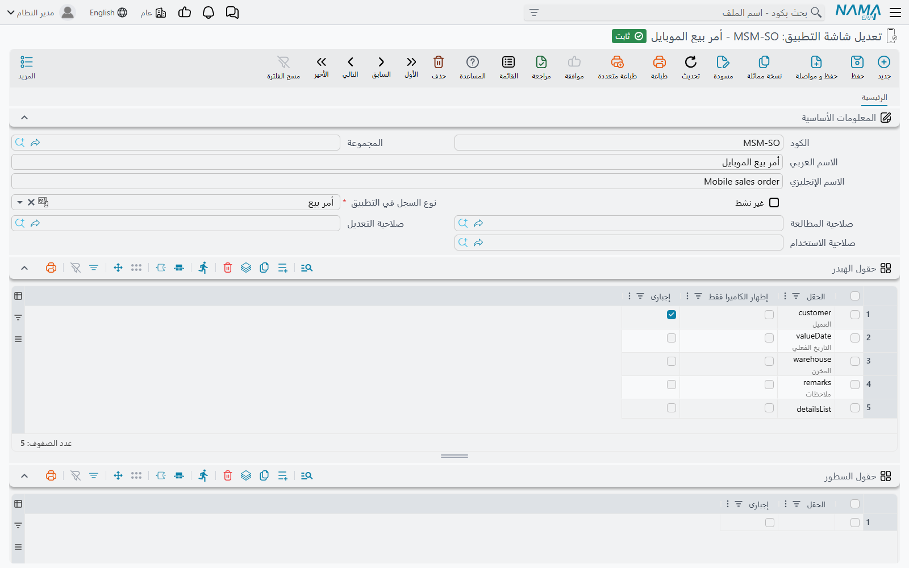
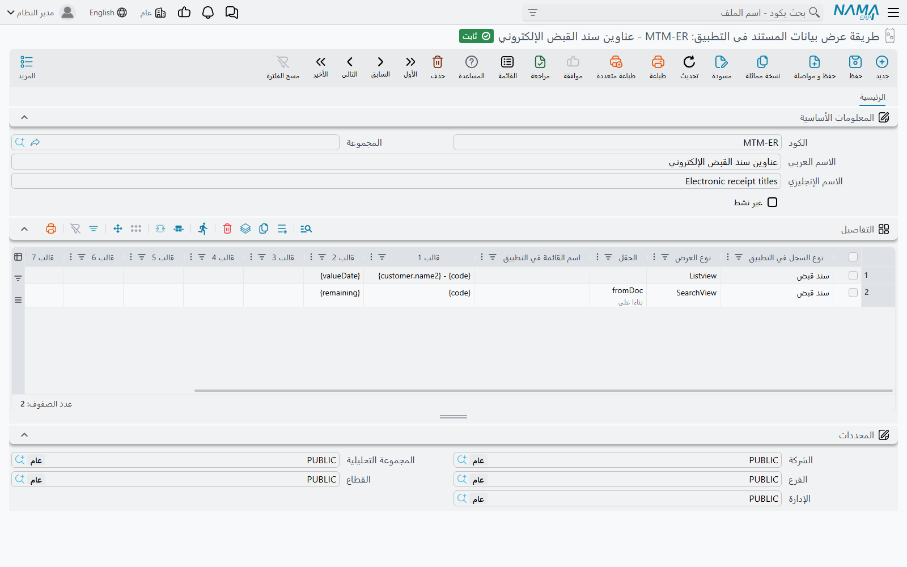
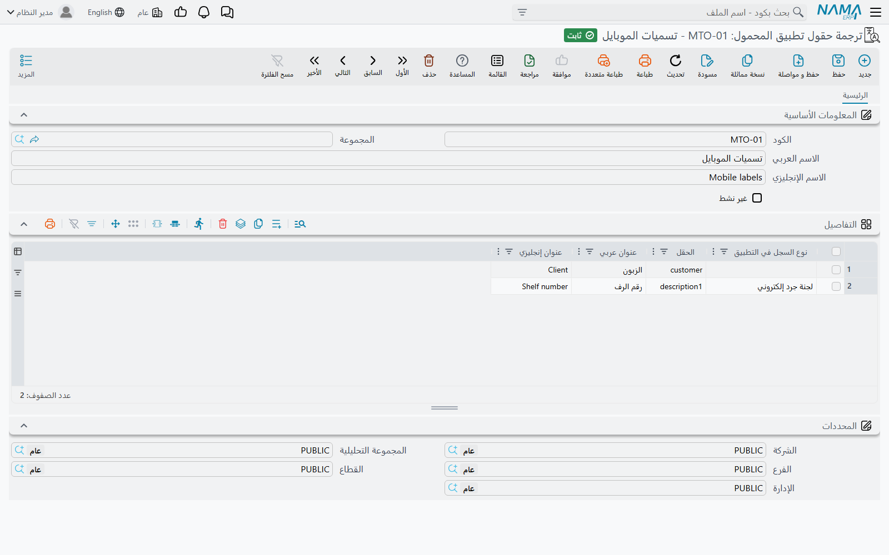
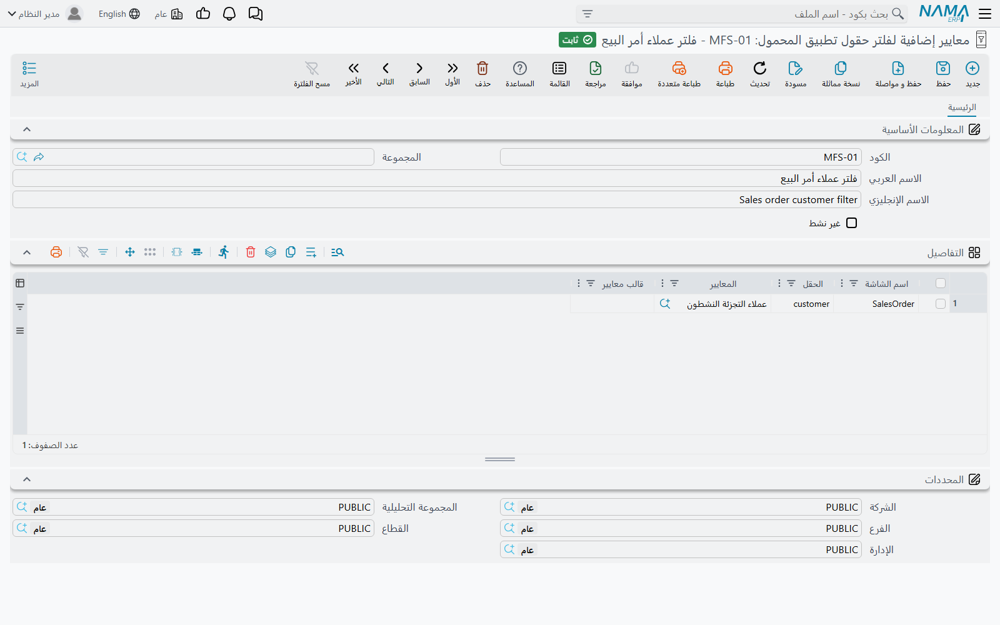

# تشكيل شاشات التطبيق: الحقول وعناوين البطاقات والتسميات وحقول البحث

كل شاشة في نما موبايل تأتي بشكل افتراضي معقول: أمر البيع يعرض العميل والمخزن والسطور، وطلب الإجازة يعرض نوع الإجازة والتواريخ والرصيد. لكن الشركات نادراً ما تريد ذلك بالضبط. موزّع يريد أن يرى مندوبوه ثلاثة حقول فقط وأن يُجبَروا على تصوير الرف؛ ومقاول يريد أن تُظهر قائمة النماذج اسم المشروع لا كوده؛ وفريق الموارد البشرية يسمّي الحقل «سبب الإجازة» لا «السبب». أربع شاشات تحت **الأساسيات ← إعدادات التطبيقات** تلبّي هذه الاحتياجات دون إصدار جديد من التطبيق:

| الشاشة | بالإنجليزية | ماذا تغيّر |
|---|---|---|
| **تعديل شاشة التطبيق** | Mobile App Screen Modifier | أي الحقول تظهر في شاشة المستند، وبأي ترتيب، وأيها إجباري |
| **طريقة عرض بيانات المستند فى التطبيق** | Mobile Entity Title Modifier | ما تقوله كل بطاقة في القائمة، أو في قائمة نتائج حقل البحث |
| **ترجمة حقول تطبيق المحمول** | Mobile App Translation Override | صياغة أي عنوان في التطبيق |
| **معايير إضافية لفلتر حقول تطبيق المحمول** | Mobile App Fields Extra Filter | أي السجلات يعرضها حقل البحث |

في الأربع خانة **غير نشط**: علّمها لإيقاف السجل دون حذفه. ولمعرفة متى يصل كل تغيير إلى الهاتف، راجع [إدارة تطبيق نما موبايل من النظام](./mobile-administration.md).

## اختيار حقول الشاشة — تعديل شاشة التطبيق (Mobile App Screen Modifier)

تعديل الشاشة يعيد كتابة شاشة واحدة من شاشات التطبيق. اختر الشاشة في **نوع السجل في التطبيق** — أمر بيع، إجازة، جرد إلكتروني، نموذج 1، وهكذا — ثم اسرد الحقول التي تريدها في الجداول أسفله.

**حقول الهيدر** هو الجدول الرئيسي. بمجرد أن يحتوي سطراً واحداً على الأقل، يتوقف التطبيق عن استخدام تصميمه المدمج لتلك الشاشة ويعرض **فقط** الحقول التي سردتها، **بالترتيب الذي سردتها به**. لكل سطر ثلاثة أعمدة:

| العمود | وظيفته |
|---|---|
| **الحقل** | الحقل الذي يُعرض. القائمة المنسدلة تقترح بالضبط الحقول التي يعرف التطبيق كيف يرسمها في تلك الشاشة. |
| **إجبارى** | يرفض التطبيق حفظ المستند حتى يملأ المستخدم هذا الحقل. |
| **إظهار الكاميرا فقط** | في حقل البحث: لا يملؤه المستخدم إلا بمسح رمز بالكاميرا؛ الكتابة والبحث معطّلان. مفيد حين يجب أن يمسح المندوب الصنف أو بطاقة العميل فعلياً. |

::: warning السطور حقل أيضاً
في شاشات المستندات تتضمن الاقتراحات `detailsList` — وهو الجزء الذي يحمل سطور المستند. وهو هنا حقل كغيره: إن بنيت قائمة حقول الهيدر وأغفلته، ظهرت الشاشة بلا سطور على الإطلاق. أضفه في الموضع الذي تريد أن تظهر فيه السطور.
:::

اترك **حقول الهيدر** فارغاً ويبقى الهيدر على تصميمه المدمج.

وتعمل الجداول الأخرى بالطريقة نفسها لسطور المستند، كلٌّ على حدة — يمكنك إعادة كتابة نموذج السطر مع إبقاء الهيدر المدمج، أو العكس:

| الجدول | ماذا يغيّر |
|---|---|
| **حقول السطور** | حقول النموذج الذي يملؤه المستخدم لسطر واحد، بالترتيب، مع خانة **إجبارى**. الفراغ يعني نموذج السطر المدمج. |
| **حقول جريد السطور** | الحقول المطبوعة على بطاقة كل سطر في قائمة السطور. ويحدد **طريقة إظهار المرجع** كيف تُطبع قيمة الحقل المرجع: **الكود فقط**، أو **الاسم العربي**، أو **الاسم الإنجليزي**، أو **الاسم حسب اللغة** (الاسم بلغة تشغيل التطبيق). الفراغ يعني البطاقة المدمجة. |
| **حقول السطور(2)** و**حقول جريد السطور(2)** و**حقول السطور(3)** و**حقول جريد السطور(3)** | الشيء نفسه لجدولي السطور الثاني والثالث. ولا يملكهما إلا النماذج (نموذج 1 إلى 4). |

الحقل الذي لا يعرفه التطبيق في تلك الشاشة يُتجاهل ولا يُرفض، فالحقل المكتوب يدوياً الذي لا يظهر على الهاتف هو غالباً حقل لا تستطيع الشاشة رسمه. اختر من الاقتراحات.

::: tip تصميم مختلف لكل فرع
لا يستخدم الخادم إلا تعديلات الشاشة التي يُسمح للمستخدم برؤيتها بحسب الشركة والفرع وبقية المحددات. فلإعطاء فرع تصميماً مختلفاً، ضع ذلك الفرع على تعديل شاشة خاص به. لكن لأي مستخدم بعينه، احتفظ بتعديل نشط واحد لكل شاشة: إذا انطبق اثنان استُخدم أحدهما فقط، ولا يمكن توقّع أيهما.
:::

## تغيير ما تقوله البطاقة — طريقة عرض بيانات المستند فى التطبيق (Mobile Entity Title Modifier)

في القائمة يطبع التطبيق على كل سجل بضع معلومات افتراضية يختارها لتلك الشاشة. وهذه الشاشة تستبدل تلك السطور بنص تكتبه أنت. كل سطر في جدول **التفاصيل** قاعدة واحدة:

| العمود | وظيفته |
|---|---|
| **نوع السجل في التطبيق** | شاشة التطبيق التي تعيد كتابة بطاقاتها — وفي **SearchView** الشاشة التي فيها حقل البحث. إجباري. |
| **نوع العرض** | **Listview** — قائمة السجلات الخاصة بالشاشة. **SearchView** — قائمة النتائج التي تُفتح عندما يبحث المستخدم في حقل مرجع. إجباري. |
| **الحقل** | في **SearchView** فقط: حقل البحث الذي تنطبق عليه القاعدة — مثلاً `fromDoc`، المستند الذي يُنشأ منه سند القبض الإلكتروني. ويجب أن يكون فارغاً في **Listview**. |
| **اسم القائمة في التطبيق** | لشاشة *سند التوصيل* في وضع **Listview** فقط، ولها قائمتان: **AssignDeliveryDocs** (التوصيلات التي تنتظر من يأخذها) و**PendingOrders** (التوصيلات المطلوب تنفيذها). اتركه فارغاً في غيرها. |
| **قالب 1** … **قالب 10** | نص البطاقة، قالب لكل سطر، مكتوب بلغة Tempo — مثلاً `{code} - {customer.name1}`. |

تُملأ القوالب على الخادم بقيم السجل نفسه، بلغة Tempo نفسها المستخدمة في بقية النظام — راجع [دليل لغة Tempo](/ar/admin/tempo.md). لذلك يمكن للبطاقة أن تُظهر أي حقل في السجل، بما فيها حقول السجلات التي يشير إليها، لا الحقول القليلة التي ينزّلها التطبيق فقط.

### رسائل قد تظهر لك

الرفضات الأربعة كلها من قاعدة واحدة — أي الأعمدة تصلح مع أي **نوع عرض**. ولا يوجد لها نص عربي في النظام، فتظهر بالإنجليزية على الشاشات العربية أيضاً.

| الرسالة | السبب | ماذا تفعل |
|---|---|---|
| *Field name is required when title type is search view in line {0}* | قاعدة **SearchView** بلا **حقل**. | حدّد حقل البحث الذي تعيد كتابة نتائجه. |
| *Field name must be empty when title type is list view in line {0}* | قاعدة **Listview** فيها **حقل**. | امسحه؛ القائمة ليس لها حقل. |
| *Mobile list view name must be empty when title type is search view in line {0}* | قاعدة **SearchView** فيها **اسم القائمة في التطبيق**. | امسحه. |
| *Mobile list view name must be empty when mobile entity type is not Delivery Document in line {0}* | **اسم القائمة في التطبيق** مملوء لشاشة غير سند التوصيل. | امسحه؛ سند التوصيل وحده له أكثر من قائمة. |

## صياغتك الخاصة لعناوين التطبيق — ترجمة حقول تطبيق المحمول (Mobile App Translation Override)

كل عنوان يظهر في التطبيق يأتي من قاموسه المدمج، بالعربية والإنجليزية. وهذه الشاشة تستبدل مداخل في ذلك القاموس للجميع. كل سطر في جدول **التفاصيل** يستبدل مدخلاً واحداً:

| العمود | وظيفته |
|---|---|
| **نوع السجل في التطبيق** | اختياري. اتركه فارغاً لتغيير العنوان في كل التطبيق. واملأه لتغييره في تلك الشاشة وحدها — مثلاً لتسمية `description1` «رقم الرف» في شاشة الجرد مع بقاء اسمه المعتاد في غيرها. |
| **الحقل** | مدخل القاموس الذي يُستبدل. القائمة المنسدلة تقترح المداخل التي يستخدمها التطبيق، مثل `description1` و`customer` و`Settings`. إجباري. |
| **عنوان عربي** / **عنوان إنجليزي** | الصياغة الجديدة لكل لغة. املأ أحدهما أو كليهما: الفارغ يترك عنوان تلك اللغة كما كان. |

يُدمج الاستبدال في قاموس التطبيق عند تسجيل دخول المستخدم أو إعادة تحميل بيانات التطبيق، ويبقى سارياً حتى تجعل السطر غير نشط.

## تضييق ما يعرضه حقل البحث — معايير إضافية لفلتر حقول تطبيق المحمول (Mobile App Fields Extra Filter)

عندما يضغط المستخدم حقل بحث في التطبيق — العميل في أمر البيع، أو نوع الإجازة في طلب الإجازة، أو المخزن في الجرد — يطلب التطبيق من الخادم السجلات التي يعرضها. وهذه الشاشة تضيف شرطاً إلى ذلك الطلب، فلا يرى المندوب إلا عملاءه *هو*، أو لا يرى إلا أنواع الإجازات المنطبقة. كل سطر في جدول **التفاصيل** يفلتر حقلاً واحداً في شاشة واحدة:

| العمود | وظيفته |
|---|---|
| **اسم الشاشة** | شاشة التطبيق، تُختار من الاقتراحات (*SalesOrder* و*Vacation* و*ElectronicStockTaking*…). |
| **الحقل** | حقل البحث في تلك الشاشة. الاقتراحات تسرد حقول الشاشة المختارة القابلة للفلترة. |
| **المعايير** | شرط ثابت يُختار من [تعريفات المعايير](/ar/platform/automation-and-rules/criteria-definitions.md) — مثلاً «العملاء الذين مندوبهم هو المستخدم الحالي». |
| **قالب معايير** | شرط مكتوب بلغة Tempo يُحسب من المستند الذي يملؤه المستخدم في تلك اللحظة — مثلاً عرض أصناف المخزن المختار في المستند فقط. راجع [دليل لغة Tempo](/ar/admin/tempo.md) لكتابة المعايير الديناميكية. |

إذا مُلئت **المعايير** و**قالب معايير** معاً، فيجب أن يحقق السجل الاثنين. والسطر الذي ليس فيه اسم شاشة أو حقل يُتجاهل.

تنطبق هذه الأسطر على البحث من التطبيق فقط. أما شاشات المتصفح فتقوم بالمهمة نفسها فيها شاشة [فلتر الحقل بالمعايير](/ar/platform/field-filtering/field-filter-with-criteria.md).

