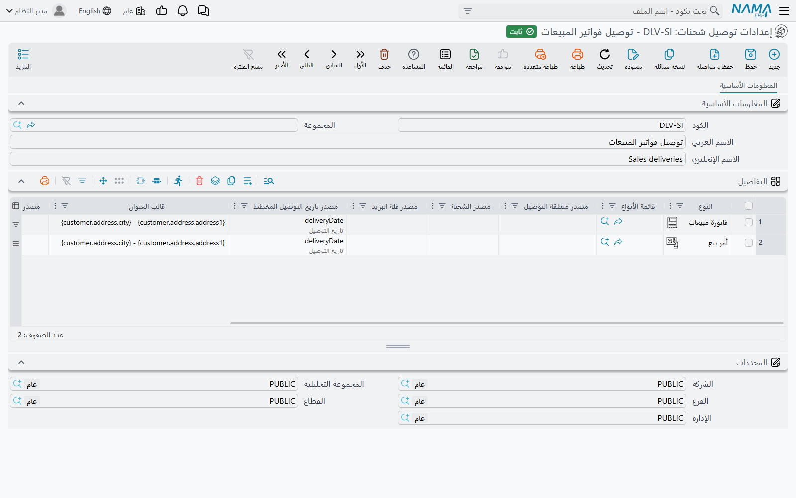
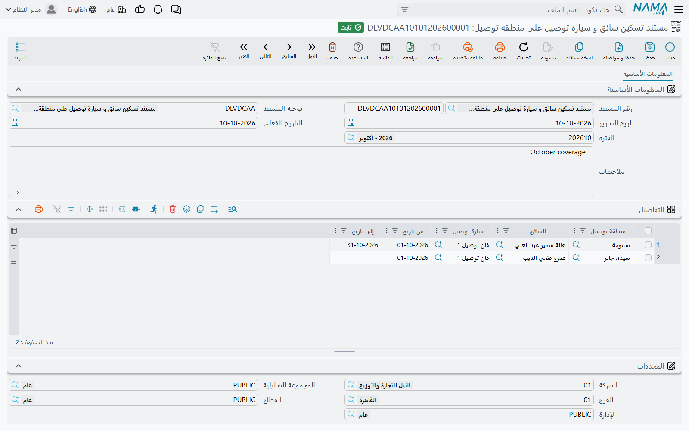
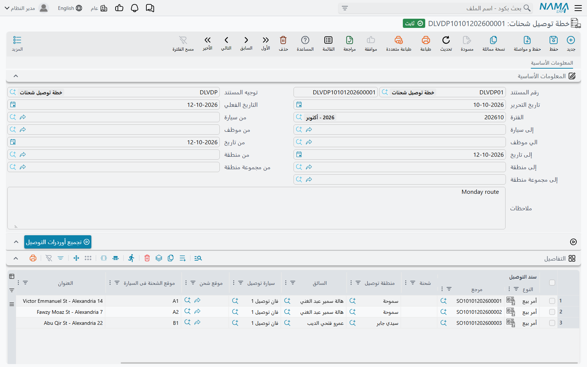
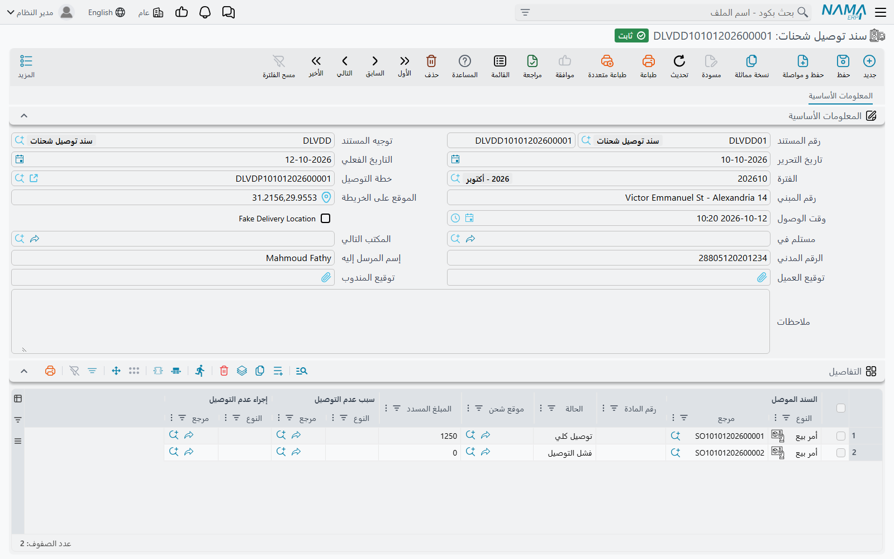
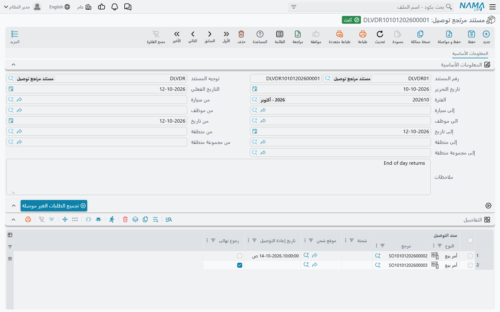

# توصيل الشحنات: الخطة والتوصيل والمرتجع

شاشتا **سند توصيل شحنة** و**طلبات التوصيل** في تطبيق السائق (راجع [خدمة العملاء والتوصيل والقبض](/ar/modules/mobile/mobile-crm-delivery.md)) ليستا سوى الواجهة. وخلفهما سبع شاشات تحت **الأساسيات ← إعدادات التوصيل** تحدد أي الشحنات موجودة، وأي سائق وسيارة يأخذانها، وماذا يحدث لشحنة لم تصل إلى عميلها. تشرح هذه الصفحة الشاشات السبع بالترتيب الذي تُعدّها وتستخدمها به.

::: info الترخيص المطلوب
`basic-mobile-shipment-delivery`. ست من الشاشات السبع مقيدة به؛ أما **سيارة توصيل** فجزء من التثبيت الأساسي.
:::

::: warning ليست هي «مستند الحركة» في مركز الخدمة
لمركز الخدمة خط سير خاص بمندوب التوصيل هو [مستند الحركة](/ar/modules/servicecenter/mobile-delivery/servicecenter-mobile-delivery-overview.md)، وهو ميزة منفصلة بشاشات منفصلة. لا ينطبق عليه شيء مما في هذه الصفحة.
:::

## الفكرة في فقرة واحدة

في كل مرة يُحفظ فيها مستند تريد توصيله — فاتورة مبيعات مثلًا — يكتب النظام بصمت سجل **شحنة** واحدًا له (أو سجلًا لكل رقم شحنة إن كان المستند يحمل أكثر من رقم). يحمل هذا السجل العميل ورقم الهاتف والعنوان والموقع على الخريطة ومنطقة التوصيل وتاريخ التوصيل المخطط، وله حالة توصيل. ثم تحرّك ثلاثة مستندات هذه الحالة إلى الأمام: **خطة توصيل شحنات** تسلّم الشحنات إلى سائق وسيارة، و**سند توصيل شحنات** يسجل هل وصلت كل شحنة أم لا، و**مستند مرتجع توصيل** يعيد الشحنات الفاشلة لمحاولة أخرى أو يغلقها نهائيًا. ليس لسجلات الشحنات نفسها شاشة؛ تراها من خلال أزرار **التجميع** ومن خلال تطبيق السائق.

| الشاشة (اسمها في القائمة) | بالإنجليزية | ما هي |
|---|---|---|
| **إعدادات توصيل شحنات** | Shipment Delivery Config | أي أنواع المستندات تنشئ شحنات، ومن أين تُقرأ كل معلومة عن الشحنة. |
| **منطقة توصيل شحنات** | Shipment Delivery Area | مناطق التوصيل التي تُقسَّم إليها المدينة. |
| **سيارة توصيل** | Delivery Car | سيارات التوصيل، بمواقع التخزين المرقمة فيها. |
| **مستند تسكين سائق و سيارة توصيل على منطقة توصيل** | DLV Driver Car Area Assignments | أي سائق وسيارة يغطيان أي منطقة، وفي أي فترة. |
| **خطة توصيل شحنات** | Shipment Delivery Plan | كشف التحميل اليومي: الشحنات موزعة على السائقين والسيارات. |
| **سند توصيل شحنات** | Shipment Delivery Document | إثبات التسليم، ويُنشأ عادة من تطبيق السائق. |
| **مستند مرتجع توصيل** | Delivery Return | الشحنات التي عادت: إعادة المحاولة لاحقًا أو الإرجاع النهائي. |

لا يُنشئ أي من هذه المستندات قيدًا في الحسابات ولا يحرك المخزون.

## الإعداد

### 1. إعدادات التوصيل

افتح **إعدادات توصيل شحنات** وأضف سطرًا لكل نوع مستند يجب أن ينتج شحنات. في عمود **النوع** اختر نوع المستند (مثل فاتورة المبيعات)، أو استخدم **قائمة الأنواع** لتغطية عدة أنواع في سطر واحد. وتحدد بقية الأعمدة من أين تأتي كل معلومة عن الشحنة في ذلك المستند:

| العمود | ماذا يملأ | إن تركته فارغًا |
|---|---|---|
| **مصدر الشحنة** (Shipment Source) | رقم الشحنة. إن أشار إلى عمود في جدول أنتج المستند شحنة لكل قيمة. | شحنة واحدة بلا رقم. |
| **مصدر الجهة الموصل إليها** (Delivered To Source) | الجهة المستلمة. | في المستندات من نوع الفواتير: العميل. |
| **مصدر رقم الهاتف** (Phone Number Source) | الرقم الذي يتصل به السائق. | في المستندات من نوع الفواتير: جوال العميل. |
| **مصدر الموقع الجغرافى** (Map Location Source) | النقطة على الخريطة. | في المستندات من نوع الفواتير: موقع عنوان العميل على الخريطة. |
| **مصدر تاريخ التوصيل المخطط** (Planned Delivery Date Source) | موعد استحقاق الشحنة. | التاريخ الفعلي للمستند. |
| **مصدر منطقة التوصيل** (Delivery Area Source) | منطقة التوصيل. | املأه — انظر التلميح أدناه. |
| **مصدر فئة البريد** (Mail Class Source) | فئة بريدية، يستخدمها موديول البريد وحده. | لا شيء. |
| **قالب العنوان** (Address Template) | نص العنوان الذي يقرؤه السائق، مبنيًا من حقول المستند. | — |

الإعدادات وحدها لا تفعل شيئًا. افتح **توجيه مستند** (الأساسيات ← الإعدادات ← توجيه مستند) لكل مستند يجب أن ينتج شحنات، واختر الإعدادات في حقل **إعدادات التوصيل**. من بعدها يكتب كل حفظ لمستند بهذا التوجيه شحناته أو يحدّثها، وحذف المستند يحذفها.

::: tip املأ مصدر منطقة التوصيل دائمًا
تطابق الخطة الشحنات مع السائقين والسيارات **حسب منطقة التوصيل**. الشحنة التي بلا منطقة تظهر عند التجميع، لكنها لا تأخذ سائقًا ولا سيارة تلقائيًا أبدًا، فينتهي بك الأمر إلى إسنادها يدويًا.
:::

### 2. المناطق والسيارات ومن يغطي ماذا

- **منطقة توصيل شحنات** ملف رئيسي بسيط — كود واسم. اجعل للمناطق مجموعات إن أردت تخطيط حي كامل دفعة واحدة؛ فالخطة تستطيع الفلترة بمجموعة المنطقة.
- **سيارة توصيل** تسجل السيارة. ويسرد جدول **مواقع التخزين فى السيارة** فيها المواقع المرقمة داخل السيارة (رف A1، A2، …) بترتيب التحميل؛ وتستخدم الخطة هذه القائمة لتخبر السائق بمكان كل شحنة.
- **مستند تسكين سائق و سيارة توصيل على منطقة توصيل** مستند يقول جدوله سطرًا سطرًا: هذه **منطقة توصيل** يغطيها هذا **السائق** بهذه **السيارة** من **من تاريخ** إلى **إلى تاريخ**. اترك التاريخ فارغًا لإسناد مفتوح. تستخدم الخطة الإسناد الساري **اليوم** — أي يوم الضغط على الزر، لا تاريخ الخطة.

## الدورة اليومية

مثال عملي: محل قطع غيار يصدر 40 فاتورة مبيعات يوم الأحد، كلها مستحقة التوصيل يوم الإثنين. توجيه فاتورة المبيعات يشير إلى إعدادات توصيل، فصار لدينا الآن 40 شحنة، كل منها تنتظر ومعها هاتف العميل وموقعه ومنطقته.

### الخطوة 1 — الخطة: من يأخذ ماذا

صباح الإثنين يفتح الموزّع **خطة توصيل شحنات** جديدة، ويضع **من تاريخ** و**إلى تاريخ** على يوم الإثنين، ويضيّق النطاق اختياريًا بـ **من منطقة / إلى منطقة** أو **من مجموعة منطقة / إلى مجموعة منطقة** أو **من سيارة / إلى سيارة** أو **من موظف / الي موظف**، ثم يضغط **تجميع أوردرات التوصيل**. يمتلئ الجدول بكل شحنة مستحقة في تلك الفترة ما زالت تنتظر أو أُعيدت لمحاولة جديدة. ولكل واحدة يعرض المستند المصدر (عمود **سند التوصيل**) و**الشحنة** و**منطقة توصيل** و**العنوان** و**الموقع** و**تاريخ التوصيل**، إضافة إلى:

- **السائق** و**سيارة التوصيل** مأخوذين من مستند التسكين الذي يغطي منطقة الشحنة اليوم؛
- **موقع الشحنة فى السيارة**: أول شحنة لسيارة تأخذ أول موقع في **مواقع التخزين فى السيارة**، والثانية تأخذ الثاني، وهكذا.

ويجدر فهم سلوك فلاتر السيارة والموظف: فهي لا تفلتر الشحنات مباشرة، بل تحدد أي **إسنادات** تؤخذ في الاعتبار، ومتى ملأت أيًّا منها سقطت الشحنة التي لا يوجد لمنطقتها إسناد مطابق. أما الشحنة التي **بلا منطقة أصلًا** فتبقى مهما كانت الفلاتر.

يستطيع الموزّع بعد ذلك تعديل أي سطر — تغيير سائق، إضافة شحنة أو حذفها — ثم يحفظ الخطة. الحفظ ينقل كل شحنة إلى حالة *مخطّطة* تحت ذلك السائق وتلك السيارة. والآن فقط تظهر الشحنات في شاشة **طلبات التوصيل** لدى السائق في التطبيق، مجمّعة حسب رقم الهاتف.

::: tip عندما لا يملأ الزر شيئًا
زر **تجميع أوردرات التوصيل** يستبدل الجدول دون أي رسالة. الجدول الفارغ يعني أنه لا توجد شحنة منتظرة تقع في الفترة والفلاتر — راجع التواريخ أولًا، ثم تأكد أن توجيه المستندات المصدر يحمل إعدادات التوصيل.
:::

### الخطوة 2 — التوصيل: الإثبات

عند كل عميل يفتح السائق **سند توصيل شحنة** في التطبيق، ويعلّم كل شحنة بأنها *وُصّلت* أو *فشل توصيلها*، ويأخذ توقيع العميل وتوقيعه هو، ثم يحفظ. فينشئ التطبيق **سند توصيل شحنات** في النظام يحمل:

- عنوان الوصول ونقطته على الخريطة، و**وقت الوصول**، وعلامة **Fake Delivery Location** إذا أشار التطبيق إلى أن الموقع المُبلَّغ مزيف (هذا الحقل يظهر بالإنجليزية في الواجهة العربية أيضًا)؛
- **إسم المرسل إليه** و**الرقم المدني** و**توقيع العميل** و**توقيع المندوب**؛
- سطرًا في الجدول لكل شحنة: المستند المصدر (**السند الموصل**)، ورقم الشحنة (**رقم المادة**)، و**الحالة** — *توصيل كلي* أو *فشل التوصيل* — وللتسليم الفاشل **سبب عدم التوصيل** و**إجراء عدم التوصيل**. ويسجل **المبلغ المسدد** النقدية المحصلة عند التسليم.

يمكنك أيضًا إدخال سند التوصيل يدويًا في النظام؛ وعند استخدام قارئ الباركود ينقلك المسح في **رقم المادة** إلى السطر التالي. الحفظ ينقل كل شحنة إلى *وُصّلت* أو *لم تُوصَّل*، تحت السائق المذكور في السطر. وليس للمستند تحققات خاصة به سوى الحقول الإلزامية المعتادة.

### الخطوة 3 — المرتجع: محاولة أخرى أو إنهاء

في نهاية اليوم يفتح الموزّع **مستند مرتجع توصيل**، ويضع التواريخ، وعند الحاجة فلاتر المنطقة ومجموعة المنطقة والموظف (وهنا **من موظف / الي موظف** تفلتر الشحنات مباشرة، بالسائق الذي تعامل معها آخر مرة)، ثم يضغط **تجميع الطلبات الغير موصلة**. يمتلئ الجدول بالشحنات التي فشل توصيلها — إضافة إلى أي شحنة ما زالت تنتظر ولم تُخطَّط في تلك الفترة. ولكل سطر:

- ضع **تاريخ إعادة التوصيل** على تاريخ ووقت المحاولة التالية — فتجمعها من جديد أي خطة تغطي فترتها ذلك التاريخ؛ أو
- علّم **رجوع نهائى** لإغلاق الشحنة نهائيًا — فلن تجمعها أي خطة بعد ذلك.

احفظ المرتجع. وإذا كتبت رقم شحنة يدويًا في سطر وتركت **سند التوصيل** فارغًا، يملأ النظام المستند المصدر عند الحفظ.

### ما الذي يحدد حالة الشحنة

حالة الشحنة هي دائمًا الحالة التي وضعها **آخر** مستند يذكرها — خطة أو سند توصيل أو مرتجع — مرتبة بالتاريخ الفعلي ثم بوقت الإنشاء. إلغاء أي من هذه المستندات أو حذفه يزيل أثره فتعود الشحنة إلى ما قبله — فإلغاء سند التوصيل يعيد شحناته إلى *مخطّطة*، وإلغاء الخطة الوحيدة يعيدها إلى *تنتظر*.

| آخر مستند تعامل مع الشحنة | الحالة | تجمعها الخطة؟ | يجمعها المرتجع؟ | في طلبات التوصيل لدى السائق؟ |
|---|---|---|---|---|
| لا شيء (حُفظ المستند المصدر للتو) | تنتظر | نعم | نعم | لا |
| خطة توصيل شحنات | مخطّطة | لا | لا | نعم |
| سند توصيل شحنات — *توصيل كلي* | وُصّلت | لا | لا | لا |
| سند توصيل شحنات — *فشل التوصيل* | لم تُوصَّل | لا | نعم | نعم |
| مستند مرتجع توصيل — دون رجوع نهائى | مرتجعة | نعم، في تاريخ إعادة التوصيل | لا | لا |
| مستند مرتجع توصيل — مع رجوع نهائى | مرتجعة نهائيًا | لا | لا | لا |

مربع البحث في تطبيق السائق (برقم الشحنة أو رقم الهاتف) أوسع من القائمة: يجد أي شحنة لم تُوصَّل بعد، أيًّا كانت حالتها.

## الأزرار في هذه الشاشات

| الشاشة | الزر | ماذا يفعل |
|---|---|---|
| خطة توصيل شحنات | **تجميع أوردرات التوصيل** (داخل الصفحة) | يملأ الجدول من الشحنات المنتظرة والمرتجعة، مع السائق والسيارة وموقع الشحنة في السيارة. |
| مستند مرتجع توصيل | **تجميع الطلبات الغير موصلة** (داخل الصفحة) | يملأ الجدول من الشحنات الفاشلة والمنتظرة. |
| سند توصيل شحنات | **إعادة إرسال أحداث IPS** (قائمة المزيد) | لتثبيتات البريد فقط — انظر أدناه. |

أما بقية الشاشات فلا تحمل إلا شريط الأدوات المعتاد.

## مع موديول البريد

في التثبيتات التي تشغّل أيضًا خدمة البريد في موديول إدارة الشحن، تحمل الشاشات نفسها بعض الإضافات: عمود **موقع شحن** في جداول الخطة وسند التوصيل والمرتجع، وحقلي **مستلم في** و**المكتب التالي** في سند التوصيل، وجدول يربط الحالة بالحدث في توجيه سند التوصيل. عندها يحدّث سند التوصيل المحفوظ استجابة المستلم في [طلب التوصيل](/ar/modules/freight/ips-delivery.md) البريدي الذي يشير إليه، ويضع أحداث التتبع المقابلة في قائمة الإرسال إلى النظام البريدي؛ ويعيد زر **إعادة إرسال أحداث IPS** وضعها للمستندات المحددة. كما ترفض الخطة شحنة تُظهر سجلات التخزين البريدية أنها لم تعد محفوظة في أي موقع. خارج تثبيتات البريد تجاهل هذه الأعمدة.

## رسائل قد تظهر لك

| الرسالة | السبب | ماذا تفعل |
|---|---|---|
| «لا يوجد طلبات غير موصلة ليتم تجميعها» | لم يجد زر **تجميع الطلبات الغير موصلة** أي شحنة فاشلة أو منتظرة في النطاق. | وسّع التواريخ أو امسح فلاتر الموظف والمنطقة. |
| «لا يمكنك استخدام الشحنة {0} حيث أنها لا تنتمي إلى أي موقع» | في تثبيتات البريد فقط: حفظ خطة فيها سطر بشحنة تُظهر سجلات التخزين البريدية أنها غادرت كل المواقع. | احذف السطر أو صحّح **موقع شحن**. |
