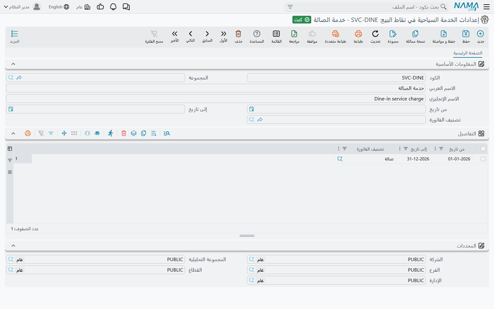
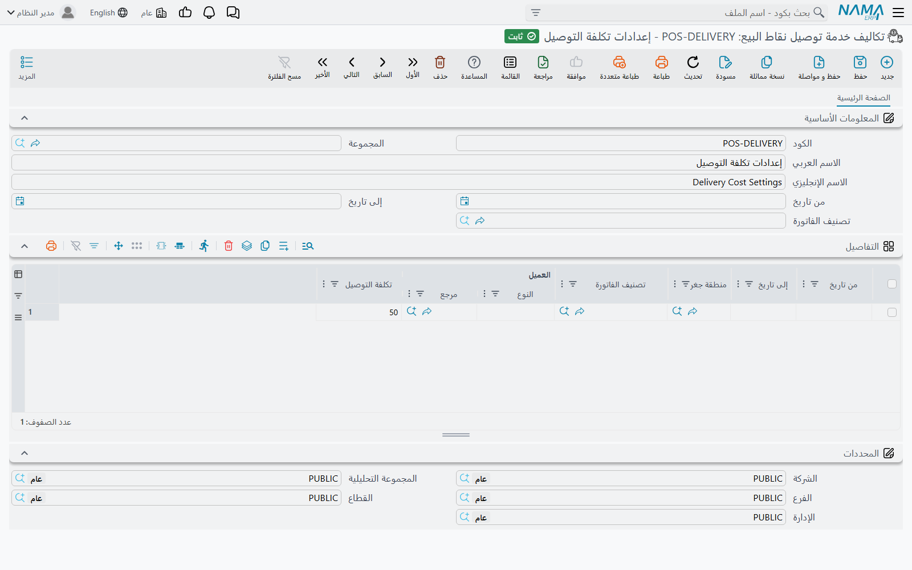
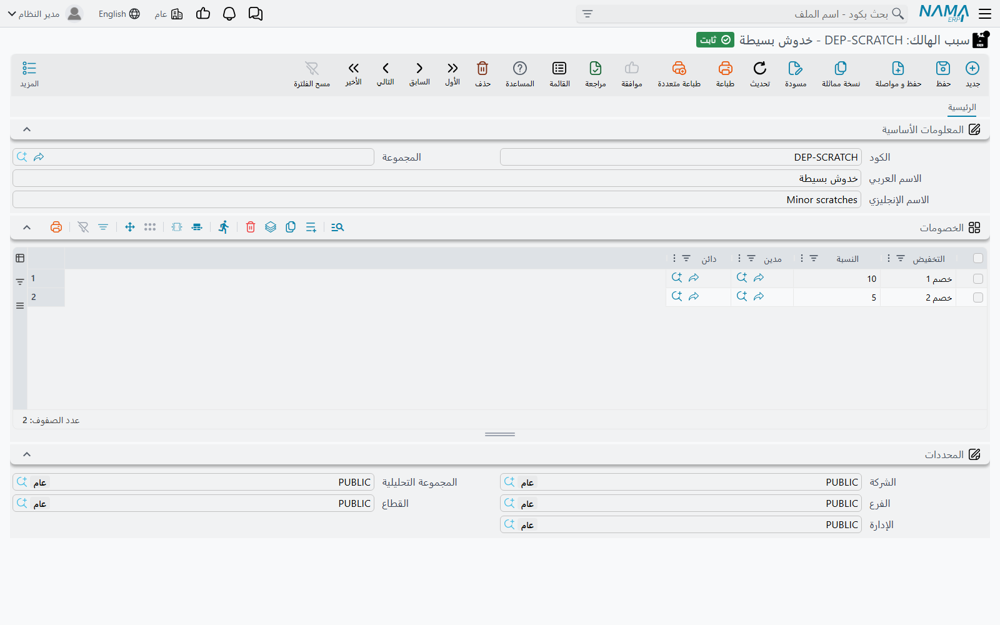

# الخدمة السياحية والحد الأدنى للطلب والتوصيل وأسباب الإرجاع

كثيرًا ما تضيف المطاعم والمقاهي إلى الفاتورة شيئًا ليس طبقًا: خدمة سياحية، أو رسم توصيل، أو تكملة حين يقل طلب الطاولة عن الحد الأدنى. تتعامل الماكينة مع الثلاثة بالطريقة نفسها — تضيف **سطر صنف خاص** إلى الفاتورة وتسعّره لك. تشرح هذه الصفحة إعداد ذلك على الخادم، ومعه القائمتان اللتان يختار منهما الكاشير حين ترجع البضاعة: أسباب الإرجاع وأسباب الهالك.

## كيف تعمل الرسوم الثلاثة

كل رسم يحتاج إلى شيئين:

1. **صنف.** صنف خدمي لكل رسم — مثلًا `SRV` «خدمة سياحية»، و`DLV` «توصيل»، و`MIN` «تكملة الحد الأدنى». الصنف هو ما يظهر سطرًا في الفاتورة وما تراه حسابات المبيعات. اختره في **صنف الخدمة السياحية** و**صنف خدمة التوصيل** و**صنف الحد الأدنى للطلب**.
2. **سجل إعدادات** يحدد *متى* ينطبق الرسم — بين أي تاريخين ولأي تصنيف فاتورة. وهي شاشات الإعدادات الثلاث أدناه.

يُختار الاثنان في **إعدادات نقاط البيع** (**نقاط البيع ← الإعدادات ← إعدادات نقاط البيع**) لكل الماكينات، ويمكن اختيارهما من جديد في **ماكينة** بعينها فتُقدَّم قيمتها لتلك الماكينة.

تضيف الماكينة كل صنف خاص **مرة واحدة**؛ وإضافته ثانيةً تُرفض («تمت إضافة صنف الخدمة السياحية بالفعل»، «تمت إضافة صنف التوصيل بالفعل»).

### الخدمة السياحية

في شاشة **إعدادات الخدمة السياحية في نقاط البيع** (**نقاط البيع ← الإعدادات ← إعدادات الخدمة السياحية في نقاط البيع**) جدول سطور، لكل سطر **من تاريخ** و**إلى تاريخ** و**تصنيف الفاتورة**. يطابق السطر حين يقع تاريخ الفاتورة في مداه ويكون تصنيفه هو تصنيف الفاتورة (والخانة الفارغة تطابق أي شيء).

القيمة نسبة مئوية تُحدَّد مع الصنف:

- **نسبة الخدمة السياحية** — مثلًا 12%.
- **الخدمة السياحية تحسب من** — أي رقم من أرقام السطور الأخرى تُطبَّق عليه النسبة: **السعر الأساسي**، أو **بعد الخصم 1** … **بعد الخصم 8**، أو بعد الضريبة 1 أو 2، أو **الصافي**. الفارغ يعني بعد الخصم 8.

**مثال.** طاولة طلبت طبقين رئيسيين بـ 100 لكل منهما وحلوى بـ 50 دون خصومات: الإجمالي 250. بنسبة 12% محسوبة من السعر الأساسي يُسعَّر سطر الخدمة بـ 30. فإن أضاف النادل مشروبًا بـ 40 تعيد الماكينة حساب السطر إلى 34.80 («تم اعادة احتساب تكلفة الخدمة السياحية»).

متى يُضاف صنف الخدمة يحدده ثلاثة خيارات (كلها في إعدادات نقاط البيع، وفي الماكينة مع اختيار إضافي **موروث** يتبع إعدادات نقاط البيع):

| الخيار على الشاشة | الاسم الإنجليزي | أثره |
|---|---|---|
| إضافة صنف الخدمة السياحية تِلْقائيًا في الفاتورة | Add Service Item Automatically In Invoice | كل فاتورة جديدة تبدأ بسطر الخدمة. |
| إضافة صنف الخدمة السياحية تلقائياً عند اختيار طاولة | Automatically Add Service Item When Selecting Table | يُضاف السطر حين يختار الكاشير طاولة — الجلوس في المطعم يدفع الخدمة، والتيك أواي لا. |
| إضافة صنف الخدمة السياحية تلقائياً عند اختيار تصنيف الفاتورة | Automatically Add Service Item When Selecting Invoice Classification | حين يتغير التصنيف يُضاف السطر إن طابقه سطر إعدادات، ويُحذف إن لم يطابقه شيء. |

### التوصيل

شاشة **تكاليف خدمة توصيل نقاط البيع** (**نقاط البيع ← الإعدادات ← تكاليف خدمة توصيل نقاط البيع**) قائمة أسعار للتوصيل. لكل سطر **من تاريخ** و**إلى تاريخ** و**منطقة جغرافيه** و**تصنيف الفاتورة** و**العميل** (عميل أو تصنيف عملاء) و**تكلفة التوصيل**. تأخذ الماكينة **أول سطر يطابق** تاريخ الفاتورة وتصنيفها ومنطقة التوصيل والعميل، فضع السطور الخاصة (عميل مميز، منطقة بعيدة) فوق العامة.

**مثال.** السطور: منطقة «وسط البلد» ← 15؛ منطقة «الضواحي» ← 30؛ تصنيف العملاء «شركات» ← 0. عميل من الضواحي يأخذ سطر توصيل بـ 30؛ غيّر المنطقة في الفاتورة إلى وسط البلد فيُعاد تسعير السطر إلى 15.

يُضاف سطر التوصيل:

| الخيار على الشاشة | الاسم الإنجليزي | أثره |
|---|---|---|
| إضافة صنف خدمة التوصيل تِلْقائيًا في الفاتورة | Add Delivery Item Automatically In Invoice | كل فاتورة جديدة تبدأ بسطر التوصيل. |
| إضافة صنف خدمة التوصيل مع اختيار عميل | Add Delivery Item When Selecting Customer | اختيار العميل يضيف السطر إن طابقه سطر تكلفة، ويحذفه إن لم يطابقه شيء. |
| إضافة صنف التوصيل تلقائياً عند اختيار تصنيف الفاتورة | Automatically Add Delivery Item When Selecting Invoice Classification | مثله لكن بتغيّر تصنيف الفاتورة — مثل تصنيف «توصيل». |

وتغيير منطقة الفاتورة يعيد فحص سطر التوصيل دائمًا.

### الحد الأدنى للطلب

في شاشة **إعدادات الحد الأدنى للطلب في نقاط البيع** (**نقاط البيع ← الإعدادات ← إعدادات الحد الأدنى للطلب في نقاط البيع**) سطور فيها **من تاريخ** و**إلى تاريخ** و**تصنيف الفاتورة** و**قيمة الحد الأدنى للطلب**. حين يطابق سطر، تضيف الماكينة صنف الحد الأدنى مسعَّرًا بـ **الحد الأدنى ناقص ما طلبته الطاولة** (محسوبًا عند **الحد الأدنى للطلب يحسب من**، وبعد الخصم 8 إن كان فارغًا).

**مثال.** صالة حدها الأدنى 300 ليالي الجمعة. طلبت طاولة بـ 220؛ فتضيف الماكينة سطر تكملة بـ 80. وقبل حفظ الفاتورة تتحقق الماكينة من أن التكملة ما زالت صحيحة؛ فإن زاد طلب الطاولة بعدها تعيد حساب السطر وتوقف الحفظ ليرى الكاشير الرقم الجديد (*Minimum charge item has been recalculated*).

خيار **إضافة صنف الحد الأدنى تلقائياً عند اختيار تصنيف الفاتورة** يضيف السطر أو يحذفه مع تغيّر التصنيف.

### الحجوزات

لا يُضاف أيٌّ من الرسوم الثلاثة افتراضيًا إلى **سند حجز** أو إلغائه. فعّل كلًّا منها على حدة في إعدادات نقاط البيع: **استخدام صنف الخدمة مع مستند حجز**، و**استخدام تكلفة التوصيل مع مستند حجز**، و**استخدام صنف الحد الأدنى مع مستند حجز**.

## أسباب الإرجاع

**سبب الإرجاع** (Nama POS Return Reason، **نقاط البيع ← الإعدادات ← سبب الإرجاع**) قائمة بسيطة — كود واسم — يختار منها الكاشير في مردود المبيعات («مقاس خاطئ»، «تالف»، «غيّر رأيه»). ليس فيه أي حساب؛ وجوده لتُحلَّل المردودات حسب السبب. ولإلزام الكاشير بشرح كل مردود كتابةً أيضًا، فعّل **الملحوظه مطلوبه في مردود نقاط البيع** في إعدادات نقاط البيع.

## أسباب الهالك

**سبب الهالك** (POS Depreciation Reason، **نقاط البيع ← الملفات ← سبب الهالك**) خصم مُعَدّ مسبقًا يطبّقه الكاشير على سطر مبيعات بزر **تحويل إلى هالك** في السطر — راجع [المرتجعات والإحلال](../pos-returns-and-replacements.md) لجانب الكاشير. يظهر الزر حين تكون للماكينة إعدادات واجهة وخيار **عدم إضافة زر التحويل إلى هالك لسطور المبيعات** غير مفعَّل.

جدول **الخصومات** في السبب يحدد أيّ خانات الخصم الثماني في السطر تستقبل الخصم:

| العمود على الشاشة | الاسم الإنجليزي | المعنى |
|---|---|---|
| التخفيض | Discount | أي خانة خصم (الخصم 1 … الخصم 8). |
| النسبة | Percentage | الخصم كنسبة من السعر **الأصلي**. |
| مدين / دائن | Debit / Credit | جانبان محاسبيان اختياريان لهذا الخصم. |

النسب تُجمَع: سبب فيه 10% في الخصم 1 و5% في الخصم 2 يخصم 15% من السعر الأصلي إجمالًا (تحوّل الماكينة الخانة الثانية بحيث تكون 5% من الأصل لا من الباقي). ولا يجوز أن يتجاوز المجموع 100%: «المجموع الكلي لنسب التخفيضات {0} يجب أن يكون أقل من أو يساوي 100%».

حين يُملأ **مدين** و**دائن** معًا في سطر، تحصل فاتورة مبيعات نقاط البيع التي تحمل هذا الهالك على زوج إضافي من سطور القيد بقيمة الخصم — مفيد لنقل الخسارة إلى حساب «بضاعة تالفة» بدل تركها خصمًا عاديًا.

## رسائل قد تظهر لك

| الرسالة | السبب | ما العمل |
|---|---|---|
| *No service item defined* | سطر الخدمة مستحق لكن **صنف الخدمة السياحية** غير محدد في الماكينة ولا في إعدادات نقاط البيع. تظهر بالإنجليزية على الشاشات العربية أيضًا. | اختر الصنف. |
| *No delivery item defined* | الأمر نفسه لـ **صنف خدمة التوصيل**. تظهر بالإنجليزية على الشاشات العربية أيضًا. | اختر الصنف. |
| *No min charge item defined* | الأمر نفسه لـ **صنف الحد الأدنى للطلب**. تظهر بالإنجليزية على الشاشات العربية أيضًا. | اختر الصنف. |
| «تمت إضافة صنف الخدمة السياحية بالفعل» | حاول الكاشير إضافة صنف الخدمة مرة ثانية. | اترك السطر الموجود؛ الماكينة تسعّره. |
| «تمت إضافة صنف التوصيل بالفعل» | الأمر نفسه لصنف التوصيل. | لا شيء. |
| *Minimum charge item has been recalculated* | تغيّر الطلب بعد تسعير سطر التكملة. تظهر بالإنجليزية على الشاشات العربية أيضًا. | راجع المبلغ الجديد واحفظ مرة أخرى. |
| «المجموع الكلي لنسب التخفيضات {0} يجب أن يكون أقل من أو يساوي 100%» | مجموع نسب سبب الهالك أكثر من 100%. | خفّض النسب. |
