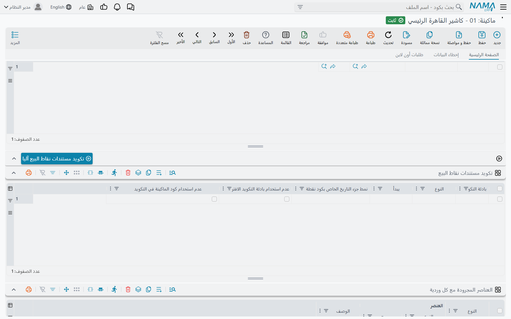

# ترقيم مستندات نقاط البيع

الماكينات تعمل دون اتصال، فلا تستطيع أن تسأل الخادم عن رقم الفاتورة التالية كما تفعل شاشات النظام. لذلك **ترقّم كل ماكينة مستنداتها بنفسها**، والأكواد مبنية بحيث لا يمكن أن تُنتج ماكينتان الكود نفسه. تشرح هذه الصفحة كيف يُبنى الكود وأي الإعدادات تغيّره: البادئة، وعدد الخانات، وجزء التاريخ، ومن أين يبدأ التسلسل.

## كيف يُبنى الكود

كل كود تُنتجه الماكينة يتكون من خمسة أجزاء على الأكثر، بهذا الترتيب:

| الجزء | مصدره | مثال |
|---|---|---|
| 1. البادئة | عمود **بادئة التكويد** في جدول تكويد الماكينة (انظر أدناه) إن كان مملوءًا | `BR1-` |
| 2. بادئة نوع المستند | ثابتة لكل نوع — `1` لفاتورة المبيعات، و`2` للمردود، وهكذا (الجدول أدناه) | `1` |
| 3. كود الماكينة | **الكود** الخاص بالماكينة نفسها | `R01` |
| 4. جزء التاريخ | نمط تاريخ مثل `yyMMdd` إن كان محددًا | `261010` |
| 5. المسلسل | رقم متتابع تُكمَل خاناته بأصفار على اليسار حتى طول ثابت (8 خانات ما لم تغيّره) | `00000001` |

دون أي إعدادات تكون أول فاتورة مبيعات للماكينة `R01` هي `1R0100000001` وأول مردود `2R0100000001`. وبإضافة جزء التاريخ `yyMMdd` تصبح الفاتورة الصادرة يوم 10 أكتوبر 2026 هي `1R0126101000000001`.

المسلسل يُعدّ **لكل نوع مستند ولكل بادئة**. ولأن جزء التاريخ من البادئة، فالماكينة التي تستخدمه تبدأ من `00000001` من جديد كل يوم — والتاريخ هو ما يُبقي الأكواد فريدة.

بادئات أنواع المستندات:

| المستند | البادئة |
|---|---|
| فاتورة مبيعات نقاط البيع | `1` |
| مردود نقاط البيع | `2` |
| إستبدال مبيعات نقاط البيع | `3` |
| إشعار دائن نقاط البيع | `4` |
| رسالة نقاط بيع داخليه | `5` |
| طلب تحويل مخزني نقاط البيع | `6` |
| مصروف نقاط البيع | `7` |
| مقبوض نقاط البيع | `8` |
| لجنة جرد نقط بيع | `9` |
| سند حجز اوردر نقاط بيع | `r` |
| سند إلغاء حجز اوردر نقاط بيع | `c` |
| توريد نقاط البيع | `rcpt` |
| مستند الهوالك | `sc` |
| مستند النواقص | `sf` |

أكواد الورديات وأكواد الجرد ليس لها بادئة نوع ولا تأخذ جزء تاريخ أبدًا — هي كود الماكينة يليه المسلسل. ويحمل سند غلق الوردية **كود الوردية** نفسه الذي في سند فتحها.

## أين توجد الإعدادات

ثلاثة مواضع تتحكم في الترقيم، من الأعم إلى الأخص.

**إعدادات نقاط البيع** (**نقاط البيع ← الإعدادات ← إعدادات نقاط البيع**) تحمل القيم الافتراضية للشركة كلها:

- **طول لاحقة كود مستندات نقاط البيع** (Pos Code Suffix Length) — عدد خانات المسلسل. إن تُرك فارغًا فهو 8.
- **نمط جزء التاريخ الخاص بكود نقطة البيع** (POS Code Date Part Format) — نمط التاريخ لكل ماكينة لا تحدد نمطها الخاص.

**الماكينة** (**نقاط البيع ← ماكينة ← ماكينة**) يمكن أن تحدد **نمط جزء التاريخ الخاص بكود نقطة البيع** في رأسها؛ فإن مُلئ حلّ محل نمط الإعدادات لهذه الماكينة.

**جدول التكويد في الماكينة**، **تكويد مستندات نقاط البيع** (Documents Coding Params)، يضبط نوع مستند واحدًا في كل سطر. كل سطر فيه:

| العمود على الشاشة | الاسم الإنجليزي | ما يفعله |
|---|---|---|
| النوع | Entity Type | المستند الذي ينطبق عليه السطر. لا يتكرر النوع إلا مرة واحدة. |
| بادئة التكويد | Prefix | نص يُضاف في أول الكود تمامًا. |
| يبدأ | Start From | أقل مسلسل يمكن أن يأخذه المستند التالي (انظر أدناه). |
| نمط جزء التاريخ الخاص بكود نقطة البيع | POS Code Date Part Format | نمط تاريخ لهذا النوع وحده، ويتقدّم على نمط الماكينة ونمط الإعدادات. |
| عدم استخدام بادئة التكويد الافتراضية | Do Not Use Default Prefix | يحذف بادئة نوع المستند (`1`، `2`، …). |
| عدم استخدام كود الماكينة في التكويد | Do Not Use Register Code In Document Code | يحذف كود الماكينة. |

حقول جزء التاريخ تقترح نمطين جاهزين هما `yyyyMMdd` و`yyMMdd`، ويصلح أي نمط تاريخ قياسي.

يقبل الجدول أنواع المستندات التالية: فاتورة المبيعات، والمردود، والاستبدال، والإشعار الدائن، والرسالة الداخلية، وطلب التحويل المخزني، والمصروف، والمقبوض، ولجنة الجرد، وفتح الوردية، والجرد، وسند الحجز، وسند إلغاء الحجز، والتوريد. أما مستندا الهوالك والنواقص فيُرقَّمان دائمًا بالطريقة الافتراضية.

::: warning لا تحذف جزءًا إلا إذا بقيت الأكواد فريدة
كود الماكينة هو ما يفصل أكواد ماكينة عن أخرى. تفعيل **عدم استخدام كود الماكينة في التكويد** على ماكينتين بالبادئة نفسها يجعل كلتيهما تُصدر `1…00000001`. لا تحذف كود الماكينة إلا إذا كانت **بادئة التكويد** التي تعطيها لكل ماكينة تميّزها عن غيرها.
:::

## من أين يبدأ التسلسل

حين تحتاج الماكينة كودًا جديدًا تأخذ **أكبر** ثلاثة أرقام ثم تضيف واحدًا:

1. أعلى مسلسل لديها محليًا لهذا النوع وهذه البادئة؛
2. قيمة **يبدأ** ناقص واحد، من جدول التكويد؛
3. أعلى مسلسل يحمله الخادم لهذه الماكينة وهذا النوع وهذه البادئة — ويُجلب في الخلفية كل مرة تبدأ فيها الماكينة.

إذن **يبدأ** حدٌّ أدنى وليس إعادة ضبط: يمكنه دفع الترقيم إلى الأمام (مثلًا البدء من `5001` بعد الانتقال من نظام قديم)، لكنه لا يعيد الترقيم أبدًا إلى ما دون كود موجود. وفحص الخادم هو ما يمنع ماكينة أُعيد تثبيتها — وقاعدة بياناتها المحلية فارغة — من إعادة إصدار أكواد أرسلتها من قبل.

تغيير البادئة أو جزء التاريخ أو عدد الخانات يبدأ تسلسلًا **جديدًا**، لأن الماكينة لا تُكمل إلا الأكواد التي لها البادئة والطول نفسهما تمامًا.

### ملء الجدول آليًا

زر **تكويد مستندات نقاط البيع آليا** (Automatic Documents Coding) فوق الجدول يطلب بادئة، ثم يبحث عن آخر كود يحمله الخادم لكل نوع مستند لهذه الماكينة، ويضيف سطرًا لكل نوع وقيمة **يبدأ** فيه هي المسلسل التالي. السطور التي كانت لها البادئة نفسها تُستبدل. استخدمه بعد إعادة تثبيت ماكينة، أو قبل إعطائها بادئة جديدة، ثم احفظ الماكينة لتستلم السطور الجديدة مع المزامنة التالية.

## مثال عملي

سلسلة محلات تريد أن تبدأ فواتير كل فرع بـ `BR1-` و`BR2-` وهكذا مع التاريخ، وتريد أن يُكمل الفرع الأول من الفاتورة 5,000 في نظامه القديم.

1. في **إعدادات نقاط البيع** اجعل **طول لاحقة كود مستندات نقاط البيع** = `6`.
2. في ماكينة الفرع الأول (كودها `R01`) أضف سطرًا في الجدول: **النوع** = فاتورة مبيعات نقاط البيع، **بادئة التكويد** = `BR1-`، **نمط جزء التاريخ الخاص بكود نقطة البيع** = `yyMMdd`، **يبدأ** = `5001`.
3. احفظ الماكينة. بعد أن تتزامن الماكينة تكون فاتورتها التالية `BR1-1R01261010005001`.

ولأن جزء التاريخ يجعل كل يوم تسلسلًا جديدًا، و**يبدأ** هو الحد الأدنى لكل تسلسل، فأول فاتورة في اليوم التالي هي `BR1-1R01261011005001`: كل يوم يبدأ من 5001 من جديد. فإن أرادت السلسلة رقمًا متصلًا واحدًا فلتترك جزء التاريخ فارغًا — وعندها تأتي بعد `BR1-1R01005001` الفاتورة `BR1-1R01005002`، يومًا بعد يوم.

## رسائل قد تظهر لك

| الرسالة | السبب | ما العمل |
|---|---|---|
| «نوع مكرر» | في جدول **تكويد مستندات نقاط البيع** في الماكينة سطران لنوع المستند نفسه. | أبقِ سطرًا واحدًا لكل نوع. |
