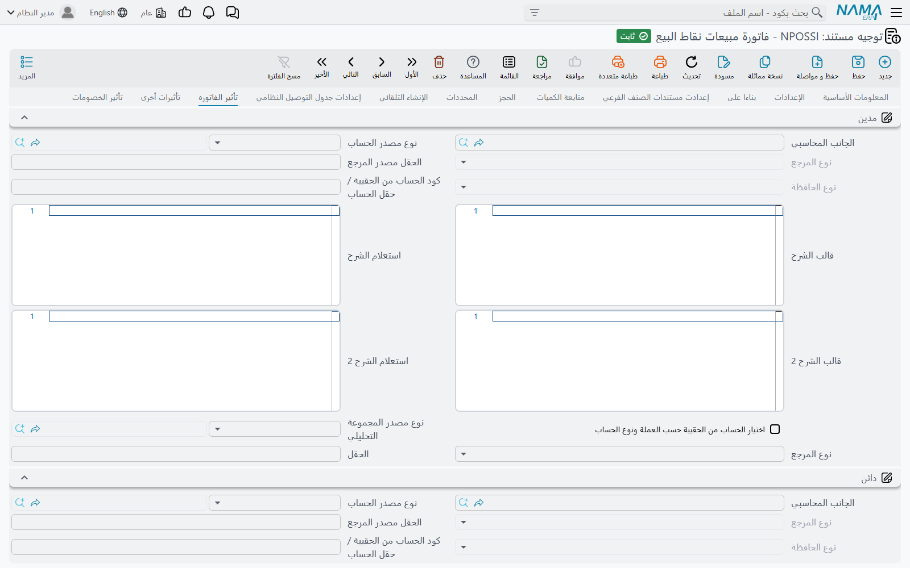

# توجيهات مستندات نقاط البيع

الكاشير لا يختار دفترًا ولا توجيهًا أبدًا — فشاشة الماكينة ليس فيها حقل لذلك. ومع ذلك يصبح كل مستند ترسله الماكينة مستندًا عاديًا على الخادم، ويحتاج مثل أي مستند إلى **دفتر** و**توجيه**: فالتوجيه هو ما يحوّله إلى قيود محاسبية وحركات مخزنية. تشرح هذه الصفحة كيف يختارهما الخادم، وما الذي تتحكم فيه كل شاشة من شاشات توجيهات نقاط البيع.

## من أين يأتي الدفتر والتوجيه

كل شيء يبدأ من الماكينة (**نقاط البيع ← ماكينة ← ماكينة**). في جدول **الدفاتر والتوجيهات** (Books And Terms) سطر لكل نوع مستند:

| العمود على الشاشة | الاسم الإنجليزي | ما يفعله |
|---|---|---|
| النوع | Entity Type | مستند نقاط البيع الذي يخصه السطر. |
| الدفتر | Book | الدفتر الذي يُحفظ فيه المستند على الخادم. إجباري. |
| توجيه المستند | Term | التوجيه الافتراضي لهذا النوع. |
| التوجيه في حالة حدوث خطأ | Term In Case Of Error | توجيه بديل لمستندات المبيعات (انظر أدناه). |
| النوع الفرعى | Sub Type | لـ**فاتورة مبيعات نقاط البيع** فقط: «عادية» أو «خدمة» (انظر أدناه). |

لأغلب المستندات هذه هي القصة كلها: يُستخدم **دفتر السطر وتوجيهه** كما هما. ينطبق هذا على سند حجز اوردر نقاط بيع، والفاتورة المعلقة، ومستند الهوالك، ومستند النواقص، وتوريد نقاط البيع، وطلب تحويل مخزني نقاط البيع، ولجنة جرد نقط بيع، وفتح الوردية، وغلق الوردية، والجرد.

أربعة مستندات يمكن أن تأخذ **توجيهًا مختلفًا** بحسب ما حدث عند الكاشير، باستخدام جداول التوجيهات في الماكينة — أو الجدول نفسه في **إعدادات نقاط البيع** إن كان جدول الماكينة فارغًا:

### فواتير المبيعات — جدول توجيهات المبيعات

في جدول **توجيهات المبيعات** (Sales Terms) الأعمدة **النوع** («العميل مطلوب» / «العميل غير مطلوب»)، و**به ذمه** (نعم / لا)، و**تصنيف سجل**، و**توجيه المستند**. لكل فاتورة يأخذ الخادم **أول** سطر مناسب:

- **النوع** — «العميل مطلوب» يناسب الفاتورة التي فيها عميل، و«العميل غير مطلوب» يناسب التي ليس فيها عميل. الفارغ يناسب الحالتين.
- **به ذمه** — «نعم» يناسب الفاتورة المبيعة على حساب ذمة، و«لا» يناسب التي بلا ذمة. الفارغ يناسب الحالتين.
- **تصنيف سجل** — يناسب حين يساوي تصنيف مستند الفاتورة. الفارغ يناسب أي تصنيف.

إن لم يناسب أي سطر يُستخدم توجيه سطر **الدفاتر والتوجيهات**. ضع السطور الأكثر تحديدًا في الأعلى: السطر الذي كل أعمدته فارغة يناسب كل فاتورة، فلا يُوصل أبدًا إلى ما تحته.

**فواتير الخدمة.** إذا كان في جدول **الدفاتر والتوجيهات** سطر لفاتورة مبيعات نقاط البيع **نوعه الفرعى** «خدمة»، فالفاتورة التي كل أصنافها خدمات تأخذ توجيه هذا السطر قبل النظر في جدول توجيهات المبيعات.

### مردودات المبيعات — جدول توجيهات المردودات

جدول **توجيهات المردودات** (Sales Return Terms) يعمل بالطريقة نفسها، مع **نوع** مختلف: «كاش» يناسب المردود المردود نقدًا، و«إلي إشعار» يناسب المردود المردود كإشعار دائن، والفارغ يناسب الحالتين. و**به ذمه** و**تصنيف سجل** كما في الفواتير. وإن لم يناسب سطر يُرجع إلى سطر الدفاتر والتوجيهات.

### المصروفات والمقبوضات — جدولا توجيهات المصروفات والمقبوضات

- **توجيهات المقبوضات** (Receipt Terms) — أول سطر يطابق **تصنيف سجل** فيه تصنيفَ المقبوض (أو يكون فارغًا) يعطي التوجيه.
- **توجيهات المصروفات** (Payment Terms) — يُستخدم أول سطر يطابق **النوع** فيه نوعَ المصروف («من الماكينة» أو «من الموظف الحالي» أو «إلي إشعار») **أو** يطابق **تصنيف سجل** فيه تصنيفَ المصروف. ولأن أي مطابقة منهما تكفي، رتّب السطور بالترتيب الذي تريد تجربتها به. (هذا الجدول في إعدادات نقاط البيع ليس فيه عمود التصنيف.)

وإن لم يناسب سطر يُرجع إلى سطر الدفاتر والتوجيهات كما سبق.

::: tip اجعل التصنيف هو من يختار التوجيه
لتسجيل مصروفات «الكهرباء» و«النظافة» و«المشتريات النثرية» على حسابات مختلفة، أنشئ تصنيف مستند لكل منها، وأعطِ كل تصنيف توجيهه في **توجيهات المصروفات**، وفعّل **تصنيف السجل مطلوب في شاشة مصروفات نقاط البيع** في [إعدادات نقاط البيع](./pos-settings-screen.md) حتى يُلزَم الكاشير باختيار أحدها.
:::

### توجيه الخطأ

حين يصل مستند مبيعات إلى الخادم ولا يمكن حفظه بتوجيهه العادي **لعدم كفاية المخزون**، يعيد الخادم المحاولة بـ**التوجيه في حالة حدوث خطأ** من جدول الدفاتر والتوجيهات. اضبط هذا التوجيه بالطريقة التي يريد بها نشاطك تسجيل هذه المبيعات، فيصل البيع إلى الخادم وتُعالج مشكلة المخزون بعد ذلك بدلًا من بقاء المستند غير مرسَل. وإن تُرك فارغًا يُرفض المستند كالمعتاد.

## شاشات توجيهات نقاط البيع

لمستندات نقاط البيع أنواع توجيهات خاصة بها. افتح التوجيه من **توجيه مستند** ونوعه مستند نقاط البيع؛ والصفحات التي تظهر تعتمد على المستند.

| المستند | الاسم الإنجليزي | صفحات التوجيه |
|---|---|---|
| فاتورة مبيعات نقاط البيع | POS Sales Invoice | الإعدادات العامة، **تأثير الفاتوره**، **تأثيرات أخرى**، **تأثير الخصومات**، **تأثير سندات الدفع** |
| مردود نقاط البيع | POS Sales Return | مثل الفاتورة |
| سند حجز اوردر نقاط بيع | POS Order Reservation | مثل الفاتورة |
| سند إلغاء حجز اوردر نقاط بيع | POS Cancel Reservation | مثل الفاتورة |
| توريد نقاط البيع | POS Stock Receipt | الإعدادات العامة مع مجموعة **الإنشاء التلقائي**، **تأثير الفاتوره** |
| مصروف نقاط البيع | POS Payment | **الإعدادات**، **التأثير** |
| مقبوض نقاط البيع | POS Receipt | **الإعدادات**، **التأثير** |
| فتح ورديه | POS Shift Opening | **التأثير** |
| غلق وردية | POS Shift Closing | **التأثير**، **النقدي** |
| جرد | POS Cash Drawer | **التأثير** |
| فاتورة معلقة | Held Invoice | الإعدادات العامة فقط |
| مستند الهوالك | Scrap Document | الإعدادات العامة فقط |
| مستند النواقص | Shortfalls Document | الإعدادات العامة فقط |
| طلب تحويل مخزني نقاط البيع | POS Stock Transfer Request | الإعدادات العامة فقط |

### المبيعات والمردودات والحجوزات

تشبه هذه التوجيهات الأربعة توجيهات المبيعات في سلسلة التوريد، وتعمل صفحة إعداداتها العامة بالطريقة نفسها — راجع [توجيهات المستندات](/ar/modules/supplychain/document-terms/) لهذه الخيارات. أما الصفحات الخاصة بها:

- **تأثير الفاتوره** — جانبا **مدين** و**دائن** البيع نفسه (عادةً العميل أو النقدية مقابل الإيراد)، وخيار **إختصار القيود**، وجانب **خصم التقريب** لخصومات التقريب.
- **تأثيرات أخرى** — جانب **النقدي** وجوانب **ضريبة مبيعات 1** و**ضريبة مبيعات 2** و**ضريبة 3** و**ضريبة الفاتورة 4**.
- **تأثير الخصومات** — جانب لكل خصم: من **خصم 1** إلى **خصم 8**، و**تخفيض الفاتورة**.
- **تأثير سندات الدفع** — قيود إضافية للفواتير المدفوعة عبر سندات دفع خارجية.

### التوريد

إلى جانب مدين التوريد ودائنه، تحدد مجموعة **الإنشاء التلقائي** **دفتر المستند** و**توجيه المستند** لسند التوريد المخزني الذي ينشئه الخادم منه، وهو ما يُدخل البضاعة المستلمة إلى المخزون.

### المصروفات والمقبوضات

صفحة **التأثير** تحمل جانبي **مدين** و**دائن** الدفع. وفي صفحة **الإعدادات** يجعل خيار **عدم إختصار قيود مصروفات طرق الدفع** قيود طرق الدفع تُكتب سطرًا بسطر بدلًا من اختصارها.

### الورديات والجرد

توجيهات فتح الوردية وغلقها والجرد تقيّد **الفروق** بين المعدود والمتوقع (جوانب **الزيادة** و**النقصان**). ولغلق الوردية أيضًا صفحة **النقدي** المستخدمة عند تصفير النقدية مع الغلق. كلاهما مشروح بالأمثلة في [إعدادات فتح وغلق الوردية وتصفير النقدية](./pos-shift-close-settings.md).

## حين يصل مستند بتوجيه غير متوقع

1. راجع تصنيف المستند وعميله وذمته، وامشِ على جدول التوجيهات في الماكينة من الأعلى: أول سطر مناسب هو الذي يُطبَّق.
2. إن كان جدول الماكينة فارغًا فالجدول المستخدم هو جدول **إعدادات نقاط البيع**.
3. إن لم يناسب أي سطر فالتوجيه هو توجيه سطر **الدفاتر والتوجيهات** — تأكد أن هذا السطر موجود لنوع المستند.
