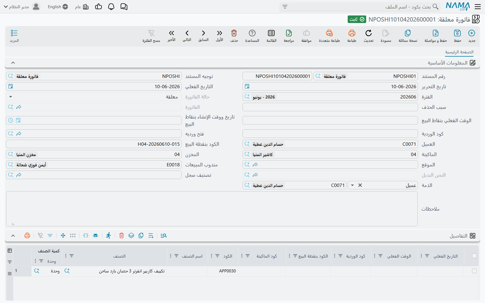
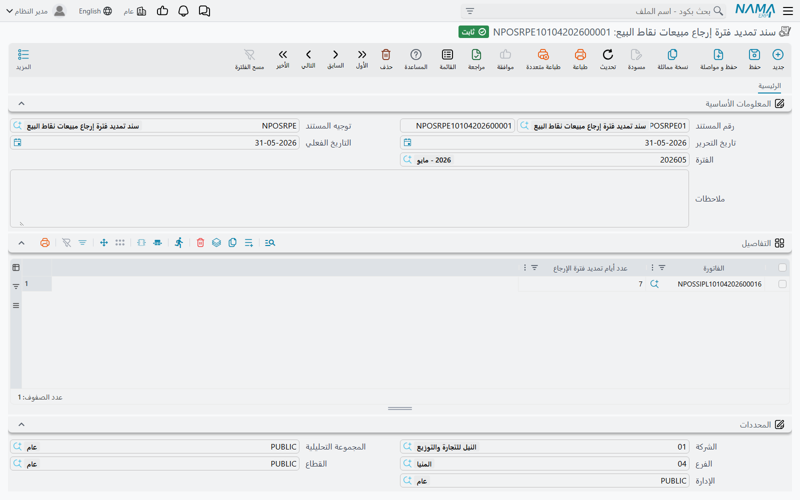

# مستندات نقاط البيع على الخادم

كل ما يفعله الكاشير على الماكينة — بيع، أو استرداد، أو صرف، أو جرد — يُحفظ على الماكينة أولًا ثم يُرسَل إلى نما كمستند (راجع [كيف تتزامن بيانات نقاط البيع مع الخادم](../pos-data-sync.md)). هذه الصفحة جولة على تلك المستندات من جهة الخادم: أين تجد كل مستند، وماذا يُنتج، وما الذي يستطيعه فريق الدعم معه وما لا يستطيعه. أما فتح الوردية وغلقها والجرد فلها صفحتها: [إعدادات فتح وغلق الوردية وتصفير النقدية](./pos-shift-close-settings.md).

## القاعدة الذهبية: مستندات الماكينة للقراءة فقط على الخادم

كل مستند تقريبًا يصل من الماكينة هو **مستند نظامي**: يمكن فتحه وطباعته واستخراج التقارير منه، لكن لا يمكن إنشاؤه يدويًا أو تعديله أو حذفه على الخادم. وأي محاولة لذلك تُرفض بالرسالة:

«مستند نظامي لا يمكنك انشاؤة أو التعديل فيه أو مسحه»

ينطبق هذا على فاتورة المبيعات، والمردود، والاستبدال، والفاتورة المعلقة، وسند الحجز، وسند إلغاء الحجز، ومستندَي الهوالك والنواقص، ومصروف ومقبوض نقاط البيع، وطلب التحويل المخزني، ولجنة الجرد، والتوريد، والإشعار الدائن، والرسالة الداخلية.

تحتفظ الماكينة بكود المستند الخاص بها، وتجده على الخادم في حقل **الكود بنقطة البيع** ومعه **كود الوردية** و**الماكينة** و**تاريخ ووقت الإنشاء بنقاط البيع**. ابحث بها حين يقرأ لك العميل رقم الإيصال. وطريقة بناء أكواد الماكينة مشروحة في [ترقيم مستندات نقاط البيع](./pos-document-numbering.md).

## البيع

كلها في **نقاط البيع ← المستندات**.

| الشاشة | الاسم الإنجليزي | ما هي |
|---|---|---|
| فاتورة مبيعات نقاط البيع | POS Sales Invoice | عملية بيع. ينتج توجيهها القيد المحاسبي وصرف المخزون. |
| فاتورة معلقة | Held Invoice | نسخة من فاتورة علّقها الكاشير. لا تُرسَل إلا إذا كان خيار **إرسال الفواتير المعلقة عند غلق الوردية أو حذف الفاتورة المعلقة** مفعَّلًا في إعدادات نقاط البيع. |
| سند حجز اوردر نقاط بيع | POS Order Reservation | طلب يؤخذ الآن ويُسلَّم أو يُستلم لاحقًا. ينتج توجيهه، كالبيع، القيد المحاسبي وصرف المخزون. |
| سند إلغاء حجز اوردر نقاط بيع | POS Cancel Reservation | يلغي حجزًا. ينتج توجيهه القيد المحاسبي. |

**فاتورة مبيعات نقاط البيع.** تعرض الصفحة الرئيسية الرأس الذي ملأته الماكينة — العميل، والمندوب، والمخزن، وتصنيف الفاتورة، و**سند الحجز** إن كانت الفاتورة إتمامًا لحجز، و**من تطبيق كابتن أوردر** إن أنشأها هاتف النادل — ثم سطور الأصناف. وصفحة **طرق الدفع** تبيّن كيف دفع العميل. وفي قائمة **المزيد** إجراء **سندات سداد الدفعات** للفواتير المباعة بالتقسيط.

::: info فاتورة واحدة على الخادم قد تضم إيصالات كثيرة
إذا كانت **طريقة تجميع فواتير نقاط البيع** في إعدادات نقاط البيع = **تجميع الفواتير**، يضيف الخادم كل إيصال نقدي جديد إلى فاتورة مبيعات نقاط بيع موجودة لنفس الوردية والعميل والمندوب والمستخدم، حتى يبلغ **أقصي عدد لسطور الفاتورة**. ويحمل كل سطر **الكود بنقطة البيع** الخاص به، فابحث في السطور لا في الرأس وحده. ولا تُدمج أبدًا الفواتير التي فيها جزء آجل، أو خصم على الرأس، أو التي تتبع استبدالًا. راجع [شاشة إعدادات نقاط البيع](./pos-settings-screen.md).
:::

**الفاتورة المعلقة.** تكون **حالة الفاتورة** = **معلقة** ما دامت عند الكاشير، و**حذف** إذا حذفها الكاشير (مع **سبب الحذف** الذي كتبه)، و**مفوتر كلياً** بعد دفعها — وعندها يشير حقل الفاتورة إلى فاتورة مبيعات نقاط البيع. استخدمها لتجيب عن سؤال «ماذا حدث للطلب الذي كان معلّقًا؟».

## المردودات والاستبدال

| الشاشة | الاسم الإنجليزي | ما هي |
|---|---|---|
| مردود نقاط البيع | POS Sales Return | استرداد. ينتج توجيهه القيد العكسي واستلام البضاعة إلى المخزون. |
| إستبدال مبيعات نقاط البيع | POS Sales Replacement | استبدال. يربط مردود نقاط بيع (ما رجع) بفاتورة مبيعات نقاط بيع (ما خرج). |
| سند تمديد فترة إرجاع مبيعات نقاط البيع | Nama POS Return Period Extension | يمنح فواتير بعينها أيامًا إضافية للإرجاع. |

**إستبدال مبيعات نقاط البيع.** الاستبدال نفسه لا يحمل قيدًا: ترسل الماكينة الجزء الراجع كمردود نقاط بيع، والجزء الجديد كفاتورة مبيعات نقاط بيع، ويربط الاستبدال بينهما. وإذا أُلغي الاستبدال على الخادم تُحذف معه الفاتورة والمردود المرتبطان به.

وللمردود والاستبدال، مثل الفاتورة، إجراء **سندات سداد الدفعات** في قائمة **المزيد**: يفتح في قائمة منبثقة مستندات السداد التي سدّدت أقساط المستند.

**سند تمديد فترة إرجاع مبيعات نقاط البيع.** لا تقبل الماكينة المردود إلا خلال **ارتجاع الفواتير في خلال (بالأيام)** من تاريخ الفاتورة (يُحدَّد في [الماكينة](./pos-register-setup.md)). فإذا وافق المدير على قبول مردود متأخر، أنشئ على الخادم **سند تمديد فترة إرجاع مبيعات نقاط البيع** — وهو مستند عادي تنشئه بنفسك — وأضف سطرًا لكل فاتورة فيه **عدد أيام تمديد فترة الإرجاع**.

وعلى الماكينة، يستخدم الكاشير الذي لديه في صلاحيات نقاط البيع **إمكانية عمل مردود بعد تجاوز مدة المردود المسموح بها** الإجراءَ **عمل مردود بعد تجاوز مدة المردود المسموح بها** ويكتب كود الفاتورة؛ فتسأل الماكينة الخادم عن عدد أيام التمديد لتلك الفاتورة (تُجمع كل سطور التمديد الخاصة بها) وتضيفها إلى المدة العادية. ولا بد أن تكون الماكينة متصلة بالخادم.

**مثال.** مدة الإرجاع 14 يومًا. عاد عميل في اليوم العشرين بغلاية معطوبة. ينشئ المدير سند تمديد فيه الفاتورة و10 أيام؛ ويستخدم الكاشير إجراء المردود بعد تجاوز المدة، فيُقبل المردود لأن 20 أقل من 14 + 10.

## النقدية الداخلة إلى الدرج والخارجة منه

| الشاشة | الاسم الإنجليزي | ما هي |
|---|---|---|
| مصروف نقاط البيع | POS Payment | نقدية تُسحب من الدرج. |
| مقبوض نقاط البيع | POS Receipt | نقدية تُضاف إلى الدرج. |

كلاهما ينتج قيدًا محاسبيًا من توجيهه، مقابل الطرف الذي اختاره الكاشير. وأي توجيه تستخدمه الماكينة يُحدَّد في جداول التوجيهات فيها — راجع [توجيهات مستندات نقاط البيع](./pos-document-terms.md).

## المخزون

| الشاشة | الاسم الإنجليزي | ما هي |
|---|---|---|
| توريد نقاط البيع | POS Stock Receipt | بضاعة استلمها المحل. يحدد توجيهه هل يُولَّد له سند استلام مخزني. |
| طلب تحويل مخزني نقاط البيع | POS Stock Transfer Request | طلب نقل مخزون بين المحل ومخزن آخر. |
| لجنة جرد نقط بيع | Point of Sale StockTaking Details Document | جرد فعلي أُجري على الماكينة. |
| مستند النواقص | Shortfalls Document | أصناف يبلّغ المحل أنها ناقصة أو قاربت على النفاد. |
| مستند الهوالك | Scrap Document | أصناف شطبها المحل لتلفها أو عدم صلاحيتها. |

**طلب التحويل المخزني.** يُكمل المخزن المرسِل أو المستلِم النقل بـ **سند تحويل مخزني** عادي يختار طلب نقاط البيع مستندًا مصدرًا له.

**لجنة الجرد.** يصل الجرد ومعه الماكينة والوردية و**كود مستند الجرد في نقاط البيع**. ولاستخدامه في دورة الجرد في سلسلة التوريد، اضغط **تحويل إلى لجنة جرد** في الصفحة الرئيسية: فيُفتح سجل **لجنة جرد مخزني** جديد منسوخًا فيه المخزن والموقع وسطور الجرد، جاهزًا للمراجعة والحفظ. ولا بد أن يكون مستند نقاط البيع محفوظًا أولًا.

مستندا الهوالك والنواقص مشروحان من جهة الكاشير في [العمليات المخزنية على الماكينة](../pos-inventory-operations.md)؛ وعلى الخادم يحدد توجيه كل منهما أي أثر مخزني له.

## ملفات تنشئها الماكينات

في **نقاط البيع ← الملفات**.

| الشاشة | الاسم الإنجليزي | ما هي |
|---|---|---|
| إشعار دائن نقاط البيع | POS Credit Note | رصيد دائن أصدرته الماكينة — غالبًا من مردود — ينفقه العميل لاحقًا. |
| رسالة نقاط بيع داخليه | POS Internal Message | رسالة أرسلها الكاشير من الماكينة إلى خمسة موظفين على الأكثر. |

**إشعار دائن نقاط البيع.** يعرض المبلغ، و**العميل**، و**منشأة من** (المستند الذي أصدره)، و**المتبقي**، وجدولًا بالفواتير التي سُدِّدت به حتى الآن. هنا تبحث حين يقول العميل إن إشعاره «ليس فيه رصيد».

**رسالة نقاط بيع داخليه.** تحمل المستلمين (**إلي موظف 1** … **5**) والماكينة والتاريخ و**نص الرساله**. وكيف يرسلها الكاشير ويقرؤها مشروح في [التقارير والأدوات](../pos-reports-and-tools.md).

## المراجع العامة: جعل أي سجل قابلًا للاختيار على الماكينة

بعض شاشات الماكينة تسمح للكاشير باختيار «أي» سجل — مثلًا قد يكون الطرف الآخر في المصروف موظفًا أو موردًا أو خزينة. والماكينة لا تحمل كل سجلات النظام، فتختار أنت ما تستلمه منها:

- **المرجع العام لنقاط البيع** (POS Generic Reference، **نقاط البيع ← الملفات**) — سجل لكل شيء تريد إرساله: أعطه كودًا واسمًا واختر **مرجع** السجل الذي يمثله.
- **المرجع العام المجمع لنقاط البيع** (POS Aggregated Generic Reference) — الشيء نفسه دفعة واحدة: سطر لكل سجل (كود، أسماء، مرجع، ومحددات اختيارية). حفظه ينشئ أو يحدّث مرجعًا عامًا لنقاط البيع لكل سطر، ويحذف المراجع التي حذفت سطورها. ويأخذ كل سجل مولَّد محددات سطره، أو محددات الرأس إن لم يكن للسطر محددات.

كلاهما ملف عادي تديره على الخادم.
