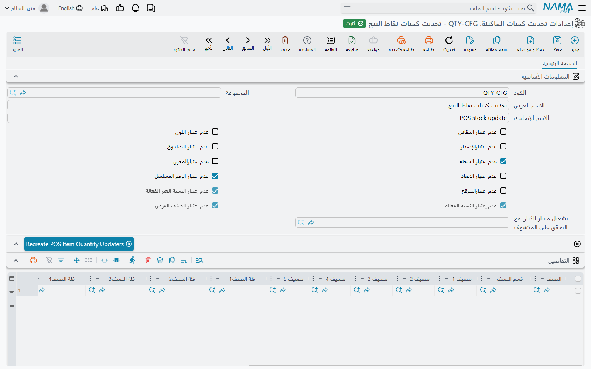
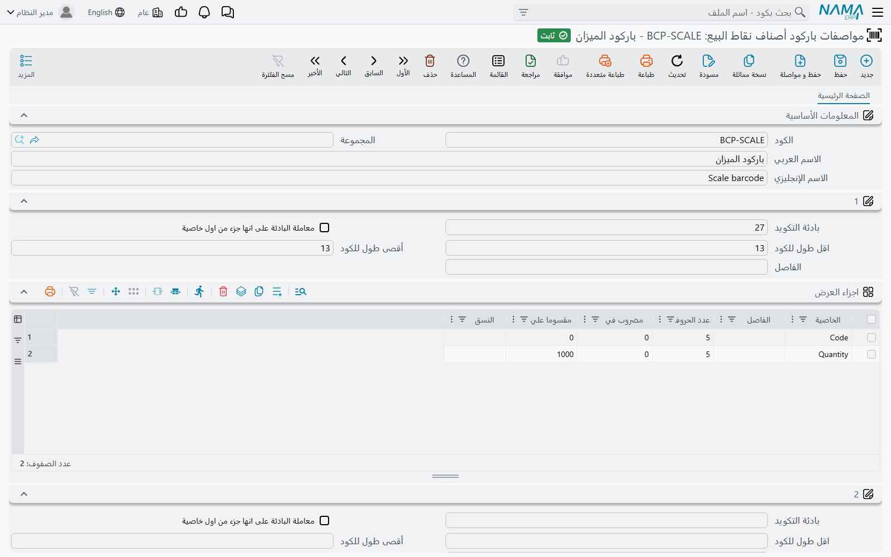
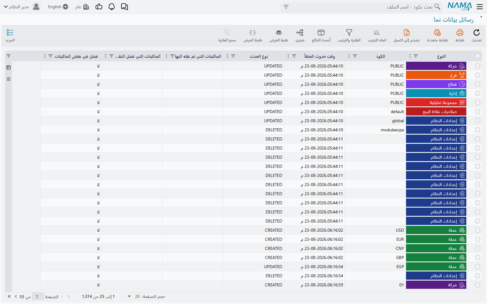

# ما الذي تستلمه الماكينة: الأصناف والباركود وإعدادات المزامنة

لا تعرف الماكينة إلا ما يرسله إليها الخادم. الأصناف والأسعار والعملاء والإعدادات تنزل عبر المزامنة الموصوفة في [كيف تتزامن بيانات نقاط البيع مع الخادم](../pos-data-sync.md)؛ أما هذه الصفحة فعن الشاشات التي تشكّل هذه الحركة — أي الأصناف تصل إلى الماكينة أصلًا، وكيف تقرأ باركود الميزان أو GS1، وكيف تتحقق من مخزون لا تراه، وأي المستندات يجب أن تصل إلى الخادم قبل حفظها، وكيف تراقب ما ينتظر النزول أو تعيد ترتيبه.

كل هذه الشاشات في **نقاط البيع ← الإعدادات**، ما عدا مواصفات الباركود ففي **نقاط البيع ← الملفات**. ويُختار كل منها في حقل في **إعدادات نقاط البيع** (لكل الماكينات) ومرة أخرى في **ماكينة** — فإن مُلئ حقل الماكينة نفسها قُدِّم لتلك الماكينة.

## أي الأصناف تصل إلى الماكينة

نادرًا ما تريد سلسلة المحلات كل الأصناف على كل كاشير. كاونتر المخبز لا يحتاج كتالوج الأدوات، والفرع الذي لا يبيع صنفًا ما لا ينبغي أن يراه. يتحكم في ذلك ملفان من النوع نفسه:

- **الأصناف المرسلة لنقاط البيع** (Pos Items To Send) — إن كان للماكينة ملف منه، فلا تستلم **إلا** الأصناف المطابقة له.
- **الأصناف الغير مرسله لنقاط البيع** (Pos Items To Not Send) — الأصناف المطابقة له **لا تُرسَل أبدًا**، حتى لو طابقت القائمة السابقة أيضًا.

الحقلان يشيران إلى نوع السجل نفسه، **الأصناف المرسلة لنقاط البيع** (**نقاط البيع ← الإعدادات ← الأصناف المرسلة لنقاط البيع**). جدوله يطابق الأصناف بـ **الصنف**، أو بأي تركيبة من **قسم الصنف** و**الماركة** و**فئة الصنف1**–**5** و**تصنيف 1**–**10** — فالسطر الذي فيه «القسم = مخبوزات» فقط يطابق كل أصناف المخبوزات. ويُطبَّق المرشح نفسه على سطور قوائم الأسعار والعروض، فلا تستلم الماكينة أسعارًا لأصناف ليست عندها.

وبشكل مستقل، أي صنف مفعَّل عليه **عدم النقل الي نقاط البيع** في ملف الصنف لا يصل إلى أي ماكينة، ولا يمكن وضعه في قائمة أصناف مرسلة.

عند حفظ القائمة، تُعاد حفظ الأصناف التي أُضيفت إليها أو حُذفت منها في الخلفية، حتى يصل التغيير فعلًا إلى الماكينات. في الكتالوج الكبير قد يستغرق ذلك وقتًا؛ فعّل **عدم إعادة حفظ الأصناف مع الحفظ** لتخطيه.

ويمكن لقائمة أسعار البيع أن تتولى القائمة عنك: حدّد فيها حقل **إضافة الأصناف الي "الأصناف المرسلة لنقاط البيع"**، فكلما حُفظت قائمة الأسعار حلّت أصنافها محل سطور ذلك الملف. الملف الذي يُدار بهذه الطريقة لا يمكن تعديله يدويًا، ولا يجوز أن تغذّي قائمتا أسعار الملف نفسه.

## التحقق من المخزون على الماكينة

ليس للماكينة رصيد مخزون خاص بها. فإن أردت أن ترفض بيعًا يُنزل صنفًا تحت الصفر، فأعطها **إعدادات تحديث كميات الماكينة** (POS Item Quantity Update Configuration، **نقاط البيع ← الإعدادات ← إعدادات تحديث كميات الماكينة**). بدونها لا تتحقق الماكينة من المخزون عند حفظ الفاتورة.

حين توجد الإعدادات:

1. يحتفظ الخادم بكمية متاحة محدَّثة لكل صنف ومخزن تغطيه الإعدادات، وتنزّل الماكينة هذه الكميات في الخلفية.
2. عند حفظ فاتورة (لا تعليقها) تسأل الماكينة الخادم هل الكميات متاحة — مضيفةً كميات الفواتير **المعلقة** على تلك الماكينة، لأنها هي الأخرى على وشك مغادرة الرف. فإن أجاب الخادم بالرفض رُفض الحفظ برسالة المخزون الخاصة بالخادم.
3. إن تعذّر الوصول إلى الخادم، تتحقق الماكينة من آخر كميات نزّلتها، مطروحًا منها الفواتير التي أصدرتها بعدها.

حقول الإعدادات:

| الحقل على الشاشة | الاسم الإنجليزي | ما يفعله |
|---|---|---|
| عدم اعتبار المقاس / اللون / الإصدار / الصندوق / الشحنة / الرقم المسلسل / الابعاد / الموقع / الصنف الفرعي / المخزن | Do Not Consider Size / Color / … | يجمع الكميات عبر هذا المحدد. محل الأحذية الذي يكفيه أن يبقى *أي* مقاس يفعّل **عدم اعتبار المقاس**. |
| عدم إعتبار النسبة الغير الفعالة / عدم إعتبار النسبة الفعالة | Do Not Consider Active Percentage / Inactive Percentage | الأمر نفسه لمحددي النسبة الفعالة وغير الفعالة. |
| تشغيل مسار الكيان مع التحقق على المكشوف | Run Entity Flow With OverDraft Validation | مسار كيان يدوي يشغّله الخادم مع التحقق، للقواعد الخاصة. يجب أن تكون كل سطور المسار يدوية. |
| جدول التفاصيل | Details | أي الأصناف والمخازن تُتابَع: بالصنف أو القسم أو التصنيفات 1–10 أو الفئات 1–5 وحتى 20 مخزنًا. الجدول الفارغ يتابع كل شيء. |
| جدول الأصناف المسموح بالسحب على المكشوف منها | Allowed Over Draft Items | أصناف (بالأعمدة نفسها) يجوز بيعها تحت الصفر — فتُستبعد من التحقق. |

بعد إنشاء الإعدادات، أو بعد تغيير ما تغطيه، اضغط **Recreate POS Item Quantity Updaters** (ليس للزر عنوان عربي فيظهر بالإنجليزية على الشاشات العربية أيضًا). يبني الزر الكميات المتابَعة لكل رصيد غير صفري حالي، فلا تضطر الماكينات إلى انتظار حركة كل صنف لتعرف مخزونه.

**مثال.** صيدلية تتابع كل شيء ما عدا الخدمات، وتسمح ببيع الأكياس دون رصيد. تترك جدول التفاصيل فارغًا، وتضع الصنف «كيس بلاستيك» في **الأصناف المسموح بالسحب على المكشوف منها**، وتفعّل **عدم اعتبار الشحنة** لتُحسب تشغيلات الدواء معًا، ثم تضغط الزر. الكاشير الذي يمسح ست علب من صنف بقي منه أربع يُمنع، والأكياس لا تُفحص أبدًا.

## قراءة الباركود: مواصفات باركود الأصناف

ملصقات الميزان وكثير من باركودات الموردين تحمل أكثر من كود الصنف: وزنًا أو سعرًا أو تاريخ انتهاء. **مواصفات باركود أصناف نقاط البيع** (POS Item Barcode Parser، **نقاط البيع ← الملفات ← مواصفات باركود أصناف نقاط البيع**) تخبر الماكينة كيف تقسّمها. اخترها في **مواصفات باركود الأصناف** في إعدادات نقاط البيع أو في الماكينة.

في المواصفات حتى خمسة أشكال مرقّمة من **1** إلى **5**. لكل شكل:

- **بادئة التكويد** و**اقل طول للكود** و**أقصى طول للكود** — لا يُستخدم الشكل إلا للأكواد الممسوحة التي تبدأ بهذه البادئة ويقع طولها في هذا المدى.
- **معاملة البادئة على انها جزء من اول خاصية** — إبقاء البادئة بداية للجزء الأول بدل حذفها.
- جدول **اجزاء العرض**، يُقرأ من اليسار إلى اليمين. لكل جزء **الخاصية** — الكود، الكمية، سعر الوحدة، السعر الإساسي (Total)، شحنة، تاريخ الإنتهاء، المقاس، اللون وغيرها — وإما **عدد الحروف** ثابت أو **الفاصل** الذي ينهيه. و**مضروب في** و**مقسوما علي** يعدّلان الرقم، و**النسق** يحدد نمط التاريخ أو الرقم.

تجرّب الماكينة الأشكال بالترتيب وتستخدم أول شكل مناسب. فإن لم يناسب أيٌّ منها، يُبحث عن النص الممسوح ككود صنف أو باركود عادي. وأكواد GS1 DataMatrix تُتعرَّف تلقائيًا قبل تجربة أي شكل.

**مثال — ميزان.** ميزان قسم اللحوم يطبع ملصقات من 13 رقمًا: `2`، ثم كود صنف من 5 أرقام، ثم الوزن بالجرام في 5 أرقام، ثم رقم تحقق. `2 12345 01250 7` تعني 1.250 كجم من الصنف `12345`. الشكل 1:

- **بادئة التكويد** `2`، **اقل طول للكود** `13`، **أقصى طول للكود** `13`.
- الأجزاء: **الكود** بعدد حروف `5`؛ **الكمية** بعدد حروف `5` و**مقسوما علي** `1000`.

تقرأ الماكينة الصنف `12345` بكمية 1.25. ويبقى رقم التحقق زائدًا فيُتجاهل. ولو طبع الميزان السعر بدل الوزن لكان الجزء الثاني هو **السعر الإساسي** (Total) و**مقسوما علي** `100` إن كان السعر بالقروش أو الهللات.

## مستندات يجب أن تصل إلى الخادم أولًا

عادةً تحفظ الماكينة محليًا وتزامن لاحقًا. لكنك في بعض المستندات تريد كلمة الخادم قبل أن يصبح البيع نهائيًا — بيع آجل لعميل حساب يتحقق فيه الخادم من حد الائتمان مثلًا. سجل **إعدادات الحفظ في نقاط البيع** (POS Saving Settings، **نقاط البيع ← الإعدادات ← إعدادات الحفظ في نقاط البيع**)، المختار في حقل **إعدادات الحفظ في نقاط البيع** في الماكينة أو إعدادات نقاط البيع، يحدد هذه الحالات.

كل سطر في جدول **شروط إرسال الملف للنظام قبل الحفظ في نقاط البيع** يمكن أن يحدد **نوع ملف نقاط البيع** و**تصنيف الفاتورة** و**نوع الذمة** و**العميل** و**الذمة**؛ والخانات الفارغة تطابق أي شيء. المستند الذي يطابق أي سطر يُرسَل إلى الخادم أولًا ولا يُحفظ على الماكينة إلا بعد قبول الخادم له — لذا يحتاج اتصالًا يعمل في تلك اللحظة.

أما المردودات والاستبدالات على فاتورة موجودة على الخادم فتذهب إلى الخادم أولًا دائمًا، أيًّا كان ما في هذا الملف.

## تضييق شاشات البحث: المرشحات الإضافية

**Filters إضافية لنقطة البيع** (Nama POS Extra Filters، **نقاط البيع ← الإعدادات ← Filters إضافية لنقطة البيع**)، المختار في حقل **Extra Filters** في الماكينة أو إعدادات نقاط البيع، يضيف شرطًا إلى شاشة بحث على الماكينة. كل سطر يحدد **نوع المستند** (شاشة الماكينة) و**الحقل** (الحقل الذي تُضيَّق شاشة بحثه) و**Filter**.

الشرط مكتوب على قاعدة بيانات الماكينة نفسها. وداخله يُستبدل `{fieldPath}` بقيمة ذلك الحقل في المستند الجاري إدخاله، و`{uuid(…)}` بمعرّف سجل ثابت. ولأنه مكتوب على جداول الماكينة، يُعدّه عادةً فريق التطبيق.

## مراقبة ما ينزل: رسائل بيانات نما

كل تغيير يجريه الخادم على شيء تحتاجه الماكينات يوضع في طابور تقرأ منه الماكينات. وشاشة **رسائل بيانات نما** (POS Read Queue، في **نقاط البيع ← الإعدادات**) تعرض هذا الطابور: **النوع** و**الكود** و**الوقت** و**نوع الحدث** و**الماكينات التي تم نقله اليها** و**الماكينات التي فشل النقل اليها** و**فشل في بعض الماكينات**.

استخدمها حين ينقص ماكينةً سعرٌ أو صنف: رشّح بكود الصنف وانظر إلى عمودي الماكينات. الماكينة المذكورة في **الماكينات التي فشل النقل اليها** استلمت التغيير لكنها لم تستطع تطبيقه — وخطؤها في صفحة **إخطاء البيانات** في الماكينة.

ولكي تأخذ الماكينات تغييرًا ما من جديد — بعد إصلاح سبب الفشل مثلًا — حدِّد سطوره واستخدم **المزيد ← Advance** (لا نص عربي لهذا الإجراء، فيظهر بالإنجليزية على الشاشات العربية أيضًا). يختم الإجراء السطور المحددة بالوقت الحالي، فتراها كل ماكينة جديدة وتقرؤها في مزامنتها التالية.

### أي التغييرات تنزل أولًا

حين تتراكم تغييرات كثيرة — قائمة أسعار جديدة من 20,000 سطر مثلًا — تستلمها الماكينات بالترتيب الذي وضعها به الخادم في الطابور. ويغيّر هذا الترتيب سجل **إعدادات أولوية نقل البيانات للماكينة** (POS Read Queue Priority Configuration، **نقاط البيع ← الإعدادات ← إعدادات أولوية نقل البيانات للماكينة**): كل سطر يعطي **النوع** قيمة **الأولوية**، و**الأرقام الأصغر تدخل الطابور أولًا**. الأنواع غير المذكورة تأخذ 10000. احتفظ بسجل واحد فقط؛ فالخادم لا يستخدم إلا واحدًا.

**مثال.** اجعل أولوية العملاء `1` وقوائم الأسعار `20000`. عندها يصل العميل الجديد المُنشأ في الإدارة إلى الكاشيرات قبل أن ينتهي نزول تحديث قائمة الأسعار.

## تصحيح قاعدة بيانات الماكينة: POS DB Update Statement Runner

في حالات نادرة يحتاج الدعم إلى تصحيح قيمة مباشرة في قواعد البيانات المحلية للماكينات — خيار تركه إصدار معيب على قيمة خاطئة مثلًا. شاشة **POS DB Update Statement Runner** (**نقاط البيع ← الإعدادات ← POS DB Update Statement Runner**) ترسل جملة SQL واحدة إلى الماكينات فتنفّذها على قاعدة بياناتها.

| الحقل على الشاشة | الاسم الإنجليزي | المعنى |
|---|---|---|
| جملة التحديث | Update Statement | الجملة المطلوب تنفيذها. |
| مسلسل التنفيذ | Execution Serial | تنفّذ الماكينة الجملة مرة واحدة لكل مسلسل. ولتنفيذها مرة أخرى ارفع المسلسل واحفظ. |
| صالح حتي | Valid until | بعد هذا التاريخ والوقت ترفض الماكينات تنفيذها. ويجب أن يكون في المستقبل عند الحفظ. |
| الماكينات المستهدفة | Target Registers | الماكينات التي تستلمها. الفارغ يعني كلها. |

تُفحص الجملة على الخادم عند الحفظ، ومرة أخرى على كل ماكينة قبل تنفيذها. يجب أن تكون جملة `UPDATE … SET … WHERE …` واحدة على أحد جداول الماكينة نفسها؛ والحذف والإضافة وتغيير بنية الجداول واستدعاء الإجراءات والتعليقات والجمل المتعددة كلها مرفوضة. تسجّل الماكينة النتيجة في إحصاءات المزامنة، وعند الفشل تبلّغ الخادم بالخطأ كخطأ بيانات للماكينة.

## رسائل قد تظهر لك

| الرسالة | السبب | ما العمل |
|---|---|---|
| «الكمية من الصنف {0} {1} لا تكفي. الكمية المتاحه {2} . الكميه المحجوزه {3}» | سألت الماكينة الخادم ولا يوجد مخزون كافٍ. وعلى الماكينة تنتهي الرسالة بـ «، الكمية المعلقة:» والكمية الموجودة في الفواتير المعلقة. | قلّل الكمية، أو أكمل الفواتير المعلقة أو احذفها، أو أضف الصنف إلى **الأصناف المسموح بالسحب على المكشوف منها**. |
| «لا يوجد كمية للصنف …» | تحقق دون اتصال: لم تستلم الماكينة أي كمية لهذا الصنف قط. | أعد اتصال الماكينة، أو اضغط **Recreate POS Item Quantity Updaters**. |
| «اوبشن عدم النقل الي نقاط البيع في الصنف {0} في السطر {1} متفعل» | صنف عليه **عدم النقل الي نقاط البيع** موجود في قائمة أصناف مرسلة. | احذف السطر، أو ألغِ الخيار في الصنف. |
| *You can not manually edit the file {0} because it is used in the price list {1}, please change the price list instead* | القائمة تُدار من قائمة أسعار. ليس للرسالة ترجمة عربية فتظهر بالإنجليزية على الشاشات العربية أيضًا. | عدّل قائمة الأسعار. |
| *Another sales price list ({0}) is using the same POS Items To Send File {1}* | قائمتا أسعار تشيران إلى الملف نفسه. تظهر بالإنجليزية على الشاشات العربية أيضًا. | أعطِ كل قائمة أسعار ملفها الخاص. |
| «مسار الكيان {0} السطر {1} يجب ان يكون نوع يدوي» | في مسار الكيان الخاص بالتحقق على المكشوف سطر غير يدوي. | اجعل كل سطور المسار يدوية. |
| *Valid For Execution Until must be a future date and time* | حقل **صالح حتي** في جملة التحديث في الماضي. تظهر بالإنجليزية على الشاشات العربية أيضًا. | حدّد تاريخًا ووقتًا في المستقبل. |
| *The statement must contain a WHERE clause* | جملة التحديث ستغيّر كل الصفوف. تظهر بالإنجليزية على الشاشات العربية أيضًا (وكذلك بقية فحوص الجملة). | أضف شرط `WHERE`. |
