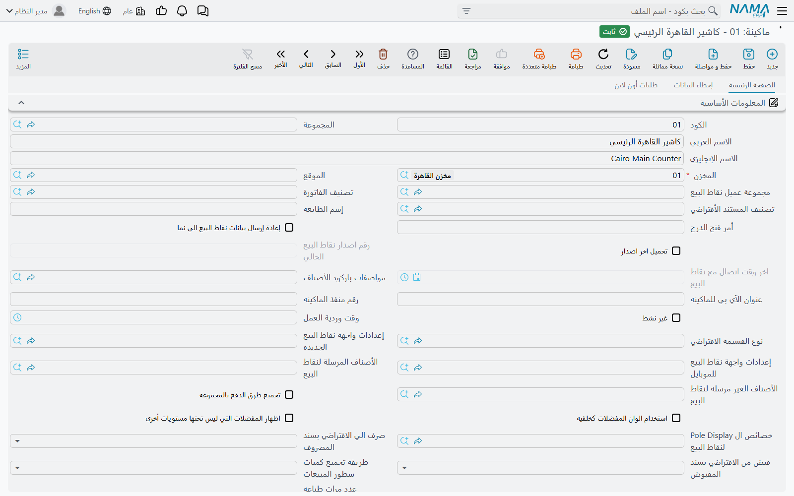
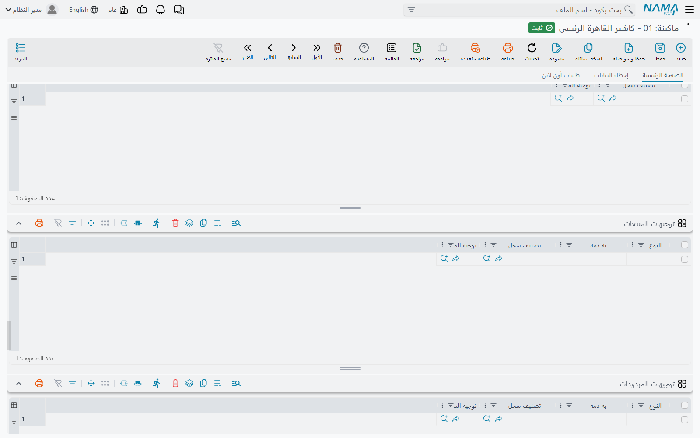
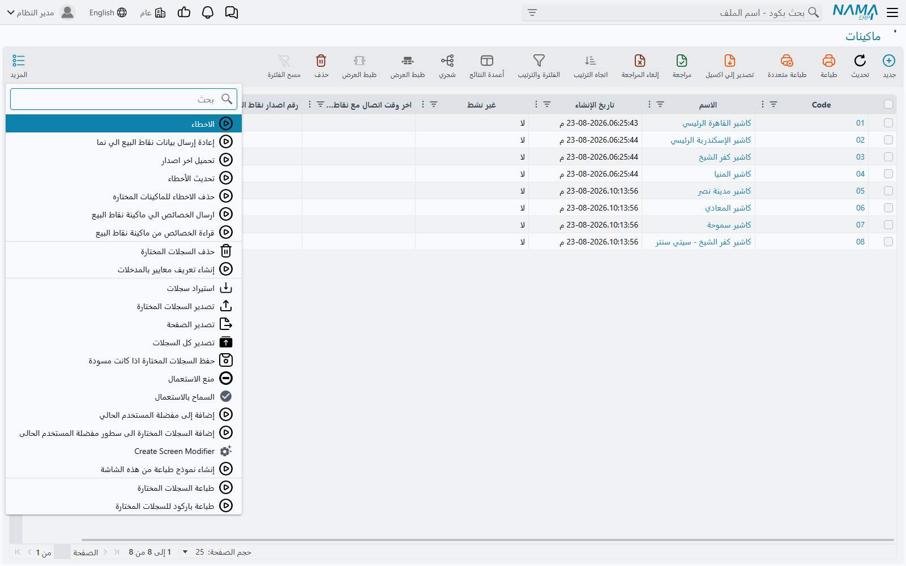

# إعداد الماكينة (Register)

كل جهاز يعمل عليه برنامج نقاط البيع من نما يُوصف على الخادم بسجل **ماكينة** واحد. نافذة الإعدادات على الجهاز نفسه لا تقول إلا *أيّ* ماكينة هو (**كود الماكينة**، راجع [تثبيت ماكينة جديدة](../pos-installation.md))؛ أما كل ما عدا ذلك — المخزن الذي تبيع منه، وطرق الدفع التي تقبلها، والتوجيهات التي تُعالَج بها مستنداتها، وطريقة طباعتها — فموجود في هذا السجل ويصل إلى الجهاز مع مزامنة البيانات. تمر هذه الصفحة على الشاشة مجموعةً مجموعة.

افتحها من **نقاط البيع ← ماكينة ← ماكينة**.

## سجل الماكينة مقابل إعدادات نقاط البيع

أغلب ما تحتاجه الماكينة يمكن ضبطه في موضعين: مرة للشركة كلها في **إعدادات نقاط البيع** (**نقاط البيع ← الإعدادات ← إعدادات نقاط البيع**)، ولكل ماكينة في سجلها. والقاعدة بسيطة: **قيمة الماكينة هي المقدَّمة إذا كانت مملوءة، وإلا تُطبَّق قيمة إعدادات نقاط البيع.** وينطبق هذا على جداول التوجيهات، وطرق الدفع، وشروط الاستبدال، ووقت وردية العمل، والأصناف المفضلة الثابتة، وحد خصم الكسور.

وعند إنشاء ماكينة جديدة تُملأ مسبقًا شروط الاستبدال، والعملات، وطرق الدفع، وجداول توجيهات المصروفات والمبيعات والمردودات، والأصناف المفضلة من إعدادات نقاط البيع، فتبدأ الماكينة الجديدة مثل غيرها ولا تغيّر إلا ما يختلف.

## الأساسيات

| الحقل على الشاشة | الاسم الإنجليزي | الغرض منه |
|---|---|---|
| المخزن | Warehouse | **إجباري.** المخزن الذي تبيع منه الماكينة وتستلم فيه. |
| الموقع | Locator | الموقع الافتراضي داخل ذلك المخزن. |
| مجموعة عميل نقاط البيع | POS Customer Group | العملاء الذين يُنشَؤون على الماكينة يُحفظون على الخادم في هذه المجموعة. يجب أن تكون مجموعة عملاء بلا تكويد آلي، لأن الماكينة تكوّد عملاءها بنفسها. |
| تصنيف الفاتورة | Invoice Classification | التصنيف الذي تبدأ به الفاتورة الجديدة. |
| تصنيف المستند الأفتراضي | Default Document Category | تصنيف السجل الذي يبدأ به المستند الجديد. |
| غير نشط | Inactive | يوقف الماكينة. الماكينة غير النشطة لا تتزامن، ولا تُحسب ضمن عدد الترخيص. |
| وقت وردية العمل | Work Shift Time | الوقت المتوقع لانتهاء الوردية (راجع [إعدادات الوردية](./pos-shift-close-settings.md)). |
| لوجو الماكينة / عنوان الدخول للماكينه | Register Logo / Register Login Title | الصورة والعنوان اللذان يظهران في شاشة الدخول على الماكينة. |
| متاح للاستخدام في تطبيق الموبايل | Available In Mobile Application | يسمح لتطبيق كابتن أوردر بالاتصال بهذه الماكينة. |
| ماكينة فرعية لكابتن أوردر | Subordinate Register For Captain Order | يجعل السجل ماكينة فرعية تستخدمها أجهزة كابتن أوردر، وتُحسب هذه ضمن حد ترخيص خاص بها. |
| وضع خدمة العملاء / قراءة الطلبات من مركز خدمة العملاء | Call Center Mode / Read Orders From Call Center | طرفا مسار مركز خدمة العملاء الموصوف في [الطاولات والحجوزات وكابتن أوردر](../pos-tables-and-restaurant.md). يمكن أن تكون الماكينة أحدهما فقط، لا كليهما. |
| تعطيل الضرائب | Stop Taxes | لا تحسب الماكينة أي ضرائب. |

ويجب أن تحمل مجموعة **المحددات** شركة فعلية — لا يمكن حفظ الماكينة على الشركة «عام» — وتحمل مجموعة **الحسابات** حسابات الماكينة وعملتها، وتُستخدم حيثما يأخذ التوجيه حسابًا «من الماكينة».

### الطباعة

| الحقل على الشاشة | الاسم الإنجليزي | الغرض منه |
|---|---|---|
| إسم الطابعه | Printer Name | الطابعة التي تطبع عليها الماكينة. |
| أمر فتح الدرج | Open Cash Drawer Command | الأمر الذي يُرسل لفتح درج النقدية. |
| عدد مرات طباعه المستندات في كل أمر طباعه | Documents Print Count | عدد النسخ في كل طباعة. |
| طباعة الفاتورة الكامله دائماً | Always Print Full Invoice | مربع «طباعة الفاتورة الكاملة» في نافذة الدفع يبدأ معلَّمًا. |
| عدم طباعه النموذج العادي في حالة طباعه النموذج الكامل | Do Not Print Normal Form With Printing Full Form | عند طباعة النموذج الكامل لا يُطبع الإيصال العادي. |
| طباعة فورمة تحضير الاوردر مع الدفع / مع تعليق الفاتوره / مع تأجيل الدفع | Print Preparation Form With Payment / With Hold / With Payment Delay | متى تُطبع ورقة التحضير (المطبخ). |

### الرسوم المضافة إلى الفاتورة

الخدمة السياحية والتوصيل والحد الأدنى للطلب تُضبط هنا أو في إعدادات نقاط البيع: **صنف الخدمة السياحية** و**نسبة الخدمة السياحية** و**الخدمة السياحية تحسب من** و**إعدادات الخدمة السياحية في نقاط البيع** وخيارات «الإضافة تلقائيًا»؛ و**صنف خدمة التوصيل** و**تكلفة التوصيل** وخياراتهما؛ و**إعدادات الحد الأدنى للطلب في نقاط البيع** و**الحد الأدنى للطلب يحسب من** و**صنف الحد الأدنى للطلب**. ولكل خيار «إضافة تلقائيًا…» ثلاث قيم: نعم، أو لا، أو الوراثة من إعدادات نقاط البيع.

### روابط إلى شاشات إعدادات أخرى

عدة حقول تشير ببساطة إلى سجل إعدادات مشترك بين الماكينات: **إعدادات واجهة نقاط البيع الجديده**، و**إعدادات واجهة نقاط البيع للموبايل**، و**الأصناف المرسلة لنقاط البيع** و**الأصناف الغير مرسله لنقاط البيع**، و**خصائص ال Pole Display لنقاط البيع**، و**مواصفات باركود الأصناف**، و**إعدادات تحديث كميات الماكينة**، و**قالب القيم الافتراضية**، و**إعدادات الحفظ في نقاط البيع**، و**Extra Filters**، و**الاختصارات**، و**أكواد الدول لأرقام العملاء**، و**إعدادات طرق الدفع**، و**Payment Terminal**، و**إعدادات نقاط المكافأة**، ودفتر ومجموعة قسيمة الخصومات. كل منها سجل مستقل له شاشته، فإعداد واحد يخدم ماكينات كثيرة.

### إبقاء الجهاز متوافقًا

| الحقل على الشاشة | الاسم الإنجليزي | ما يفعله |
|---|---|---|
| رقم اصدار نقاط البيع الحالي / اخر وقت اتصال مع نقاط البيع | POS Machine Current Release / POS Machine Last Connection Time | يملؤهما الجهاز: الإصدار الذي يعمل به وآخر مرة اتصل فيها بالخادم. أسرع فحص لحالة الماكينة. |
| إعادة إرسال بيانات نقاط البيع الي نما | Resend POS Data To Nama | حين يستلم الجهاز سجل الماكينة في المرة التالية يصفّر عدادات إعادة المحاولة ويرسل كل مستنداته غير المرسلة من جديد، ثم يزيل العلامة. |
| تحميل اخر اصدار | Download Latest Release | يحمّل الجهاز أحدث إصدار ويبدأ التحديث دون سؤال، ثم يزيل العلامة. |
| خصائص أعمدة المبيعات / خصائص الأتصال | Sales Lines Screen Properties / Connection Properties | نص تريد كتابته في ملفي إعدادات الشاشة وإعدادات الاتصال على الجهاز. |
| ارسال الخصائص الي ماكينة نقاط البيع | Send Properties To POS Register | يكتب الجهاز الحقلين السابقين في ملفاته، ثم يزيل العلامة. |
| قراءة الخصائص من ماكينة نقاط البيع | Read Properties From POS Register | يرفع الجهاز ملفاته الحالية إلى **خصائص اعمدة المبيعات المقروءه من نقطة البيع** و**خصائص الاتصال المقروءه من نقطة البيع**، فتقرأها دون زيارة المحل. |
| حذف المستندات من نقطة البيع بعد مرور (بالأيام) | Remove Documents From POS After (In Days) | يُبقي قاعدة بيانات الجهاز صغيرة: المستندات المرسلة إلى الخادم والأقدم من هذه المدة تُحذف من الجهاز. |

هذه العلامات لا تعمل إلا حين يستلم الجهاز سجل الماكينة المعدَّل — فالجهاز المغلق ينفّذها في أول مزامنة بعد تشغيله.

## شروط و سياسة الإستبدال

**ارتجاع الفواتير في خلال (بالأيام)** و**إستبدال خلال (بالأيام)** يحددان أقصى عمر للفاتورة في المردود والاستبدال، و**شرط نصي 1–5** هي سطور السياسة التي تُطبع للعميل. القيم الفارغة تؤخذ من إعدادات نقاط البيع. والكاشير الذي في صلاحياته **إمكانية عمل مردود بعد تجاوز مدة المردود المسموح بها** يستطيع مع ذلك رد فاتورة أقدم (راجع [صلاحيات نقاط البيع](./pos-security-profiles.md)).

## الجداول

### الدفاتر والتوجيهات

سطر لكل نوع مستند يخبر الخادم بأي **دفتر** و**توجيه المستند** تُعطى المستندات التي ترسلها هذه الماكينة. يجب أن يكون الدفتر للنوع نفسه وألا يكون دفترًا نظاميًا، والتوجيه إجباري (إلا للجنة الجرد).

- **التوجيه في حالة حدوث خطأ** — لمستندات المبيعات: إذا لم يستطع الخادم حفظ المستند بسبب عدم كفاية الكمية، يعيد حفظه بهذا التوجيه بدل تركه في الأخطاء. الاستخدام المعتاد توجيه يسمح بالسحب على المكشوف.
- **النوع الفرعى** — لفاتورة مبيعات نقاط البيع فقط: *عادي* أو *خدمة*. سطر *خدمة* يعطي الفواتير المكوّنة بالكامل من أصناف خدمية توجيهًا خاصًا بها.

### طرق الدفع والعملات

**العملات** تحدد العملات التي تقبلها الماكينة. و**طرق الدفع** تحدد الطرق التي تعرضها نافذة الدفع:

| العمود على الشاشة | الاسم الإنجليزي | المعنى |
|---|---|---|
| طريقة الدفع | Payment Method | الطريقة، ولا تتكرر. |
| ترتيب الظهور في برنامج نقاط البيع | Appearance order in Point Of Sale | ترتيبها في نافذة الدفع، ولا يشترك سطران في ترتيب واحد. |
| طريقة الدفع النقدي | Cash Payment Method | الطريقة التي تُعتبر **النقدية** — للباقي، والدرج، وتصفير النقدية عند غلق الوردية. لا يُعلَّم إلا سطر واحد. |
| طريقة الدفع الافتراضية | Default Payment Method | الطريقة التي تبدأ عليها نافذة الدفع. |
| عرض في طرق الدفع الإضافية | Show In Additional Methods | تظهر الطريقة ضمن الطرق الإضافية لا بين الأزرار الرئيسية. |

إذا لم يكن للماكينة طرق دفع خاصة بها يُستخدم جدول **طرق الدفع** في إعدادات نقاط البيع، بما في ذلك تحديد طريقة الدفع النقدي.

### أي توجيه يأخذه كل مستند

أربعة جداول تختار التوجيه بحسب الحالة، قبل اللجوء إلى توجيه **الدفاتر والتوجيهات** كقيمة احتياطية. يُقرأ كل جدول من الماكينة إذا كانت فيه سطور، وإلا من إعدادات نقاط البيع، و**أول سطر مطابق** هو المستخدم.

| الجدول على الشاشة | الاسم الإنجليزي | يطابق السطر حين… |
|---|---|---|
| توجيهات المبيعات | Sales Terms | يكون **النوع** *العميل مطلوب* إذا كان في الفاتورة عميل (و*العميل غير مطلوب* إذا لم يكن)، ويطابق **به ذمه** ما إذا كانت الفاتورة تحمل ذمة (طرفًا آجلًا)، ويكون **تصنيف سجل** فارغًا أو مساويًا لتصنيف الفاتورة. |
| توجيهات المردودات | Sales Return Terms | يكون **النوع** *كاش* أو *إلي إشعار* بحسب طريقة رد المبلغ، ويطابق **به ذمه**، ويكون **تصنيف سجل** فارغًا أو مساويًا. |
| توجيهات المصروفات | Payment Terms | يطابق **النوع** (*من الماكينة*، *من الموظف الحالي*، *إلي إشعار*) نوع الصرف، أو يطابق **تصنيف سجل**. |
| توجيهات المقبوضات | Receipt Terms | يكون **تصنيف سجل** فارغًا أو مساويًا لتصنيف المقبوض. |

وبهذا تستطيع سلسلة المحلات معالجة المبيعات النقدية للعملاء العابرين والمبيعات الآجلة للشركات بتوجيهين مختلفين، دون أن يختار الكاشير شيئًا.

### المفضلات

**الأصناف المفضلة** تضع الأصناف على أزرار مفضلة حتى خمسة مستويات؛ و**الأصناف المفضلة الثابتة** تثبّت أصنافًا أو مجموعات على شاشة البيع دائمًا (وقائمة الماكينة تحل محل قائمة الإعدادات إن كانت فيها سطور)؛ و**المستندات المفضله** تضيف أزرارًا في شريط الأدوات تفتح نوع مستند بعنوان عربي وإنجليزي وتصنيف سجل خاص.

### الطاولات

حين يكون **إستخدام الطاولات** معلَّمًا في إعدادات نقاط البيع يظهر جدول **الطاولات** بسجلات **صالة نقاط البيع** و**طاولة نقاط البيع** التي تخدمها هذه الماكينة. الصالات (**نقاط البيع ← ماكينة ← صالة نقاط البيع**) سجلات بسيطة بكود واسم، وكل **طاولة** (**نقاط البيع ← ماكينة ← طاولة نقاط البيع**) تتبع صالة واحدة. أما استخدام الصالة على الكاشير فموصوف في [الطاولات والحجوزات وكابتن أوردر](../pos-tables-and-restaurant.md).

### جداول أخرى

- **تكويد مستندات نقاط البيع** وزر **تكويد مستندات نقاط البيع آليا** فوقه — راجع [ترقيم مستندات نقاط البيع](./pos-document-numbering.md).
- **العناصر المجرودة مع كل وردية** — راجع [إعدادات الوردية](./pos-shift-close-settings.md).
- **المستخدمين المسموح لهم** — إذا كانت فيه سطور فلا يدخل على هذا الجهاز إلا المستخدمون المدرجون. وإن كان فارغًا فالجميع مسموح لهم.

## إعدادات نقطة بيع إيصال إلكتروني (مصر)

في منظومة الإيصال الإلكتروني المصرية تُعد كل ماكينة جهاز نقطة بيع مسجَّلًا. تحمل المجموعة **إعدادات مصلحة الضرائب** وبيانات الجهاز: **POS Serial Number** و**POS Client ID** و**POS Client Secret** و**POS OS Version** و**POS Model Framework** و**Syndicate License Number**. بعد الحفظ اضغط **تفعيل نقطة البيع على بوابة الإيصال الإلكتروني** لتسجيل الجهاز في البوابة. وباقي الإعداد في [الفاتورة والإيصال الإلكتروني المصري](../../invoicing/egypt-einvoice-guide.md).

## صفحتا إخطاء البيانات وطلبات أون لاين

**إخطاء البيانات** تعرض مستندات هذه الماكينة التي لم يستطع الخادم حفظها — النوع والكود والتاريخ الفعلي ووقت وصول الخطأ لنما ورسالة الفشل. ومن قائمة **المزيد** فيها تستطيع **حذف الأخطاء المختاره** بعد معالجتها، أو **تحديث الأخطاء**. و**تحديث الأخطاء** — الموجود أيضًا في قائمة **المزيد** لسجل الماكينة — يحذف سطور الأخطاء التي حُفظت مستنداتها بنجاح في محاولة لاحقة، ويعرض *{0} error line(s) were removed* (بالإنجليزية، إذ لا ترجمة عربية لهذه الرسالة). أما ما يُفعل بمستند يستمر فشله فموضَّح في [مزامنة بيانات نقاط البيع مع الخادم](../pos-data-sync.md).

**طلبات أون لاين** تعرض طلبات مركز خدمة العملاء والطلبات الإلكترونية الموجَّهة إلى هذه الماكينة، بالعميل والحالة وتاريخ آخر تحديث.

## إجراءات قائمة الماكينات

حدد ماكينة أو أكثر في القائمة واستخدم **المزيد**:

| الإجراء على الشاشة | الاسم الإنجليزي | ما يفعله |
|---|---|---|
| إعادة إرسال بيانات نقاط البيع الي نما | Resend POS Data To Nama | يعلّم إعادة الإرسال في كل ماكينة محددة (انظر أعلاه). |
| تحميل اخر اصدار | Download Latest Release | يعلّم التحديث في كل ماكينة محددة. |
| ارسال الخصائص الي ماكينة نقاط البيع | Send Properties To POS Register | يعلّم إرسال الخصائص. |
| قراءة الخصائص من ماكينة نقاط البيع | Read Properties From POS Register | يعلّم قراءة الخصائص. |
| تحديث الأخطاء | Refresh Errors | يحذف سطور الأخطاء التي حُلَّت، لكل الماكينات. |
| حذف الاخطاء للماكينات المختاره | Delete Errors For Selected Registers | يحذف كل سطور الأخطاء للماكينات المحددة. |

وتعرض القائمة أيضًا **غير نشط** و**اخر وقت اتصال مع نقاط البيع** و**رقم اصدار نقاط البيع الحالي** و**تحميل اخر اصدار** و**المخزن**، فتعرف بنظرة واحدة أي الأجهزة متأخر في الإصدار أو توقفت مزامنته.

## رسائل قد تظهر لك

| الرسالة | السبب | ما العمل |
|---|---|---|
| «لا يمكن الحفظ , عدد الماكينات لا يمكن ان يتخطي {0}» | حفظ هذه الماكينة النشطة يتجاوز عدد الماكينات المسموح به في الترخيص. | اجعل ماكينة غير مستخدمة **غير نشط**، أو وسّع الترخيص. |
| «لا يمكن الحفظ , عدد الماكينات الفرعية الخاصة بكابتن أوردر لا يمكن ان يتخطي {0}» | الأمر نفسه للماكينات الفرعية لكابتن أوردر. | كما سبق. |
| «اكثر من طريقة دفع إفتراضيه» | سطران في طرق الدفع معلَّم عليهما **طريقة الدفع النقدي**. | علّم سطرًا واحدًا فقط. |
| «اكثر من طريقة دفع لهم نفس الترتيب» | سطران لهما **ترتيب الظهور** نفسه. | أعطِ كل سطر رقمًا مختلفًا. |
| «طريقة دفع مكرره» | طريقة دفع مكررة. | احذف المكرر. |
| «لا يمكن الحفظ علي الشركة عام» | لا شركة في المحددات. | اختر شركة الماكينة. |
| «هذه المجموعة ليست لعميل» | **مجموعة عميل نقاط البيع** ليست مجموعة عملاء. | اختر مجموعة عملاء. |
| «مجموعة عملاء نقاط البيع يجب الا يكون بها تكويد آلي» | المجموعة المختارة تكوّد العملاء آليًا. | استخدم مجموعة بلا تكويد آلي. |
| «الدفتر {0} فى السطر {1} نظامى» | اختير دفتر نظامي في **الدفاتر والتوجيهات**. | اختر دفترًا عاديًا. |
| «الدفتر {0} للنوع {1}، بينما النوع المختار {2} فى السطر {3}» | الدفتر لنوع مستند آخر. | اختر دفترًا من نوع السطر. |
| «التوجيه {0} للنوع {1}، بينما النوع المختار {2} فى السطر {3}» | التوجيه لنوع مستند آخر. | اختر توجيهًا من نوع السطر. |
| «النوع {0} فى السطر {1} مكرر للسطر {2}، للنوع الفرعى {3}» | سطران في **الدفاتر والتوجيهات** للنوع والنوع الفرعي نفسيهما. | أبقِ سطرًا واحدًا. |
| «النوع الفرعى يجب أن يكون عادى أو فارغ للنوع {0}» | حُدد نوع فرعي لنوع غير فاتورة المبيعات. | امسحه. |
| *The register {0} is inactive* | إجراء من القائمة أو اتصال مزامنة لماكينة غير نشطة. ليس لهذه الرسالة ترجمة عربية فتظهر بالإنجليزية على الشاشات العربية أيضًا. | أزل علامة **غير نشط** إن عادت الماكينة للعمل. |
| «المستخدم ({0}) لا يمكنه الدخول على هذه الماكينة ({1})» | تظهر على الجهاز: المستخدم ليس في **المستخدمين المسموح لهم**. | أضف المستخدم، أو ادخل على جهاز مسموح له به. |
| «من فضلك قم باختيار إعدادات مصلحة الضرائب» | ضُغط **تفعيل نقطة البيع على بوابة الإيصال الإلكتروني** دون إعدادات مصلحة الضرائب. | املأ **إعدادات مصلحة الضرائب** واحفظ أولًا. |
