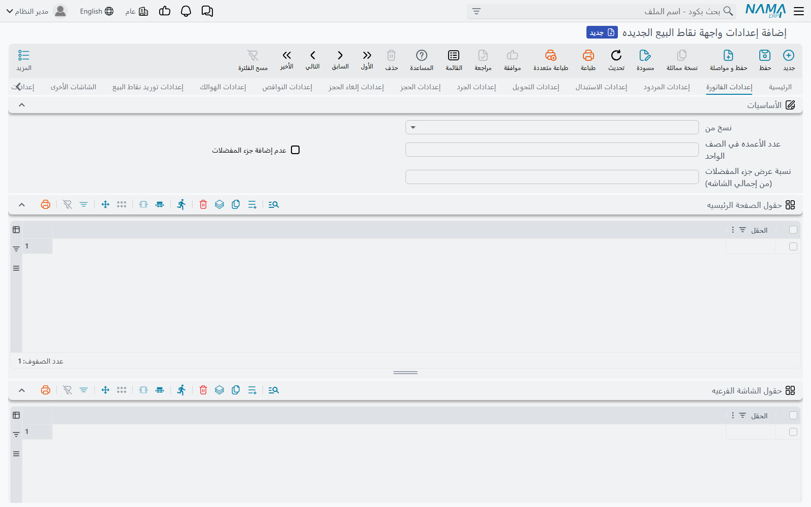
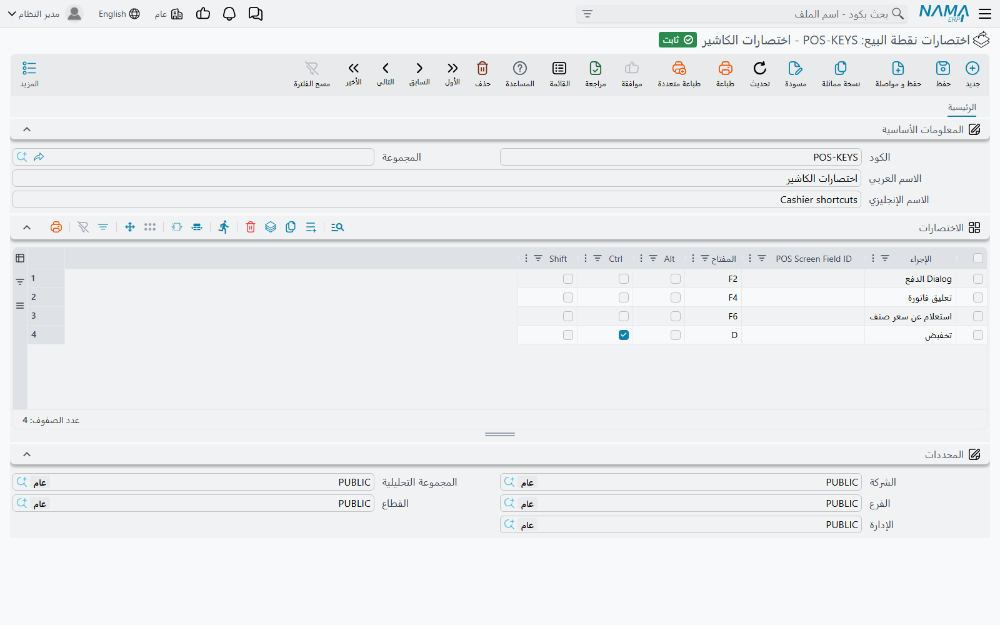
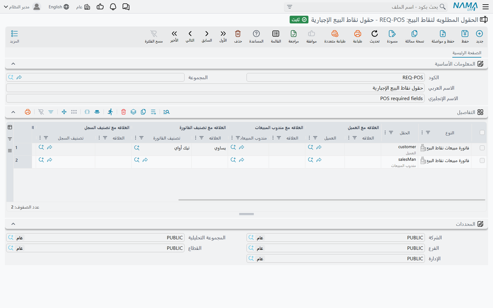

# إعدادات الشاشة ولوحة المفاتيح والأجهزة

ماكينة السوبر ماركت لا ينبغي أن تشبه ماكينة المقهى. السوبر ماركت يريد جدول أصناف كبيرًا فيه الباركود والوحدة وتاريخ الانتهاء؛ والمقهى يريد أزرار مفضلات كبيرة وأزرار طاولات. تغطي هذه الصفحة سجلات الإعدادات التي تشكّل ما يراه الكاشير وما يكتبه: تخطيط الشاشات، وهاتف النادل، واختصارات لوحة المفاتيح، وشاشة العميل (Pole Display)، والقيم الافتراضية، والحقول المطلوبة، وأكواد الدول للهواتف، وطرق الدفع التي تظهر. وكلها في **نقاط البيع ← الإعدادات**.

## كيف تجد الماكينة إعداداتها

معظم هذه السجلات **تُربط**: تنشئ سجلًا أو أكثر ثم تختار واحدًا في **ماكينة** أو في **إعدادات نقاط البيع**. ما يُختار في الماكينة هو المقدَّم لها، وإلا فالمختار في إعدادات نقاط البيع ينطبق على كل الماكينات. وبعضها يُربط بالماكينة فقط، واثنان ينطبقان على الجميع دون ربط أصلًا.

| سجل الإعدادات | الاسم الإنجليزي | أين يُختار |
|---|---|---|
| إعدادات واجهة نقاط البيع الجديده | Pos UI Settings | الماكينة، وإلا إعدادات نقاط البيع (وإلا التخطيط المدمج) |
| إعدادات واجهة نقاط البيع للموبايل | Pos Mobile UI Settings | الماكينة، وإلا إعدادات نقاط البيع |
| اختصارات نقطة البيع | Nama POS Shortcuts | الماكينة، وإلا إعدادات نقاط البيع |
| أكواد الدول لأرقام عملاء نقاط البيع | POS Customer Phone Country Codes | الماكينة، وإلا إعدادات نقاط البيع |
| إعدادات طرق دفع نقاط البيع | Nama POS Payment Methods Settings | الماكينة، وإلا إعدادات نقاط البيع |
| قالب قيم افتراضيه لنقاط البيع | Pos Defaults Template | الماكينة فقط (**قالب القيم الافتراضية**) |
| خصائص ال Pole Display لنقاط البيع | Pos Pole Display Specs | الماكينة فقط |
| الحقول المطلوبه لنقاط البيع | Pos Required Fields | لا يُربط — كل سجل ينطبق على كل الماكينات |
| إعدادات دفع من خلال نقاط البيع | Payment From Pos Settings | لا يُربط — ينطبق على مستندات الخادم |

وككل إعداد، يصل التعديل إلى الماكينة مع المزامنة التالية ([كيف تتزامن بيانات نقاط البيع مع الخادم](../pos-data-sync.md)).

## تخطيط الشاشة: إعدادات واجهة نقاط البيع الجديده

هذا هو السجل الأكبر. صفحته الأولى فيها مفاتيح للماكينة كلها، ثم صفحة لكل شاشة.

**الصفحة الرئيسية.** مفاتيح تضيف أجزاء إلى شاشة البيع أو تحذفها — مثل **إضافة عمود كود الصنف في جدول المبيعات**، و**إضافة عمود الوحدة لتفاصيل المبيعات**، و**إضافة حقول اللون والمقاس**، و**إضافة تاريخ الإنتاج والانتهاء الي المبيعات**، و**إضافة حقول التخفيض 1** … 8، و**إضافة حقول الضريبة 1**، و**إضافة المخزن والموقع المخزني**، و**إضافة حقل معدل العملة**؛ ومقاسات أزرار المفضلات والطاولات (**عدد الأصناف المفضله في السطر الواحد**، و**عدد أزرار الطاولات لكل صف**، و**ارتفاع زر الطاولة**)؛ و**ملءالشاشة عند فتح شاشة البحث** و**ملءالشاشة عند فتح شاشة الدفع**؛ و**لون الإجماليات**؛ و**خطوط خاصة ب Jasper** للنماذج المطبوعة. ومجموعة **زرائر سطور المبيعات** تخفي الأزرار الصغيرة في كل سطر: التكرار، والحذف، وزيادة الكمية، وخفضها، والتحويل إلى هالك.

**صفحة لكل شاشة** — **إعدادات الفاتورة**، و**إعدادات المردود**، و**إعدادات الاستبدال**، و**إعدادات التحويل**، و**إعدادات الجرد**، و**إعدادات الحجز**، و**إعدادات إلغاء الحجز**، و**إعدادات النواقص**، و**إعدادات الهوالك**، و**إعدادات توريد نقاط البيع**. في كل منها:

- **عدد الأعمده في الصف الواحد** و**عدم إضافة جزء المفضلات** و**نسبة عرض جزء المفضلات (من إجمالي الشاشه)** — ترتيب الرأس وظهور لوحة المفضلات؛
- **حقول الصفحة الرئيسيه** — حقول الرأس الظاهرة على الشاشة نفسها؛
- **حقول الشاشة الفرعيه** — حقول نُقلت إلى الصفحة الفرعية؛
- **حقول جدول المبيعات** — أعمدة جدول الأصناف بترتيبها، ولكل منها **مقاس العرض**؛
- **نسخ من** — اختر شاشة أخرى، فتُستبدل حقول هذه الصفحة عند الحفظ بحقول تلك الشاشة. والصفحة التي تتركها فارغة تمامًا تنسخ صفحة الفاتورة تلقائيًا.

صفحة **الشاشات الأخرى** تحدد حقول نافذة العميل (**حقول شاشة العميل**، ويمكن جعل كل منها مطلوبًا) و**حقول شاشتي الصرف و القبض**. وصفحة **إعدادات أعمدة ال Search Dialogue لنقاط البيع** تختار أعمدة كل نافذة بحث وفلاترها وعدد سجلات الصفحة وترتيبها. وصفحة **الإجراءات المفضلة** تحدد إجراءات القائمة المثبتة كمفضلة.

صفحة **نافذة العميل** تحدد ما تعرضه الشاشة الثانية المواجهة للعميل — حقول الرأس وأعمدة السطور وحقول الذيل لكل نوع مستند. وزر **الإعدادات الافتراضية** يملأ الجداول الثلاثة بمجموعة جاهزة للفواتير والمردودات والاستبدالات، ثم تحذف منها ما لا تريد.

ولعرض الأعمدة تحديدًا راجع أيضًا [دليل استعمال النقاط الفنية في نقاط البيع](../nama-pos.md).

## هاتف النادل: إعدادات واجهة نقاط البيع للموبايل

تتحكم في تطبيق كابتن أوردر (راجع [الطاولات والحجوزات وكابتن أوردر](../pos-tables-and-restaurant.md)). المفاتيح تحذف أزرارًا من التطبيق — **عدم إضافة زر الدفع**، و**عدم إضافة زر الحفظ**، و**عدم إضافة زر الإرسال**، و**عدم إضافة زر إضافة صنف**، و**عدم إضافة زر تعديل صنف**، و**عدم إضافة زر الحذف**، و**عدم إضافة زر الأصناف المُفضلة** — فيستطيع النادل مثلًا إرسال الطلب إلى المطبخ دون أن يحصّل الدفع. وجدول **حقول الهيدر** يحدد حقول رأس الطلب الظاهرة على الهاتف، ولكل منها **طريقة العرض** (*الكود والاسم* أو *الاسم فقط*) و**حجم/ مساحة الحقل** (*سطر كامل* أو *نصف سطر*)؛ وجدول **حقول التفاصيل** يحدد الحقول الظاهرة لكل صنف.

## لوحة المفاتيح: اختصارات نقطة البيع

كل سطر يربط تركيبة مفاتيح إما بـ **الإجراء** — شاشة الفاتورة، تعليق فاتورة، استعلام عن سعر صنف، قفل الشاشة، إعادة طباعة المستند، ونحو خمسين غيرها — وإما بـ **POS Screen Field ID** الذي ينقل المؤشر إلى ذلك الحقل في الرأس. اختر **المفتاح** (F1–F12، الحروف، الأسهم، Enter، Esc …) وعلّم **Ctrl** و/أو **Alt** و/أو **Shift**.

يُفحص السجل عند الحفظ: السطر يحتاج إجراءً أو حقلًا (لا الاثنين)، ومفتاحًا، و**Ctrl** أو **Alt** مع أي حرف؛ ولا يجوز أن يستخدم سطران التركيبة نفسها. والاختصارات المدمجة في الماكينة مذكورة في [البداية على الماكينة](../pos-getting-started.md).

## شاشة العميل: خصائص ال Pole Display لنقاط البيع

تحدد طريقة اتصال الماكينة بشاشة العميل — **نوع الاتصال** (*CommPort* أو *Printer*) و**اسم الطابعه او رقم المنفذ** — وقوالب النص التي تظهر عند الخمول، وعند إضافة سطر أو حذفه، وللإجمالي، وللباقي. اختر السجل في حقل **خصائص ال Pole Display لنقاط البيع** في الماكينة. وصيغة القوالب موثقة في [دليل استعمال النقاط الفنية في نقاط البيع](../nama-pos.md#POS-Pole-Display-Setup).

## قيم معبّأة مسبقًا: قالب قيم افتراضيه لنقاط البيع

كل سطر يقول: لمستندات **للنوع** (فاتورة مبيعات، مردود، استبدال، توريد، طلب تحويل، جرد، حجز، إلغاء حجز، مصروف، مقبوض) اجعل **الحقل** في الرأس = هذا **مرجع** أو **نص** أو **تاريخ**. والماكينة التي فيها هذا القالب في حقل **قالب القيم الافتراضية** تفتح كل مستند جديد من ذلك النوع والقيم معبّأة فيه — مثل عميل «نقدي» في الفواتير، أو تصنيف سجل ثابت في المصروفات.

## جعل الحقول إلزامية: الحقول المطلوبه لنقاط البيع

كل سطر يحدد نوع مستند وحقلًا (**الحقل**) و**نوع الحقل**: **إجبارى** أو **يجب تركه فارغا**. ويمكن جعل القاعدة مشروطة بالعميل والمندوب وتصنيف الفاتورة وتصنيف السجل والمخزن والموقع: لكل منها اختر علاقة — **يساوي** أو **لا يساوي** أو **بدون** أو **بدون علاقه** — والقيمة التي يُقارن بها. وخيار **عدم التطبيق مع التعليق** يسمح للكاشير بتعليق المستند دون الحقل.

**مثال.** «المندوب مطلوب في فواتير مبيعات نقاط البيع التي تصنيفها *توصيل*»: نوع المستند فاتورة مبيعات نقاط البيع، والحقل المندوب، ونوع الحقل إجبارى، والعلاقة مع التصنيف **يساوي**، والتصنيف *توصيل*.

كل سجل حقول مطلوبة يصل إلى كل الماكينات؛ لا شيء يُربط. وحين تفشل القاعدة تذكر الماكينة اسم الحقل وترفض الحفظ.

## أرقام هواتف العملاء: أكواد الدول لأرقام عملاء نقاط البيع

قائمة سطور **كود الدولة** مع الاسمين العربي والإنجليزي، تُعرض على الكاشير عند إدخال رقم هاتف عميل جديد — مفيدة في المناطق السياحية التي يأتيها عملاء من دول عدة.

## أي طرق الدفع تظهر: إعدادات طرق دفع نقاط البيع

كل سطر يحدد **طريقة الدفع** والشروط التي **تُخفى** فيها من شاشة الدفع: **تصنيف سجل**، و**تصنيف الفاتورة**، و/أو **العميل** (عميل أو فئة عملاء أو تصنيف عملاء). فإذا طابقت كل الشروط المملوءة في السطر المستند الحالي، لا تُعرض تلك الطريقة. والسطور الخالية من أي شرط تُتجاهل.

**مثال.** إخفاء «آجل» لتصنيف العملاء «نقدي»، فلا يشتري على الحساب إلا العملاء المعروفون.

## سداد مستندات الخادم من الماكينة: إعدادات دفع من خلال نقاط البيع

هذا السجل يعمل في الاتجاه المعاكس: يسمح للكاشير بتحصيل قيمة مستندات **أُنشئت على الخادم** — مثلًا فاتورة خدمة — من شاشة المقبوض أو المصروف في الماكينة. كل سطر يختار مستندات الخادم (**النوع** أو **قائمة الأنواع**، ويمكن تضييقها بـ **دفتر مستند** و**توجيه مستند** و**المعايير**)، والحقل الذي يحمل المبلغ المستحق (**مصدر حقل الدفع**)، و**قالب الوصف**، و**صرف وليس قبض** للمستندات التي يدفعها المحل بدل أن يحصّلها. وكل مستند مطابق يُحفظ على الخادم يصبح بعد ذلك متاحًا للاختيار على الماكينة.

وإذا سُدِّد جزء من مستند على الماكينة، لا يمكن تخفيض مبلغه إلى أقل مما سُدِّد: *value of {0} cannot be less than paid amount from pos is {1}* (تظهر بالإنجليزية على الشاشات العربية أيضًا).

## رسائل قد تظهر لك

| الرسالة | السبب | ما العمل |
|---|---|---|
| «يجب اختيار مفتاح» | سطر اختصار بلا مفتاح. | اختر المفتاح. |
| «يجب استخدام Ctrl/Alt مع الحروف الأبجدية» | اختير حرف دون Ctrl أو Alt. | علّم Ctrl أو Alt. |
| «الاختصار في سطر رقم {0} متكرر في سطر رقم {1}» | سطران يستخدمان التركيبة نفسها. | غيّر أحدهما. |
| *You must select functionality or field ID* | سطر اختصار بلا إجراء ولا حقل. | اختر أحدهما. |
| *You must select functionality or field ID, Not both* | سطر اختصار فيه الاثنان. | أبقِ واحدًا. |
| *value of {0} cannot be less than paid amount from pos is {1}* | خُفِّض مبلغ مستند على الخادم إلى أقل مما حصّلته الماكينة له. تظهر بالإنجليزية على الشاشات العربية أيضًا. | أبقِ المبلغ مساويًا لما سُدِّد أو أكثر. |
