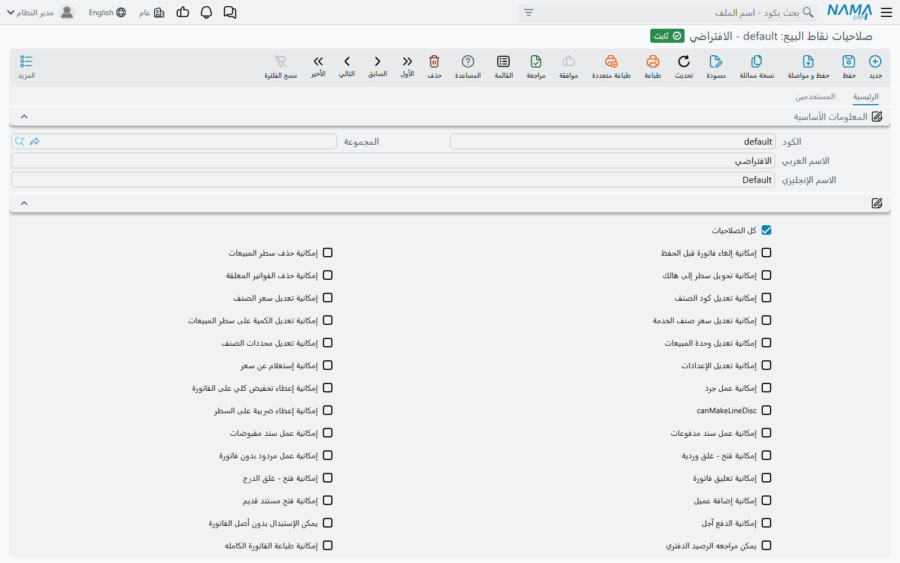

# صلاحيات نقاط البيع (POS Security Profile)

ما يُسمح للكاشير بفعله على الماكينة — تعديل سعر، أو إعطاء خصم، أو مردود بدون فاتورة، أو غلق وردية غيره — لا تتحكم فيه أدوار النظام وصلاحياته المعتادة، بل يتحكم فيه ملف **صلاحيات نقاط البيع**: سجل لكل نوع من المستخدمين («كاشير»، «مشرف وردية»، «مدير فرع»)، وكل سجل قائمة طويلة من الصلاحيات بنعم أو لا. تقرأ الماكينة صلاحيات من يسجّل الدخول، فتسمح بكل إجراء أو ترفضه بحسبها.

## ربط المستخدم بملف الصلاحيات

ملف الصلاحيات لا أثر له حتى يُربط به مستخدمون:

1. أنشئ الملف من **نقاط البيع ← الإعدادات ← صلاحيات نقاط البيع** وعلّم ما يُسمح لهذا النوع من المستخدمين بفعله.
2. افتح كل **مستخدم** واملأ حقل **صلاحيات نقاط البيع** فيه.
3. صفحة **المستخدمين** في ملف الصلاحيات تعرض كل مستخدم مرتبط به حاليًا — وهي أسرع طريقة لمعرفة من سيتأثر بأي تعديل.

تصل ملفات الصلاحيات والمستخدمون إلى الماكينة عبر مزامنة البيانات المعتادة مثل أي بيانات أساسية (راجع [مزامنة بيانات نقاط البيع مع الخادم](../pos-data-sync.md)). المستخدم الذي ليس له ملف صلاحيات يستطيع الدخول، لكن يُرفض له كل إجراء يحتاج صلاحية.

## طريقتان لمنح الصلاحية

في الصفحة **الرئيسية** موضعان يمنحان الصلاحيات، والماكينة تقبل أيًّا منهما:

- **مربعات الاختيار** في رأس الشاشة — مربع لكل صلاحية شائعة.
- **جدول الصلاحيات** — كل سطر يختار صلاحية واحدة من قائمة. القائمة تضم كل صلاحيات المربعات **وأيضًا** نحو عشرين صلاحية أخرى ليس لها مربع (معلَّمة «في الجدول فقط» أدناه). تُمنح الصلاحية إذا كان مربعها معلَّمًا **أو** كان لها سطر في الجدول.

خيار **كل الصلاحيات** في أعلى الشاشة يمنح كل شيء دفعة واحدة، وهو مخصص للمديرين ومستخدمي الدعم.

::: warning القيود و«كل الصلاحيات»
بعض الخيارات *تقيّد* ولا تمنح — مثل **عدم إمكانية الاطلاع على التنبيهات** و**تعطيل الاختصارات** و**عرض فواتير الوردية الحالية فقط**. تعليم **كل الصلاحيات** في الملف نفسه يُلغي قيود الرأس هذه. والاستثناء هو القيود الموجودة في الجدول فقط (**منع إمكانية الدفع**، و**منع عرض فواتير نقاط البيع القديمة**، و**منع عرض مردودات نقاط البيع القديمة**، و**قراءة كود الصنف من خلال قارئ الباركود فقط**، و**قراءة كود فاتورة المبيعات في المردود من خلال قارئ الباركود فقط**): فهي تسري حتى على ملف فيه **كل الصلاحيات**.
:::

## طلب موافقة المشرف بدل الرفض

افتراضيًا، الكاشير الذي يحاول إجراءً لا يسمح به ملفه يُرفض طلبه بالرسالة «ليست لديك هذة الصلاحية» متبوعة باسم الصلاحية الناقصة.

في **إعدادات نقاط البيع** (**نقاط البيع ← الإعدادات ← إعدادات نقاط البيع**) يحوّل جدول **طلب تفويض من مستخدم آخر عند عدم وجود الصلاحيات التالية** حالات الرفض المختارة إلى موافقة مشرف. لكل صلاحية مدرجة فيه تفتح الماكينة نافذة دخول بدل الرفض؛ فيكتب مشرف لديه الصلاحية اسم مستخدمه وكلمة مروره، ويتم الإجراء. وتسجّل الماكينة أي مشرف وافق على أي إجراء في أي مستند.

إعداد شائع: لا يُعطى الكاشير صلاحية الخصم، وتُدرج **إمكانية إعطاء تخفيض كلي على الفاتورة** في ذلك الجدول، فيحتاج كل خصم على الفاتورة إلى كلمة مرور المشرف عند الكاشير.

## الصلاحيات

الجداول تجمع الصلاحيات بحسب ما تتحكم فيه. العمود الأول هو الاسم كما يظهر على الشاشة العربية.

### البيع وسطور الفاتورة

| الصلاحية على الشاشة | الاسم الإنجليزي | ما تسمح به |
|---|---|---|
| إمكانية تعديل كود الصنف | Can Edit Item Code | تغيير الصنف في سطر مُدخل بالفعل. |
| إمكانية حذف سطر المبيعات | Can Delete Sales Line | حذف سطر من الفاتورة. |
| إمكانية تحويل سطر إلى هالك | Can Depreciate Sales Line | تعليم سطر كهالك (بضاعة تالفة). |
| إمكانية تعديل سعر الصنف | Can Edit Item Price | كتابة سعر وحدة مختلف. |
| إمكانية تعديل سعر صنف الخدمة | Can Edit Service Item Price | تغيير سعر صنف خدمة مثل الخدمة السياحية. |
| إمكانية تعديل تكلفة خدمة التوصيل *(في الجدول فقط)* | Can Edit Delivery Cost | تغيير رسوم التوصيل. |
| إمكانية تعديل الكمية على سطر المبيعات | Can Edit Line Quantity | تغيير كمية السطر. |
| إمكانية تعديل وحدة المبيعات | Can Edit Sales Uom | البيع بوحدة قياس أخرى. |
| إمكانية تعديل محددات الصنف | Can Edit Item Dims | تغيير مقاس الصنف ولونه ونحوهما في السطر. |
| إمكانية إعطاء تخفيض 1 على السطر … 8 *(في الجدول؛ وللتخفيض 1 مربع أيضًا)* | Make Line Discount 1 … 8 | إدخال تخفيض السطر من 1 إلى 8، وكل عمود تخفيض يُتحكم فيه منفصلًا. |
| إمكانية إعطاء تخفيض كلي على الفاتورة | Can Make Document Discount | إدخال خصم على مستوى الفاتورة. |
| إمكانية إعطاء ضريبة على السطر | Can Make Line Taxes | تعديل ضرائب السطر. |
| إمكانية إلغاء الضرائب | Can Cancel Taxes | حذف الضرائب من الفاتورة. |
| إمكانية أعطاء أصناف مجانية | Can Give Free Items | إضافة أصناف مجانًا. |
| إمكانية تعديل تصنيف الفاتورة | Can Edit Invoice Classification | تغيير تصنيف الفاتورة (صالة، تيك أواي، توصيل…). |
| إمكانية تعديل مندوب المبيعات | Can Edit Sales Man | اختيار المندوب في فاتورة جديدة. |
| السماح بتعديل المندوب في الفاتورة التي تم صدورها بالفعل | Allow Salesman Update | تغيير المندوب في فاتورة محفوظة. |
| السماح بإخفاء Dialog العروض | Allow Hide Offers Dialog | إغلاق نافذة العروض دون اختيار. |
| إمكانية تكرار أخر سطر بكمية سالبة *(في الجدول فقط)* | Can Make Negative Duplicate | الضغط على مفتاح السالب لتكرار آخر سطر بكمية سالبة. |
| قراءة كود الصنف من خلال قارئ الباركود فقط *(في الجدول فقط، قيد)* | Read Item Code Using Scanner Only | لا يضيف الكاشير الأصناف إلا بالمسح بالقارئ، لا بكتابة الكود. |

### الفاتورة ككل

| الصلاحية على الشاشة | الاسم الإنجليزي | ما تسمح به |
|---|---|---|
| إمكانية إلغاء فاتورة قبل الحفظ | Can Cancel Invoice Before Save | التخلي عن فاتورة جارية. |
| إمكانية تعليق فاتورة | Can Hold Invoice | تعليق فاتورة لاستدعائها لاحقًا. |
| إمكانية حذف الفواتير المعلقة | Can Delete Held Invoices | حذف فاتورة معلقة. |
| إمكانية طباعة فاتورة معلقة | Can Print Held Invoice | طباعة فاتورة ما زالت معلقة. |
| إمكانية فتح مستند قديم | Can Open Old Document | فتح مستند محفوظ. |
| منع عرض فواتير نقاط البيع القديمة *(في الجدول فقط، قيد)* | Prevent Opening Old Invoices | يمنع فتح الفواتير المحفوظة. |
| منع عرض مردودات نقاط البيع القديمة *(في الجدول فقط، قيد)* | Prevent Opening Old Returns | يمنع فتح المردودات المحفوظة. |
| عرض فواتير الوردية الحالية فقط *(قيد)* | Show Current Shift Invoices Only | البحث عن الفواتير القديمة لا يعرض إلا فواتير الوردية الحالية. |
| إمكانية طباعة الفاتورة الكامله | Can Print Full Invoice | طباعة نموذج الفاتورة الكامل (A4). |
| إمكانية إعادة طباعة المستندات | Can RePrint Documents | إعادة طباعة مستند محفوظ. |
| إمكانية منع طباعة الفواتير *(في الجدول فقط)* | Can Prevent Printing Invoices | تعليم «عدم الطباعة» في نافذة الدفع. |

### الدفع ودرج النقدية

| الصلاحية على الشاشة | الاسم الإنجليزي | ما تسمح به |
|---|---|---|
| إمكانية الدفع آجل | Can Pay With Credit Val | ترك جزء من الفاتورة على حساب العميل. |
| إمكانية تأجيل دفع الفاتوره | Can Delay Invoice Payment | حفظ الفاتورة الآن وتحصيلها لاحقًا. |
| إمكانية الإطلاع على تفاصيل الدفع في المبيعات | Can Show Payments Details | رؤية تفاصيل دفع البيعة. |
| منع استعمال طرق الدفع الحرجه بنقاط البيع *(قيد)* | Prevent Using Critical Methods | لا يمكن اختيار طرق الدفع المعلَّم عليها **طريقة دفع حرجه لنقاط البيع** في شاشة طريقة الدفع. |
| منع خصم الكسر *(قيد)* | Prevent Fraction Discount | يمنع خصم «جبر الكسور» الصغير (الذي حده **اقصي قيمة مسموحه لخصم الكسور** في الماكينة أو في إعدادات نقاط البيع). |
| منع تعديل قيمة إشعار الدائن في الدفع *(في الجدول فقط، قيد)* | Can Not Modify Credit Note Value In Payment | يقفل مبلغ الإشعار الدائن المستخدم في الدفع، ويستطيع المشرف فتحه من الزر المجاور للحقل (Alt+F2). لاحظ أن **كل الصلاحيات** تفعّل هذا القفل أيضًا. |
| منع إمكانية الدفع *(في الجدول فقط، قيد)* | Prevent Payment | لا يستطيع المستخدم تحصيل أي دفع — مفيد لمستخدم يأخذ الطلبات ويسلّم الفواتير للكاشير. |
| إمكانية فتح - غلق الدرج | Can Open Cash Drawer | زر فتح الدرج في شريط أدوات الماكينة. |

### العملاء

| الصلاحية على الشاشة | الاسم الإنجليزي | ما تسمح به |
|---|---|---|
| إمكانية إضافة عميل | Can Add Customer | إنشاء عميل جديد من الماكينة. |
| إمكانية تعديل العميل | Can Edit Customer | تعديل عميل موجود. |
| إمكانية البحث عن عميل | Can Search On Customers | البحث في قائمة العملاء. معلَّمة افتراضيًا في الملف الجديد. |

### المردودات والاستبدالات

| الصلاحية على الشاشة | الاسم الإنجليزي | ما تسمح به |
|---|---|---|
| إمكانية عمل مردود مبيعات | Can Make Return | عمل مردود مبيعات. |
| إمكانية عمل إستبدال مبيعات | Can Make Replacement | عمل استبدال. |
| إمكانية عمل مردود بدون فاتورة | Can Return Without Invoice | مردود لا يشير إلى فاتورة أصلية. |
| يمكن الإستبدال بدون أصل الفاتورة | Can Replace Without Invoice | استبدال لا يشير إلى فاتورة أصلية. |
| إمكانية البحث في كود الفاتورة في المردود والاستبدال | Can Search On Invoice In Return And Replacement | البحث عن الفاتورة الأصلية من المردود أو الاستبدال. |
| إمكانية البحث بجزء من كود الفاتورة في المردود و الاستبدال | Can Search By Invoice Code Part in return and replacement | إيجاد الفاتورة الأصلية بكتابة جزء من كودها. |
| إمكانية اختيار فاتورة المبيعات في المردود *(في الجدول فقط)* | Can Select Sales Invoice In Returns | اختيار الفاتورة الأصلية في المردود. |
| قراءة كود فاتورة المبيعات في المردود من خلال قارئ الباركود فقط *(في الجدول فقط، قيد)* | Read Sales Invoice Code In Returns Using Scanner Only | يجب مسح الفاتورة الأصلية من إيصالها بالقارئ، لا كتابتها. |
| إمكانية عرض السطور عند اختيار الفاتورة في مردود المبيعات *(في الجدول فقط)* | Can Display Lines When Selecting Invoice In Sales Return | رؤية سطور الفاتورة عند اختيارها في المردود. |
| إمكانية عمل مردود بعد تجاوز مدة المردود المسموح بها *(في الجدول فقط)* | Allow Return After Allowed Period | مردود فاتورة أقدم من **ارتجاع الفواتير في خلال (بالأيام)** في الماكينة. |
| يمكن تعديل سعر الوحده في المردود | Can Edit Return Unit Price | تغيير سعر الوحدة المردود. |
| يمكن تعديل التخفيض أو الضريبة في المردود | Can Edit Return Discount or Tax | تغيير الخصومات أو الضرائب في المردود. |
| إمكانية حذف أصناف مجانية من مردود المبيعات موجودة في الفاتورة الأصلية | Can Remove Sales Return Free Items | استبعاد الأصناف المجانية للفاتورة الأصلية عند المردود. |
| إمكانية عمل مردود بوردية مستخدم اخر | Can Return In Other User Shift | حفظ مردود في وردية فتحها مستخدم آخر. |
| إمكانية عمل استبدال بوردية مستخدم اخر | Can Replace In Other User Shift | حفظ استبدال في وردية فتحها مستخدم آخر. |

### الورديات ومستندات النقدية

| الصلاحية على الشاشة | الاسم الإنجليزي | ما تسمح به |
|---|---|---|
| إمكانية فتح - غلق وردية | Can Open-Close Shifts | فتح الورديات وغلقها. |
| إمكانية فتح وردية *(في الجدول فقط)* | Can Open Shift | فتح الوردية فقط — لمستخدم لا ينبغي أن يغلق. |
| إمكانية غلق وردية *(في الجدول فقط)* | Can Close Shift | غلق الوردية فقط. |
| إمكانية غلق وردية مستخدم آخر | Can Close Another User Shift | غلق وردية فتحها مستخدم آخر. |
| إمكانية استخدام وردية مستخدم أخر | Can Use Another User Shift | البيع في وردية فتحها مستخدم آخر (راجع [إعدادات الوردية](./pos-shift-close-settings.md)). |
| يمكن مراجعه الرصيد الدفتري | Can View System Balance | رؤية ما يتوقعه النظام في الدرج أثناء الجرد. اتركها غير معلَّمة للجرد الأعمى. |
| إمكانية طباعة مستند غلق وردية *(في الجدول فقط)* | Can Print Shift Closing Document | طباعة إيصال غلق الوردية. |
| إمكانية عمل جرد | Can Make Cash Count | جرد النقدية أثناء الوردية. |
| إمكانية عمل سند مدفوعات | Can Make Payment Document | صرف نقدية من الدرج. |
| إمكانية عمل سند مقبوضات | Can Make Receipt Document | قبض نقدية في الدرج. |
| عرض مصروفات الوردية الحالية فقط *(قيد)* | Show Current Shift Payments Only | البحث عن المصروفات لا يعرض إلا مصروفات الوردية الحالية. |
| عرض مقبوضات الوردية الحالية فقط *(قيد)* | Show Current Shift Receipts Only | البحث عن المقبوضات لا يعرض إلا مقبوضات الوردية الحالية. |

### المخزون على الماكينة

| الصلاحية على الشاشة | الاسم الإنجليزي | ما تسمح به |
|---|---|---|
| إمكانية عمل طلب تحويل مخزني | Can Make Stock Transfer Request | طلب بضاعة من مخزن آخر. |
| إمكانية عمل توريد مخزني من التحويل المخزني | Can Receipt From Stock Transfer | استلام بضاعة مقابل تحويل. |
| إمكانية عمل توريد مخزني من فاتورة المشتريات | Can Receipt From Purchase Invoice | استلام بضاعة مقابل فاتورة مشتريات. |
| إمكانية عمل سند نواقص | Can Make Shortfalls Document | تسجيل النواقص. |
| إمكانية عمل سند هوالك | Can Make Scrap Document | تسجيل الهوالك. |
| إمكانية إستعلام عن سعر | can Inquire For Prices | استخدام الاستعلام عن السعر. |
| إمكانية البحث في كود الصنف | Can Search On Item Code | البحث عن الأصناف بالكود. |

### الشاشة والأدوات

| الصلاحية على الشاشة | الاسم الإنجليزي | ما تسمح به |
|---|---|---|
| إمكانية تعديل الإعدادات | Can Edit Settings | فتح إعدادات الماكينة من شريط الأدوات أو القائمة الجانبية. |
| إمكانية الإطلاع على أخطاء نقل البيانات | Can Show Data Transfer Errors | رؤية المستندات التي فشلت مزامنتها. |
| إمكانية الأطلاع على معرف الحقول | Can Show Field Ids | رؤية الأسماء الفنية للحقول (تُستخدم عند تصميم الشاشات). |
| إمكانية استعمال الآلة الحاسبة | Can Use Calculator | الآلة الحاسبة على الشاشة. |
| إمكانية استعمال لوحة المفاتيح | Can Use KeyBoard | لوحة المفاتيح على الشاشة. |
| إمكانية تسجيل بصمة إصبع الموظفين *(في الجدول فقط)* | Can Enroll Fingerprints | تسجيل بصمات المستخدمين (راجع [الدخول بالبصمة](../pos-fingerprint-login.md)). |
| عدم إمكانية الاطلاع على التنبيهات *(قيد)* | Prevent View Notifications | يخفي التنبيهات. |
| تعطيل الاختصارات *(قيد)* | Deactivate Shortcuts | اختصارات لوحة المفاتيح لا تعمل لهذا المستخدم. |
| منع تغيير ترتيب اعمدة الجداول *(قيد، مجموعة متقدم)* | Prevent Reorder Columns | لا يستطيع المستخدم سحب أعمدة الجداول لترتيب جديد. |
| منع تغيير حجم اعمده الجداول *(قيد، مجموعة متقدم)* | Prevent Resize Columns | لا يستطيع المستخدم تغيير عرض أعمدة الجداول. |

### الإلتزام بأدني سعر مع التخفيضات

تحتوي مجموعة **متقدم** أيضًا على **الإلتزام بأدني سعر مع التخفيضات** (Force Minimum Price With Discounts). وهو ليس صلاحية بل فحص: لهذا المستخدم لا يجوز أن يقل سعر السطر بعد كل خصوماته عن **أدنى سعر** في سطر قائمة الأسعار الذي سُعِّر منه. ويسري حتى على ملف فيه **كل الصلاحيات**.

## رسائل قد تظهر لك

| الرسالة | السبب | ما العمل |
|---|---|---|
| «ليست لديك هذة الصلاحية» | ملف صلاحيات المستخدم الحالي ينقصه الإجراء المذكور بعد الرسالة. | امنح الصلاحية في الملف، أو أدرجها في **طلب تفويض من مستخدم آخر…** ليوافق عليها مشرف. |
| «المتسخدم ممنوع من اتخاذ هذا الإجراء. يرجى مراجعة الصلاحيات» | في الملف قيد من القيود الموجودة في الجدول فقط مثل **منع عرض فواتير نقاط البيع القديمة**. | احذف سطر القيد إن كان المستخدم يجب أن يُسمح له. |
| «ليس لديك صلاحية الدفع» | في الملف **منع إمكانية الدفع**. | سلّم الفاتورة لمستخدم يستطيع التحصيل. |
| «السطر {0} السعر بعد التخفيضات {1} اقل من ادني سعر {2}» | خيار **الإلتزام بأدني سعر مع التخفيضات** مفعَّل والخصومات تنزل بالسطر عن أدنى سعر في قائمة الأسعار. | قلّل الخصم. |
