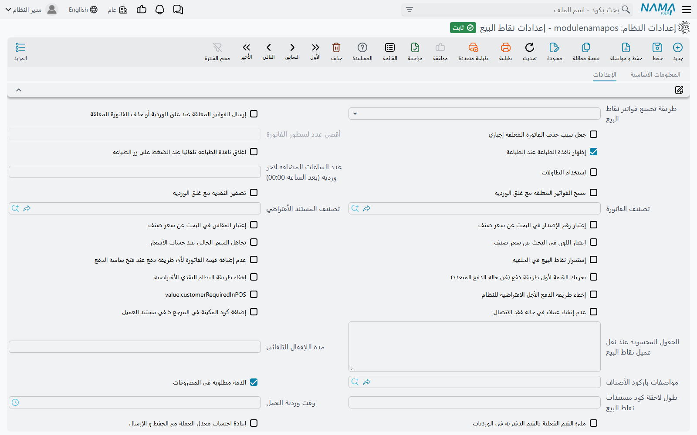
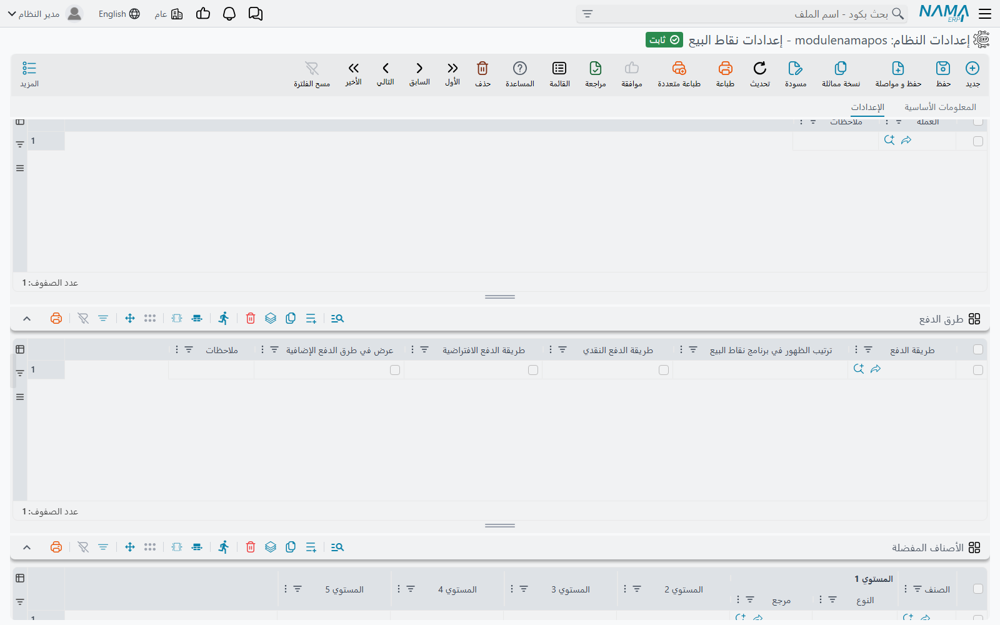
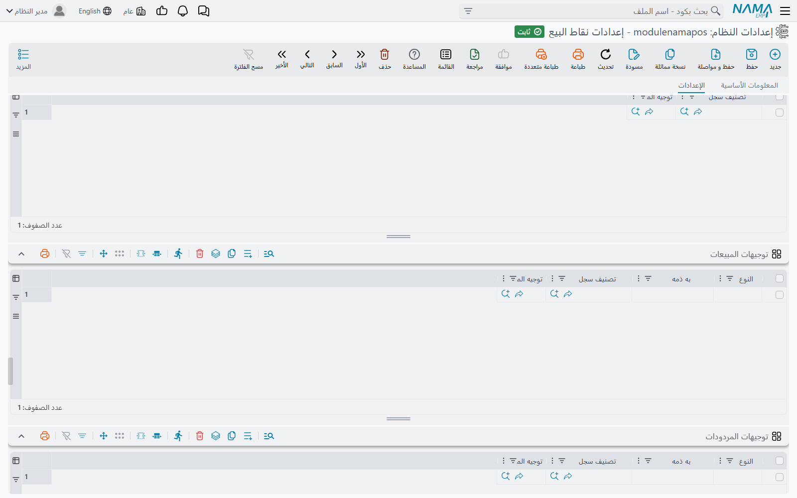

# شاشة إعدادات نقاط البيع

في **إعدادات نقاط البيع** (POS Settings) يتحدد سلوك كل ماكينات الشركة: كيف يُبحث عن السعر، وماذا تفعل شاشة الدفع، وأي المستندات يمكن للكاشير حفظها دون اتصال، وكيف تصل المبيعات إلى الخادم. هي صفحة واحدة طويلة فيها أكثر من مئة خيار، ولهذا يبحث فيها العملاء عادةً بالنص الظاهر على الشاشة حرفيًا. تعرض هذه الصفحة الخيارات مقسّمة حسب سير العمل، لتصل إلى الخيار من المشكلة التي يحلّها.

افتحها من **نقاط البيع ← الإعدادات ← إعدادات نقاط البيع**.

## كيف تعمل الشاشة

- **شاشة واحدة للشركة كلها.** هناك سجل إعدادات نقاط بيع واحد، وليس لكل فرع أو ماكينة سجل خاص.
- **يمكن للماكينة أن تتجاوز كثيرًا من هذه الخيارات.** تكرر شاشة **ماكينة** جزءًا كبيرًا منها — تصنيف الفاتورة، وتصنيف المستند، ووقت وردية العمل، واستعلامَي السعر والأصناف المفضلة، وأصناف الخدمة والتوصيل والحد الأدنى، وسجلات الإعدادات المرتبطة، وجداول العملات وطرق الدفع والتوجيهات والمفضلة. إذا مُلئ حقل الماكينة استُخدمت قيمة الماكينة، وإن كان فارغًا (أو «موروث») طُبّقت إعدادات نقاط البيع. أما الحقول الموجودة هنا فقط فتنطبق على كل الماكينات.
- **الماكينة الجديدة تبدأ من هذه الجداول.** عند إنشاء ماكينة تُنسخ إليها من إعدادات نقاط البيع جداول **العملات** و**طرق الدفع** و**توجيهات المصروفات** و**توجيهات المبيعات** و**توجيهات المردودات** و**الأصناف المفضلة** وسياسة الاستبدال. التعديلات اللاحقة هنا لا تُنسخ مرة أخرى إلى الماكينات الموجودة.
- **التعديلات تصل إلى الماكينات عبر المزامنة.** تستلم الماكينة التعديل مع مزامنة بياناتها المعتادة كأي بيانات أساسية أخرى. الماكينة غير المتصلة أو المتوقفة مزامنتها تبقى على القيم القديمة — راجع [مزامنة بيانات نقاط البيع مع الخادم](../pos-data-sync.md).

لعائلتين من الخيارات صفحتان خاصتان:

- فتح الوردية وغلقها وتصفير النقدية — [إعدادات فتح وغلق الوردية وتصفير النقدية](./pos-shift-close-settings.md)؛
- عدد خانات أكواد المستندات وجزء التاريخ فيها — [ترقيم مستندات نقاط البيع](./pos-document-numbering.md).

## الأسعار والخصومات

| الإعداد كما يظهر على الشاشة | الاسم الإنجليزي | ما يفعله |
|---|---|---|
| الأسعار بجدول الوحدات بالصنف لها أولوية عن قوائم الأسعار | Prices in Units Grid has Priority over Price Lists | يبحث عن السعر في جدول وحدات الصنف قبل قوائم الأسعار. إن كان غير مفعَّل يُبحث في قوائم الأسعار أولًا. |
| الالتزام بقوائم الأسعار | Force Price Lists | يرفض بيع صنف ليس له سعر في قوائم الأسعار. |
| السماح بالحفظ مع وجود أصناف ليس لها سعر (مع الالتزام بقوائم الأسعار) | Do Not Check Items Without Price List (With Force Price Lists Option) | يخفف الخيار السابق فيُسمح بحفظ هذه الأصناف. |
| تجاهل الالتزام بقوائم الأسعار مع الصنف المجانى | Ignore Force Price List With Free Item | لا تُرفض الأصناف المجانية لعدم وجود سعر لها في قوائم الأسعار. |
| الألتزام بالأسعار في جدول الوحدات للصنف | Force Item Prices From Units | يرفض الصنف الذي ليس لسعره سطر في جدول وحدات الصنف. |
| إعتبار رقم الإصدار / المقاس / اللون في البحث عن سعر صنف | Include Revision Id / Size / Color In Item Price Search | يجعل الإصدار أو المقاس أو اللون جزءًا من البحث عن السعر، لقوائم الأسعار التي تسعّرها منفصلة. |
| تجاهل السعر الحالي عند حساب الأسعار | Ignore Current Price When Calculating Prices | عند إعادة حساب الأسعار لا يُحتفظ بالسعر الحالي للسطر كأحد الخيارات. |
| السعر الافتراضي في قائمة الأسعار | Price List Default Price | أي أسعار قائمة الأسعار يؤخذ افتراضيًا. |
| استعلام حساب السعر (الوعاء) المخصص | Custom Price Query | استعلام يُرجع السعر بدلًا من البحث المعتاد. موجود أيضًا في الماكينة. |
| عدم حساب السعر إذا وجد في الباركود | Do Not Calculate Price If It Exists In Barcode | لباركود الميزان أو الباركود المسعَّر: يبقى السعر المقروء من الباركود كما هو. |
| عدم تحديث الأسعار مع اختيار العميل / تصنيف الفاتورة / محدد السعر 1–5 / الذمه | Do Not Update Price With Customer / Invoice Classification / Price Classifier 1–5 / Subsidiary Selection | اختيار هذا الحقل في فاتورة مفتوحة لا يعيد تسعير السطور. |
| عدم تحديث الأسعار عند وجود سند بيع في بناء على | Do Not Update Prices When There is Sales Doc In From Doc | المستند المبني على مستند بيع يحتفظ بأسعار ذلك المستند. |
| اعتبار التاريخ الفعلي من بناءا علي في حساب الأسعار والعروض | Consider Value Date From From Document In Pricing And Offers | تُحسب الأسعار والعروض بتاريخ المستند المصدر لا بتاريخ اليوم. مفعَّل افتراضيًا. |
| تجاهل قيمة الخصم 1 … 8 الحالية عند إعادة حساب الخصومات و الأسعار | Do Not Consider Current Discount 1 … 8 Value When Recalculating Prices and Discounts | خيار لكل خصم: عند إعادة الحساب يُحسب هذا الخصم من جديد بدلًا من الإبقاء على قيمته الموجودة في السطر. |
| إعتبار أقصى خصم من مطبق الخصم | Consider Max Discount From Discount Applier | حين يفوّض مشرف خصمًا، يُطبَّق أقصى خصم للمشرف لا للكاشير. |
| اقصي قيمة مسموحه لخصم الكسور | Max Fraction Discount Value | أكبر خصم كسور (تقريب) يمكن للكاشير منحه. موجود أيضًا في الماكينة. |
| استخدام من ساعه - الي ساعه في خصومات الأصناف | Use From Hour To Hour In Item Discounts | يضيف «من ساعة / إلى ساعة» إلى خصومات الأصناف، لعروض ساعات محددة. |
| نسخ تخفيض الفاتورة إلي | Copy Invoice Discount To | أي خصم سطر (من 3 إلى 8) يستقبل تخفيض الفاتورة. |
| إضافة حقل تخفيض الكسور للمبيعات / نسخ تخفيض الكسور إلي | Add Header Discount 2 Field To Sales / Header Discount 2 Location | يُظهر حقل تخفيض الكسور في شاشة المبيعات، وأي خصم سطر يستقبله. |
| السماح بالحفظ في وجود أصناف سعرها صفر | Allow Save With Zero Item Price | يسمح بحفظ مستند فيه سطر سعره صفر. |
| عدم ادراج الأصناف التي ليس لها سعر في قوائم الأسعار أو الوحدات | Do Not Insert Items With No Defined Price | لا يمكن إضافة صنف ليس له سعر في أي مكان. |
| عدم إدراج الصنف بسعر صفر | Do Not Add Item If Price Is Zero | لا يمكن إضافة صنف يخرج سعره صفرًا (عدا السطور المجانية). |
| سياسة الضريبة | Tax Plan | سياسة الضريبة التي تطبقها الماكينات. |
| احتساب السعر من قائمة أسعار المشتريات في سند التوريد | Calculate Price From Purchase Price List In Stock Receipt | يُسعَّر سند التوريد في الماكينة من قائمة أسعار المشتريات. |
| عدم إضافة الأصناف المجانية تلقائياً (مطالبة عند المسح أو تسوية عند الدفع) / يجب إضافة الأصناف المجانية للصنف قبل الدفع | Dont Auto-Add Free Items (Claim By Scan Or Resolve At Payment) / Must Add Item Free Items Before Payment | طريقة التعامل مع الأصناف المجانية في العروض — راجع [الأصناف المجانية في نقاط البيع](../pos-free-items-claim-and-reconciliation.md). |

## شاشة المبيعات

| الإعداد كما يظهر على الشاشة | الاسم الإنجليزي | ما يفعله |
|---|---|---|
| تصنيف الفاتورة | Invoice Classification | التصنيف الذي تبدأ به الفاتورة الجديدة. موجود أيضًا في الماكينة. |
| تصنيف المستند الأفتراضي | Default Document Category | تصنيف المستند الذي يبدأ به المستند الجديد. موجود أيضًا في الماكينة. |
| إضافة حقل تصنيف المستند | Add Document Category Field | يُظهر حقل تصنيف المستند في شاشة المبيعات. |
| طريقة تجميع كميات سطور المبيعات | Sales Lines Collection Method | «التجميع بالصنف» يزيد كمية السطر الموجود حين يُمسح الصنف نفسه مرة أخرى؛ و«عدم التجميع» يضيف سطرًا جديدًا في كل مرة. موجود أيضًا في الماكينة. |
| إستخدام المستخدم الحالي كمندوب مبيعات / مندوب المبيعات مطلوب | Use User As Sales Man / SalesMan Is Required | يملأ المندوب من المستخدم الحالي (إن كان مرتبطًا بموظف)، ويجعل المندوب إجباريًا. |
| إضافة عمود السعر في البحث عن صنف | Add Price Column To Item Search | يُظهر الأسعار في نافذة البحث عن صنف. |
| طريقة عرض وحدة المبيعات / المقاس / اللون | UOM / Size / Color Display Type | عرض الكود فقط، أو الإسم فقط، أو كليهما. |
| طريقة عرض زر الصنف المفضل | Favourite Item Display Method | أزرار المفضلة تعرض الاسم، أو الصورة، أو الاسم والصورة. |
| استعلام الأصناف المفضله | Favourite Items Query | استعلام يحدد الأصناف المفضلة. موجود أيضًا في الماكينة. |
| عدم استخدام صور الأصناف | Do Not Use Items Image | لا تُحمَّل صور الأصناف على الماكينة. |
| مسار المقطع الصوتي للدفع / مسار المقطع الصوتي للصنف غير الموجود | Payment Sound Path / Item Not Found Alert Path | ملفات صوت تُشغَّل عند الدفع وعند عدم العثور على صنف ممسوح. |
| فتح الدرج مع الدفع | Open Drawer With Payment | يفتح درج النقدية عند حفظ الدفع. |
| إظهار نافذة الطباعة عند الطباعة | Print To Dialog | يُظهر نافذة الطباعة بدلًا من الطباعة مباشرة. مفعَّل افتراضيًا. |
| اغلاق نافذة الطباعه تلقائيا عند الضغط على زر الطباعه | Auto Hide Preview With Print Button Click | يغلق معاينة الطباعة بعد الضغط على طباعة. |
| طباعة اخر مستند في حالة عدم وجود مستند مفتوح | Print Last Document If No Current Open Document | زر الطباعة على شاشة فارغة يعيد طباعة آخر مستند. |
| عدم الاحتفاظ باخر شاشة فاتورة مبيعات / مردود مبيعات / استبدال مبيعات / تحويل مخزني / جرد مخزني | DO Not Save Last Invoice / Return / Replacement / Stock Transfer / Stock Taking Screen | لا تعيد الماكينة فتح مستند غير مكتمل من هذا النوع بعد إعادة التشغيل. |
| حفظ مؤقت تلقائي للمستند الحالي | Temporal Automatic Save Current Document | يحتفظ بنسخة مؤقتة من المستند الجاري إدخاله حتى لا يضيع إن توقف البرنامج. |
| دمج الفواتير المعلقة مع حقل الذهاب إلى  فاتورة معلقة | Merge Held Invoices With Go To Held Invoice Field | يدمج قائمة الفواتير المعلقة مع حقل «الذهاب إلى فاتورة معلقة». |
| جعل سبب حذف الفاتورة المعلقة إجباري | Make Held Invoice Deletion Reason Required | لا تُحذف الفاتورة المعلقة دون ذكر سبب. |
| اللون الأساسي / لون المردود / لون الاستبدال | Main Color / Sales Return Color / Sales Replacement Color | ألوان الشاشة، ليعرف الكاشير بنظرة إن كان المفتوح مردودًا أو استبدالًا. |
| إستمرار نقاط البيع في الخلفيه | Run Pos In Background | إغلاق النافذة يُبقي البرنامج يعمل في شريط النظام. |
| استخدام السيرفر لتحديث الإصدار | Use Domain Server For Release | تنزّل الماكينات الإصدارات الجديدة من خادم نما الخاص بك. |
| عدم التحقق من الموقع في المبيعات | Do Not Validate On Locator In Sales | لا تُفحص سطور المبيعات مقابل الموقع. |
| تصنيف المستند مطلوب في التحويل المخزني | Stock transfer Document Category Is Required | طلب التحويل المخزني يحتاج تصنيف مستند. |
| عدم التحقق من بيانات تتبع الأدوية في فواتير المبيعات / مردودات المبيعات | Do Not Validate RSD Fields In Sales Invoices / Sales Returns | يتخطى فحوص تتبع الأدوية. موجود أيضًا في الماكينة. |

## العملاء

| الإعداد كما يظهر على الشاشة | الاسم الإنجليزي | ما يفعله |
|---|---|---|
| عدم إنشاء عملاء في حاله فقد الاتصال | Do Not Add Customer When Offline | لا يُنشأ عميل جديد إلا والماكينة متصلة. |
| استبدال عميل نقطة البيع ب عميل الخادم عند تكرار الكود | Replace POSCustomer With Server Customer If Code Repeated | إذا كان للعميل المُنشأ على الماكينة كود عميل موجود على الخادم، يُستخدم عميل الخادم. |
| إضافة كود المكينة في المرجع 5 في مستند العميل | Add Register To Customer Ref5 | يحفظ الماكينة التي أنشأت العميل في المرجع 5 للعميل. |
| الحقول المحسوبه عند نقل عميل نقاط البيع | POS Customer Calculated Fields | حقول تُحسب عند نقل عميل الماكينة إلى الخادم. موجود أيضًا في الماكينة. |
| التحقق من البيانات الضريبية للعميل إذا كان خاضعاً للضريبة | Validate Customer Tax Info If Taxable | العميل الخاضع للضريبة يجب أن تكتمل بياناته الضريبية. |
| حقل رقم سيارة العميل | Customer Car Number Field ID | أي حقول العميل يحمل رقم السيارة، لأنشطة خدمة السيارات. |

## الدفع والإشعارات الدائنة والقسائم وبطاقات الهدايا

| الإعداد كما يظهر على الشاشة | الاسم الإنجليزي | ما يفعله |
|---|---|---|
| عدم إضافة قيمة الفاتورة لأي طريقة دفع عند فتح شاشة الدفع | Do Not Add Invoice Amount To Any Payment Method When Opening Payment Dialog | تُفتح شاشة الدفع فارغة، فيكتب الكاشير كل مبلغ بنفسه. |
| تحريك القيمة لأول طريقة دفع (في حاله الدفع المتعدد) | Move Amount To First Payment Method | في الدفع المتعدد ينتقل المبلغ المتبقي إلى أول طريقة دفع. |
| منع التعديل التلقائي لقيمة الدفع النقدي بشاشة الدفع | Prevent Cash Amount Auto Update | لا يُعاد حساب المبلغ النقدي حين يتغير مبلغ طريقة أخرى. |
| إخفاء طريقة النظام النقدي الأفتراضيه / إخفاء طريقة الدفع الآجل الافتراضية للنظام | Hide Default System Cash Method / Hide Default System Debit Method | يُخفي طريقة النقدي أو الآجل المدمجة في النظام حين تستخدم طرق دفع خاصة بك. |
| السماح للعميل بالدفع بأكثر من صافي الفاتورة بطرق دفع غير نقدية | Allow Customer To Overpay Invoice By Non-Cash Methods | يقبل دفعًا بالبطاقة أكبر من إجمالي الفاتورة. موجود أيضًا في الماكينة. |
| استخدام الإشعارات الدائنة | Use Credit Notes | يمكن رد المردود كإشعار دائن، وقبول الإشعارات الدائنة كوسيلة دفع. |
| إستخدام قسائم الخصومات (الكوبونات) / طول كود قسيمة الخصومات (الكوبون) | Use Coupons / Discount Coupon Code Length | يفعّل قسائم الخصم، ويحدد طول كود القسيمة. |
| خصم قيمة القسيمة من المدفوعات غير النقدية | Deduct Coupon Value From Non-Cash Payments | القسيمة تُنقص الجزء غير النقدي من الدفع. |
| مجموعة قسيمة خصومات / دفتر قسيمة خصومات | Discount Coupon Group / Discount Coupon Book | المجموعة والدفتر المستخدمان للقسائم الصادرة من الماكينة. موجود أيضًا في الماكينة. |
| إعدادات نقاط المكافأة | Reward Points Configuration | إعداد نقاط الولاء الذي تستخدمه الماكينات. موجود أيضًا في الماكينة. |
| Payment Terminal | Payment Terminal | جهاز البطاقات الذي تتصل به الماكينات. موجود أيضًا في الماكينة. |
| الحفظ التلقائي للفاتوره بعد الدفع بال terminal | Automatic Save Invoice After Terminal Payment | تُحفظ الفاتورة بمجرد موافقة الجهاز على البطاقة. |

## المصروفات والمقبوضات على الماكينة

| الإعداد كما يظهر على الشاشة | الاسم الإنجليزي | ما يفعله |
|---|---|---|
| الذمة مطلوبه في المصروفات | Subsidiary Required In Payments | يجب أن يحدد المصروف لمن صُرف المال. مفعَّل افتراضيًا. |
| صرف الي الافتراضي بسند المصروف / قبض من الافتراضي بسند المقبوض | Default Pay To In Payments / Default Receipt From In Receipts | نوع الذمة الذي يبدأ به المصروف أو المقبوض. موجود أيضًا في الماكينة. |
| اخفاء الذمم الافتراضية في سندات الصرف والقبض | Hide Default Types In Payments And Receipts | يُخفي أنواع الذمم المدمجة، فتبقى فقط الأنواع الموجودة في الجدولين أدناه. |
| السماح بعمل مصروف من الموظف الحالي | Allow Payment From Current Employee | يضيف خيار تسجيل المصروف كمدفوع من الكاشير شخصيًا. |
| السماح بالدفع من الخزينة | Allow Payment From Treasury | يضيف خيار تسجيل المصروف كمدفوع من الخزينة. |
| تصنيف السجل مطلوب في شاشة مصروفات نقاط البيع / شاشة مقبوضات نقاط البيع | Document Category Is Required In POS Payment Screen / Receipt Screen | يحتاج المصروف أو المقبوض تصنيف مستند — مفيد حين يكون التصنيف هو ما يختار التوجيه (راجع [توجيهات مستندات نقاط البيع](./pos-document-terms.md)). |

## المردودات والاستبدال

| الإعداد كما يظهر على الشاشة | الاسم الإنجليزي | ما يفعله |
|---|---|---|
| السماح بعمل مردود او استبدال للفواتير من سيرفر نما | Return or replace invoices from server | يمكن للماكينة أن تعمل مردودًا أو استبدالًا لفاتورة صدرت من ماكينة أخرى بجلبها من الخادم. |
| السماح بعمل مردود و استبدال في حالة عدم وجود إتصال بالخادم | Allow Sales Return / Replacement If Connection Is Down | يسمح بإتمام المردود أو الاستبدال من البيانات المحلية حين يتعذر الوصول إلى الخادم. |
| الملحوظه مطلوبه في مردود نقاط البيع | Remarks Required In Sales Return | لا يُحفظ المردود دون ملحوظة. |
| عدم عرض السطور المردودة عند أختيار الفاتورة | Do Not Display Returned Lines When Selecting Invoice | تُخفى السطور المردودة من قبل عند اختيار فاتورة للرد. موجود أيضًا في الماكينة. |
| عدم اعتبار الصندوق / الشحنة / الإصدار / المقاس / اللون / رقم المسلسل مع الاستبدال و المردود | Do Not Consider Box / LotId / RevisionId / Size / Color / Serial Number With Replacement Or Return | عند مطابقة السطر المردود مع الفاتورة الأصلية تُتجاهل هذه الصفة. |
| شروط و سياسة الإستبدال — إستبدال خلال (بالأيام)، شرط نصي 1–5 | Replacement Conditions And Policy — Replace WithIn (In Days), Text Condition 1–5 | مدة الاستبدال ونص السياسة. تُنسخ إلى كل ماكينة جديدة، وللماكينة أيضًا **ارتجاع الفواتير في خلال (بالأيام)**. |

أسباب المردود وأسباب الإهلاك وتمديد فترة المردود شاشات مستقلة.

## المطاعم والحجوزات والتوصيل

| الإعداد كما يظهر على الشاشة | الاسم الإنجليزي | ما يفعله |
|---|---|---|
| إستخدام الطاولات | Use Tables | يفعّل الصالات والطاولات، ويُظهر جدول **الطاولات** في الماكينة. |
| استخدام سند حجز نقاط البيع | Use Reservation Document | يفعّل حجز الطلبات في الماكينة. |
| عدم عرض شاشة الدفع مع سند الحجز | Do Not Show Payment Dialog In Reservation | حفظ الحجز لا يفتح شاشة الدفع. |
| عدم التأكد من صحة تاريخ و وقت الحجز | Do Not Validate Reservation Date And Time | يتخطى فحص تاريخ الحجز ووقته. |
| صنف الخدمة السياحية / نسبة الخدمة السياحية / الخدمة السياحية تحسب من | Service Charge Item / Percentage / Service Charge Calculated From | صنف الخدمة ونسبتها وأساس حسابها. موجود أيضًا في الماكينة. |
| إعدادات الخدمة السياحية في نقاط البيع | POS Service Charge Settings | سجل مستقل لإعدادات الخدمة، لقواعد حسب التصنيف. |
| إضافة صنف الخدمة السياحية تلقائياً عند اختيار تصنيف الفاتورة | Automatically Add Service Item When Selecting Invoice Classification / Table | يضيف صنف الخدمة عند اختيار التصنيف، أو عند اختيار الطاولة (للخيارين النص العربي نفسه على الشاشة). |
| إضافة صنف الخدمة السياحية تِلْقائيًا في الفاتورة | Add Service Item Automatically In Invoice | يضيفه إلى كل فاتورة. |
| صنف خدمة التوصيل / تكلفة التوصيل | Delivery Item / Delivery Cost | صنف التوصيل وسجل تكلفة التوصيل الذي يسعّره. |
| إضافة صنف التوصيل تلقائياً عند اختيار تصنيف الفاتورة / إضافة صنف خدمة التوصيل مع اختيار عميل / إضافة صنف خدمة التوصيل تِلْقائيًا في الفاتورة | Automatically Add Delivery Item When Selecting Invoice Classification / Add Delivery Item When Selecting Customer / Add Delivery Item Automatically In Invoice | متى يُضاف صنف التوصيل. |
| إعدادات الحد الأدنى للطلب في نقاط البيع / الحد الأدنى للطلب يحسب من / صنف الحد الأدنى للطلب / إضافة صنف الحد الأدنى تلقائياً عند اختيار تصنيف الفاتورة | Pos Minimum Charge Settings / Minimum Charge Calculation Type / Minimum Charge Item / Automatically Add Minimum Charge Item When Selecting Invoice Classification | حد أدنى لقيمة الطلب، يُستكمل بصنف الحد الأدنى. |
| استخدام تكلفة التوصيل / صنف الخدمة / صنف الحد الأدنى مع مستند حجز | Enable Delivery Cost / Service Charge / Minimum Charge In POS Reservation Document | يطبّق الأصناف الإضافية نفسها على الحجوزات. |
| طباعة فورمة تحضير الاوردر مع الدفع / مع تعليق الفاتوره / مع تأجيل الدفع | Print Preparation Form With Payment / With Hold / With Payment Delay | متى تُطبع ورقة التحضير للمطبخ. موجود أيضًا في الماكينة. |
| طباعة فواتير كابتن أوردر | Print Captain Order Invoices | تُطبع فواتير كابتن أوردر من كابتن أوردر فقط، أو من نقطة البيع فقط، أو من كليهما. |

هذه الخصائص من جهة الكاشير موصوفة في [الطاولات والحجوزات وكابتن أوردر](../pos-tables-and-restaurant.md).

## إرسال المستندات إلى الخادم

| الإعداد كما يظهر على الشاشة | الاسم الإنجليزي | ما يفعله |
|---|---|---|
| طريقة تجميع فواتير نقاط البيع | Point Of Sale - Collection Method | «كل فاتورة بمفردها» تنشئ فاتورة على الخادم لكل فاتورة ماكينة. «تجميع الفواتير» يدمج فواتير الوردية نفسها في فاتورة خادم واحدة متى اتفقت في العميل والمندوب والمستخدم والتاريخ والعملة ومحددات السعر ولم يكن عليها تخفيض فاتورة. |
| أقصي عدد لسطور الفاتورة | Maximum Invoice Lines | مع «تجميع الفواتير»: أقصى عدد سطور لفاتورة الخادم المجمّعة. |
| إعادة احتساب معدل العملة مع الحفظ و الإرسال | Recalculate Currency Rate With Sending | يُعاد حساب معدل العملة للمستند الوارد على الخادم من أسعار الصرف بدلًا من معدل الماكينة، وتُدمج الفواتير دون مقارنة المعدلات. |
| عدم تجميع سطور المبيعات | Do Not Merge Sales Lines | تُرسل سطور الصنف نفسه كما هي دون دمج. |
| حفظ المستندات التي بها اخطاء كمسودm | Save Documents With Errors As Draft | المستند الذي لا يقبله الخادم يُحفظ هناك كمسودة بدلًا من رفضه. |
| عدد مرات إعادة إرسال الفاتورة في حالة فشل الإرسال | Number Of Times For Resending Failed Invoice | كم مرة يُعاد إرسال المستند الفاشل قبل أن ينتظر تدخلًا يدويًا. الفارغ يعني 25. |
| المستندات التي يجب نقلها بمجرد الحفظ | Transfer With Save Documents | أنواع مستندات تُرسل لحظة حفظها بدل انتظار المزامنة التالية. |
| إعدادات ارسال البيانات لنقاط البيع | Sending Configurations | لكل نوع بيانات: معيار ما يُرسل إلى الماكينات ومعيار ما لا يُرسل أبدًا. |
| فلترة المحددات عند الارسال | Filter Dimensions On Sending | يرسل لكل ماكينة سجلات شركتها أو فرعها أو قطاعها أو إدارتها أو مجموعتها التحليلية فقط — راجع [النقاط الفنية لنقاط البيع](../nama-pos.md). |
| حذف المستندات من نقطة البيع بعد مرور (بالأيام) | Remove Documents From POS After (In Days) | المدة التي تحتفظ فيها الماكينة بسجل الأخطاء التي أُبلغ بها الخادم من قبل. موجود أيضًا في الماكينة. |
| Connection Timeout / Receive Timeout | Connection Timeout / Receive Timeout | المدة بالمللي ثانية التي تنتظرها الماكينة للاتصال بالخادم ولتلقي رده (الافتراضي 5000 و30000). |
| محتوى التنبيه | Notification Content | ما يعرضه تنبيه خطأ النقل. |

## الصلاحيات وتسجيل الدخول

| الإعداد كما يظهر على الشاشة | الاسم الإنجليزي | ما يفعله |
|---|---|---|
| مدة اللإقفال التلقائي | Auto Lock Period | تُقفل الماكينة بعد هذه المدة من عدم النشاط. |
| طلب تفويض من مستخدم آخر عند عدم وجود الصلاحيات التالية | Request Authorization From Another User When User Does Not Have Capability | جدول صلاحيات. حين تنقص الكاشير إحداها تطلب الماكينة من مشرف أن يدخل ويفوّض العملية بدلًا من رفضها. |
| عدم اخفاء الحقول في حالة عدم وجود صلاحية بها للمستخدم | Do Not Hide Fields If User Has Not Capability | تبقى عناصر القائمة غير المسموحة للمستخدم ظاهرة (معطّلة) بدلًا من إخفائها. |
| تفعيل البصمة | Enable Fingerprint | يفعّل الدخول بالبصمة — راجع [الدخول بالبصمة](../pos-fingerprint-login.md). |
| السماح بتعديل حقل "يمكن تعديل الضريبة" في توجيهات سندات نقاط البيع | Allow Modifying "Modifiable Tax" Field in POS Terms | ما دام غير مفعَّل تُحفظ توجيهات مبيعات نقاط البيع والحجز وإلغاء الحجز دائمًا وخيار «يمكن تعديل الضريبة» فيها مفعَّل. فعّله لتستطيع إلغاءه. |

## سجلات الإعدادات المرتبطة

عدة خيارات ليست سوى إشارة إلى سجل محفوظ في شاشة إعدادات خاصة به تحت **نقاط البيع ← الإعدادات**. كلها موجودة أيضًا في الماكينة، واختيار الماكينة هو المقدَّم.

| الإعداد كما يظهر على الشاشة | الاسم الإنجليزي |
|---|---|
| إعدادات واجهة نقاط البيع الجديده | Pos UI Settings |
| إعدادات واجهة نقاط البيع للموبايل | Pos Mobile UI Settings |
| الأصناف المرسلة لنقاط البيع / الأصناف الغير مرسله لنقاط البيع | Pos Items To Send / Pos Items To Not Send |
| مواصفات باركود الأصناف | Item Barcode Parser |
| إعدادات تحديث كميات الماكينة | POS Item Quantity Update Configuration |
| إعدادات الحفظ في نقاط البيع | Saving Setting |
| Extra Filters | Extra Filters |
| الاختصارات | ShortCuts |
| أكواد الدول لأرقام العملاء | Customer Phone Country Codes |
| إعدادات طرق الدفع | Payment Methods Settings |

و**حفظ السطور المحذوفة من الفاتورة** (Track Invoice Removed Lines) يحتفظ بالسطور التي يحذفها الكاشير من الفاتورة لمراجعتها لاحقًا، وهو موجود أيضًا في الماكينة.

## الجداول

| الجدول على الشاشة | الاسم الإنجليزي | ما يحتويه |
|---|---|---|
| العملات | Currencies | العملات التي تقبلها الماكينات. |
| طرق الدفع | Payment Methods | الطرق المعروضة عند الدفع، و**ترتيب الظهور في برنامج نقاط البيع**، وأيها **طريقة الدفع النقدي** وأيها **طريقة الدفع الافتراضية**، وهل تظهر في طرق الدفع الإضافية. |
| الأصناف المفضلة / الأصناف المفضلة الثابتة | Favourite Items / Fixed Favourite Items | أزرار المفضلة، حتى خمسة مستويات. |
| المستندات المفضله | Favourite Documents | أزرار مختصرة تفتح نوع مستند بتصنيف محدد. |
| توجيهات المصروفات / توجيهات المقبوضات / توجيهات المبيعات / توجيهات المردودات | Payment Terms / Receipt Terms / Sales Terms / Sales Return Terms | أي توجيه يأخذه كل مستند على الخادم — راجع [توجيهات مستندات نقاط البيع](./pos-document-terms.md). |
| ذمم مصروفات نقاط البيع الافتراضية / ذمم مقبوضات نقاط البيع الافتراضية | Payment Subsidiary Types / Receipt Subsidiary Types | أنواع الذمم المعروضة في المصروفات والمقبوضات. |
| العناصر المجرودة مع كل وردية | Taken Elements Per Shift | أشياء إضافية تُعدّ مع كل وردية — راجع [إعدادات الوردية](./pos-shift-close-settings.md). |
| بطاقات الهدايا | Gift Cards | أصناف بطاقات الهدايا وطريقة توليد أكوادها (البادئة، و**طول اللاحقة**، و**أول رقم**)، وهل كل بطاقة **تستخدم مره واحده**. |
| أزرار الفواتير المعلقة المفلترة | Filtered Held Invoices Buttons | أزرار إضافية في الماكينة تعرض فقط الفواتير المعلقة المطابقة لـ**شرط الفلترة** — مثلًا زر لكل قناة توصيل. |

