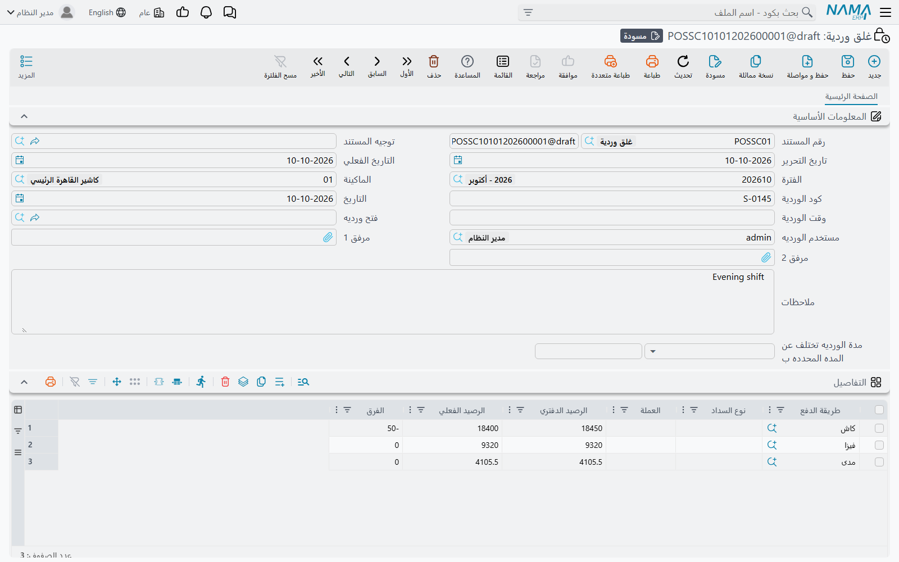
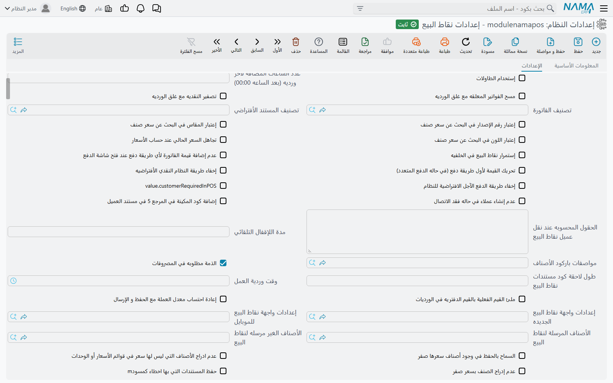
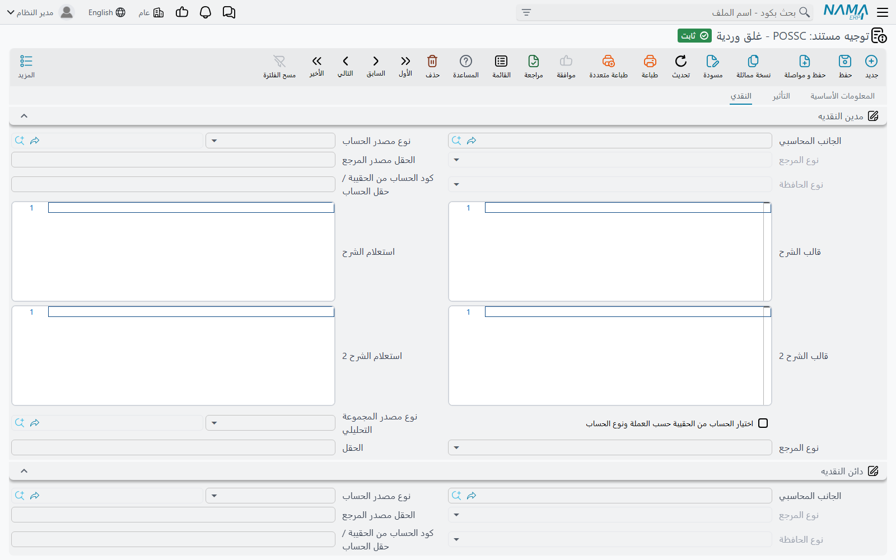

# إعدادات فتح وغلق الوردية وتصفير النقدية

يفتح الكاشير الوردية ويغلقها على الماكينة (راجع [الورديات والنقدية](../pos-shifts-and-cash.md)). هذه الصفحة هي النصف الآخر من القصة: ماذا تصبح هذه الورديات على خادم نما، وأي الإعدادات تتحكم في سلوك الغلق، وكيف يتحول الغلق إلى قيود محاسبية. وهي الصفحة التي تحتاجها حين يقول العميل *«الوردية لا تتصفر عند الغلق»* أو *«الكاشير لا يستطيع غلق الوردية»*.

## ما الذي يصل إلى الخادم

كل وردية تفتحها الماكينة أو تغلقها تُرسَل إلى الخادم كمستند:

| الشاشة | الاسم الإنجليزي | ما تحتويه |
|---|---|---|
| **فتح ورديه** | POS Shift Opening | جرد الافتتاح لكل طريقة دفع وعملة |
| **غلق وردية** | POS Shift Closing | جرد الغلق: ما توقعه النظام، وما عدّه الكاشير، والفرق بينهما |
| **جرد** | POS Cash Drawer | جرد للنقدية أثناء الوردية دون غلقها |

تجدها في **نقاط البيع ← المستندات** (أما الجرد ففي **نقاط البيع ← الملفات**). الجدول في كل منها له الأعمدة نفسها: **طريقة الدفع** و**نوع السداد** و**العملة** و**الرصيد الدفتري** (ما توقعته الماكينة) و**الرصيد الفعلي** (ما عدّه الكاشير) و**الفرق** (الفعلي ناقص الدفتري). ويحمل رأس المستند الماكينة، و**كود الوردية** المشترك بين الفتح وغلقه، و**مستخدم الورديه**، والربط بين سند الفتح وسند الغلق.

هذه **مستندات نظامية**: تُنشئها الماكينة ولا يمكن إنشاؤها أو تعديلها أو حذفها على الخادم، وأي محاولة لذلك تُرفض بالرسالة «مستند نظامي لا يمكنك انشاؤة أو التعديل فيه أو مسحه». الجرد الخاطئ يُصحَّح بتسوية محاسبية، لا بتعديل سند الغلق.

## تصفير النقدية مع الغلق

أكثر إعداد يسأل عنه العملاء هو **تصفير النقديه مع غلق الورديه** (Shift Close Reset Cash) في شاشة **إعدادات نقاط البيع** (**نقاط البيع ← الإعدادات ← إعدادات نقاط البيع**). وهو الذي يحدد مصير النقدية في الدرج بعد غلق الوردية.

**إذا كان غير مفعَّل** تبقى النقدية المعدودة في دفاتر الدرج. مثلًا: توقّع النظام 5,000 وعدّ الكاشير 4,980، فتُغلق الوردية بفرق −20، وتبدأ الوردية التالية ورصيد النقدية في الدرج 4,980. يناسب هذا المحل الذي تبقى فيه «الفكّة» في الدرج من وردية إلى أخرى.

**إذا كان مفعَّلًا** يعود رصيد النقدية إلى الصفر مع كل غلق. تُعتبر الـ 4,980 قد سُلِّمت، وتبدأ الوردية التالية من الصفر (مضافًا إليه ما يدخله الكاشير كجرد افتتاح جديد). يناسب هذا المحل الذي يُفرَّغ فيه الدرج إلى الخزينة أو إلى المشرف مع نهاية كل وردية.

أما طرق الدفع غير النقدية — البطاقات والقسائم ونحوها — فتُصفَّر **دائمًا** عند الغلق أيًّا كانت قيمة الإعداد. الإعداد يغيّر سلوك سطر النقدية فقط.

### أي سطر يُعتبر «النقدية»

سطر واحد فقط في سند الغلق هو سطر النقدية:

- سطر النقدية الافتراضي للنظام، أو
- طريقة الدفع المعلَّم عليها **طريقة الدفع النقدي** في جدول **طرق الدفع** في [الماكينة](./pos-register-setup.md) — أو في الجدول نفسه في **إعدادات نقاط البيع** إن لم يكن للماكينة طرق دفع خاصة بها.

إذا كان المحل يحصّل النقدية بطريقة دفع غير معلَّم عليها أنها النقدية، يُعامَل سطرها كأي طريقة غير نقدية.

### أثر التصفير في الحسابات

مع تفعيل الإعداد يُنتج سند الغلق أيضًا قيدًا **ينقل النقدية المعدودة** من الماكينة. الحسابات تأتي من صفحة **النقدي** في توجيه مستند غلق الوردية (مجموعتا **مدين النقديه** و**دائن النقديه**). الإعداد المعتاد يجعل الخزينة الرئيسية مدينة ونقدية الماكينة دائنة. يجب ملء المجموعتين معًا؛ فإن كانت إحداهما فارغة تُصفِّر الماكينة رصيدها لديها لكن الخادم لا يكتب سطور نقل النقدية.

### حين يبدو أن التصفير لا يحدث

راجع النقاط التالية بالترتيب:

1. **هل الإعداد مفعَّل؟** افتح **إعدادات نقاط البيع** وتحقق من **تصفير النقديه مع غلق الورديه**. هناك شاشة إعدادات نقاط بيع واحدة للشركة كلها، وليس لكل ماكينة نسخة خاصة من هذا الخيار.
2. **هل وصل التعديل إلى الماكينة؟** تصل الإعدادات إلى الماكينة عبر مزامنة البيانات نفسها التي تنقل الأصناف والأسعار. الماكينة غير المتصلة، أو المتوقفة مزامنتها، تعمل بالقيمة القديمة. راجع [كيف تتزامن بيانات نقاط البيع مع الخادم](../pos-data-sync.md).
3. **هل النقدية هي فعلًا طريقة الدفع النقدي؟** تأكد أن طريقة الدفع المستخدمة للنقدية معلَّم عليها **طريقة الدفع النقدي** في الماكينة.
4. **هل صفحة النقدي في التوجيه مملوءة؟** إذا صُفِّرت الماكينة ولم يظهر قيد النقل على الخادم، فمجموعتا **مدين النقديه** و**دائن النقديه** في توجيه غلق الوردية ناقصتان.

::: warning ليس هو الخيار الموجود في طريقة الدفع
في شاشة **طريقة دفع** خيار باسم قريب هو **تصفير الرصيد مع غلق الوردية** (Reset Balance With Shift Close). هذا الخيار يخص مستندَي **سند فتح وردية** و**سند غلق وردية** في وحدة الحسابات، وليس نقاط البيع، وتفعيله لا يؤثر في ورديات نقاط البيع.
:::

## كيف تُقيَّد الفروق

حين يكون في سطر من سند الغلق (أو الفتح) فرق، يعالجه الخادم من صفحة **التأثير** في توجيه المستند:

- **الزيادة** (المعدود أكثر من المتوقع) تستخدم **مدين الزيادة** و**دائن الزيادة**؛
- **النقص** (المعدود أقل) يستخدم **مدين النقصان** و**دائن النقصان**.

ويمكن لطريقة الدفع أن تتجاوز ذلك بجانبيها **الجانب المدين لفرق الورديه** و**الجانب الدائن لفرق الورديه** (في شاشة **طريقة دفع**)، ويُطبَّقان معكوسين في حالة النقص. السطور التي لا فرق فيها لا تُنتج أي قيد.

## إعدادات تتحكم في الغلق

كل هذه الإعدادات في **إعدادات نقاط البيع**. وحيث يكون للماكينة حقل بالاسم نفسه، تُقدَّم قيمة الماكينة.

| الإعداد كما يظهر على الشاشة | الاسم الإنجليزي | ما يفعله |
|---|---|---|
| تصفير النقديه مع غلق الورديه | Shift Close Reset Cash | يصفّر رصيد النقدية مع كل غلق (انظر أعلاه). |
| مسح الفواتير المعلقه مع غلق الورديه | Delete Held Invoices On Shift Closing | يحذف الفواتير والمردودات والاستبدالات المعلقة على الماكينة عند غلق الوردية. |
| إرسال الفواتير المعلقة عند غلق الوردية أو حذف الفاتورة المعلقة | Send Held Invoices On Shift Closing and On Deleting Held Invoices | يرسل الفواتير المعلقة إلى الخادم (كسجلات **فاتورة معلقة**) عند غلق الوردية حتى لا تضيع. |
| منع الاغلاق في وجود مستندات معلقة | Prevent Close If Hold Documents Exist | يرفض الغلق ما دامت هناك فاتورة أو مردود أو استبدال معلَّق. |
| منع إغلاق الوردية عند وجود فواتير معلقة | Prevent Shift Close On Held Invoices | مثله، لكن الفواتير المعلقة وحدها هي التي تمنع الغلق. |
| منع إغلاق الوردية عند وجود إشعارات دائنة غير مستخدمة تم إنشاؤها أثناء الوردية | Prevent Shift Close On Unused Credit Notes | يرفض الغلق ما دام إشعار دائن صدر في هذه الوردية له رصيد غير مستخدم. |
| منع تسجيل الدخول إلا لمنشئ الوردية أو من لديه صلاحية استخدام وردية مستخدم أخر | Prevent Login Except For Shift Opener Or Users With Can-Use-Another-User-Shift Capability | ما دامت هناك وردية مفتوحة، لا يدخل إلا من فتحها أو مستخدم لديه في صلاحيات نقاط البيع **إمكانية استخدام وردية مستخدم أخر**. |
| عدد الساعات المضافه لاخر ورديه (بعد الساعه 00:00) | Count of added hours to last shift (After 00:00 O'clock) | للأنشطة التي تغلق بعد منتصف الليل. اجعله 3، فيُؤرَّخ المستند المحفوظ الساعة 01:30 باليوم السابق الساعة 23:59، فتبقى إيرادات الليلة في يوم عمل واحد. |
| وقت وردية العمل | Work Shift Time | الوقت المتوقع لانتهاء الوردية. الوردية التي فُتحت قبل هذا الوقت لا تستطيع البيع بعده، ويُطلب من الكاشير غلقها وفتح وردية جديدة. موجود أيضًا في الماكينة، وقيمة الماكينة هي المقدَّمة. |
| مدة الورديه | Shift Period | الطول المتوقع للوردية. يُظهر كل سند غلق وردية عندئذٍ **مدة الورديه تختلف عن المده المحدده ب** — كم زادت الوردية أو نقصت بالساعات. |
| ملئ القيم الفعلية بالقيم الدفتريه في الورديات | Fill Actual With System Value In Shifts | يملأ **الرصيد الفعلي** مسبقًا بالرصيد الدفتري، فلا يغيّر الكاشير إلا السطور المختلفة. اتركه غير مفعَّل إن أردت جردًا أعمى. |
| منع حفظ سند الوردية باختصار F2 | Prevent Saving Shift By F2 Shortcut | لا تُحفظ شاشة الوردية إلا بزرها، لا بالمفتاح F2. |
| الفئات النقدية (CSV) | Cash Denominations (CSV) | الأوراق والعملات المعدنية التي تظهر في مربع الفئات في شاشة الغلق، مفصولة بفواصل، مثل `200,100,50,20,10,5,1,0.5`. |
| العناصر المجرودة مع كل وردية | Taken Elements Per Shift | أشياء إضافية تُعدّ مع كل فتح أو غلق — مفاتيح، قسائم، مخزون بطاقات هدايا. كل سطر يحدد المستند (فتح أو غلق) والعنصر، ويُدخل الكاشير قيمته، فتُحفظ في جدول **العناصر المجرودة مع كل وردية** في المستند. موجود أيضًا في الماكينة. |
| تحديث الفواتير التي لا تحتوي على فتح وردية مع حفظ الوردية | Update Invoices Without ShiftOpening On Shift Save | حين يصل سند فتح الوردية إلى الخادم بعد فواتيرها، يربط فواتير تلك الوردية التي وصلت من قبل به. |
| البدء بالشكل الجديد لشاشة الورديات | Start With New Shift UI | يستخدم الشكل الأحدث لشاشة الورديات في جرد النقدية أثناء الوردية أيضًا. |

والفاتورة مؤجلة الدفع تمنع الغلق دائمًا، أيًّا كانت الإعدادات.

### خيارات طريقة الدفع التي تؤثر في الغلق

ثلاثة خيارات في شاشة **طريقة دفع** تغيّر سلوك سطرها في شاشة الغلق:

- **اخفاء في شاشة الورديات** — لا تظهر الطريقة في شاشة الوردية إطلاقًا.
- **تعطيل الرصيد الفعلي في نقطة البيع** — لا يستطيع الكاشير إدخال رصيد فعلي لها.
- **الرصيد الفعلي في نقطة البيع إجباري** — يُرفض الغلق إذا كان للطريقة رصيد دفتري وترك الكاشير رصيدها الفعلي فارغًا.

## رسائل قد تظهر لك

تظهر هذه الرسائل على الماكينة حين يحاول الكاشير غلق الوردية أو البيع.

| الرسالة | السبب | ما العمل |
|---|---|---|
| «لا يمكن غلق الوردية و هناك فواتير مبيعات معلقة» | خيار **منع إغلاق الوردية عند وجود فواتير معلقة** مفعَّل وهناك فاتورة معلقة. | استدعِ الفاتورة المعلقة وأكملها أو احذفها، ثم أغلق. |
| «لا يمكن غلق الوردية و هناك مستندات معلقة (فواتير او مردودات او استبدالات)» | خيار **منع الاغلاق في وجود مستندات معلقة** مفعَّل. | أكمل كل مستند معلَّق أو احذفه. |
| «لا يمكن غلق الوردية و هناك إشعارات دائنة غير مستخدمة» | خيار **منع إغلاق الوردية عند وجود إشعارات دائنة غير مستخدمة…** مفعَّل وإشعار دائن من هذه الوردية ما زال له رصيد. | استخدم الإشعار الدائن، أو راجع المدير في إبقاء الإعداد. |
| «لا يمكن غلق الورديه في وجود فواتير مؤجلة الدفع» | فاتورة على هذه الماكينة تنتظر الدفع. | حصّل قيمتها أولًا. |
| «الرصيد الفعلي إجباري لطريقة الدفع {0}» | الطريقة معلَّم عليها **الرصيد الفعلي في نقطة البيع إجباري** وجردها فارغ. | أدخل المبلغ المعدود. |
| «قيمه فعليه سالبه» | أُدخل مبلغ سالب كنقدية معدودة. | صحّح الجرد. |
| «يجب إغلاق الوردية الحالية لتخطى وقت الوردية المسموح به وفتح وردية جديدة» | تجاوزت الوردية **وقت وردية العمل**. | أغلق الوردية وافتح وردية جديدة. |
| *Another user has an open shift, you cannot login* | خيار **منع تسجيل الدخول إلا لمنشئ الوردية…** مفعَّل ومستخدم آخر هو من فتح الوردية الحالية. ليس لهذه الرسالة ترجمة عربية فتظهر بالإنجليزية على الشاشات العربية أيضًا. | ادخل بمستخدم الوردية، أو أغلق الوردية، أو امنح المستخدم **إمكانية استخدام وردية مستخدم أخر**. |
| «وردية مستخدم أخر. المستخدم: {0} قام بفتح وردية في: {1} {2}» | الكاشير يحفظ مستندًا في وردية فتحها مستخدم آخر، وليس لديه **إمكانية استخدام وردية مستخدم أخر**. | أغلق تلك الوردية وافتح وردية بمستخدم الكاشير نفسه، أو امنحه الصلاحية. |
| «مستند نظامي لا يمكنك انشاؤة أو التعديل فيه أو مسحه» | محاولة إنشاء أو تعديل مستند وردية على الخادم. | مستندات الوردية تأتي من الماكينة فقط؛ صحّح الخطأ بتسوية محاسبية. |
