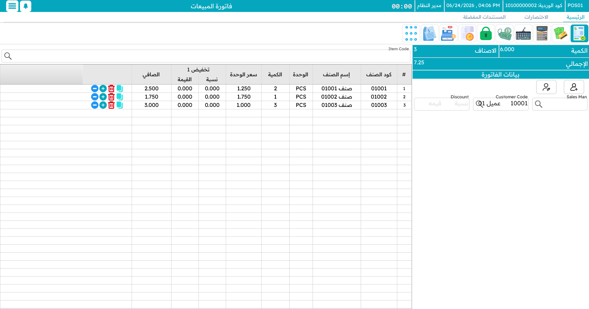

# نقاط البيع

يعمل معظم نظام Nama ERP داخل متصفح الويب، إلا أن **نقاط البيع (Nama POS)** استثناء: فهي **تطبيق سطح مكتب** مخصّص يعمل مباشرةً على ماكينة الكاشير، يرافقه تطبيق جوال **كابتن أوردر (Captain Order)** للنُّدُل. والسبب في هذا التصميم بسيط — نقطة البيع لا يصح أن تتوقف عن البيع لمجرد انقطاع الإنترنت.

## مصمَّمة للعمل دون اتصال أولًا

أرض المتجر بيئة صعبة: ينقطع الاتصال، ويزدحم الزبائن أمام الكاشير، ومع ذلك يتوقّع الزبون الواقف أمامك إيصالًا خلال ثوانٍ. لذلك تحتفظ كل ماكينة بـ**قاعدة بيانات محلية** خاصة بها، وتُسجِّل كل عملية بيع ومرتجع ودفع ووردية **محليًا أولًا**، ثم تُزامن في الخلفية ما تنشئه إلى نظام Nama ERP المركزي — وترفع المستندات المتراكمة تلقائيًا فور عودة الاتصال.

هذه أهم فكرة عن نقاط البيع، ولها صفحة مستقلة ضمن القائمة أدناه.

## كيف رُتِّب هذا الدليل

هذا الدليل جولةٌ في الماكينة، بالترتيب الذي ستقابل به كل جزء تقريبًا.

### ابدأ من هنا

- **[نقاط البيع (Nama POS) — نظرة عامة](./pos-overview.md)** — ما هو النظام، ومكوّناته (الماكينة، كابتن أوردر، الخادم، الملحقات)، ومن يستخدم كلًّا منها.
- **[تنزيل ماكينة جديدة](./pos-installation.md)** — الإعداد لأول مرة: SQL Server، قاعدة البيانات المحلية، المُنصِّب، شاشة الإعدادات، وأول تزامن مع الخادم.
- **[البداية على الماكينة](./pos-getting-started.md)** — التشغيل، تسجيل الدخول، القائمة المنزلقة، اختصارات لوحة المفاتيح، قفل الشاشة، اعتماد المشرف، اللغة والمظهر.

### البيع

- **[فاتورة المبيعات](./pos-sales-invoice.md)** — شاشة البيع الرئيسية: إضافة الأصناف، العميل، الخصومات، تعليق الفاتورة واستعادتها.
- **[الدفع والتحصيل](./pos-payment-and-tender.md)** — تحصيل المبلغ: نقدًا، بالبطاقة، الدفع المجزّأ، الكوبونات، الإشعارات الدائنة، نقاط المكافأة.
- **[المرتجعات والإحلال](./pos-returns-and-replacements.md)** — الاسترجاع، الاستبدال، الإشعارات الدائنة، وخصم الإهلاك على المرتجع.

### تشغيل الماكينة

- **[الورديات والنقدية](./pos-shifts-and-cash.md)** — فتح الوردية وإغلاقها، جرد الدرج، الإيداع والصرف.
- **[الطاولات والحجوزات وكابتن أوردر](./pos-tables-and-restaurant.md)** — الصالات والطاولات، الحجوزات، الطلبات المعلّقة، آلية مركز الاتصال، وتطبيق النادل على الجوال.
- **[إضافات الأصناف](./pos-item-addons.md)** — المقاسات والألوان والإضافات (كالسكر والحليب للقهوة).
- **[العمليات المخزنية على الماكينة](./pos-inventory-operations.md)** — الاستلام والتحويل والجرد والإتلاف من الماكينة.
- **[التقارير والأدوات](./pos-reports-and-tools.md)** — تشغيل التقارير، الرسائل الداخلية، فاحص الأسعار، وأدوات الصيانة.

### خلف الكواليس

- **[كيف تتزامن بيانات نقاط البيع مع الخادم](./pos-data-sync.md)** — معنى "مُرسَل" و"غير مُرسَل"، وماذا تفعل حين يتعذّر رفع مستند.

### نقاط فنية ومراجع

- **[دليل استعمال النقاط الفنية في نقاط البيع](./nama-pos.md)** — شاشة العرض الجانبية، التصفية بالمحددات، الدخول بمفتاح API، عرض الأعمدة، إعادة ضبط العداد، ونقاط فنية أخرى.
- **[الأصناف المجانية في نقاط البيع: المطالبة بالمسح والتسوية عند الدفع](./pos-free-items-claim-and-reconciliation.md)** — كيف تُطالَب الأصناف المجانية الترويجية وتُسوّى.
- **[تسجيل الدخول بالبصمة في نقاط البيع](./pos-fingerprint-login.md)** — الدخول عبر جهاز قراءة البصمة.
- **[أسئلة شائعة حول نقاط البيع](./pos-faq.md)** — إجابات سريعة عن الأسئلة المتكررة.

::: tip الإعدادات موضوع منفصل
هذا الدليل عن **استخدام** نقاط البيع يوميًا. أما إعدادها — تعريف الماكينات وطرق الدفع وملفّات الأمان وتخطيط الشاشات وإعدادات نقاط البيع الكثيرة — فموثّق على حدة.
:::
