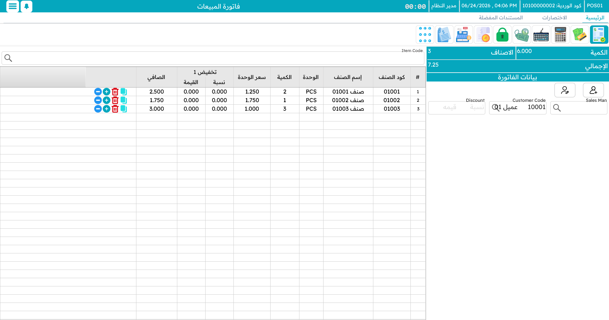

# نقاط البيع

يعمل معظم نظام Nama ERP داخل متصفح الويب، إلا أن **نقاط البيع (Nama POS)** استثناء: فهي **تطبيق سطح مكتب** مخصّص يعمل مباشرةً على ماكينة الكاشير، يرافقه تطبيق جوال **كابتن أوردر (Captain Order)** للنُّدُل. والسبب في هذا التصميم بسيط — نقطة البيع لا يصح أن تتوقف عن البيع لمجرد انقطاع الإنترنت.

## مصمَّمة للعمل دون اتصال أولًا

أرض المتجر بيئة صعبة: ينقطع الاتصال، ويزدحم الزبائن أمام الكاشير، ومع ذلك يتوقّع الزبون الواقف أمامك إيصالًا خلال ثوانٍ. لذلك تحتفظ كل ماكينة بـ**قاعدة بيانات محلية** خاصة بها، وتُسجِّل كل عملية بيع ومرتجع ودفع ووردية **محليًا أولًا**، ثم تُزامن في الخلفية ما تنشئه إلى نظام Nama ERP المركزي — وترفع المستندات المتراكمة تلقائيًا فور عودة الاتصال.

هذه أهم فكرة عن نقاط البيع، ولها صفحة مستقلة ضمن القائمة أدناه.

## كيف رُتِّب هذا الدليل

هذا الدليل جولةٌ في الماكينة، بالترتيب الذي ستقابل به كل جزء تقريبًا.

### ابدأ من هنا

<LandingGrid>
  <LandingCard icon="🗺️" title="نقاط البيع (Nama POS) — نظرة عامة" link="/ar/modules/pos/pos-overview.md" details="ما هو النظام، ومكوّناته (الماكينة، كابتن أوردر، الخادم، الملحقات)، ومن يستخدم كلًّا منها." />
  <LandingCard icon="💿" title="تنزيل ماكينة جديدة" link="/ar/modules/pos/pos-installation.md" details="الإعداد لأول مرة: SQL Server، قاعدة البيانات المحلية، المُنصِّب، شاشة الإعدادات، وأول تزامن مع الخادم." />
  <LandingCard icon="🚀" title="البداية على الماكينة" link="/ar/modules/pos/pos-getting-started.md" details="التشغيل، تسجيل الدخول، القائمة المنزلقة، اختصارات لوحة المفاتيح، قفل الشاشة، اعتماد المشرف، اللغة والمظهر." />
</LandingGrid>

### البيع

<LandingGrid>
  <LandingCard icon="🛒" title="فاتورة المبيعات" link="/ar/modules/pos/pos-sales-invoice.md" details="شاشة البيع الرئيسية: إضافة الأصناف، العميل، الخصومات، تعليق الفاتورة واستعادتها." />
  <LandingCard icon="💳" title="الدفع والتحصيل" link="/ar/modules/pos/pos-payment-and-tender.md" details="تحصيل المبلغ: نقدًا، بالبطاقة، الدفع المجزّأ، الكوبونات، الإشعارات الدائنة، نقاط المكافأة." />
  <LandingCard icon="↩️" title="المرتجعات والإحلال" link="/ar/modules/pos/pos-returns-and-replacements.md" details="الاسترجاع، الاستبدال، الإشعارات الدائنة، وخصم الإهلاك على المرتجع." />
</LandingGrid>

### تشغيل الماكينة

<LandingGrid>
  <LandingCard icon="💵" title="الورديات والنقدية" link="/ar/modules/pos/pos-shifts-and-cash.md" details="فتح الوردية وإغلاقها، جرد الدرج، الإيداع والصرف." />
  <LandingCard icon="🍽️" title="الطاولات والحجوزات وكابتن أوردر" link="/ar/modules/pos/pos-tables-and-restaurant.md" details="الصالات والطاولات، الحجوزات، الطلبات المعلّقة، آلية مركز الاتصال، وتطبيق النادل على الجوال." />
  <LandingCard icon="☕" title="إضافات الأصناف" link="/ar/modules/pos/pos-item-addons.md" details="المقاسات والألوان والإضافات (كالسكر والحليب للقهوة)." />
  <LandingCard icon="📦" title="العمليات المخزنية على الماكينة" link="/ar/modules/pos/pos-inventory-operations.md" details="الاستلام والتحويل والجرد والإتلاف من الماكينة." />
  <LandingCard icon="📊" title="التقارير والأدوات" link="/ar/modules/pos/pos-reports-and-tools.md" details="تشغيل التقارير، الرسائل الداخلية، فاحص الأسعار، وأدوات الصيانة." />
</LandingGrid>

### خلف الكواليس

<LandingGrid>
  <LandingCard icon="🔄" title="كيف تتزامن بيانات نقاط البيع مع الخادم" link="/ar/modules/pos/pos-data-sync.md" details="معنى «مُرسَل» و«غير مُرسَل»، وماذا تفعل حين يتعذّر رفع مستند." />
</LandingGrid>

### الإعداد على الخادم

<LandingGrid>
  <LandingCard icon="🛠️" title="نقاط البيع — الإعداد على الخادم" link="/ar/modules/pos/erp-setup/" details="ملف الماكينة، وإعدادات نقاط البيع، وترقيم المستندات، وإعدادات غلق الوردية وتصفير النقدية، والتوجيهات، وصلاحيات نقاط البيع، وباقي شاشات قائمة نقاط البيع." />
</LandingGrid>

### نقاط فنية ومراجع

<LandingGrid>
  <LandingCard icon="🔧" title="دليل استعمال النقاط الفنية في نقاط البيع" link="/ar/modules/pos/nama-pos.md" details="شاشة العرض الجانبية، التصفية بالمحددات، الدخول بمفتاح API، عرض الأعمدة، إعادة ضبط العداد، ونقاط فنية أخرى." />
  <LandingCard icon="🎁" title="الأصناف المجانية في نقاط البيع: المطالبة بالمسح والتسوية عند الدفع" link="/ar/modules/pos/pos-free-items-claim-and-reconciliation.md" details="كيف تُطالَب الأصناف المجانية الترويجية وتُسوّى." />
  <LandingCard icon="👆" title="تسجيل الدخول بالبصمة في نقاط البيع" link="/ar/modules/pos/pos-fingerprint-login.md" details="الدخول عبر جهاز قراءة البصمة." />
  <LandingCard icon="❓" title="أسئلة شائعة حول نقاط البيع" link="/ar/modules/pos/pos-faq.md" details="إجابات سريعة عن الأسئلة المتكررة." />
</LandingGrid>

::: tip الإعدادات موضوع منفصل
هذا الدليل عن **استخدام** نقاط البيع يوميًا. أما إعدادها — تعريف الماكينات وطرق الدفع وملفّات الأمان وتخطيط الشاشات وإعدادات نقاط البيع الكثيرة — فموثّق في [نقاط البيع — الإعداد على الخادم](./erp-setup/).
:::
