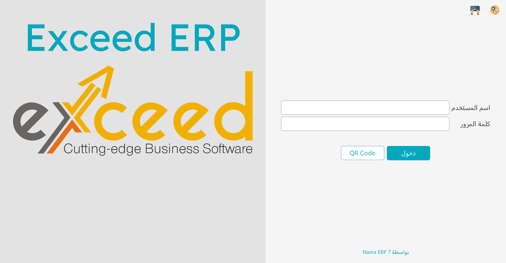
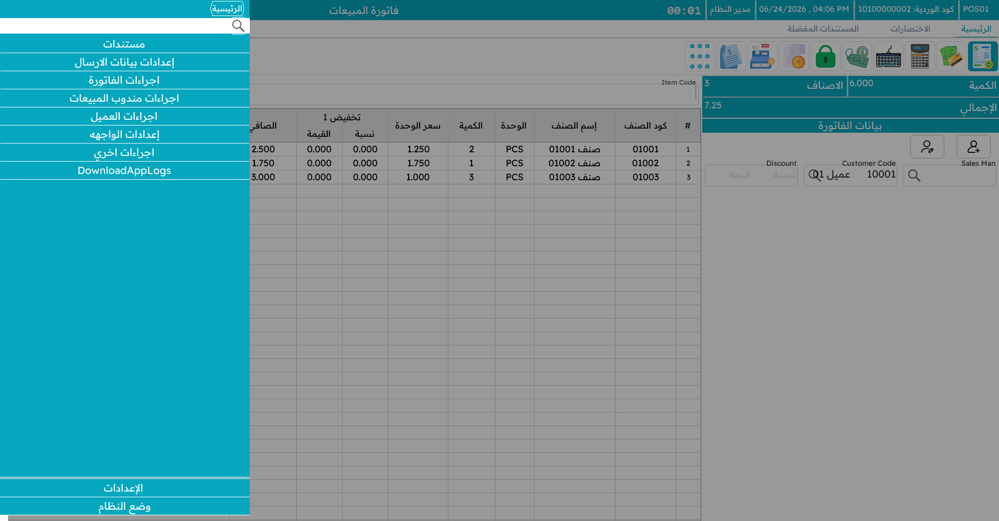
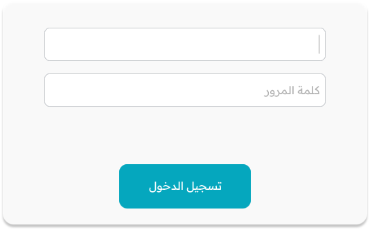
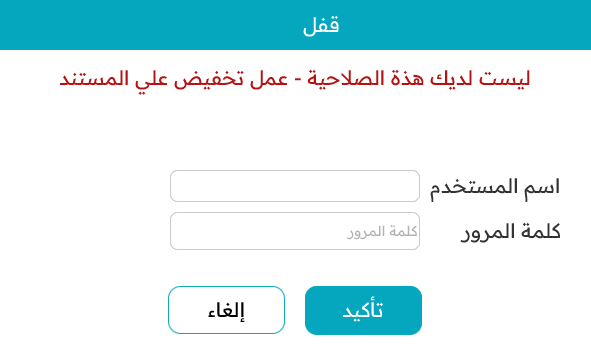

# البداية على الماكينة

تستعرض هذه الصفحة الأساسيات اليومية: تشغيل التطبيق، تسجيل الدخول، التنقّل في القائمة، قفل الشاشة عند الابتعاد، وتبديل اللغة أو المظهر.

## تشغيل التطبيق

عند تشغيل نقاط البيع تظهر أولًا **شاشة بدء** بشريط تقدّم بينما تستيقظ الماكينة.

خلف هذه الشاشة تقوم الماكينة بعدة أمور: فتح **قاعدة بياناتها المحلية**، وتطبيق اللغة والمظهر المحفوظين، وتحميل إعداداتها وأسعارها من الذاكرة المؤقتة، و — إن أمكنها الوصول إلى الخادم — سحب أحدث البيانات ورفع ما تبقّى من المرة السابقة. وإن تعذّر الوصول إلى الخادم، تواصل الماكينة العمل دون اتصال؛ فبإمكانك البيع.

## تسجيل الدخول

بمجرد جهوزية الماكينة تظهر **شاشة الدخول**.

هناك ثلاث طرق لتسجيل الدخول، ويمكن استخدامها جميعًا على الماكينة نفسها:

**اسم المستخدم وكلمة المرور.** الطريقة التقليدية. اكتب اسم المستخدم ثم كلمة المرور واضغط Enter. ويُحمَّل معك **ملف الأمان** الخاص بك، وهو ما يحدّد العمليات المسموح لك بها (انظر قسم **القفل والأمان** أدناه).

**البصمة.** إن سُجّلت بصمتك، فما عليك سوى وضع إصبعك على القارئ — دون أي كتابة. يبقى القارئ مُنصِتًا في الخلفية على شاشة الدخول وشاشة إلغاء القفل ونافذة اعتماد المشرف. ويُشرَح التسجيل والإعداد في [تسجيل الدخول بالبصمة](./pos-fingerprint-login.md).

**مفتاح API.** بدلًا من تخزين كلمة المرور على الجهاز، يمكن للماكينة الدخول بـ**مفتاح API** مرتبط بمستخدم. وهذا يستمر في العمل حتى بعد تغيير كلمة مرور ذلك المستخدم، ويتجنّب الاحتفاظ بكلمة المرور (ولو مشفّرة) في ملفات الماكينة. يمكنك لصق المفتاح في نافذة الإعدادات الأولية بدل اسم المستخدم وكلمة المرور. وتجد الإعداد التفصيلي في [دليل النقاط الفنية](./nama-pos.md).

## التنقّل

### القائمة المنزلقة

تنزلق القائمة الرئيسية من جانب الشاشة. تضم أزرارًا للعمليات الشائعة — بيع جديد، دفع، مرتجعات، ورديات، الفواتير المعلّقة، التقارير، القفل، وغيرها. اضغط على أي عملية للانتقال إلى شاشتها.

### اختصارات لوحة المفاتيح

الكاشير المزدحم يعمل بلوحة المفاتيح لا بالفأرة. تأتي نقاط البيع باختصارات افتراضية معقولة (يمكن لمسؤولك تغيير أيٍّ منها على الخادم، فقد تختلف لديك):

| الاختصار | العملية | الاختصار | العملية |
|---|---|---|---|
| `Alt+F1` | بيع جديد | `F6` | تعليق الفاتورة |
| `F1` | التنقّل بين الجدول والترويسة | `Ctrl+F6` | عرض الفواتير المعلّقة |
| `Ctrl+F1` | مرتجع مبيعات | `Shift+F6` | حذف كل الفواتير المعلّقة |
| `Shift+F1` | إحلال (استبدال) | `Ctrl+Shift+F6` | عرض طلبات مركز الاتصال المعلّقة |
| `F2` | شاشة الوردية (فتح/إغلاق) | `F7` | اختيار العميل |
| `Ctrl+F2` | شاشة المخزون | `Shift+F7` | إضافة عميل جديد |
| `F3` | البحث عن صنف/مستند | `Ctrl+F7` | إزالة العميل |
| `Ctrl+F3` | فتح فاتورة قائمة | `F8` | اختيار المندوب |
| `F4` | تغيير حجم الخط | `Ctrl+F8` | إزالة المندوب |
| `F5` | الدفع / التحصيل | `Ctrl+F9` | استعلام السعر |
| `F10` | خصم الفاتورة | `Alt+1` … `Alt+8` | مستويات خصم السطر 1–8 |
| `Ctrl+F10` | إلغاء خصم الفاتورة | `Ctrl+Q` | تعديل كمية السطر المحدد |
| `F11` | قفل الشاشة | `Ctrl+Del` | حذف السطر المحدد |
| `Ctrl+F11` | عرض كل الإشعارات | `+` | نسخة مماثلة للسطر |
| `F12` | المساعدة | `Alt+P` | إعادة الطباعة |
| `Alt+R` | الدفع بنقاط المكافأة | `Ctrl+O` | استعلام الطلبات الإلكترونية |
| `Page Up` | الانتقال إلى حقول الترويسة | `Page Down` | الانتقال إلى جدول السطور |
| `Alt+F4` | إغلاق التطبيق | `Ctrl+I` | فتح فاتورة معلّقة بالكود |

::: tip
لا حاجة لحفظها كلها. تعرض القائمة المنزلقة الاختصار بجوار كل عملية، والأكثر استخدامًا (بيع جديد، دفع، تعليق، خصم) يصبح تلقائيًا خلال يوم.
:::

## القفل والأمان

### قفل الشاشة

كلما ابتعدت عن الماكينة — ولو لحظة — **اقفل الشاشة** بـ `F11`. عندها يغطّي الشاشةَ طلبُ دخول، وعلى من يريد استخدام الماكينة تسجيل الدخول من جديد. هذا يمنع تسجيل مبيعات باسمك أثناء غيابك، ويُسجَّل القفل وإلغاؤه للتدقيق.

لإلغاء القفل، سجّل الدخول مجددًا (ببياناتك، أو ببيانات مستخدم آخر مخوّل، أو بالبصمة). ومن يلغي القفل يصبح المشغّل الفعّال.

### اعتماد المشرف

بعض العمليات مقيّدة عمدًا — خصم كبير، مرتجع بعد المدة المسموحة، إلغاء فاتورة. وحين يحاول كاشير لا يملك تلك الصلاحية إحداها، لا تكتفي نقاط البيع بالرفض، بل تُظهر **نافذة اعتماد** صغيرة تطلب بيانات شخص يملك الصلاحية.

يكتب المشرف اسمه وكلمة مروره (أو يستخدم بصمته)، فتمرّ العملية ويتابع الكاشير — دون تسجيل خروج ودخول. ويُسجَّل كل اعتماد كهذا.

### المستخدمون وملفّات الأمان

تتكامل هنا فكرتان:

- **مستخدم نقاط البيع** هو حساب دخول مرتبط بموظف.
- **ملف الأمان** حزمة مسمّاة من الصلاحيات — "كاشير"، "مشرف"، "مدير" وهكذا. لكل مستخدم ملف واحد، ويمكن لعدة مستخدمين مشاركة الملف نفسه.

ملف الأمان هو ما يجيب أسئلة مثل: *هل يحق لهذا الشخص منح خصم؟ تنفيذ مرتجع؟ رؤية النقدية المتوقَّعة عند إغلاق الوردية؟ فتح درج النقود؟* وكلها تُضبط مركزيًا على الخادم وتُدفَع إلى كل الماكينات، فتغيير الملف يحدّث كل من يحمله.

## اللغة والمظهر

يمكن لنقاط البيع العمل بأكثر من لغة. من منطقة الإعدادات يمكنك تبديل لغة الواجهة؛ ويُحفَظ الاختيار على تلك الماكينة.

كما يمكنك التبديل بين مظهر **فاتح** و**داكن** — الداكن أرفق بالعين في متجر خافت الإضاءة، والفاتح أوضح تحت الإضاءة القوية.

ويمكن أيضًا **تخصيص** نصوص بعينها لكل ماكينة — فقد يفضّل مقهى كلمة "حساب" على "فاتورة". تُضبط هذه التخصيصات مركزيًا وتُدفَع إلى الماكينة، فقد تكون الكلمات التي تراها مفصّلة على نشاطك.
