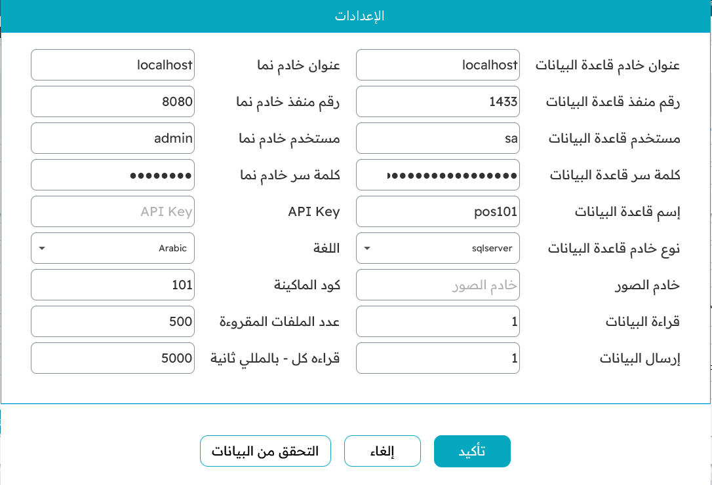

# تنزيل نقاط البيع على ماكينة جديدة وربطها بالخادم الرئيسي

نقاط البيع (Nama POS) تطبيق سطح مكتب يعمل مباشرةً على ماكينة الكاشير، ويحتفظ بقاعدة بيانات محلية خاصة به حتى يستمر البيع وإن انقطع الاتصال بالخادم المركزي. ولهذا التصميم يختلف إعداد ماكينة جديدة قليلًا عن مجرد فتح صفحة ويب — فهناك قاعدة بيانات محلية تُجهَّز، واتصال يُضبط لمرة واحدة. تأخذك هذه الصفحة في الرحلة كاملةً: من جهاز ويندوز فارغ إلى ماكينة تُنزِّل الأصناف والمستخدمين والأسعار من الخادم وتكون جاهزة لتسجيل أول فاتورة.

::: tip هذا إعداد لمرة واحدة
تفعل هذا مرة واحدة لكل ماكينة. أما الاستخدام اليومي — تسجيل الدخول والبيع والورديات — فيبدأ من صفحة [البداية على الماكينة](./pos-getting-started.md). وضبط سلوك الماكينة على الخادم (طرق الدفع، ملفّات الأمان، تخطيط الشاشة) موضوع منفصل.
:::

## قبل أن تبدأ

جهّز هذه الأمور قبل أن تلمس الجهاز الجديد:

- **جهاز ويندوز** ليكون الماكينة.
- **خادم Nama ERP** متاحًا عبر الشبكة — عنوانه ورقم منفذه.
- **مستخدم على الخادم** (اسم وكلمة سر) تستعمله نقاط البيع للاتصال بالخادم، أو **مفتاح API** بدلًا منه.
- **الماكينة معرّفة مسبقًا على الخادم** بكود. فالإعداد يتصل بهذا الكود ويتحقق الخادم من وجوده، لذا يجب إنشاء سجل الماكينة أولًا.

## الخطوة 1 — تنصيب SQL Server

كل ماكينة تحفظ مبيعاتها محليًا في **SQL Server**، فأول ما يُنصَّب على الجهاز هو SQL Server نفسه.

**أي إصدار؟** تعمل نقاط البيع مع **SQL Server Express** المجاني، وهو يكفي ماكينةً ذات عدد أصناف محدود. أما العملاء الذين لديهم عدد كبير من الأصناف والعملاء فننصحهم بـ**إصدار Standard**، إذ يرفع قيود الحجم والذاكرة في Express ويتحمّل الضغط بشكل أفضل. وهناك أيضًا **إصدار Developer** المجاني وكامل المزايا، لكنه مرخَّص **للاختبار والتطوير فقط** — لا تشغّل عليه ماكينة إنتاج أبدًا.

أمران مهمّان أثناء التنصيب:

- اختر نمط المصادقة **Mixed Mode**، بحيث يكون **كلٌّ** من مصادقة ويندوز ومصادقة SQL Server مفعّلًا. فنقاط البيع تدخل قاعدة البيانات بحساب SQL Server، لذا لا بد أن تكون مصادقة SQL مفعّلة.
- **دوّن كلمة سر `sa`** التي تضبطها. (أو يمكنك لاحقًا إنشاء حساب SQL مخصّص ومنحه صلاحية الوصول إلى قاعدة بيانات نقاط البيع — وهو الخيار الأنظف في بيئة الإنتاج.)

بعد انتهاء المُنصِّب، افتح **SQL Server Configuration Manager** و**فعّل بروتوكول TCP/IP** للنسخة (instance)، ثم أعد تشغيل خدمة SQL Server — تمامًا كما تفعل عند تنصيب خادم Nama ERP. فبدون تفعيل TCP/IP لا تستطيع نقاط البيع الوصول إلى قاعدة البيانات. ومنفذ SQL Server الافتراضي هو **1433**.

## الخطوة 2 — إنشاء قاعدة بيانات فارغة لنقاط البيع

افتح SQL Server Management Studio وأنشئ قاعدة بيانات فارغة للماكينة، ثم طبّق عليها إعدادات العزل (Isolation) نفسها التي تستعملها قاعدة Nama. هذه الإعدادات (read-committed snapshot و snapshot isolation) تتيح للقراءة والكتابة العمل دون أن يعيق أحدهما الآخر، فتبقى الماكينة سريعة الاستجابة. استبدل `DB_NAME` بالاسم الذي تريده (مثل `pos101`):

```sql
-- إنشاء قاعدة البيانات
create database DB_NAME;
GO

-- ضبط مستوى العزل (Isolation Level)
USE [master];
DECLARE @kill varchar(8000) = '';
SELECT @kill = @kill + 'kill ' + CONVERT(varchar(5), session_id) + ';'
FROM sys.dm_exec_sessions
WHERE database_id  = db_id('DB_NAME')
EXEC(@kill);
ALTER DATABASE DB_NAME SET READ_COMMITTED_SNAPSHOT ON;
ALTER DATABASE DB_NAME SET ALLOW_SNAPSHOT_ISOLATION ON;
ALTER DATABASE DB_NAME SET MEMORY_OPTIMIZED_ELEVATE_TO_SNAPSHOT ON;
```

اترك قاعدة البيانات فارغة — فنقاط البيع ستنشئ جداولها وتملؤها عند أول اتصال.

## الخطوة 3 — تنزيل المُنصِّب وتشغيله

نزّل مُنصِّب نقاط البيع من:

`https://namasoft.com/bin/update-pos.exe`

شغّله. سيُنزِّل المُنصِّب نقاط البيع ويفكّ ضغطها في مجلدها. وعند انتهائه، شغّل **`pos-launcher.exe`** من ذلك المجلد — فهو ما يشغّل الماكينة من الآن فصاعدًا.

وعند هذا التشغيل الأول يتأكد المُشغِّل بهدوء من توفّر كل ما تحتاجه نقاط البيع، ويُنزِّل ما ينقص:

- يبحث عن **بيئة جافا مناسبة (JDK 21 أو أحدث)**؛ فإن لم يجدها نزّلها ونصّبها.
- يبحث عن مكتبة **JavaFX** التي تحتاجها الواجهة؛ فإن كانت غير موجودة نزّلها.
- يتأكد من وجود **تطبيق نقاط البيع** نفسه، ويُنزِّل أحدث إصدار عند الحاجة.

ثم يبدأ تطبيق نقاط البيع لسطح المكتب.

::: tip احتفظ بالمُنصِّب لما بعد
`update-pos.exe` هو أيضًا أداة التحديث. احتفظ به بجوار الماكينة — فتشغيله لاحقًا يرفع نقاط البيع إلى أحدث إصدار.
:::

## الخطوة 4 — تعبئة شاشة الإعدادات

في أول تشغيل لا تعرف نقاط البيع أين قاعدة بياناتها ولا أين خادمها، لذا تفتح قبل أي شيء شاشة **الإعدادات**. وكل ما تحتاجه نقاط البيع للاتصال موجود هنا، في مجموعتين من الحقول.



**مجموعة قاعدة البيانات** تصف خادم SQL Server المحلي الذي جهّزته في الخطوتين 1 و2:

- **عنوان خادم قاعدة البيانات** — `localhost` حين يكون SQL Server على نفس جهاز الماكينة.
- **رقم منفذ قاعدة البيانات** — `1433` افتراضيًا.
- **مستخدم قاعدة البيانات** — `sa`، أو الحساب المخصّص الذي أنشأته.
- **كلمة سر قاعدة البيانات** — كلمة سر ذلك الحساب.
- **إسم قاعدة البيانات** — القاعدة التي أنشأتها في الخطوة 2 (مثل `pos101`).
- **نوع خادم قاعدة البيانات** — `sqlserver`.
- **خادم الصور** — اختياري؛ اتركه فارغًا إلا إن كنت تقدّم صور الأصناف من عنوان منفصل.
- **قراءة البيانات / إرسال البيانات** — أبقِهما مفعّلين (`1`) لتسحب الماكينة البيانات الجديدة وترفع مستنداتها معًا.

**مجموعة خادم نما** تصف نظام ERP المركزي الذي تتزامن معه الماكينة:

- **عنوان خادم نما** و**رقم منفذ خادم نما** — حيث يستجيب خادم Nama ERP (مثل المنفذ `8080`). ويمكنك أيضًا إدخال عنوان كامل يبدأ بـ `http://…` / `https://…`.
- **مستخدم خادم نما** و**كلمة سر خادم نما** — حساب الخادم الذي تستعمله نقاط البيع. وبدلًا من المستخدم وكلمة السر يمكنك إدخال **مفتاح API**، الذي يظل صالحًا حتى بعد تغيير كلمة سر المستخدم.
- **اللغة** — لغة واجهة الماكينة.
- **كود الماكينة** — **كود الماكينة كما هو معرَّف على الخادم**. وهو الرابط بين هذا الجهاز وسجلّ ماكينته.
- **عدد الملفات المقروءة** و**قراءة كل — بالمللي ثانية** — كم سجلًّا تسحبه كل دورة تزامن، وكم مرة. والقيم الافتراضية تناسب معظم الحالات.

بعد تعبئة الحقول، اضغط **التحقق من البيانات**. تختبر نقاط البيع الاتصال بقاعدة البيانات، وتدخل إلى الخادم، وتتأكد من وجود كود الماكينة — وأي خطأ يُعلَّم على الحقل المعنيّ لتصحّحه. وحين تسلم البيانات، اضغط **تأكيد**.

## الخطوة 5 — إعادة التشغيل، وأول تزامن

الضغط على تأكيد يحفظ إعداداتك و**يغلق** نقاط البيع. وهذا متوقَّع. شغّل الماكينة من جديد (شغّل `pos-launcher.exe`).

في هذه المرة الثانية تتصل نقاط البيع بالخادم وتُنزِّل البيانات الأساسية إلى قاعدتها المحلية — **المستخدمين، والماكينة نفسها، والفروع، والعملات، والأصناف، والأسعار، والإعدادات**. وعلى ماكينة جديدة ذات عدد أصناف كبير قد يستغرق هذا التزامن الأول بعض الوقت؛ وهو يحدث مرة واحدة فقط. وحين ينتهي تظهر شاشة الدخول وتكون الماكينة جاهزة.

ومن هنا تابع مع [البداية على الماكينة](./pos-getting-started.md) لتسجيل الدخول وعمل أول فاتورة.

::: warning يجب أن تكون الماكينة معرّفة على الخادم أولًا
إن أبلغت خطوة **التحقق من البيانات** أن كود الماكينة غير صالح، فهذا يعني غالبًا أن الماكينة لم تُعرَّف على الخادم بعد، أو أن الكود غير مطابق. أنشئ الماكينة أو صحّح كودها على الخادم، ثم أعد التحقق من البيانات.
:::
