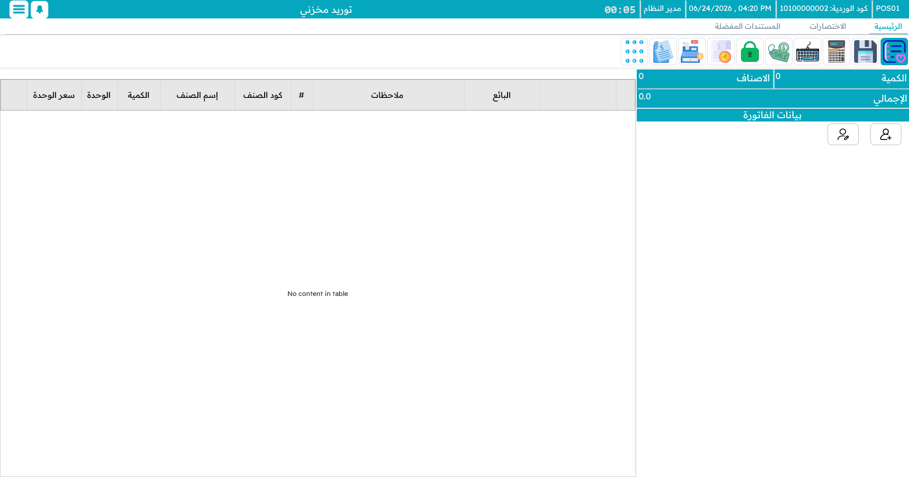
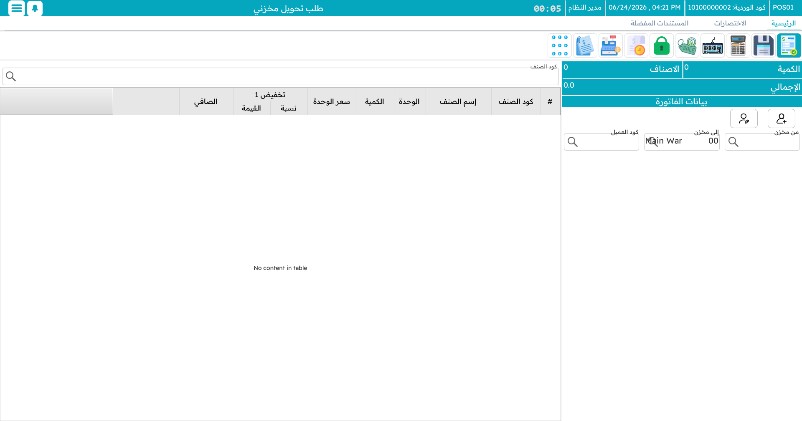
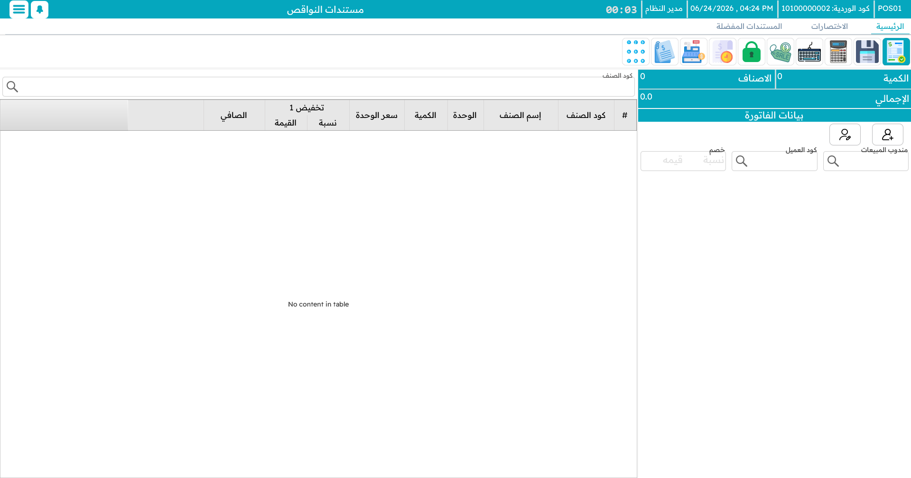

# العمليات المخزنية على الماكينة

نقطة البيع ليست صندوقًا فحسب — بل هي الخط الأمامي لمخزون المتجر أيضًا. فمن **شاشة المخزون** (`Ctrl+F2`) يستطيع مستخدم المتجر استلام البضائع، وتحويلها إلى فرع آخر، وجردها، وإتلاف التالف أو تسجيل الناقص، كل ذلك دون مغادرة الماكينة. وكلٌّ من هذه مستندٌ يتزامن مع النظام المركزي كسائر شيء.

## استلام البضائع

حين تصل البضائع — من مورّد أو الإدارة أو فرع آخر — يسجّلها **الاستلام المخزني** في مخزن المتجر. أضف كل صنف والكمية المستلَمة، وأضف ملاحظة إن لزم، واحفظ. فيحدّث الاستلام مخزون المتجر ويُرسَل إلى النظام المركزي.

## تحويل البضائع

حين تحتاج البضائع إلى الانتقال إلى مخزن أو فرع آخر، يسجّل **طلب التحويل المخزني** خروجها من هنا وتوجّهها إلى هناك. يُملأ مخزنك مصدرًا؛ اختر الوجهة، وأدرج الأصناف والكميات، واحفظ. وتؤكّده الجهة المستقبِلة من جانبها لإتمام النقل.

## جرد البضائع

مستند **الجرد** هو عدٌّ فعلي — الفحص الدوري لمطابقة ما على الرفّ لما يظنّه النظام. اختر المخزن والموقع، وامسح أو أدخل كل صنف بالكمية الموجودة فعلًا، واحفظ. تذهب الأعداد إلى النظام المركزي، حيث تُقارَن بالسجلات لإبراز أي عجز أو فائض.

## إتلاف التالف أو تسجيل الناقص

مستندان يعالجان المخزون الذي ينبغي ألّا يبقى في الدفاتر:

- **مستند الإتلاف** للبضائع التالفة أو منتهية الصلاحية أو غير الصالحة — تُزال من المخزون بسبب وأثر تدقيقي.
- **مستند العجز** يسجّل المخزون الناقص أو غير المحصور — تسرّب، فقد، كسر — أيضًا بوصف للمراجعة لاحقًا.

::: info لماذا يُفعَل هذا من الماكينة؟
أداء العمل المخزني حيث تكون البضائع فعليًّا — في المتجر، على الجهاز الذي بأيدي الموظفين — يعني أن العدّ أو الإتلاف يحدث لحظة ملاحظته، لا بعد ساعات على مكتب. ولأن كل ذلك يتزامن مع النظام المركزي، ترى الإدارة الصورة نفسها التي يراها المتجر.
:::
