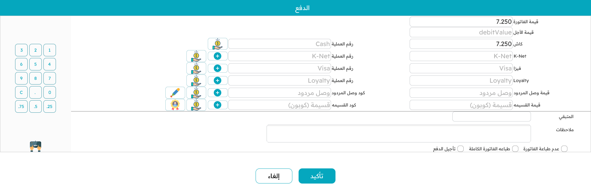

# الدفع والتحصيل

ضغط `F5` على فاتورة مكتملة يفتح **شاشة التحصيل** — لحظة الحقيقة حيث ينتقل المال. تغطّي هذه الصفحة كيف تعمل تلك الشاشة وكل طريقة قد يدفع بها العميل.

## شاشة التحصيل

التخطيط مبنيّ للسرعة:

- **قيمة الفاتورة** — المطلوب — في الأعلى.
- صفٌّ لكل **طريقة دفع** تقبلها الماكينة يتيح لك كتابة المبلغ المدفوع بتلك الطريقة. ولصفوف البطاقة والإشعار الدائن والكوبون حقلٌ لرقم اعتماد أو مرجع.
- **المتبقّي** في الأسفل يتحدّث مع كل ضغطة. الصفر يعني تغطية الفاتورة بالكامل؛ والباقي يعني وجود مبلغ ما زال يُحصّل؛ والزيادة في النقدي هي ببساطة **الباقي** الذي تُعيده.

تؤكّد لإنهاء البيع، فيُطبَع الإيصال، وتعود إلى شاشة بيع نظيفة للزبون التالي.

## طرق الدفع

### نقدًا

اكتب النقد الذي سلّمه العميل. إن زاد عن الإجمالي صار المتبقّي سالبًا، وذلك الرقم هو **الباقي** المستحق. النقد يقبل الزيادة دائمًا — وهذا هو مغزى الباقي.

### البطاقة / جهاز الدفع

تمرّ مدفوعات البطاقات عبر **جهاز دفع** مدمج. أدخل المبلغ في صف البطاقة وأرسله إلى الجهاز (هناك زر مخصّص على الصف). يؤدّي الجهاز عمله ويعيد النتيجة — الموافقة، نوع البطاقة، رقم البطاقة المُقنَّع — فتُسجَّل على سطر الدفع. وإن تعذّر مطابقة رد الجهاز بطريقة معرّفة، يُبلَّغ الكاشير بدل أن يُترَك في حيرة.

### التجزئة على عدة طرق

يمكن تسوية الفاتورة الواحدة بأكثر من طريقة — نصفها نقدًا ونصفها بالبطاقة مثلًا. أدخل كل مبلغ؛ ويُبقيك **المتبقّي** على الصواب، ولا يكتمل البيع إلا ببلوغه الصفر (أو سالبًا كباقٍ على النقد). ويمكن أيضًا تجميع الطرق في أقسام قابلة للطيّ لترتيب قائمة طويلة.

### الآجل (الدفع لاحقًا)

أحيانًا يدفع العميل لاحقًا — حساب ائتماني، طلب محجوز. اختيار **الآجل** يصفّر المبالغ ويحفظ الفاتورة مع بقاء الرصيد مستحقًّا، دون فتح الدرج أو (افتراضيًا) طباعة إيصال. وهل يحق للكاشير التأجيل أصلًا أمرٌ تحكمه صلاحية.

### الإشعارات الدائنة والكوبونات

يمكن للعميل الدفع بـ**إشعار دائن** (رصيد متجر، يُصدَر غالبًا من مرتجع سابق) أو **كوبون خصم** (من عرض ترويجي). أدخل الكود؛ تتحقّق الماكينة من صلاحيته وبقاء رصيد فيه وانتمائه للعميل الصحيح حيث يلزم، ثم تطرح قيمته من المطلوب. ويُدفَع ما تبقّى عاديًّا. أما آلية إصدارها فموجودة في صفحة [المرتجعات والإحلال](./pos-returns-and-replacements.md).

### نقاط المكافأة / الولاء

إن كان العميل ضمن برنامج ولاء، اضغط `Alt+R` لاستبدال النقاط مقابل الفاتورة. تعرض النافذة رصيد نقاطه وقيمته النقدية، وتُدخل أنت قدر ما يُستبدَل (حتى إجمالي الفاتورة). وحيث يتطلّب البرنامج ذلك، يُطلَب **رمز تحقّق لمرة واحدة (OTP)** ويُدخَل قبل قبول الاستبدال؛ كما يدعم النظام برنامج ولاء STC. تُطرَح القيمة المستبدَلة من الفاتورة ويُدفَع الباقي كالمعتاد.

## قواعد مالية تستحق المعرفة

قواعد قليلة تحفظ الصندوق:

- **الباقي نقدًا.** الزيادة متوقّعة على النقد وتصبح باقيًا. أما البطاقة وسائر الطرق غير النقدية فلا يُسمح لها عادةً بالزيادة — لا يمكن إعطاء باقٍ على بطاقة.
- **أرقام الاعتماد مطلوبة حيث تهمّ.** دفعة البطاقة تحتاج رمز موافقتها؛ والإشعار الدائن أو الكوبون يحتاج مرجعه. ولن يكتمل البيع بدونها.
- **تُقرَّب المبالغ** إلى منازل العملة العشرية للعرض، بينما تحتفظ الحسابات تحتها بالدقة الكاملة.
- **خصم طريقة الدفع** (مثل "2% خصم نقدًا") يُعيد حساب الصافي تلقائيًا عند استخدام تلك الطريقة، ويُلغى إن أُلغي الدفع.

## الإيصال

بمجرد تأكيد الدفع يُطبَع **الإيصال**. وفي أسفل شاشة التحصيل خيارات لطباعة فاتورة مفصّلة بالكامل، و — لمن يملك الصلاحية — لمنع الطباعة. ويمكن إعادة طباعة الإيصالات لاحقًا من شاشة البيع بـ `Alt+P`.

