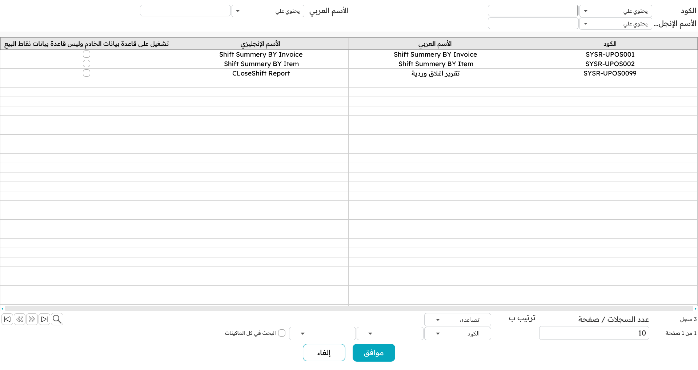
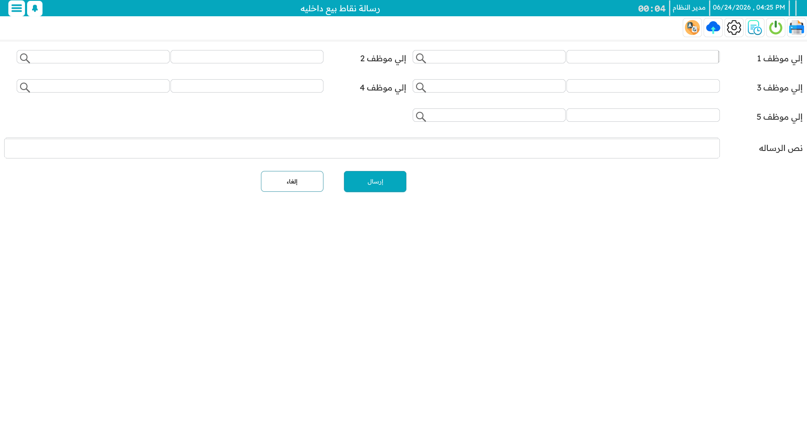
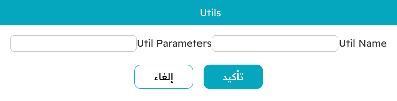

# التقارير والأدوات

إلى جانب البيع، تحمل الماكينة حفنةً من الأدوات اليومية: تشغيل التقارير، مراسلة الموظفين الآخرين، فحص سعر دون إجراء بيع، و — للمشرفين — تشغيل أدوات الصيانة.

## التقارير

يمكنك تشغيل التقارير داخل نقاط البيع مباشرةً. افتح شاشة التقارير، اختر تقريرًا، املأ ما يطلبه من مدخلات (مدى تواريخ، فلتر مخزن)، فيُفتَح في عارض تتصفّحه أو تطبعه أو تصدّره إلى PDF أو Excel أو صورة.

أيّ التقارير تظهر هنا أمرٌ يُقرَّر مركزيًّا — فأي تقرير في نظام ناما الرئيسي يمكن إتاحته لنقاط البيع. ويمكن للتقرير أن يعمل على قاعدة بيانات الماكينة **المحلية** (سريع، ويعمل دون اتصال، لكن لبيانات هذه الماكينة فقط) أو على قاعدة بيانات **الخادم** (صورة كاملة محدَّثة عبر كل النقاط). وتشرح [الأسئلة الشائعة لنقاط البيع](./pos-faq.md) إتاحة تقرير في نقاط البيع.

## الرسائل الداخلية والإشعارات

يمكن للموظفين إرسال **رسائل داخلية** قصيرة إلى بعضهم — إلى عدة موظفين مسمَّين دفعةً — مباشرةً من الماكينة. ويرى المستلِم الرسالة كنافذة منبثقة على جهازه، أو تنتظره إن كان دون اتصال.

وتلك النوافذ جزء من تيار **إشعارات** أوسع — رسائل واردة، تنبيهات نظام، وصول طلبات. اضغط `Ctrl+F11` لرؤيتها كلها في مكان واحد ومسحها.

## فاحص الأسعار

يمنح `Ctrl+F9` أي كاشير **استعلام سعر** سريعًا أثناء البيع، كما هو مشروح في [صفحة البيع](./pos-sales-invoice.md). وفوق ذلك، يمكن للماكينة أن تعمل كـ**محطة فحص أسعار** مخصّصة — كشكٌ بملء الشاشة، يكون غالبًا في صالة المتجر، يمسح فيه الزبون صنفًا بنفسه فيرى اسمه وسعره بخطّ كبير واضح (مع صور ترويجية تتعاقب بجانبه). ويمسح الصنف التالي ما يمسح السابق، ويعيد زرٌّ الجهاز إلى وضع البيع العادي.

## تشغيل الأدوات

بين الحين والآخر يحتاج مشرف إلى تشغيل **أداة** لمرة واحدة على ماكينة — روتين صيانة أو إصلاح يسمّيه فريق الدعم. تأخذ نافذة الأدوات اسم الأداة وأي مدخلات، وتشغّلها، وتُبلّغ بالنتيجة.

ولا تفعل ذلك عادةً إلا حين يطلبه الدعم، بالاسم الدقيق الذي يعطيك إياه. ويظهر مثال شائع في [الأسئلة الشائعة لنقاط البيع](./pos-faq.md): أداة تصلح طريقة دفع غُيِّر ضبطها النقدي/غير النقدي بعد استخدامها بالفعل.

::: warning
الأدوات وسائل صيانة — لا تشغّل أداةً إلا حين تعرف ما تفعل (أو يطلبه منك الدعم) وبالمدخلات التي أُعطيت لك. فهي تعمل مباشرةً على بيانات الماكينة.
:::
