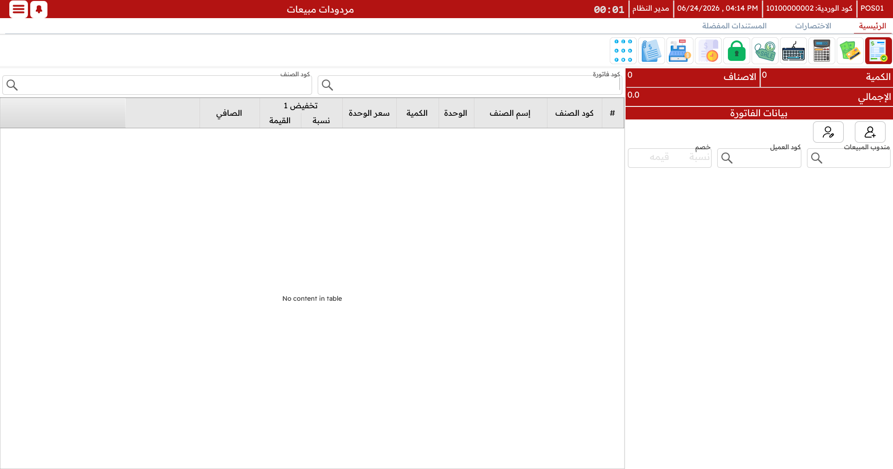

# المرتجعات والإحلال

البضائع تعود. يغيّر الزبون رأيه، أو يكون الصنف معيبًا، أو المقاس خاطئًا. تتعامل نقاط البيع مع ذلك كله — استرداد مباشر، استبدال، رصيد متجر، وحتى خصم مقابل التلف — وتربط كلًّا منها بمن نفّذه ولماذا.

## المرتجعات

المرتجع يعيد الأصناف ويعطي العميل ماله (أو رصيد متجر) في المقابل. ابدأ مرتجعًا بـ `Ctrl+F1`.

### مقابل الفاتورة الأصلية

الحالة المعتادة: لديك الفاتورة الأصلية. ابحث عنها، فتظهر سطورها لتختار منها. حدّد الأصناف والكميات العائدة — والمرتجع الجزئي مقبول، وأي أصناف مجانية رافقت صنفًا مُرتجَعًا تعود معه. وتحسب الماكينة قيمة الاسترداد.

### دون الفاتورة الأصلية

أحيانًا لا توجد فاتورة — فُقدت، أو البيع قديم جدًّا. ما زال بإمكانك تنفيذ المرتجع بإضافة كل صنف يدويًّا: ابحث عن الصنف، حدّد الكمية، وأدخل السعر الذي دفعه العميل.

### سبب المرتجع

تطلب المرتجعات **سببًا** — معيب، صنف خاطئ، تغيّر رأي العميل، وهكذا. خطوة صغيرة تصنع الفرق في نهاية الشهر حين يسأل أحدهم *لماذا* تعود البضائع.

### الخصم مقابل التلف (الإهلاك)

ليس كل شيء يعود بحالة ممتازة. يطبّق **سبب الإهلاك** خصمًا محدّدًا مسبقًا على القيمة المستردّة — "عبوة مفتوحة −5%"، "مستعمل أسبوعًا −20%" ونحوها. اختر السبب فيُحسَب الخصم نيابةً عنك، فيُستردّ للعميل المبلغ العادل بدل السعر الكامل.

### الاسترداد

تعود الأموال كما جاءت. يمكنك استرداد نقدٍ من الدرج، أو إعادته لطريقة الدفع نفسها، أو إصدار **إشعار دائن** بدل النقد (انظر أدناه). وإن دُفعت الأصلية بعدة طرق، فيمكن للاسترداد أن يتبع التجزئة نفسها.

::: tip مدة المرتجع
تسمح الأنشطة عادةً بالمرتجع خلال عدد أيام محدّد فقط. والمرتجع بعد تلك المدة محظور على الكاشير العادي — لكن يمكن لمشرف اعتماده في الحال (`Ctrl+R`)، كما تُعتمَد سائر العمليات المقيّدة.
:::

## الإحلال (الاستبدال)

الإحلال هو "أبدّل هذا بذاك" الكلاسيكي. وبدلًا من استرداد يتبعه بيع منفصل، تنفّذ نقاط البيع الأمرين في مستند واحد: ابدأ إحلالًا بـ `Shift+F1`.

في الإحلال، تُدخَل السطور العائدة كمرتجعات والسطور الخارجة كمبيعات جديدة. وتصافي الماكينة الاثنين وتخبرك بالفرق:

- أصناف جديدة قيمتها **أكبر** من العائدة → يدفع العميل الفرق.
- أصناف جديدة قيمتها **أقل** → يُستردّ للعميل الفرق.

وتسوّي ذلك الفرق الوحيد في شاشة التحصيل، في أي من الاتجاهين.

> **مثال.** يعيد عميل قميصًا مقاس L (بـ 50) ويأخذ قميصًا مقاس M (بـ 50) وبنطالًا (بـ 80). المرتجع 50 والبيع الجديد 130، فيدفع العميل ببساطة فرق الـ 80.

## الإشعارات الدائنة

**الإشعار الدائن** رصيد متجر. فبدل تسليم نقد على مرتجع، يمكنك إصدار إشعار دائن بالقيمة؛ يستبدله العميل لاحقًا مقابل شراء مقبل. وبعض العروض تولّد إشعارات دائنة تلقائيًا.

يحمل كل إشعار كودًا فريدًا والمبلغ و(حيث يُضبَط) العميل الذي يخصّه وتاريخ انتهاء. ويُستبدَل في شاشة التحصيل تمامًا كأي طريقة دفع — أدخل الكود فتُطرَح قيمته من الفاتورة، مع تتبّع الرصيد المتبقّي للمرة القادمة.

## كوبونات الخصم

**الكوبونات** هي ابن العم الترويجي للإشعارات الدائنة — "اشترِ بـ 100 واحصل على كوبون 15 للمرة القادمة"، أو بطاقة هدية محوّلة إلى كوبون. تُسلَّم للعميل (مطبوعة) وتُستبدَل لاحقًا في شاشة التحصيل بإدخال الكود، ضمن تواريخها ورصيدها الصالحين.

ويُوصَف جانب استرداد الإشعارات الدائنة والكوبونات أيضًا في صفحة [الدفع والتحصيل](./pos-payment-and-tender.md)، فهي حيث يستخدمها العميل فعلًا.
