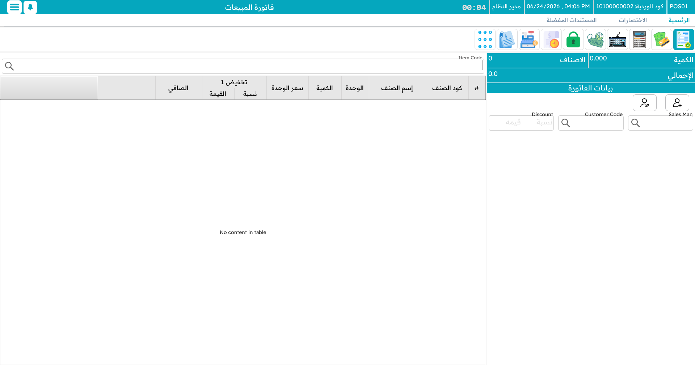
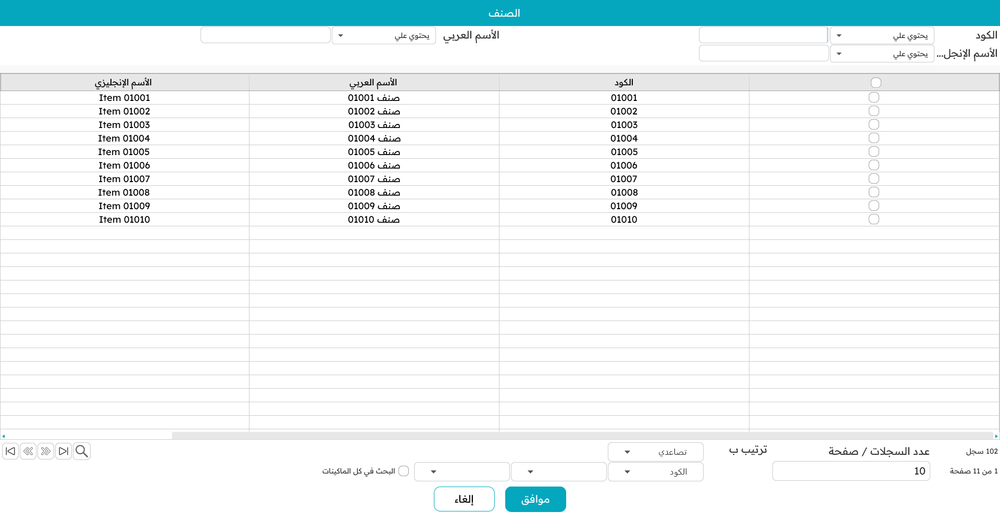
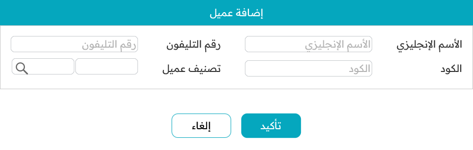
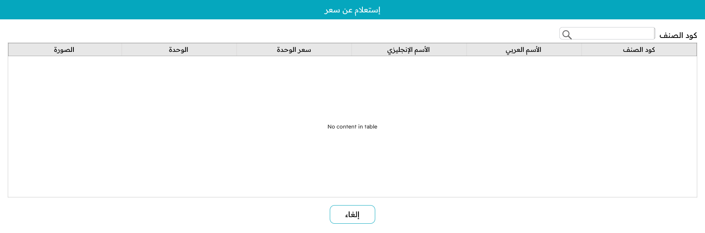
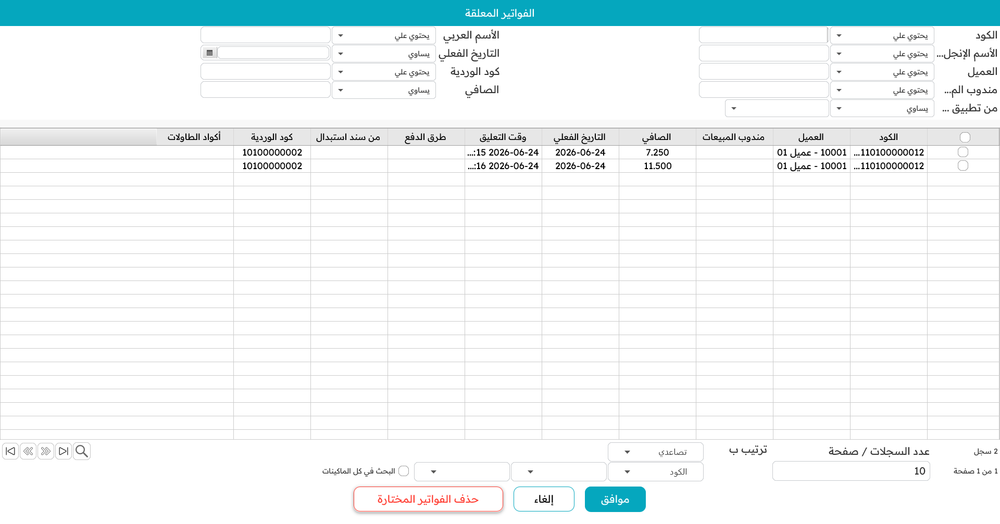

# فاتورة المبيعات

شاشة البيع هي حيث يقضي الكاشير يومه كله تقريبًا. وهي مبنيّة لتفعل شيئًا واحدًا بسرعة بالغة: تحويل سلّة بضائع إلى إيصال مدفوع. تستعرض هذه الصفحة تلك الشاشة والمسار اليومي لتسجيل البيع.

## التخطيط

تبدو الشاشة مزدحمة للوهلة الأولى، لكنها تستقر في مناطق قليلة:

- **الترويسة** في الأعلى تحمل بيانات الفاتورة نفسها — كودها وتاريخها، والعميل، والمندوب، والمخزن، وأي حقول إضافية يستخدمها نشاطك. ويتحدّث ملخّص جارٍ (إجمالي الكمية، وعدد الأصناف المختلفة، والمبلغ) كلما تابعت.
- **لوحة المفضلة** على أحد الجانبين شبكةٌ من أزرار سريعة لأكثر الأصناف بيعًا. وفيها مربع **كمية** صغير وحقل بحث.
- **حقل إدخال الصنف** حيث تكتب الصنف أو تمسحه بالباركود.
- **جدول السطور** يملأ الوسط: سطر لكل صنف بكميته وسعر وحدته وخصوماته وضريبته وإجمالي سطره.
- **لوحة الإجماليات** بجانبه تعرض قيمة الأصناف والخصومات والضريبة و**الصافي** الذي يدفعه العميل.

يمكن إظهار **لوحة أرقام** عائمة فوق كل ذلك لإدخال الكميات والمبالغ دون لوحة مفاتيح؛ اسحبها حيث يناسبك ويُحفَظ موضعها.

## تسجيل البيع

### ابدأ فاتورة جديدة

اضغط `Alt+F1` (أو اختر *بيع جديد* من القائمة). تحصل على فاتورة جديدة والمؤشّر في حقل الصنف جاهز لأول مسح.

### إضافة الأصناف — أربع طرق

يلجأ الكاشير إلى الأسرع في كل لحظة:

1. **امسح الباركود.** يدخل الصنف بكمية 1 ويُفرَّغ الحقل للمسح التالي. هذا هو أساس العمل على الكاشير.
2. **اكتب كود الصنف** واضغط Enter — النتيجة نفسها، للأصناف بلا باركود في المتناول.
3. **ابحث بالاسم.** اكتب جزءًا من الاسم واختر من القائمة الظاهرة. مفيد حين لا يتوفر كود ولا باركود.
4. **انقر مفضّلًا.** على لوحة المفضلة انقر زر الصنف. استخدم مسار التنقّل للدخول إلى الفئات (مثل *المشروبات ← الباردة*). ولإضافة عدة وحدات دفعةً، اكتب العدد في مربع **الكمية** أولًا ثم انقر الزر.

### تعديل سطر

انقر سطرًا لتحديده، ثم:

- **غيّر الكمية** بـ `Ctrl+Q`، فيفتح محرّر صغير (يتعامل مع الكميات الكسرية والوزنية).
- **عدّل بيانات السطر** — الأرقام التسلسلية أو أرقام التشغيلة، تاريخ الصلاحية، ملاحظة السطر، المرجع — من أزرار إجراءات السطر.
- **انسخ السطر نسخةً مماثلة** بـ `+` حين تحتاج وحدة أخرى مطابقة بالتفاصيل نفسها.
- **احذف السطر** بـ `Ctrl+Del`.

إن كان الصنف يحمل **إضافات** — مقاسات أو ألوان أو إضافات كالسكر والحليب — فتفتح نافذة الإضافات عند إضافته. ولهذا الموضوع صفحته الخاصة: [إضافات الأصناف](./pos-item-addons.md).

### تطبيق الخصومات

هناك مستويان يتراكمان:

- **خصومات السطر.** حدّد سطرًا واضغط `Alt+1` حتى `Alt+8` حتى ثمانية مستويات خصم، بإدخال نسبة أو مبلغ ثابت. وهل يحق للكاشير ذلك — وإلى أي حد — أمرٌ تحكمه صلاحيته.
- **خصم الفاتورة.** اضغط `F10` لخصم الفاتورة كاملةً، و`Ctrl+F10` لإلغائه.

تُعاد لوحة الإجماليات الحساب لحظةَ أي تغيير.

### تحديد العميل

للبيع النقدي السريع لا تحتاج غالبًا عميلًا مسمّى. وعندما تحتاج:

- اضغط `F7` لاختيار عميل قائم بالكود أو الاسم.
- اضغط `Shift+F7` لتسجيل عميل **جديد** في الحال دون مغادرة البيع.
- اضغط `Ctrl+F7` لإزالة العميل من الفاتورة.

ويجلب العميل معه أسعاره وشروط ائتمانه وأي ولاء.

## أدوات مفيدة أثناء البيع

**المفضلة.** أكثر من مجرد راحة — فللكاشير السريع تعني الفرق بين مجاراة الصف والتأخّر عنه. ينظّمها المشرفون في فئات ليكون الصنف الشائع على بُعد نقرة.

**استعلام السعر (`Ctrl+F9`).** افحص سعر صنف ووحداته دون إزعاج البيع الجاري — مثاليّ للإجابة عن "بكم هذا؟" على الكاونتر أو الهاتف.

**التعليق والاسترجاع (`F6` / `Ctrl+F6`).** إن عاد الزبون مسرعًا لصنف نسيه، **علّق** الفاتورة بـ `F6`، اخدم التالي، ثم **استرجعها** بـ `Ctrl+F6` وتابع. ويمكن استرجاع الفواتير المعلّقة حتى على ماكينة أخرى — انظر [الطاولات والمطعم](./pos-tables-and-restaurant.md) لكيفية عمل ذلك بين الماكينات.

**فتح فاتورة قائمة (`Ctrl+F3`).** استدعِ فاتورة سابقة لمراجعتها أو إعادة طباعتها أو اتخاذها أساسًا لمرتجع.

## الجاهزية للدفع

حين يكتمل كل صنف وخصم، يكون **الصافي** في لوحة الإجماليات هو ما يدين به العميل. اضغط `F5` للانتقال إلى شاشة التحصيل وقبض المبلغ — وتلك هي الصفحة التالية، [الدفع والتحصيل](./pos-payment-and-tender.md).
