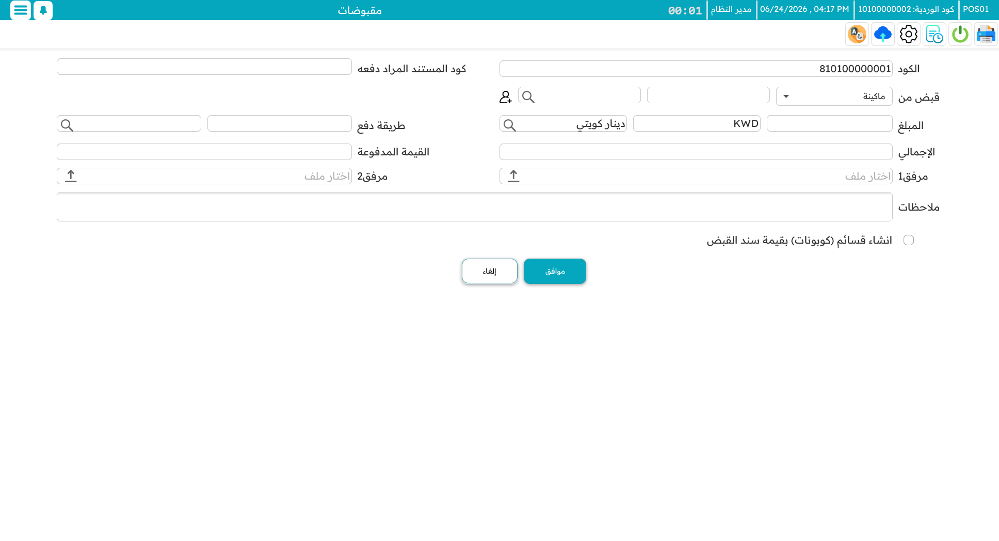
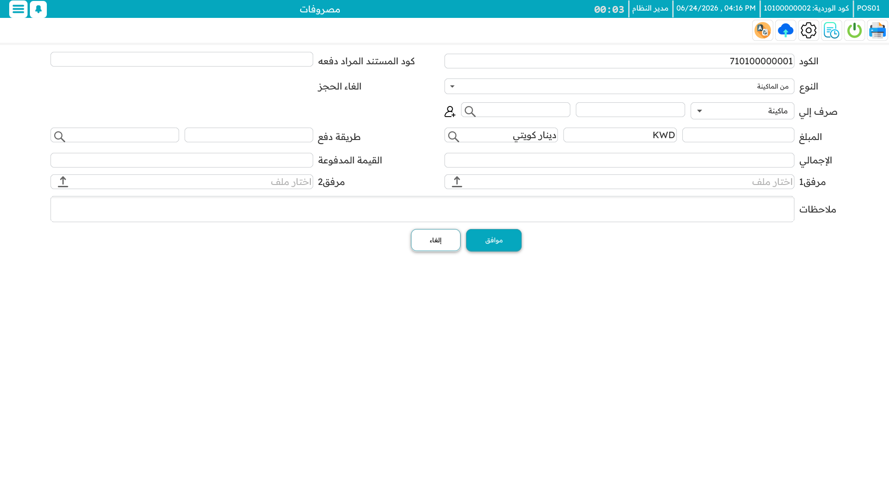
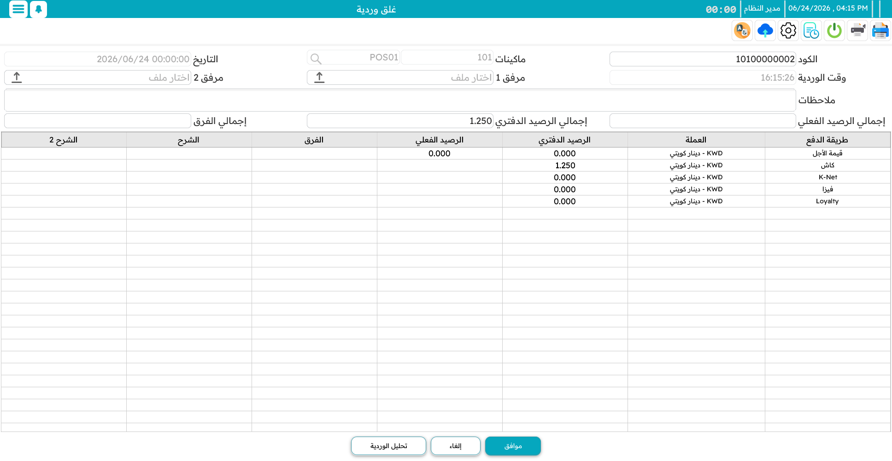

# الورديات والنقدية

**الوردية** هي جلسة عمل واحدة على الماكينة: تُفتَح حين يبدأ الكاشير، وتُغلَق حين يجرد الدرج ويُسلّم. وضبط الفتح والإغلاق هو ما يحفظ النقدية محاسَبةً. تصل إلى شاشة الوردية بـ `F2`.

## فتح الوردية

تفتح الوردية بتسجيل ما في الدرج بدايةً — **الرصيد الافتتاحي**، مُدخَلًا حسب طريقة الدفع والعملة (كذا نقدًا، وكذا بكل عملة، وهكذا). تأخذ الوردية كودها الخاص، ويُختَم التاريخ والوقت تلقائيًا، وتُعرَف الماكينة التي تخصّها. ويمكنك إضافة ملاحظة أو إرفاق ورقة جرد.

يصبح ذلك الرصيد الافتتاحي الأساس الذي يتوقّعه النظام. وكل ما يجري خلال الوردية يضيف إليه أو يطرح منه.

## أثناء الوردية

مع سير الوردية، يُتتبَّع كل بيع ومرتجع وإيداع وصرف **حسب طريقة الدفع**. ونادرًا ما تفكّر في ذلك حتى وقت الإغلاق — لكن هناك حركتين نقديتين متعمَّدتين يجدر معرفتهما.

### الإيداع (تحصيل للماكينة)

يضيف **الإيداع** نقدًا إلى الدرج أثناء الوردية — مشرف يضيف فكّة صغيرة، أو يأتي مال من الخزنة. تسجّل المبلغ والعملة ومصدره. وعند الإغلاق يتوقّع النظام وجود هذا النقد الإضافي، فينبغي أن يشمله جردك.

### الصرف (دفع من الماكينة)

يُخرِج **الصرف** نقدًا من الدرج — إيداع في الخزنة، أو صرف صغير. تسجّل المبلغ والعملة والوجهة. وعند الإغلاق يكون النظام قد طرحه، فلا يتوقّع رؤيته في الدرج.

::: tip الإيداع في الخزنة
بدل ترك الدرج يمتلئ، يمكن للكاشير إيداع حزم في **خزنة** دوريًّا. وهذا النقد ما زال يخصّ الوردية — فعند الإغلاق يُحسَب ضمن إجمالي الوردية، لكنه محفوظ في مكان أأمن من الدرج.
:::

## إغلاق الوردية

الإغلاق هو المطابقة. تعرض الماكينة كل طريقة دفع بما **تتوقّعه** مقابل ما **جردته** فعلًا، والفرق بينهما.

المسار:

1. افتح شاشة الإغلاق — الماكينة تعرف الوردية المفتوحة.
2. **اجرد الدرج** وأدخل المبلغ الفعلي لكل طريقة. وللنقد، يتيح لك **صندوق الفئات** إدخال عدد كل ورقة وعملة معدنية؛ فيجمعها لك ويراجع حسابك.
3. تحسب الماكينة **الفرق**: الفعلي ناقص المتوقَّع. الموجب **زيادة** (أكثر من المتوقَّع)، والسالب **عجز** (أقل). والصفر إغلاق نظيف.
4. أضف ملاحظة لتفسير أي فرق، واحفظ.

وحتى رؤية الكاشير للرقم "المتوقَّع" أمرٌ تحكمه صلاحية — فبعض الأنشطة تفضّل أن يجرد الكاشير دون رؤيته، ليكون الجرد صادقًا لا منحازًا نحو الرقم المتوقَّع.

## تحليل الوردية

يجيب عرض **تحليل الوردية** عن "من أين جاء المال وإلى أين ذهب؟" للجلسة. يفصّل الإجمالي حسب طريقة الدفع وحسب نوع الحركة — فواتير، مرتجعات، إحلال، حجوزات، إيداعات، مصروفات، إشعارات دائنة، كوبونات — ويعرض صافي كل طريقة، مع الإجمالي العام في الأسفل. كما يفصل نقدية **الوردية الحالية** عن أي نقدية قديمة ما زالت في الدرج.

وللمديرين، هذه الشاشة الوحيدة التي تروي القصة المالية للوردية بنظرة — مفيدة لجرد آخر اليوم ولتقصّي فرقٍ عنيد.

::: info جرد نقدي سريع
لا تحتاج دائمًا إغلاقًا كاملًا لفحص الدرج. يتيح لك جردٌ نقدي مستقلٌّ، يُفتَح من شاشة المخزون (`Ctrl+F2`)، مطابقة النقدية في منتصف الوردية دون إنهائها.
:::
