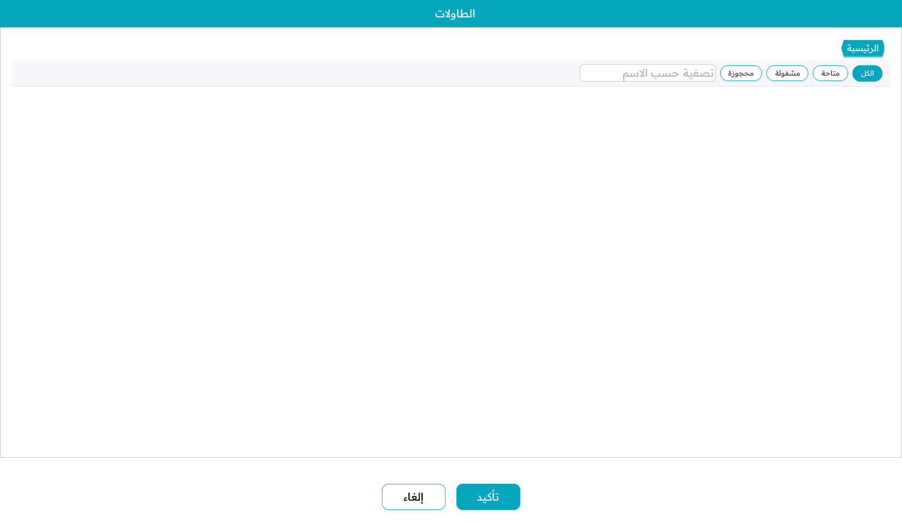
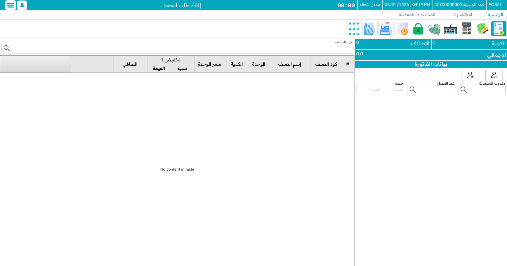
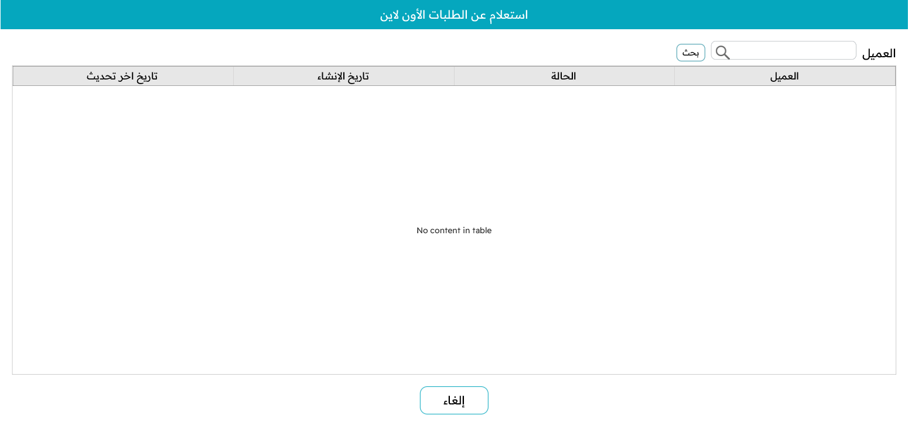

# الطاولات والحجوزات وكابتن أوردر

تبيع المطاعم والمقاهي بطريقة تختلف عن كاشير المتجر: فالطلبات تخصّ **الطاولات**، ويأخذها النُّدُل بعيدًا عن الكاشير، وبعضها محجوز مسبقًا. تغطّي هذه الصفحة خدمة الطاولات والحجوزات وآلية الطلبات المعلّقة ومركز الاتصال وتطبيق **كابتن أوردر**.

## الصالات والطاولات

تُنظَّم المقاعد في **صالات** و**طاولات** داخلها. يعرض عارض الطاولات كل طاولة كزرّ ملوَّن حسب حالتها، فتعرف أرض المطعم بنظرة:

- **حرّة** — مفتوحة جاهزة للإجلاس.
- **مشغولة** — عليها طلب بالفعل؛ ويُظهر الزرّ كود فاتورتها.
- **محجوزة** — محفوظة لحجز في نافذة زمنية معيّنة.

للعمل على طاولة، افتحها من العارض؛ فيُحمَّل طلبها على شاشة البيع وتضيف الأصناف تمامًا كأي [فاتورة مبيعات](./pos-sales-invoice.md). واطلب جولةً أخرى فتنضمّ إلى حساب الطاولة الجاري. وحين يجهز الضيوف، تسوّي الطاولة في [شاشة التحصيل](./pos-payment-and-tender.md) فتعود حرّة.

## الحجوزات

يحجز **الحجز** طاولة — وغالبًا يأخذ عربونًا — لموعد مستقبلي. تسجّل العميل والتاريخ والوقت والأصناف إن كانت مطلوبة مسبقًا والعربون المدفوع. وما دام الحجز قائمًا تظهر الطاولة محجوزة ولا تُعطى لزبون عابر.

وعند وصول الضيوف، استدعِ الحجز، وأضف ما يطلبونه إضافةً، وسوِّ — فيُخصَم العربون من الحساب النهائي. وإن تعذّر الحجز، يسجّل **الإلغاء** السبب ويعالج أي استرداد (قد تُطبَّق رسوم إلغاء)، وتتحرّر الطاولة من جديد.

## الطلبات المعلّقة ومركز الاتصال

**تعليق** الطلب هو فكرة تعليق الفاتورة نفسها على كاشير المتجر — اركنه الآن وعُد إليه لاحقًا — لكنه يستحقّ اسمه هنا لما يتيحه بين الماكينات.

### التعليق والاسترجاع

علّق الطلب الحالي بـ `F6`؛ فيُحفَظ وتُفرَّغ شاشتك للزبون التالي. استرجعه لاحقًا من قائمة الطلبات المعلّقة (`Ctrl+F6`). والطلب المعلّق على ماكينة يمكن إيجاده واسترجاعه على أخرى، وهذا ما يتيح الجزء التالي.

### آلية مركز الاتصال

تحوّل هذه الآلية الماكينة إلى **محطة مركز اتصال** تتلقّى الطلبات هاتفيًّا وترسلها إلى الفرع الذي سيحضّرها ويوصّلها فعلًا.

وهي مبنية من إعدادين على سجلات الماكينات:

- الماكينة المستقبِلة للطلب تعمل في **وضع خدمة العملاء**. يبني المشغّل الطلب، ويختار الفرع/الماكينة الوجهة، وبدل الدفع **يعلّق** الطلب — فيُرسَل إلى تلك الوجهة.
- الماكينة الوجهة مفعَّلٌ فيها **قراءة الطلبات من مركز خدمة العملاء**. تفحص الطلبات الواردة كل دقيقة تقريبًا، وتُظهر إشعارًا منبثقًا عند وصول طلب، ويظهر الطلب في قائمة طلباتها المعلّقة (`Ctrl+Shift+F6`) جاهزًا لفتحه وإتمامه كبيع عادي.

ينتقل الطلب كاملًا — الأصناف والكميات والأسعار، وبيانات العميل، والملاحظات، وأي خصومات — ويعيد النظام المحاولة إن تعثّرت الشبكة. وهي مثالية لعمليات التوصيل واستقبال الطلبات المركزي عبر عدة فروع.

## الطلبات الإلكترونية / عن بُعد

قد تصل الطلبات أيضًا من قنوات إلكترونية. يتيح **استعلام الطلبات الإلكترونية** (`Ctrl+O`) البحث عنها بالعميل ورؤية حالتها — قيد الانتظار، قيد المعالجة، جاهز، مسلَّم، ملغًى — ثم فتح طلب لتلبيته وتحصيل دفعه إن لم يكن مدفوعًا.

## كابتن أوردر — تطبيق الجوال

يضع **كابتن أوردر** دفتر الطلبات على هاتف أو جهاز لوحي ليأخذ النُّدُل الطلبات عند الطاولة بدل العودة إلى الكاشير. وهو يشارك الماكينة نفس الأصناف والمفضلة والطاولات.

يفتح النادل طاولة، ويضيف الأصناف — ناقرًا المفضلة للسرعة ومختارًا [الإضافات](./pos-item-addons.md) حيث يحملها الصنف — و**يرسل** الطلب. فيصل إلى الماكينة والمطبخ فورًا. ويمكن إرسال جولات أخرى للطاولة نفسها طوال المساء، وكلها تتراكم على حسابها، الذي يُسوّى على ماكينة عند مغادرة الضيوف.

